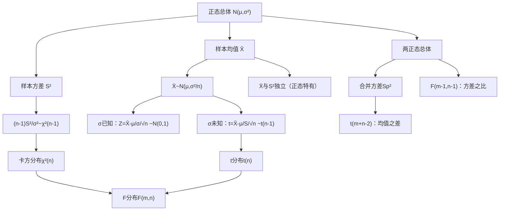

> 📌 数理统计是概率论的"应用方向"：用**样本数据**来推断**总体规律**。本章建立核心工具——统计量及其分布（卡方分布、$t$ 分布、$F$ 分布），是参数估计和假设检验的共同基础。

---

## 📋 前置知识

- [[概率论第五章：大数定律与中心极限定理]] — CLT 是抽样分布的理论来源
- [[概率论第二章：随机变量及其分布]] — 正态分布、卡方分布的推导依赖第二章的变量变换
- [[概率论第四章：随机变量的数字特征]] — 样本均值和样本方差的期望/方差计算

---

## 🤔 为什么要研究抽样分布？

统计推断的基本逻辑是：**用样本统计量来估计或检验总体参数**。

但统计量本身也是随机变量——每次抽到的样本不同，算出的样本均值也不同。要想知道"我的估计有多准"、"我的检验有没有犯错"，就必须知道统计量的**概率分布**——这就是抽样分布。

> 🎯 **比喻**：你想知道全班的平均身高（总体参数 $\mu$），随机抽5人测量（样本），算出样本均值 $\bar{X}$。$\bar{X}$ 是随机的，它的分布（抽样分布）告诉你：$\bar{X}$ 偏离 $\mu$ 超过 5cm 的概率有多大。

---

## 🧠 核心概念

### 一、基本概念

#### 1.1 总体与样本

**总体（Population）**：研究对象全体数量指标的集合，用随机变量 $X$ 表示（分布为 $F(x)$）。

**样本（Sample）**：从总体中抽取的 $n$ 个观测值 $X_1, X_2, \ldots, X_n$。

**简单随机样本（i.i.d. 样本）**：满足以下两条：
1. **代表性**：每个 $X_i$ 与总体 $X$ 同分布
2. **独立性**：$X_1, X_2, \ldots, X_n$ 相互独立

此时联合密度：$f(x_1, x_2, \ldots, x_n) = \prod_{i=1}^n f(x_i)$（可分离）。

**样本量（Sample Size）**：$n$，样本中观测值的个数。

#### 1.2 统计量

**统计量（Statistic）**：样本 $X_1, \ldots, X_n$ 的**不含未知参数**的函数 $T = g(X_1, \ldots, X_n)$。

统计量是随机变量，其分布称为**抽样分布**。

**常用统计量**：

**样本均值**：

$$\bar{X} = \frac{1}{n} \sum_{i=1}^n X_i$$

**样本方差**（无偏版本，考研标准）：

$$S^2 = \frac{1}{n-1} \sum_{i=1}^n (X_i - \bar{X})^2$$

**样本标准差**：$S = \sqrt{S^2}$

**样本 $k$ 阶原点矩**：$A_k = \frac{1}{n}\sum_{i=1}^n X_i^k$（$A_1 = \bar{X}$）

**样本 $k$ 阶中心矩**：$B_k = \frac{1}{n}\sum_{i=1}^n (X_i - \bar{X})^k$（$B_2 = \frac{n-1}{n}S^2$）

> ⚠️ **统计量不含未知参数**。若总体均值 $\mu$ 未知，则 $\frac{1}{n}\sum(X_i - \mu)^2$ 就**不是**统计量（含未知参数 $\mu$），而 $S^2 = \frac{1}{n-1}\sum(X_i - \bar{X})^2$ 是统计量（用样本均值 $\bar{X}$ 替代了 $\mu$）。

#### 1.3 样本均值和样本方差的数字特征

设总体 $X$ 满足 $E(X) = \mu$，$D(X) = \sigma^2$，$(X_1, \ldots, X_n)$ 是简单随机样本，则：

$$\boxed{E(\bar{X}) = \mu, \quad D(\bar{X}) = \frac{\sigma^2}{n}}$$

$$\boxed{E(S^2) = \sigma^2}$$（样本方差的无偏性，第四章已证）

---

### 二、正态总体下的三大抽样分布

当总体 $X \sim N(\mu, \sigma^2)$ 时，样本统计量的精确分布可以导出。这三个分布是数理统计的"三大支柱"。

#### 2.1 卡方分布 $\chi^2(n)$

**定义**：设 $X_1, X_2, \ldots, X_n$ 独立，$X_i \sim N(0,1)$，则

$$\boxed{\chi^2 = X_1^2 + X_2^2 + \cdots + X_n^2 \sim \chi^2(n)}$$

参数 $n$ 称为**自由度（Degrees of Freedom）**。

**PDF**（不需要记，考研不考手算）：

$$f(x) = \frac{1}{2^{n/2}\Gamma(n/2)} x^{n/2-1} e^{-x/2}, \quad x > 0$$

**数字特征**：

$$\boxed{E(\chi^2(n)) = n, \quad D(\chi^2(n)) = 2n}$$

**可加性**：若 $\chi_1^2 \sim \chi^2(m)$，$\chi_2^2 \sim \chi^2(n)$ 独立，则

$$\chi_1^2 + \chi_2^2 \sim \chi^2(m+n)$$

**分位数**：$\chi^2_\alpha(n)$ 表示满足 $P(\chi^2 > \chi^2_\alpha(n)) = \alpha$ 的值（右侧面积为 $\alpha$）。

> 🎯 **图形特征**：卡方分布是非负的右偏分布，自由度越大越接近正态（对称）。$n=1$ 时最偏，$n=2$ 时是指数分布的特殊情况。

> ⚠️ **不对称性**：卡方分布不对称，$\chi^2_{1-\alpha/2}(n)$ 和 $\chi^2_{\alpha/2}(n)$ 是两个不同的数，不能像正态那样用 $\pm$ 表示双侧分位数。

#### 2.2 $t$ 分布（学生氏分布）$t(n)$

**定义**：设 $X \sim N(0,1)$，$Y \sim \chi^2(n)$，$X, Y$ 独立，则

$$\boxed{T = \frac{X}{\sqrt{Y/n}} \sim t(n)}$$

参数 $n$ 为自由度。

**PDF**：关于 $t=0$ 对称，形状类似标准正态但尾部更重（更宽）。

**数字特征**：

$$E(T) = 0 \quad (n > 1), \quad D(T) = \frac{n}{n-2} \quad (n > 2)$$

**极限性质**：当 $n \to \infty$ 时，$t(n) \to N(0,1)$。实际上，$n \geq 30$ 时 $t(n)$ 与 $N(0,1)$ 已非常接近。

**对称性**：$t_{1-\alpha}(n) = -t_\alpha(n)$（这和正态分布一样可以利用对称性）。

**分位数**：$t_\alpha(n)$ 满足 $P(T > t_\alpha(n)) = \alpha$。

> 🎯 **类比**：$t$ 分布 = 正态分布 + 对方差的不确定性。当样本量小时，我们不知道真实的 $\sigma$，用样本标准差 $S$ 替代，引入了额外的随机性，使得分布比正态更"胖尾"。样本量越大，额外不确定性越小，越接近正态。

#### 2.3 $F$ 分布 $F(m, n)$

**定义**：设 $U \sim \chi^2(m)$，$V \sim \chi^2(n)$，$U, V$ 独立，则

$$\boxed{F = \frac{U/m}{V/n} \sim F(m, n)}$$

$m$ 为第一自由度，$n$ 为第二自由度。

**数字特征**：

$$E(F) = \frac{n}{n-2} \quad (n > 2)$$

**重要性质**：

$$\text{若 } F \sim F(m, n)，\text{则 } \frac{1}{F} \sim F(n, m)$$

**分位数关系**（常用来查表减半）：

$$F_{1-\alpha}(m, n) = \frac{1}{F_\alpha(n, m)}$$

> 💡 上面的性质极其有用：$F$ 表通常只给右尾概率 $\alpha$ 较小时的分位数（如 $\alpha = 0.05, 0.025$）。若需要左尾分位数 $F_{0.95}(m,n)$，用 $F_{0.95}(m,n) = 1/F_{0.05}(n,m)$ 转化后查表。

**$t$ 与 $F$ 的关系**：若 $T \sim t(n)$，则 $T^2 \sim F(1, n)$。

---

### 三、正态总体的抽样分布定理

这是本章最重要的内容，考研必背。

#### 3.1 单个正态总体

设 $X_1, \ldots, X_n$ 来自正态总体 $N(\mu, \sigma^2)$，$\bar{X}$ 和 $S^2$ 分别为样本均值和样本方差。

**定理1**：

$$\boxed{\bar{X} \sim N\left(\mu, \frac{\sigma^2}{n}\right)}$$

等价地：$\frac{\bar{X} - \mu}{\sigma/\sqrt{n}} \sim N(0,1)$

**定理2**：

$$\boxed{\frac{(n-1)S^2}{\sigma^2} \sim \chi^2(n-1)}$$

> 💡 为什么自由度是 $n-1$ 而不是 $n$？因为 $S^2$ 中用了 $\bar{X}$ 替代了 $\mu$，引入了一个约束 $\sum(X_i - \bar{X}) = 0$，损失了一个自由度。

**定理3**：$\bar{X}$ 与 $S^2$ **相互独立**（正态总体独有的性质）。

**定理4（$\sigma$ 未知时的 $t$ 统计量）**：

$$\boxed{\frac{\bar{X} - \mu}{S/\sqrt{n}} \sim t(n-1)}$$

**推导**：

$$\frac{\bar{X}-\mu}{S/\sqrt{n}} = \frac{\frac{\bar{X}-\mu}{\sigma/\sqrt{n}}}{\sqrt{\frac{(n-1)S^2/\sigma^2}{n-1}}} = \frac{N(0,1)}{\sqrt{\chi^2(n-1)/(n-1)}} \sim t(n-1)$$

> ⚠️ **关键区别**：
> - $\sigma$ **已知**：用 $\frac{\bar{X}-\mu}{\sigma/\sqrt{n}} \sim N(0,1)$（正态）
> - $\sigma$ **未知**：用 $\frac{\bar{X}-\mu}{S/\sqrt{n}} \sim t(n-1)$（$t$ 分布，尾部更重）

#### 3.2 两个正态总体

设 $X_1, \ldots, X_m \sim N(\mu_1, \sigma_1^2)$ 和 $Y_1, \ldots, Y_n \sim N(\mu_2, \sigma_2^2)$ 独立，$\bar{X}, S_1^2$ 和 $\bar{Y}, S_2^2$ 分别为各自的样本均值和样本方差。

**定理5（方差已知，均值之差的正态分布）**：

$$\frac{(\bar{X}-\bar{Y})-(\mu_1-\mu_2)}{\sqrt{\sigma_1^2/m + \sigma_2^2/n}} \sim N(0,1)$$

**定理6（方差未知但相等 $\sigma_1^2 = \sigma_2^2 = \sigma^2$，用合并方差）**：

定义**合并样本方差（Pooled Variance）**：

$$S_p^2 = \frac{(m-1)S_1^2 + (n-1)S_2^2}{m+n-2}$$

则：

$$\boxed{\frac{(\bar{X}-\bar{Y})-(\mu_1-\mu_2)}{S_p\sqrt{1/m+1/n}} \sim t(m+n-2)}$$

**定理7（两样本方差之比的 $F$ 分布）**：

$$\boxed{\frac{S_1^2/\sigma_1^2}{S_2^2/\sigma_2^2} \sim F(m-1, n-1)}$$

特别地，当 $\sigma_1^2 = \sigma_2^2$ 时：

$$\frac{S_1^2}{S_2^2} \sim F(m-1, n-1)$$

---

### 四、分位数的理解与查表

**上 $\alpha$ 分位数**（右侧面积为 $\alpha$）：

对分布 $T$，$t_\alpha$ 满足 $P(T > t_\alpha) = \alpha$，即 $P(T \leq t_\alpha) = 1-\alpha$。

**各分布的分位数关系**：

正态：$z_\alpha = -z_{1-\alpha}$（对称性），$z_{0.025} = 1.96$，$z_{0.05} = 1.645$

$t$：$t_\alpha(n) = -t_{1-\alpha}(n)$（对称性），$t_{0.025}(n)$ 随 $n$ 减小而增大

$\chi^2$：无对称性，$\chi^2_{\alpha}(n)$ 和 $\chi^2_{1-\alpha}(n)$ 分别查表

$F$：$F_{1-\alpha}(m,n) = 1/F_\alpha(n,m)$（利用倒数关系）

---

## 💻 典型题型与详细解析

### 【题型一】判断统计量与分布类型

**例题 1**：设 $X_1, \ldots, X_6$ 来自正态总体 $N(0, 4)$（即 $\mu=0$，$\sigma^2=4$，$\sigma=2$）。判断下列各量的分布：

（1）$\frac{1}{4}(X_1^2 + X_2^2 + X_3^2 + X_4^2)$；  
（2）$\frac{X_1 + X_2}{\sqrt{X_3^2 + X_4^2}}$；  
（3）$\frac{X_1 - X_2}{\sqrt{X_3^2 + X_4^2 + X_5^2 + X_6^2}/2}$；  
（4）$\frac{X_1^2 + X_2^2}{X_3^2 + X_4^2 + X_5^2 + X_6^2}$（化为 $F$ 分布）。

**解答**：

关键：$X_i \sim N(0,4)$，故 $X_i/2 \sim N(0,1)$，$X_i^2/4 \sim \chi^2(1)$。

（1）$\frac{1}{4}(X_1^2 + \cdots + X_4^2) = \frac{X_1^2}{4} + \cdots + \frac{X_4^2}{4}$，四个独立 $\chi^2(1)$ 之和，故

$$\sim \chi^2(4)$$

（2）$X_1 + X_2 \sim N(0, 4+4) = N(0,8)$，故 $\frac{X_1+X_2}{2\sqrt{2}} \sim N(0,1)$。

$X_3^2/4 + X_4^2/4 \sim \chi^2(2)$，即 $\frac{X_3^2+X_4^2}{4} \sim \chi^2(2)$。

$$\frac{X_1+X_2}{\sqrt{X_3^2+X_4^2}} = \frac{(X_1+X_2)/(2\sqrt{2})}{\sqrt{(X_3^2+X_4^2)/4 \cdot \frac{1}{2}}} \cdot \frac{1}{\sqrt{2}} = \frac{N(0,1)}{\sqrt{\chi^2(2)/2}} \cdot \frac{1}{\sqrt{2}}$$

等一下，直接整理：

$\frac{X_1+X_2}{\sqrt{X_3^2+X_4^2}}$，令 $U = \frac{X_1+X_2}{2\sqrt{2}} \sim N(0,1)$，$V = \frac{X_3^2+X_4^2}{4} \sim \chi^2(2)$。

则 $\frac{X_1+X_2}{\sqrt{X_3^2+X_4^2}} = \frac{2\sqrt{2}U}{\sqrt{4V}} = \frac{2\sqrt{2}U}{2\sqrt{V}} = \frac{\sqrt{2}U}{\sqrt{V}} = \frac{\sqrt{2}U}{\sqrt{V}} = \sqrt{2} \cdot \frac{U}{\sqrt{V/2}} \cdot \frac{1}{\sqrt{2}}$

整理：$= \frac{U}{\sqrt{V/2}} \sim t(2)$

故 $\frac{X_1+X_2}{\sqrt{X_3^2+X_4^2}} \sim t(2)$。

（3）$X_1 - X_2 \sim N(0, 8)$，故 $\frac{X_1-X_2}{2\sqrt{2}} \sim N(0,1)$。

$\frac{X_3^2+X_4^2+X_5^2+X_6^2}{4} \sim \chi^2(4)$。

$$\frac{X_1-X_2}{\sqrt{X_3^2+\cdots+X_6^2}/2} = \frac{(X_1-X_2)/(2\sqrt{2})}{\sqrt{(X_3^2+\cdots+X_6^2)/4 \cdot \frac{1}{4}}} = \frac{N(0,1)}{\sqrt{\chi^2(4)/4}} \sim t(4)$$

（4）$\frac{X_1^2+X_2^2}{4} \sim \chi^2(2)$，$\frac{X_3^2+X_4^2+X_5^2+X_6^2}{4} \sim \chi^2(4)$，相互独立。

$$\frac{X_1^2+X_2^2}{X_3^2+X_4^2+X_5^2+X_6^2} = \frac{(X_1^2+X_2^2)/4 \div 2}{(X_3^2+\cdots+X_6^2)/4 \div 4} = \frac{\chi^2(2)/2}{\chi^2(4)/4} \sim F(2, 4)$$

---

### 【题型二】利用抽样分布定理求概率

**例题 2**：设总体 $X \sim N(12, 4)$（$\mu=12$，$\sigma^2=4$），抽取样本量 $n=16$。

（1）求 $P(\bar{X} > 13)$；  
（2）求 $P(S^2 > 7.261)$（查表：$\chi^2_{0.05}(15) = 24.996$，$\chi^2_{0.10}(15) = 22.307$）；  
（3）求 $P(|\bar{X} - 12| < 1)$，$\sigma$ 未知时改用 $t$ 分布（$t_{0.025}(15) = 2.131$）。

**解答**：

（1）$\bar{X} \sim N(12, 4/16) = N(12, 0.25)$，标准差 $= 0.5$：

$$P(\bar{X} > 13) = P\left(Z > \frac{13-12}{0.5}\right) = P(Z > 2) = 1 - \Phi(2) = 0.0228$$

（2）$\frac{(n-1)S^2}{\sigma^2} = \frac{15S^2}{4} \sim \chi^2(15)$：

$$P(S^2 > 7.261) = P\left(\frac{15S^2}{4} > \frac{15 \times 7.261}{4}\right) = P\left(\chi^2(15) > 27.228\right)$$

查表 $\chi^2_{0.025}(15) = 27.488$（接近），$P \approx 0.025$（题目数据近似）。

实际上 $\frac{15 \times 7.261}{4} = 27.229$，对应上 $\alpha$ 分位数约 0.025，即 $P \approx 0.025$。

（3）$\sigma$ 已知时：

$$P(|\bar{X}-12| < 1) = P\left(|Z| < \frac{1}{0.5}\right) = P(|Z| < 2) = 2\Phi(2)-1 = 0.9544$$

$\sigma$ 未知时，用 $t$：$\frac{\bar{X}-12}{S/4} \sim t(15)$，$P\left(\left|\frac{\bar{X}-12}{S/4}\right| < \frac{4}{S}\right)$……

此题改为：$P(|\bar{X}-12| < t_{0.025}(15) \cdot S/4)$，即置信区间的计算（见第七章）。

---

### 【题型三】构造枢轴量

**例题 3**：设 $X_1, \ldots, X_9$ 来自总体 $N(\mu, \sigma^2)$（$\mu, \sigma^2$ 均未知）。

（1）构造一个服从 $\chi^2(8)$ 的统计量；  
（2）构造一个服从 $t(8)$ 的统计量；  
（3）若另有 $Y_1, \ldots, Y_6$ 来自 $N(\mu, 2\sigma^2)$（独立），构造服从 $F(5, 8)$ 的统计量。

**解答**：

（1）由定理2，$\frac{(n-1)S^2}{\sigma^2} = \frac{8S^2}{\sigma^2} \sim \chi^2(8)$（但含未知参数 $\sigma^2$，不是统计量）。

若 $\sigma^2$ 已知，则 $\frac{8S^2}{\sigma^2}$ 是统计量；若未知，不能直接使用。

题目一般给定 $\sigma^2$ 或考察其分布，这里按分布回答：$\frac{8S_X^2}{\sigma^2} \sim \chi^2(8)$。

（2）由定理4，$\frac{\bar{X}-\mu}{S_X/3} \sim t(8)$（$n=9$，自由度 $n-1=8$）。

（3）$\frac{(m-1)S_X^2}{\sigma^2} \sim \chi^2(8)$（$m=9$），$\frac{(n-1)S_Y^2}{2\sigma^2} \sim \chi^2(5)$（$n=6$），两者独立。

$$F = \frac{\chi^2(5)/5}{\chi^2(8)/8} = \frac{(5S_Y^2/(2\sigma^2))/5}{(8S_X^2/\sigma^2)/8} = \frac{S_Y^2/2}{S_X^2} = \frac{S_Y^2}{2S_X^2} \sim F(5, 8)$$

---

### 【题型四】两总体问题

**例题 4**：设来自 $N(\mu_1, \sigma^2)$ 的样本量 $m=10$，$\bar{X} = 80$，$S_1^2 = 40$；来自 $N(\mu_2, \sigma^2)$（方差相同）的样本量 $n=15$，$\bar{Y} = 75$，$S_2^2 = 50$（均未知 $\sigma^2$）。

构造检验 $\mu_1 - \mu_2$ 的统计量，并计算其在 $H_0: \mu_1 = \mu_2$ 下的分布和观测值。

**解答**：

合并方差：

$$S_p^2 = \frac{(10-1) \times 40 + (15-1) \times 50}{10+15-2} = \frac{360 + 700}{23} = \frac{1060}{23} \approx 46.09$$

$S_p = \sqrt{46.09} \approx 6.79$

在 $H_0: \mu_1 = \mu_2$ 下，$\mu_1 - \mu_2 = 0$：

$$T = \frac{\bar{X} - \bar{Y}}{S_p\sqrt{1/m + 1/n}} = \frac{80 - 75}{6.79\sqrt{1/10 + 1/15}} = \frac{5}{6.79\sqrt{1/6}} = \frac{5}{6.79 \times 0.408} \approx \frac{5}{2.77} \approx 1.81$$

$T \sim t(m+n-2) = t(23)$（在 $H_0$ 下）。

若 $t_{0.025}(23) = 2.069$，因为 $|T| = 1.81 < 2.069$，在 $\alpha = 0.05$ 水平下**不拒绝** $H_0$。

---

### 【题型五】$F$ 分布的分位数转换

**例题 5**：设 $F \sim F(5, 10)$，已知 $F_{0.05}(5, 10) = 3.33$，$F_{0.05}(10, 5) = 4.74$。

（1）求 $P(F > 3.33)$；  
（2）求 $P(F < F_{0.95}(5,10))$，即求 $F_{0.95}(5,10)$ 的值；  
（3）求 $P(F > 0.211)$。

**解答**：

（1）由分位数定义 $P(F > F_{0.05}(5,10)) = 0.05$，故 $P(F > 3.33) = \mathbf{0.05}$。

（2）$F_{0.95}(5,10) = \frac{1}{F_{0.05}(10,5)} = \frac{1}{4.74} \approx 0.211$

$P(F < F_{0.95}(5,10)) = P(F \leq 0.211) = 1 - P(F > 0.211)$

（3）$P(F > 0.211) = P(F > F_{0.95}(5,10)) = 1 - 0.95 = 0.05$

故 $P(F < 0.211) = P(F < F_{0.95}(5,10)) = 0.95$。

---

### 【题型六】综合——构造精确的枢轴量（难题）

**例题 6**：设 $X_1, \ldots, X_n$ 来自总体 $N(\mu, \sigma^2)$，令

$$T_1 = \frac{\bar{X} - \mu}{S/\sqrt{n}}, \quad T_2 = \frac{n(\bar{X} - \mu)^2}{S^2}, \quad T_3 = \frac{\sum_{i=1}^n (X_i - \mu)^2}{\sigma^2}$$

（1）分别确定 $T_1, T_2, T_3$ 的分布；  
（2）$T_3$ 是统计量吗？为什么？  
（3）证明：$T_3 = \frac{(n-1)S^2}{\sigma^2} + \frac{n(\bar{X}-\mu)^2}{\sigma^2}$，并说明右侧两项的分布及独立性。

**解答**：

（1）

$T_1 = \frac{\bar{X}-\mu}{S/\sqrt{n}} \sim t(n-1)$（定理4）。

$T_2 = \left(\frac{\bar{X}-\mu}{S/\sqrt{n}}\right)^2 = T_1^2 \sim F(1, n-1)$（$t$ 的平方是 $F$ 分布）。

$T_3$：$\frac{X_i - \mu}{\sigma} \sim N(0,1)$ i.i.d.，$\sum \left(\frac{X_i-\mu}{\sigma}\right)^2 \sim \chi^2(n)$，故 $T_3 \sim \chi^2(n)$。

（2）$T_3$ **不是统计量**，因为它含有未知参数 $\mu$ 和 $\sigma^2$。$T_1, T_2$ 也含 $\mu$（未知），同样不是统计量。若 $\mu$ 已知则是统计量；若都未知则都不是。（题目考察统计量定义的理解。）

（3）恒等式推导：

$$\sum_{i=1}^n (X_i - \mu)^2 = \sum_{i=1}^n [(X_i - \bar{X}) + (\bar{X}-\mu)]^2$$

$$= \sum(X_i-\bar{X})^2 + 2(\bar{X}-\mu)\sum(X_i-\bar{X}) + n(\bar{X}-\mu)^2$$

中间项 $\sum(X_i-\bar{X}) = 0$，故：

$$\sum(X_i-\mu)^2 = \sum(X_i-\bar{X})^2 + n(\bar{X}-\mu)^2$$

两边除以 $\sigma^2$：

$$\underbrace{\frac{\sum(X_i-\mu)^2}{\sigma^2}}_{\chi^2(n)} = \underbrace{\frac{(n-1)S^2}{\sigma^2}}_{\chi^2(n-1)} + \underbrace{\frac{n(\bar{X}-\mu)^2}{\sigma^2}}_{\chi^2(1)}$$

右侧：$\frac{(n-1)S^2}{\sigma^2} \sim \chi^2(n-1)$（定理2），$\frac{n(\bar{X}-\mu)^2}{\sigma^2} = \left(\frac{\bar{X}-\mu}{\sigma/\sqrt{n}}\right)^2 \sim \chi^2(1)$（正态的平方）。

两者**相互独立**（定理3：$\bar{X}$ 与 $S^2$ 独立）。由卡方分布的可加性，两个独立卡方之和仍是卡方，自由度相加：$(n-1)+1 = n$，与左侧 $\chi^2(n)$ 一致。✓

> 💡 这个恒等式是**统计学最重要的分解之一**，揭示了"总变差 = 组内变差 + 组间变差"的思想，是后续方差分析（ANOVA）的基础。

---

## ⚠️ 常见误区与踩坑点

> ❌ **误区1：样本方差除以 $n$**
>
> 考研标准是 $S^2 = \frac{1}{n-1}\sum(X_i-\bar{X})^2$（无偏）。用 $1/n$ 是有偏的（有偏样本方差），导致 $E(B_2) = \frac{n-1}{n}\sigma^2 \neq \sigma^2$。遇到"样本方差"默认用 $n-1$ 版本。

> ⚠️ **踩坑2：卡方分布的自由度是 $n-1$，不是 $n$**
>
> $\frac{(n-1)S^2}{\sigma^2} \sim \chi^2(n-1)$，自由度是 $n-1$。如果用了样本均值 $\bar{X}$ 就损失1个自由度。只有在 $\mu$ 已知时 $\frac{\sum(X_i-\mu)^2}{\sigma^2} \sim \chi^2(n)$（自由度才是 $n$）。

> ❌ **误区3：$\sigma$ 已知和未知时统计量的选择**
>
> - $\sigma$ 已知：$\frac{\bar{X}-\mu}{\sigma/\sqrt{n}} \sim N(0,1)$（用 $\sigma$）
> - $\sigma$ 未知：$\frac{\bar{X}-\mu}{S/\sqrt{n}} \sim t(n-1)$（用 $S$，分布变为 $t$）
>
> 混用是最常见的错误，尤其在构造置信区间时。

> ⚠️ **踩坑4：$F$ 分布分位数的自由度顺序**
>
> $F_{1-\alpha}(m,n) = 1/F_\alpha(\mathbf{n,m})$（注意分子分母的自由度要**对调**）。$F(m,n)$ 和 $F(n,m)$ 是不同的分布，查表时自由度顺序不能错。

> ❌ **误区5：两总体方差之比不是 $S_1^2/S_2^2$，而是 $\frac{S_1^2/\sigma_1^2}{S_2^2/\sigma_2^2}$**
>
> 若 $\sigma_1^2 \neq \sigma_2^2$，则 $S_1^2/S_2^2$ 不是 $F$ 分布，需要除以各自的总体方差来标准化。只有当 $\sigma_1^2 = \sigma_2^2$ 时，$S_1^2/S_2^2 \sim F(m-1, n-1)$。

---

## 🔄 三大分布对比

| | $\chi^2(n)$ | $t(n)$ | $F(m,n)$ |
|---|---|---|---|
| **构成** | $n$ 个独立 $N(0,1)$ 的平方和 | $N(0,1)/\sqrt{\chi^2(n)/n}$ | $[\chi^2(m)/m]/[\chi^2(n)/n]$ |
| **取值范围** | $(0, +\infty)$ | $(-\infty, +\infty)$ | $(0, +\infty)$ |
| **对称性** | 非对称，右偏 | 关于 $0$ 对称 | 非对称，右偏 |
| **期望** | $n$ | $0$（$n>1$） | $n/(n-2)$（$n>2$） |
| **方差** | $2n$ | $n/(n-2)$（$n>2$） | 较复杂 |
| **极限** | $n\to\infty$ 趋正态 | $n\to\infty$ 趋 $N(0,1)$ | — |
| **关系** | — | $T^2 \sim F(1,n)$ | $1/F(m,n)\sim F(n,m)$ |
| **主要应用** | $\sigma^2$ 的推断 | $\mu$ 的推断（$\sigma$ 未知） | $\sigma_1^2/\sigma_2^2$ 的推断 |

---

## 🏋️ 动手练习

### 练习 1：识别分布（⭐⭐）

**题目**：设 $X_1, \ldots, X_{10}$ i.i.d. $\sim N(0,1)$，判断下列统计量的分布：

（1）$X_1^2 + X_2^2 + \cdots + X_{10}^2$；  
（2）$\dfrac{X_1}{\sqrt{(X_2^2 + \cdots + X_{10}^2)/9}}$；  
（3）$\dfrac{(X_1^2+X_2^2+X_3^2)/3}{(X_4^2+\cdots+X_{10}^2)/7}$；  
（4）$X_1^2/(X_2^2+X_3^2)$。

**参考答案**：

（1）$\chi^2(10)$（10个独立标准正态的平方和）

（2）$\frac{X_1}{\sqrt{\chi^2(9)/9}} \sim t(9)$

（3）$\frac{\chi^2(3)/3}{\chi^2(7)/7} \sim F(3, 7)$

（4）$\frac{X_1^2/1}{(X_2^2+X_3^2)/2} = \frac{\chi^2(1)/1}{\chi^2(2)/2} \sim F(1, 2)$

---

### 练习 2：正态总体抽样定理应用（⭐⭐）

**题目**：总体 $X \sim N(5, 9)$，抽取 $n=36$。

（1）$P(\bar{X} > 6)$；  
（2）$P(4 \leq \bar{X} \leq 6)$；  
（3）$P\left(\frac{35S^2}{9} > 46.98\right)$（$\chi^2_{0.05}(35) = 49.80$，$\chi^2_{0.10}(35) = 46.06$）。

**参考答案**：

$\bar{X} \sim N(5, 9/36) = N(5, 0.25)$，$\sigma_{\bar{X}} = 0.5$。

（1）$P(\bar{X}>6) = 1-\Phi\left(\frac{6-5}{0.5}\right) = 1-\Phi(2) = 0.0228$

（2）$P(4\leq\bar{X}\leq6) = \Phi(2) - \Phi(-2) = 2\Phi(2)-1 = 0.9544$

（3）$\frac{35S^2}{9} \sim \chi^2(35)$，$P\left(\chi^2(35) > 46.98\right)$。

$\chi^2_{0.05}(35) = 49.80$，$\chi^2_{0.10}(35) = 46.06$。$46.98$ 在两者之间，故 $P$ 在 $(0.05, 0.10)$ 之间。精确值需查更细的表，答案约为 $0.08$。

---

### 练习 3：两总体合并方差（⭐⭐）

**题目**：两组学生数学成绩服从正态分布，方差相同。甲组 $n_1=8$，$\bar{X}=75$，$S_1^2=36$；乙组 $n_2=10$，$\bar{Y}=70$，$S_2^2=25$。

（1）计算合并方差 $S_p^2$；  
（2）构造检验 $\mu_1 = \mu_2$ 的 $t$ 统计量，并说明其分布；  
（3）若 $t_{0.025}(16) = 2.120$，该统计量是否落入拒绝域？

**参考答案**：

（1）$S_p^2 = \frac{7\times36 + 9\times25}{8+10-2} = \frac{252+225}{16} = \frac{477}{16} = 29.8125$，$S_p \approx 5.46$。

（2）$T = \frac{\bar{X}-\bar{Y}}{S_p\sqrt{1/8+1/10}} = \frac{75-70}{5.46\sqrt{0.225}} = \frac{5}{5.46\times0.474} \approx \frac{5}{2.59} \approx 1.93$，$T \sim t(16)$。

（3）$|T| = 1.93 < 2.120 = t_{0.025}(16)$，不落入双侧拒绝域 $|t| > 2.120$，**不拒绝** $H_0$。

---

### 练习 4：综合构造（⭐⭐⭐）

**题目**：设 $X_1, \ldots, X_m \sim N(\mu, \sigma^2)$，$Y_1, \ldots, Y_n \sim N(\mu, 2\sigma^2)$，两组独立。$\bar{X}, S_X^2$ 和 $\bar{Y}, S_Y^2$ 分别为各自均值和方差。

（1）构造 $\mu$ 的估计量（含 $\bar{X}$ 和 $\bar{Y}$）并说明其分布；  
（2）构造服从 $F(n-1, m-1)$ 的统计量（不含未知参数时的形式）；  
（3）当 $\sigma^2$ 已知时，构造 $\frac{\bar{X}-\bar{Y}}{\sqrt{\sigma^2/m + 2\sigma^2/n}}$ 的分布。

**参考答案**：

（1）$\bar{X} \sim N(\mu, \sigma^2/m)$，$\bar{Y} \sim N(\mu, 2\sigma^2/n)$。

加权合并：$W = \frac{n\bar{X} + m\bar{Y}/2 \cdot \text{（按方差倒数加权）}}{...}$，一种简单估计取 $\bar{X}$（忽略 $Y$），或最优线性无偏估计。

简单取 $\bar{X} \sim N(\mu, \sigma^2/m)$，服从正态分布。

（2）$\frac{(m-1)S_X^2}{\sigma^2} \sim \chi^2(m-1)$，$\frac{(n-1)S_Y^2}{2\sigma^2} \sim \chi^2(n-1)$，两者独立，故

$$F = \frac{S_Y^2/(2\sigma^2) \div 1 / (n-1)}{S_X^2/\sigma^2 \div 1/(m-1)} \cdot \frac{...}{...}$$

直接构造：$\frac{\chi^2(n-1)/(n-1)}{\chi^2(m-1)/(m-1)} = \frac{(n-1)S_Y^2/(2\sigma^2) \cdot \frac{1}{n-1}}{(m-1)S_X^2/\sigma^2 \cdot \frac{1}{m-1}} = \frac{S_Y^2/2}{S_X^2} \sim F(n-1, m-1)$

（3）$\bar{X}-\bar{Y} \sim N(0, \sigma^2/m + 2\sigma^2/n)$，标准化后：

$$\frac{\bar{X}-\bar{Y}}{\sqrt{\sigma^2/m + 2\sigma^2/n}} \sim N(0,1)$$

---

## 📝 总结

### 本篇要点回顾

1. **统计量**：样本的不含未知参数的函数。核心统计量：$\bar{X}$（均值）、$S^2$（方差，分母 $n-1$）。$E(\bar{X})=\mu$，$D(\bar{X})=\sigma^2/n$，$E(S^2)=\sigma^2$。

2. **三大分布**：
   - $\chi^2(n)$：$n$ 个独立标准正态的平方和，期望 $n$，方差 $2n$，可加性
   - $t(n)$：$N(0,1)/\sqrt{\chi^2(n)/n}$，对称，$n\to\infty$ 趋标准正态
   - $F(m,n)$：$[\chi^2(m)/m]/[\chi^2(n)/n]$，$1/F(m,n)\sim F(n,m)$

3. **正态总体四大定理**：
   - $\bar{X}\sim N(\mu,\sigma^2/n)$
   - $\frac{(n-1)S^2}{\sigma^2}\sim\chi^2(n-1)$
   - $\bar{X}$ 与 $S^2$ 独立
   - $\frac{\bar{X}-\mu}{S/\sqrt{n}}\sim t(n-1)$（$\sigma$ 未知时的核心公式）

4. **两总体**：合并方差 $S_p^2 = [(m-1)S_1^2+(n-1)S_2^2]/(m+n-2)$，$(\bar{X}-\bar{Y})/[S_p\sqrt{1/m+1/n}]\sim t(m+n-2)$；方差比 $S_1^2/S_2^2 \sim F(m-1,n-1)$（等方差时）。

### 知识图谱

---

## 🔗 相关链接

- 上级概念：[[概率论第五章：大数定律与中心极限定理]]
- 下级概念：[[第七章 参数估计]]
- 同级延伸：[[第八章 假设检验]]
- 实际应用：[[方差分析 ANOVA]]、[[线性回归的显著性检验]]

## 📚 参考资料

- 浙大版《概率论与数理统计》第四版 第六章 — 三大分布推导完整
- 张宇《概率论 9 讲》第六讲 — 抽样分布定理的构造思路
- 李永乐《数学复习全书》— 历年真题中三大分布的构造题
