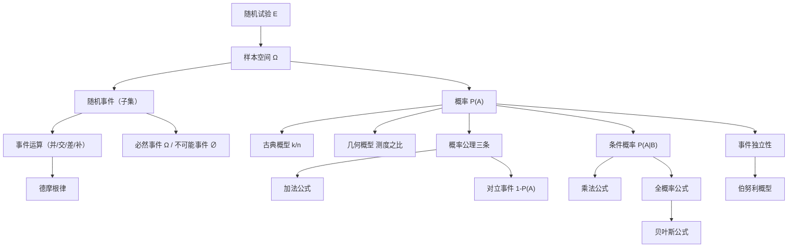

> 📌 概率论研究的是**随机现象的规律性**——在不确定的世界里，寻找确定的数量描述。第一章是整门课的地基，必须夯实每一个概念。

---

## 📋 前置知识

在开始之前，你需要了解这些概念：

- [[集合的基本运算]] — 并集、交集、差集、补集，因为随机事件本质上就是集合运算
- [[排列与组合]] — 古典概型的计算离不开计数原理
- [[极限的基本概念]] — 频率稳定性需要极限思想理解

---

## 🤔 为什么要学这个？

想象一下：天气预报说"明天降雨概率 70%"，这个 70% 是怎么算出来的？又比如：一家保险公司怎么定价才能不亏本？医学临床试验怎么判断新药有没有效果？

这些问题的核心都是：**在不确定性中作出最优决策**。而要做到这一点，首先需要一套严格的数学语言来描述"不确定性"本身——这就是概率论第一章要建立的基础。

没有第一章，后面的大数定律、中心极限定理、假设检验全都是空中楼阁。所以这一章看似简单，实则每个定义都要烂熟于心。

---

## 🧠 核心概念

### 一、随机试验与样本空间

#### 1.1 随机试验

> 🎯 **类比**：随机试验就像投骰子——你能控制**怎么投**（规则固定），但不能控制**投出几点**（结果不确定）。每次投掷都是一次独立的"试验"。

**随机试验（Random Experiment）** 满足三个条件：

1. **可重复性**：在相同条件下可以重复进行
2. **可观测性**：每次试验的结果是可以观测到的
3. **不确定性**：试验前无法确切知道哪个结果会出现，但所有可能结果是已知的

记号：通常用 $E$ 表示一个随机试验。

**典型例子**：

| 试验 $E$ | 描述 |
|----------|------|
| $E_1$ | 抛一枚硬币，观察正反面 |
| $E_2$ | 掷一颗骰子，观察朝上的点数 |
| $E_3$ | 从一批灯泡中任取一只，测其寿命 |
| $E_4$ | 记录某路口一小时内的车流量 |

#### 1.2 样本空间

> 🎯 **类比**：样本空间就像一个**装有所有可能结果的大袋子**。你不知道下一次从袋子里摸出哪个，但你知道所有可能摸出来的东西都在这个袋子里。

**样本空间（Sample Space）** $\Omega$（或 $S$）：随机试验 $E$ 的**所有可能结果**组成的集合。

每个可能结果称为**样本点**，记作 $\omega$（小写）。

对应上面四个试验：

$$\Omega_1 = \{正面, 反面\}$$

$$\Omega_2 = \{1, 2, 3, 4, 5, 6\}$$

$$\Omega_3 = \{t \mid t \geq 0\} = [0, +\infty)$$

$$\Omega_4 = \{0, 1, 2, 3, \ldots\}$$

注意：样本空间可以是**有限集**（$\Omega_1$, $\Omega_2$）、**无限可数集**（$\Omega_4$）或**无限不可数集**（$\Omega_3$）。

> ⚠️ **踩坑**：样本空间的定义和试验的观测目的密切相关。同样是"抛硬币"，如果你关心的是"连续抛直到出现正面需要几次"，样本空间就变成了 $\{1, 2, 3, \ldots\}$，而不是 $\{正面, 反面\}$。**试验没变，但目的变了，样本空间就变了**。

---

### 二、随机事件

#### 2.1 事件的定义

> 🎯 **类比**：如果样本空间是一个城市的地图，随机事件就是地图上圈出来的某个"区域"——投骰子"点数大于4"这个事件，就是在 $\{1,2,3,4,5,6\}$ 这张地图上圈出 $\{5, 6\}$ 这个区域。

**随机事件（Random Event）**：样本空间 $\Omega$ 的**子集**，称为随机事件，简称事件，通常用大写字母 $A, B, C$ 等表示。

- **基本事件**：只含一个样本点的子集，如 $\{3\}$（掷骰子出现3点）
- **复合事件**：含多个样本点的子集，如 $\{2, 4, 6\}$（出现偶数点）
- **必然事件**：$\Omega$ 本身——每次试验必然发生的事件
- **不可能事件**：空集 $\emptyset$——每次试验都不会发生的事件

**事件的发生**：当且仅当试验结果 $\omega \in A$ 时，称事件 $A$ **发生**了。

#### 2.2 事件的关系与运算

事件是集合，所以集合的所有运算都适用。**这是考试的重点，每个运算都要能互相转化。**

**① 包含关系 $A \subset B$**

若事件 $A$ 发生必然导致事件 $B$ 发生，则称 $B$ 包含 $A$，记作 $A \subset B$。

几何理解：$A$ 的区域完全在 $B$ 的区域内部。

例：$A = \{6\}$（掷出6点），$B = \{4,5,6\}$（掷出大于3的点）。$A$ 发生则 $B$ 必然发生，所以 $A \subset B$。

**② 相等关系 $A = B$**

$A \subset B$ 且 $B \subset A$，则 $A = B$。

**③ 和（并）事件 $A \cup B$**

$A \cup B = \{\omega \mid \omega \in A \text{ 或 } \omega \in B\}$

"$A$ 与 $B$ 至少有一个发生"。推广：$\bigcup_{i=1}^{n} A_i$ 表示 $A_1, A_2, \ldots, A_n$ 中至少一个发生。

**④ 积（交）事件 $A \cap B$（简记 $AB$）**

$AB = \{\omega \mid \omega \in A \text{ 且 } \omega \in B\}$

"$A$ 与 $B$ 同时发生"。推广：$\bigcap_{i=1}^{n} A_i$ 表示 $A_1, A_2, \ldots, A_n$ 全部发生。

**⑤ 差事件 $A - B$**

$A - B = \{\omega \mid \omega \in A \text{ 且 } \omega \notin B\}$

"$A$ 发生但 $B$ 不发生"。注意 $A - B = A\overline{B}$（后面讲对立事件后就清楚了）。

**⑥ 互斥事件（互不相容）**

若 $AB = \emptyset$，则称 $A$ 与 $B$ **互斥**（Mutually Exclusive）。

直觉：$A$ 和 $B$ 不能同时发生，在地图上它们的区域没有重叠。

**⑦ 对立事件（互为逆事件）$\overline{A}$**

$\overline{A} = \Omega - A = \{\omega \mid \omega \notin A\}$

对立事件满足：$A \cup \overline{A} = \Omega$ 且 $A \cap \overline{A} = \emptyset$。

即：$A$ 与 $\overline{A}$ **互斥且互补**（两者恰好覆盖整个样本空间）。

> ⚠️ **经典误区：互斥 vs 对立**
> 
> - **互斥**：$AB = \emptyset$，两者不能同时发生，但可以都不发生
> - **对立**：$AB = \emptyset$ **且** $A \cup B = \Omega$，两者不能同时发生，且必有一个发生
> 
> **对立一定互斥，互斥不一定对立。**
> 
> 例：掷骰子，$A = \{1, 2\}$，$B = \{3, 4\}$。$AB = \emptyset$（互斥），但 $A \cup B = \{1,2,3,4\} \neq \Omega$（不对立，因为5、6点两者都没包含）。

#### 2.3 事件运算定律

这些定律和集合运算完全相同，考试中常用来化简复杂事件：

**交换律**：$A \cup B = B \cup A$，$AB = BA$

**结合律**：$(A \cup B) \cup C = A \cup (B \cup C)$，$(AB)C = A(BC)$

**分配律**：$A(B \cup C) = AB \cup AC$，$A \cup (BC) = (A \cup B)(A \cup C)$

**德摩根律（De Morgan's Laws）**——这个最重要，考试高频：

$$\overline{A \cup B} = \overline{A} \cap \overline{B}$$

$$\overline{A \cap B} = \overline{A} \cup \overline{B}$$

推广到 $n$ 个事件：

$$\overline{\bigcup_{i=1}^{n} A_i} = \bigcap_{i=1}^{n} \overline{A_i}, \quad \overline{\bigcap_{i=1}^{n} A_i} = \bigcup_{i=1}^{n} \overline{A_i}$$

> 🎯 **记忆口诀**：德摩根律 = "**取反破横线，并变交，交变并**"。$\overline{A \cup B}$ 的横线"破开"后，$\cup$ 变 $\cap$，每个字母头上加横线。

---

### 三、概率的定义

#### 3.1 频率与概率的关系

在相同条件下重复试验 $n$ 次，事件 $A$ 发生了 $n_A$ 次，则称

$$f_n(A) = \frac{n_A}{n}$$

为事件 $A$ 在 $n$ 次试验中的**频率（Relative Frequency）**。

**频率的统计规律性（大数定律的直觉）**：当 $n$ 很大时，$f_n(A)$ 会在某个固定值附近稳定下来，这个稳定值就是**概率** $P(A)$。

这不是定义，是自然现象。数学上对概率有更严格的公理化定义。

#### 3.2 概率的公理化定义（柯尔莫哥洛夫公理）

**概率（Probability）** 是定义在事件域 $\mathcal{F}$（所有可能事件的集合）上的一个实值函数 $P(\cdot)$，满足以下三条公理：

**公理一（非负性）**：对任意事件 $A$，有 $P(A) \geq 0$

**公理二（规范性）**：$P(\Omega) = 1$

**公理三（可列可加性）**：若 $A_1, A_2, \ldots$ 两两互斥，则

$$P\left(\bigcup_{i=1}^{\infty} A_i\right) = \sum_{i=1}^{\infty} P(A_i)$$

由这三条公理，可以推导出所有概率性质，无需额外假设。

#### 3.3 概率的重要性质（由公理推导）

以下性质**必须全部掌握**，推导过程也要理解：

**性质1**：$P(\emptyset) = 0$

*证明*：$\Omega = \Omega \cup \emptyset \cup \emptyset \cup \cdots$（各项互斥），由公理三：$P(\Omega) = P(\Omega) + P(\emptyset) + P(\emptyset) + \cdots$，所以 $P(\emptyset) = 0$。

**性质2（有限可加性）**：若 $A_1, A_2, \ldots, A_n$ 两两互斥，则

$$P\left(\bigcup_{i=1}^{n} A_i\right) = \sum_{i=1}^{n} P(A_i)$$

**性质3（对立事件）**：$P(\overline{A}) = 1 - P(A)$

*证明*：$\Omega = A \cup \overline{A}$，$A \cap \overline{A} = \emptyset$，所以 $1 = P(A) + P(\overline{A})$。

> 💡 这个性质极其有用：**当直接求 $P(A)$ 困难时，改求 $P(\overline{A})$，再用 $1$ 减**。这是概率计算的万能技巧。

**性质4（单调性）**：若 $A \subset B$，则 $P(A) \leq P(B)$，且 $P(B-A) = P(B) - P(A)$

*证明*：$B = A \cup (B-A)$，两者互斥，所以 $P(B) = P(A) + P(B-A) \geq P(A)$。

**性质5（概率范围）**：$0 \leq P(A) \leq 1$

**性质6（加法公式）**：

$$P(A \cup B) = P(A) + P(B) - P(AB)$$

*证明*：$A \cup B = A \cup (B - AB)$，两者互斥，所以

$$P(A \cup B) = P(A) + P(B - AB) = P(A) + P(B) - P(AB)$$

**三个事件的加法公式**（推广）：

$$P(A \cup B \cup C) = P(A) + P(B) + P(C) - P(AB) - P(AC) - P(BC) + P(ABC)$$

这是**容斥原理**在概率中的体现。记住规律：奇数个交集加，偶数个交集减。

> ⚠️ **踩坑**：加法公式中如果 $A$ 与 $B$ 互斥，则 $P(AB) = 0$，公式退化为 $P(A \cup B) = P(A) + P(B)$。但切忌在不知道是否互斥时直接用这个简化版本！

---

### 四、古典概型

#### 4.1 定义与条件

> 🎯 **类比**：古典概型就像一个**公平的抽签游戏**——抽签筒里有 $n$ 根签，每根签被抽到的机会完全相等，你要计算"抽到满足条件的签"的概率。

**古典概型（等可能概型）** 满足两个条件：

1. **有限性**：样本空间 $\Omega$ 只有**有限个**样本点：$\omega_1, \omega_2, \ldots, \omega_n$
2. **等可能性**：每个样本点发生的概率**相等**，即 $P(\{\omega_i\}) = \frac{1}{n}$（$i = 1, 2, \ldots, n$）

在古典概型下，若事件 $A$ 包含 $k$ 个样本点，则

$$\boxed{P(A) = \frac{k}{n} = \frac{A \text{ 包含的样本点数}}{\Omega \text{ 的样本点总数}} = \frac{\text{有利于} A \text{的基本事件数}}{\text{基本事件总数}}}$$

#### 4.2 古典概型的计算技巧

古典概型的本质是**计数问题**，需要熟练运用排列组合：

- $P_n^m = A_n^m = \frac{n!}{(n-m)!}$：从 $n$ 个元素中取 $m$ 个的**排列数**（有序）
- $C_n^m = \binom{n}{m} = \frac{n!}{m!(n-m)!}$：从 $n$ 个元素中取 $m$ 个的**组合数**（无序）

**关键：区分有序（排列）还是无序（组合）**

- "选人组队"：通常无序，用组合
- "选人排座位"：有序，用排列
- "从中抽取"：通常无序，用组合

#### 4.3 几何概型（连续版古典概型）

当样本空间是某个区域（线段、面积、体积等）时，等可能性体现为"落在某区域的概率正比于该区域的测度"：

$$P(A) = \frac{A \text{ 的测度（长度/面积/体积）}}{\Omega \text{ 的测度}}$$

这用于处理连续型问题，避免了有限样本空间的局限。

---

### 五、条件概率

#### 5.1 条件概率的引入

> 🎯 **类比**：你想知道"从一副牌中随机抽一张是A"的概率，答案是 $\frac{4}{52}$。但如果有人告诉你"抽到的是黑色花色"，你的答案就变成了 $\frac{2}{26}$。**已有额外信息，概率就会更新**——这就是条件概率的本质。

在事件 $B$ 已经发生的条件下，事件 $A$ 发生的**条件概率**：

$$\boxed{P(A \mid B) = \frac{P(AB)}{P(B)}, \quad P(B) > 0}$$

直觉理解：知道 $B$ 发生了，样本空间从 $\Omega$ **缩小**到了 $B$；在新的样本空间 $B$ 中，$A$ 能发生的部分就是 $AB$；所以用 $P(AB)$ 除以 $P(B)$ 做归一化。

**条件概率本身也是概率**，满足概率的三条公理。

#### 5.2 乘法公式

由条件概率定义直接得到：

$$P(AB) = P(B) \cdot P(A \mid B) = P(A) \cdot P(B \mid A)$$

推广到三个事件（要求 $P(AB) > 0$）：

$$P(ABC) = P(A) \cdot P(B \mid A) \cdot P(C \mid AB)$$

**推广到 $n$ 个事件**（链式法则）：

$$P(A_1 A_2 \cdots A_n) = P(A_1) \cdot P(A_2 \mid A_1) \cdot P(A_3 \mid A_1 A_2) \cdots P(A_n \mid A_1 A_2 \cdots A_{n-1})$$

> 💡 乘法公式适合处理**有顺序的连续抽取**问题，比如"先取一个，再取一个"。

---

### 六、全概率公式与贝叶斯公式

#### 6.1 划分（完备事件组）

若事件组 $B_1, B_2, \ldots, B_n$ 满足：

1. $B_i B_j = \emptyset$（$i \neq j$）—— 两两互斥
2. $B_1 \cup B_2 \cup \cdots \cup B_n = \Omega$ —— 完全覆盖

则称 $\{B_1, B_2, \ldots, B_n\}$ 是样本空间 $\Omega$ 的一个**划分（完备事件组）**。

> 🎯 **类比**：把样本空间想象成一个大饼，划分就是把大饼切成若干块——每块不重叠（互斥），所有块拼起来就是完整的大饼（完备）。

#### 6.2 全概率公式

设 $\{B_1, B_2, \ldots, B_n\}$ 是 $\Omega$ 的一个划分，$P(B_i) > 0$，则对任意事件 $A$：

$$\boxed{P(A) = \sum_{i=1}^{n} P(B_i) \cdot P(A \mid B_i)}$$

**直觉**：$A$ 的发生，必然是通过某一个"通道" $B_i$ 实现的（因为 $B_i$ 划分了整个样本空间）。把所有通道的贡献加起来，就得到 $P(A)$。

> 🎯 **类比**：工厂有三条生产线（$B_1, B_2, B_3$），分别生产了总量的 20%、30%、50% 的产品，各条线的次品率分别为 1%、2%、3%。要算总次品率，就把每条线的贡献（产量占比 × 次品率）加起来：$P(\text{次品}) = 0.2 \times 0.01 + 0.3 \times 0.02 + 0.5 \times 0.03$。这正是全概率公式。

#### 6.3 贝叶斯公式（逆概率公式）

在全概率公式的条件下，已知 $A$ 发生，求某个原因 $B_k$ 的概率：

$$\boxed{P(B_k \mid A) = \frac{P(B_k) P(A \mid B_k)}{\sum_{i=1}^{n} P(B_i) P(A \mid B_i)} = \frac{P(B_k) P(A \mid B_k)}{P(A)}}$$

**直觉（正向 vs 逆向）**：

- **全概率**：已知"原因"（$B_i$ 的概率），求"结果"（$A$ 的概率）→ 正向推理
- **贝叶斯**：已知"结果"（$A$ 发生了），求"原因"（哪个 $B_k$ 导致的）→ 逆向推理（后验概率）

$P(B_k)$ 称为**先验概率**（实验前的认知），$P(B_k \mid A)$ 称为**后验概率**（看到结果后更新的认知）。

> ⚠️ **踩坑**：贝叶斯公式的分母就是 $P(A)$（全概率公式的结果），不要重复计算。先算 $P(A)$，再代入贝叶斯。

---

### 七、事件的独立性

#### 7.1 独立性的定义

> 🎯 **类比**：抛两枚硬币，第一枚的结果完全不影响第二枚——这就是独立性。数学上，"$B$ 的发生不影响 $A$ 的概率"，即 $P(A \mid B) = P(A)$。

事件 $A$ 与 $B$ **相互独立（Independent）** 当且仅当：

$$\boxed{P(AB) = P(A) \cdot P(B)}$$

由此定义可以验证：若 $A, B$ 独立，则

$$P(A \mid B) = \frac{P(AB)}{P(B)} = \frac{P(A)P(B)}{P(B)} = P(A)$$

即 $B$ 发生与否对 $A$ 的概率没有影响。

**独立性的推论**：若 $A$ 与 $B$ 独立，则以下各对也相互独立：

- $A$ 与 $\overline{B}$
- $\overline{A}$ 与 $B$  
- $\overline{A}$ 与 $\overline{B}$

> ⚠️ **独立 vs 互斥（最容易混淆）**：
>
> - **互斥**：$P(AB) = 0$，关注的是两事件能否同时发生（结构关系）
> - **独立**：$P(AB) = P(A)P(B)$，关注的是一个事件是否影响另一个的概率（信息关系）
>
> 若 $P(A) > 0$ 且 $P(B) > 0$，则互斥和独立**不可能同时成立**（互斥时 $P(AB)=0$，但独立要求 $P(AB) = P(A)P(B) > 0$，矛盾）。

#### 7.2 三个事件的独立性

三个事件 $A, B, C$ **相互独立**，需满足以下**四个**条件：

$$P(AB) = P(A)P(B)$$
$$P(AC) = P(A)P(C)$$
$$P(BC) = P(B)P(C)$$
$$P(ABC) = P(A)P(B)P(C)$$

**两两独立不能推出相互独立！** 这是考研高频考点。

> ⚠️ **反例**：设 $\Omega = \{1,2,3,4\}$，各点概率均为 $\frac{1}{4}$。令 $A=\{1,2\}$，$B=\{1,3\}$，$C=\{1,4\}$（$A,B,C$ 两两独立）。但 $P(ABC) = P(\{1\}) = \frac{1}{4}$，而 $P(A)P(B)P(C) = \frac{1}{2} \cdot \frac{1}{2} \cdot \frac{1}{2} = \frac{1}{8} \neq \frac{1}{4}$，故 $A,B,C$ 不相互独立。

#### 7.3 伯努利概型（二项概型）

设每次试验只有两个结果：事件 $A$ 发生（概率 $p$）或 $A$ 不发生（概率 $q = 1-p$）。将此试验**独立重复** $n$ 次，称为 $n$ 重**伯努利试验（Bernoulli Trial）**。

在 $n$ 重伯努利试验中，$A$ 恰好发生 $k$ 次的概率：

$$\boxed{P_n(k) = C_n^k p^k (1-p)^{n-k}, \quad k = 0, 1, 2, \ldots, n}$$

这就是**二项分布**的概率质量函数（后续第二章细讲）。

---

## 💻 典型题型与详细解析

以下是考研真题难度的综合例题，覆盖各类题型。

---

### 【题型一】事件的关系与运算

**例题 1**：设 $A, B, C$ 是三个事件，用 $A, B, C$ 的运算表示以下事件：

（1）$A, B, C$ 中恰好有一个发生；  
（2）$A, B, C$ 中至少有两个发生；  
（3）$A, B, C$ 中至多有一个发生；  
（4）$A, B, C$ 中至少有一个不发生。

**解答**：

（1）恰好一个发生 = （$A$ 发生，$B, C$ 不发生）或（$B$ 发生，$A, C$ 不发生）或（$C$ 发生，$A, B$ 不发生）：

$$A\overline{B}\overline{C} \cup \overline{A}B\overline{C} \cup \overline{A}\overline{B}C$$

（2）至少两个发生 = （恰好两个发生）或（三个都发生）：

$$AB\overline{C} \cup A\overline{B}C \cup \overline{A}BC \cup ABC$$

也可以写成：$AB \cup AC \cup BC$（注意这里用了容斥的思路，验证一下：$AB$ 包含了 $AB\overline{C}$ 和 $ABC$，$AC$ 包含了 $A\overline{B}C$ 和 $ABC$，$BC$ 包含了 $\overline{A}BC$ 和 $ABC$，它们的并集 $= AB\overline{C} \cup A\overline{B}C \cup \overline{A}BC \cup ABC$ ✓）

（3）至多一个发生 = "至少两个发生"的对立事件：

$$\overline{AB \cup AC \cup BC} = \overline{AB} \cdot \overline{AC} \cdot \overline{BC} = (\overline{A} \cup \overline{B})(\overline{A} \cup \overline{C})(\overline{B} \cup \overline{C})$$

（4）至少一个不发生 = "$A, B, C$ 全部发生"的对立事件：

$$\overline{ABC} = \overline{A} \cup \overline{B} \cup \overline{C}$$

---

### 【题型二】古典概型与排列组合

**例题 2**：将 $n$ 个不同的球随机地放入 $N$（$N \geq n$）个不同的箱子中（每个箱子可放多个球），求以下事件的概率：

（1）指定的 $n$ 个箱子各有一个球（即某指定箱子恰好各有一球）；  
（2）恰好有 $n$ 个箱子各有一个球（不指定哪些箱子）。

**解答**：

**总数**：每个球有 $N$ 种放法，$n$ 个球共 $N^n$ 种等可能的放法。

（1）**指定**的 $n$ 个箱子各有一球：

$n$ 个球放入指定的 $n$ 个箱子，每个箱子恰好一个球，等价于 $n$ 个球的全排列：$n!$ 种。

$$P_1 = \frac{n!}{N^n}$$

（2）**某** $n$ 个箱子各有一球（不指定哪些）：

先从 $N$ 个箱子中选 $n$ 个（$C_N^n$ 种），再将 $n$ 个球全排列放入（$n!$ 种）：

$$P_2 = \frac{C_N^n \cdot n!}{N^n} = \frac{N!}{(N-n)! \cdot N^n} = \frac{A_N^n}{N^n}$$

**验证**：$P_2 = C_N^n \cdot P_1$，这有意义——$P_1$ 是指定箱子的概率，有 $C_N^n$ 种指定方式，且这些方式互斥，所以 $P_2 = C_N^n \cdot P_1$。

---

### 【题型三】条件概率与乘法公式

**例题 3**：袋中有 5 个白球、3 个黑球。不放回地连续取两次，每次取一个球。

（1）第二次取到白球的概率；  
（2）两次都取到白球的概率；  
（3）已知第一次取到白球，第二次也取到白球的概率。

**解答**：

设 $A_i$ = "第 $i$ 次取到白球"，$i = 1, 2$。

（1）利用**全概率公式**（以第一次结果为划分）：

$$P(A_2) = P(A_1)P(A_2 \mid A_1) + P(\overline{A_1})P(A_2 \mid \overline{A_1})$$

$$= \frac{5}{8} \cdot \frac{4}{7} + \frac{3}{8} \cdot \frac{5}{7} = \frac{20}{56} + \frac{15}{56} = \frac{35}{56} = \frac{5}{8}$$

> 💡 有趣结论：$P(A_2) = P(A_1) = \frac{5}{8}$。这是"**对称性**"的体现——不放回抽取时，每一次抽取白球的概率相同（不受顺序影响）。直觉上，把8个球随机排成一排，第2个位置是白球的概率和第1个位置一样，都是 $\frac{5}{8}$。

（2）利用**乘法公式**：

$$P(A_1 A_2) = P(A_1) \cdot P(A_2 \mid A_1) = \frac{5}{8} \cdot \frac{4}{7} = \frac{20}{56} = \frac{5}{14}$$

（3）这就是条件概率 $P(A_2 \mid A_1)$，由（2）的计算过程已知：

$$P(A_2 \mid A_1) = \frac{4}{7}$$

也可用定义验证：$P(A_2 \mid A_1) = \frac{P(A_1 A_2)}{P(A_1)} = \frac{5/14}{5/8} = \frac{5}{14} \cdot \frac{8}{5} = \frac{4}{7}$ ✓

---

### 【题型四】全概率公式与贝叶斯公式

**例题 4（经典工厂问题）**：某工厂有三条生产线生产同一种产品，产量分别占总产量的 25%、35%、40%，各生产线的次品率分别为 5%、4%、2%。现从该厂产品中随机抽取一件：

（1）求该件为次品的概率；  
（2）若已知抽到的是次品，求它最可能来自哪条生产线？

**解答**：

设 $B_i$ = "产品来自第 $i$ 条生产线"，$A$ = "产品是次品"。

已知：$P(B_1) = 0.25$，$P(B_2) = 0.35$，$P(B_3) = 0.40$

$P(A \mid B_1) = 0.05$，$P(A \mid B_2) = 0.04$，$P(A \mid B_3) = 0.02$

（1）**全概率公式**：

$$P(A) = \sum_{i=1}^{3} P(B_i) P(A \mid B_i)$$

$$= 0.25 \times 0.05 + 0.35 \times 0.04 + 0.40 \times 0.02$$

$$= 0.0125 + 0.0140 + 0.0080 = 0.0345$$

（2）**贝叶斯公式**，分别计算三条线的后验概率：

$$P(B_1 \mid A) = \frac{P(B_1)P(A \mid B_1)}{P(A)} = \frac{0.0125}{0.0345} \approx 0.362$$

$$P(B_2 \mid A) = \frac{P(B_2)P(A \mid B_2)}{P(A)} = \frac{0.0140}{0.0345} \approx 0.406$$

$$P(B_3 \mid A) = \frac{P(B_3)P(A \mid B_3)}{P(A)} = \frac{0.0080}{0.0345} \approx 0.232$$

由于 $P(B_2 \mid A)$ 最大，次品**最可能来自第二条生产线**。

> 💡 注意：尽管第一条线次品率最高（5%），但第二条线产量更大（35% vs 25%），综合效果下来贡献的次品反而最多。这正是贝叶斯公式的魅力：综合考虑先验信息（产量）和条件信息（次品率）。

---

### 【题型五】事件独立性

**例题 5**：甲、乙两人各自独立地破译一份密码，甲破译的概率为 $\frac{1}{3}$，乙破译的概率为 $\frac{1}{4}$，求：

（1）密码被破译的概率；  
（2）恰好有一人破译的概率；  
（3）密码未被破译的概率。

**解答**：

设 $A$ = "甲破译"，$B$ = "乙破译"，$A, B$ 独立。

（1）密码被破译 = $A \cup B$：

$$P(A \cup B) = P(A) + P(B) - P(AB) = \frac{1}{3} + \frac{1}{4} - \frac{1}{3} \cdot \frac{1}{4} = \frac{4}{12} + \frac{3}{12} - \frac{1}{12} = \frac{6}{12} = \frac{1}{2}$$

或用对立：$P(A \cup B) = 1 - P(\overline{A}\overline{B}) = 1 - P(\overline{A})P(\overline{B}) = 1 - \frac{2}{3} \cdot \frac{3}{4} = 1 - \frac{1}{2} = \frac{1}{2}$ ✓

（2）恰好一人破译 = $A\overline{B} \cup \overline{A}B$（互斥）：

$$P(A\overline{B}) + P(\overline{A}B) = P(A)P(\overline{B}) + P(\overline{A})P(B) = \frac{1}{3} \cdot \frac{3}{4} + \frac{2}{3} \cdot \frac{1}{4} = \frac{3}{12} + \frac{2}{12} = \frac{5}{12}$$

（3）密码未被破译 = $\overline{A} \cap \overline{B}$（两人都没破译）：

$$P(\overline{A}\overline{B}) = P(\overline{A}) \cdot P(\overline{B}) = \frac{2}{3} \cdot \frac{3}{4} = \frac{1}{2}$$

验证：（1）+ （3）= $\frac{1}{2} + \frac{1}{2} = 1$ ✓（（1）和（3）是对立事件）

---

### 【题型六】伯努利概型

**例题 6**：某射手每次射击命中目标的概率为 0.8，独立射击 5 次，求：

（1）恰好命中 3 次的概率；  
（2）至少命中 4 次的概率；  
（3）至多命中 1 次的概率。

**解答**：

$n = 5$，$p = 0.8$，$q = 0.2$，$P_5(k) = C_5^k (0.8)^k (0.2)^{5-k}$

（1）$P_5(3) = C_5^3 (0.8)^3 (0.2)^2 = 10 \times 0.512 \times 0.04 = 0.2048$

（2）至少命中 4 次 = 命中 4 次或 5 次：

$$P_5(4) = C_5^4 (0.8)^4 (0.2)^1 = 5 \times 0.4096 \times 0.2 = 0.4096$$

$$P_5(5) = C_5^5 (0.8)^5 (0.2)^0 = 1 \times 0.32768 \times 1 = 0.32768$$

$$P(X \geq 4) = 0.4096 + 0.32768 = 0.73728$$

（3）至多命中 1 次（用对立事件更简便）：

至多命中 1 次的对立事件为"命中 2 次或以上"，不如直接算：

$$P(X = 0) = C_5^0 (0.8)^0 (0.2)^5 = 0.00032$$

$$P(X = 1) = C_5^1 (0.8)^1 (0.2)^4 = 5 \times 0.8 \times 0.0016 = 0.0064$$

$$P(X \leq 1) = 0.00032 + 0.0064 = 0.00672$$

---

### 【题型七】综合难题（较难）

**例题 7（两两独立但不相互独立）**：设 $A, B, C$ 是三个事件，$P(A) = P(B) = P(C) = \frac{1}{4}$，$P(AB) = P(BC) = 0$，$P(AC) = \frac{1}{8}$。求 $P(A \cup B \cup C)$，并判断 $A, C$ 是否独立。

**解答**：

用容斥原理：

$$P(A \cup B \cup C) = P(A) + P(B) + P(C) - P(AB) - P(AC) - P(BC) + P(ABC)$$

需要求 $P(ABC)$。由 $P(BC) = 0$ 知 $BC = \emptyset$（概率意义下），从而 $ABC \subset BC$，故 $P(ABC) = 0$。

$$P(A \cup B \cup C) = \frac{1}{4} + \frac{1}{4} + \frac{1}{4} - 0 - \frac{1}{8} - 0 + 0 = \frac{6}{8} = \frac{3}{4}$$

判断 $A, C$ 的独立性：

$$P(A) \cdot P(C) = \frac{1}{4} \times \frac{1}{4} = \frac{1}{16} \neq \frac{1}{8} = P(AC)$$

所以 $A, C$ **不独立**（正相关，$P(AC) > P(A)P(C)$）。

---

## ⚠️ 常见误区与踩坑点

> ❌ **误区1：互斥与独立混淆**
> 
> 互斥是事件的**集合关系**（区域不重叠），独立是事件的**概率关系**（互不影响）。对于 $P(A)>0, P(B)>0$，这两者不能同时成立。考试常出"判断是否独立/互斥"的选择题，一定要用定义验证，不要凭直觉。

> ❌ **误区2：加法公式漏掉交集项**
> 
> $P(A \cup B) = P(A) + P(B)$ 只在 $A, B$ 互斥时成立。一般情况下必须减去 $P(AB)$。这是大题失分最多的地方。

> ⚠️ **踩坑3：条件概率不满足 $P(B) > 0$**
> 
> $P(A \mid B)$ 要求 $P(B) > 0$，若 $P(B) = 0$ 则条件概率无意义。考题有时会设置 $P(B) = 0$ 的陷阱。

> ❌ **误区4：两两独立 → 相互独立**
> 
> 三个（及以上）事件相互独立需要验证**所有子集的乘积公式**，仅验证两两独立是不够的。例题5给出了反例。

> ⚠️ **踩坑5：贝叶斯公式的分母不用全概率**
> 
> 很多同学在套贝叶斯公式时，分母 $P(A)$ 直接写 $P(B_k)P(A|B_k)$（只用了一项），忘了是对所有 $i$ 求和。分母必须先用全概率公式算出 $P(A)$。

> ⚠️ **踩坑6：不放回抽取的对称性**
> 
> 不放回抽取时，第 $k$ 次取到某类球的概率与 $k$ 的具体值无关（只与总数比例有关），这个"对称性"结论在做全概率公式验证时很有用，但不要错误地把它用于**有放回**抽取（有放回每次独立，本来就对称，更没争议）。

---

## 🔄 概念对比

| 特性 | 互斥事件 | 对立事件 | 独立事件 |
|------|----------|----------|----------|
| 定义条件 | $AB = \emptyset$ | $AB = \emptyset$ 且 $A \cup B = \Omega$ | $P(AB) = P(A)P(B)$ |
| 能否同时发生 | 否 | 否 | 可以 |
| 能否都不发生 | 可以 | 否（必有一个发生） | 可以 |
| 相互关系 | 对立 $\Rightarrow$ 互斥 | 对立是互斥的特殊情况 | 独立与互斥相互排斥（$P>0$时） |
| 对应运算 | $P(A \cup B) = P(A) + P(B)$ | $P(\overline{A}) = 1 - P(A)$ | $P(AB) = P(A)P(B)$ |

> 💡 **一句话总结**：互斥关注的是"能不能同时发生"（集合不重叠），独立关注的是"一个会不会影响另一个"（概率不联动）。对立是最强的互斥（不仅不重叠，还完全覆盖）。

---

## 🏋️ 动手练习

### 练习 1：德摩根律的应用（⭐）

**题目**：设 $P(A) = 0.4$，$P(B) = 0.3$，$P(A \cup B) = 0.6$，求 $P(\overline{A}\overline{B})$、$P(A\overline{B})$、$P(\overline{A}B)$。

**参考答案**：

首先求 $P(AB)$：

$$P(AB) = P(A) + P(B) - P(A \cup B) = 0.4 + 0.3 - 0.6 = 0.1$$

$$P(\overline{A}\overline{B}) = P(\overline{A \cup B}) = 1 - P(A \cup B) = 1 - 0.6 = 0.4$$

$$P(A\overline{B}) = P(A - B) = P(A) - P(AB) = 0.4 - 0.1 = 0.3$$

$$P(\overline{A}B) = P(B - A) = P(B) - P(AB) = 0.3 - 0.1 = 0.2$$

验证：$P(A\overline{B}) + P(\overline{A}B) + P(AB) + P(\overline{A}\overline{B}) = 0.3 + 0.2 + 0.1 + 0.4 = 1.0$ ✓

---

### 练习 2：全概率与贝叶斯（⭐⭐）

**题目**：某医院用血液检测来筛查某疾病。该疾病在人群中的患病率为 1%。检测试剂对患病者的检出率（灵敏度）为 95%，对健康者的误报率（假阳性率）为 2%。若某人检测结果为阳性，求他实际患病的概率（后验概率）。

**参考答案**：

设 $D$ = "患病"，$T$ = "检测阳性"。

已知：$P(D) = 0.01$，$P(\overline{D}) = 0.99$，$P(T \mid D) = 0.95$，$P(T \mid \overline{D}) = 0.02$

全概率公式求 $P(T)$：

$$P(T) = P(D)P(T \mid D) + P(\overline{D})P(T \mid \overline{D})$$
$$= 0.01 \times 0.95 + 0.99 \times 0.02 = 0.0095 + 0.0198 = 0.0293$$

贝叶斯公式：

$$P(D \mid T) = \frac{P(D)P(T \mid D)}{P(T)} = \frac{0.0095}{0.0293} \approx 0.324$$

> 💡 **惊人结论**：即使检测阳性，实际患病概率只有约 32.4%，不到三分之一！这是因为疾病本身患病率极低（1%），大量健康人中的假阳性（误报）把分母拉大了。这就是著名的"**基础率谬误**"——直觉上以为阳性 = 患病，但贝叶斯告诉你不是。

---

### 练习 3：独立性综合判断（⭐⭐）

**题目**：设 $A, B$ 互相独立，$P(A) = 0.3$，$P(B) = 0.4$。求：

（1）$P(A \cup B)$；  
（2）$P(\overline{A} \cup \overline{B})$；  
（3）$P(A \cup \overline{B})$；  
（4）$P(\overline{A} \mid B)$。

**参考答案**：

独立性条件：$P(AB) = P(A)P(B) = 0.3 \times 0.4 = 0.12$

（1）$P(A \cup B) = 0.3 + 0.4 - 0.12 = 0.58$

（2）$A, B$ 独立 $\Rightarrow$ $\overline{A}, \overline{B}$ 独立，$P(\overline{A}\overline{B}) = 0.7 \times 0.6 = 0.42$

$$P(\overline{A} \cup \overline{B}) = P(\overline{A}) + P(\overline{B}) - P(\overline{A}\overline{B}) = 0.7 + 0.6 - 0.42 = 0.88$$

或用德摩根律：$P(\overline{A} \cup \overline{B}) = P(\overline{AB}) = 1 - P(AB) = 1 - 0.12 = 0.88$ ✓

（3）$A, \overline{B}$ 独立，$P(A\overline{B}) = P(A)P(\overline{B}) = 0.3 \times 0.6 = 0.18$

$$P(A \cup \overline{B}) = P(A) + P(\overline{B}) - P(A\overline{B}) = 0.3 + 0.6 - 0.18 = 0.72$$

（4）$A, B$ 独立 $\Rightarrow$ $\overline{A}, B$ 独立：

$$P(\overline{A} \mid B) = P(\overline{A}) = 0.7$$

---

### 练习 4：伯努利概型综合（⭐⭐⭐）

**题目**：某系统由 5 个相互独立的元件并联组成（任意一个元件正常工作，系统就正常工作）。每个元件正常工作的概率为 0.9。

（1）系统正常工作的概率；  
（2）若要求系统正常工作的概率不低于 0.999，至少需要几个元件并联（仍设每个元件工作概率为 0.9）？

**参考答案**：

（1）设 $A_i$ = "第 $i$ 个元件正常工作"，独立，$P(A_i) = 0.9$。

系统正常工作 = $A_1 \cup A_2 \cup \cdots \cup A_5$

用对立事件：系统**不**工作 = 所有元件都坏 = $\overline{A_1}\overline{A_2}\cdots\overline{A_5}$

$$P(\text{系统不工作}) = \prod_{i=1}^{5} P(\overline{A_i}) = (0.1)^5 = 10^{-5}$$

$$P(\text{系统正常工作}) = 1 - 10^{-5} = 0.99999$$

（2）设需要 $n$ 个元件，要求：

$$1 - (0.1)^n \geq 0.999 \Rightarrow (0.1)^n \leq 0.001 = 10^{-3}$$

即 $10^{-n} \leq 10^{-3}$，所以 $n \geq 3$。

**至少需要 3 个元件**并联（验证：$n=3$ 时 $P = 1 - 0.001 = 0.999 \geq 0.999$ ✓，$n=2$ 时 $P = 1 - 0.01 = 0.99 < 0.999$ ✗）。

---

## 📝 总结

### 本篇要点回顾

1. **样本空间与事件**：事件是样本空间的子集，掌握并、交、差、补的定义，重点掌握德摩根律 $\overline{A \cup B} = \overline{A}\overline{B}$，$\overline{AB} = \overline{A} \cup \overline{B}$。

2. **概率的三条公理**：非负性、规范性、可列可加性。从这三条出发推导所有性质，尤其是加法公式 $P(A \cup B) = P(A) + P(B) - P(AB)$ 和对立 $P(\overline{A}) = 1 - P(A)$。

3. **古典概型**：本质是计数，关键是分清有序（排列）还是无序（组合）；几何概型用测度之比。

4. **条件概率与乘法**：$P(A \mid B) = \frac{P(AB)}{P(B)}$，乘法公式用于处理顺序抽取问题。

5. **全概率 & 贝叶斯**：全概率 = 由原因推结果（正向），贝叶斯 = 由结果推原因（逆向）。先用全概率算 $P(A)$，再代入贝叶斯。

6. **独立性**：$P(AB) = P(A)P(B)$；独立与互斥（$P>0$ 时）不能共存；两两独立 $\not\Rightarrow$ 相互独立。

### 知识图谱

---

## 🔗 相关链接

- 上级概念：[[概率论与数理统计总览]]
- 下级概念：[[第二章 随机变量及其分布]]
- 同级概念：[[数学一 极限与连续]]、[[数学一 微积分]]
- 实际应用：[[假设检验基础]]、[[贝叶斯推断]]

## 📚 参考资料

- 浙大版《概率论与数理统计》第四版（陈希孺）— 考研标准教材
- 张宇《概率论与数理统计 9 讲》— 考研重点梳理
- 李永乐《数学复习全书》概率章节 — 历年真题解析
