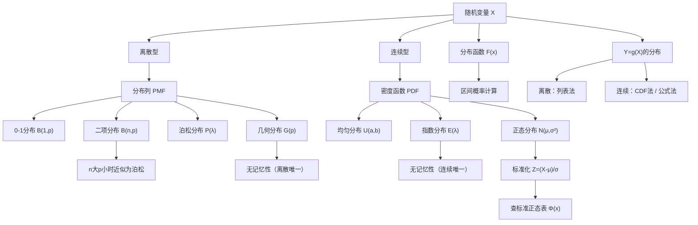

> 📌 随机变量是把"随机试验的结果"翻译成"数"的工具——有了这个翻译，我们才能用数学分析工具（求和、积分、期望）来研究随机现象。

---

## 📋 前置知识

- [[概率论第一章：随机事件与概率]] — 事件与概率的基本概念，本章是其延伸
- [[定积分的计算]] — 连续型随机变量的概率需要用积分计算
- [[级数基础]] — 离散型概率求和有时需要无穷级数

---

## 🤔 为什么要引入随机变量？

第一章我们用集合语言描述事件，虽然严谨，但每次都要写"掷骰子出现1或2或3"这样啰嗦的描述，而且无法做代数运算。

引入随机变量后，上面那句话变成 $X \leq 3$，可以直接写 $P(X \leq 3)$，可以求 $E(X)$（期望）、$D(X)$（方差），可以研究多个随机变量的关系。

**随机变量是第一章到整门课其余部分的桥梁**——没有随机变量，就没有分布、期望、中心极限定理，也没有后续的统计推断。

---

## 🧠 核心概念

### 一、随机变量的定义

> 🎯 **类比**：随机变量就像一个**翻译官**，把随机试验的每个结果（样本点 $\omega$）翻译成一个数字。抛硬币的结果是"正面"或"反面"，翻译官把它翻译成"1"或"0"——这就是随机变量 $X$。

**随机变量（Random Variable）**：定义在样本空间 $\Omega$ 上的实值函数，即

$$X = X(\omega): \Omega \to \mathbb{R}$$

对每个样本点 $\omega \in \Omega$，$X(\omega)$ 是一个实数。

关键点：$X$ 的取值是随机的（因为 $\omega$ 是随机的），但 $X$ 的**规律**（分布）是确定的，可以分析。

随机变量分两大类：

| 类型 | 取值 | 典型例子 |
|------|------|----------|
| **离散型** | 有限个或可列无限个值 | 掷骰子点数、一小时内到达人数 |
| **连续型** | 某区间上的所有实数 | 灯泡寿命、测量误差 |

---

### 二、分布函数（CDF）

#### 2.1 定义

> 🎯 **类比**：分布函数就像"累积水位计"——$F(x)$ 告诉你"水位不超过 $x$ 米的概率有多大"。水位越高，概率越大，最终趋向 1。

**分布函数（Cumulative Distribution Function, CDF）**：

$$F(x) = P(X \leq x), \quad -\infty < x < +\infty$$

分布函数完整地描述了随机变量的概率规律，**任何类型**的随机变量（离散、连续、混合）都有分布函数。

#### 2.2 分布函数的性质（必须全部掌握）

**性质1（单调不减）**：若 $x_1 < x_2$，则 $F(x_1) \leq F(x_2)$

**性质2（右连续）**：$F(x^+) = \lim_{t \to x^+} F(t) = F(x)$（从右侧趋近等于当前值）

**性质3（极限条件）**：

$$F(-\infty) = \lim_{x \to -\infty} F(x) = 0, \quad F(+\infty) = \lim_{x \to +\infty} F(x) = 1$$

**利用分布函数计算区间概率**：

$$P(a < X \leq b) = F(b) - F(a)$$

$$P(X = a) = F(a) - F(a^-)$$（$F(a^-)$ 是左极限）

$$P(X > a) = 1 - F(a)$$

$$P(a \leq X \leq b) = F(b) - F(a^-)$$

> ⚠️ **踩坑**：区分严格不等号和非严格不等号时，关键看 $X = a$ 处有没有概率质量（即分布函数在 $a$ 处是否有跳跃）。对连续型随机变量，$P(X = a) = 0$，所以 $P(X < a) = P(X \leq a) = F(a)$；但对离散型，一定要区分。

---

### 三、离散型随机变量

#### 3.1 概率分布列（PMF）

**概率质量函数（Probability Mass Function, PMF）**：

$$P(X = x_k) = p_k, \quad k = 1, 2, \ldots$$

满足：$p_k \geq 0$，$\sum_k p_k = 1$

通常用**分布表**表示：

| $X$ | $x_1$ | $x_2$ | $\cdots$ | $x_n$ |
|-----|--------|--------|----------|--------|
| $P$ | $p_1$  | $p_2$  | $\cdots$ | $p_n$  |

#### 3.2 重要离散分布（考研必考）

---

**① 0-1 分布（伯努利分布）$B(1, p)$**

只做一次试验，结果只有 0 或 1：

$$P(X = 1) = p, \quad P(X = 0) = 1 - p = q$$

这是最简单的离散分布，是二项分布的特例（$n=1$）。

---

**② 二项分布 $B(n, p)$**

> 🎯 **类比**：$n$ 次独立抛硬币，每次正面概率为 $p$，$X$ = 正面次数。

$$\boxed{P(X = k) = C_n^k p^k (1-p)^{n-k}, \quad k = 0, 1, \ldots, n}$$

记作 $X \sim B(n, p)$。

**参数含义**：$n$ = 试验次数，$p$ = 每次成功概率。

**最可能值（众数）**：使 $P(X=k)$ 最大的 $k$，满足 $(n+1)p - 1 \leq k \leq (n+1)p$。

期望 $E(X) = np$，方差 $D(X) = np(1-p)$（第三章证明）。

**特殊情况**：$B(1,p)$ 就是 0-1 分布。

---

**③ 泊松分布 $P(\lambda)$**

> 🎯 **类比**：泊松分布描述"单位时间内随机事件发生次数"——比如一小时内某路口的车祸次数、一天内某客服收到的投诉数、单位体积内的细菌数。

$$\boxed{P(X = k) = \frac{\lambda^k e^{-\lambda}}{k!}, \quad k = 0, 1, 2, \ldots}$$

记作 $X \sim P(\lambda)$，参数 $\lambda > 0$ 表示**单位时间（或空间）内事件发生的平均次数**。

验证归一性：$\sum_{k=0}^{\infty} \frac{\lambda^k e^{-\lambda}}{k!} = e^{-\lambda} \cdot e^{\lambda} = 1$ ✓

期望 $E(X) = \lambda$，方差 $D(X) = \lambda$（泊松分布期望方差相等，这是判断题常考点）。

**泊松定理（二项分布的极限）**：当 $n \to \infty$，$p \to 0$，$np \to \lambda$ 时，

$$C_n^k p^k (1-p)^{n-k} \to \frac{\lambda^k e^{-\lambda}}{k!}$$

实用准则：当 $n \geq 20$，$p \leq 0.05$ 时，可用泊松分布近似二项分布，取 $\lambda = np$。

---

**④ 几何分布 $G(p)$**

> 🎯 **类比**：反复投篮，每次命中概率为 $p$，$X$ = **第一次**命中时的投篮次数（包括命中那次）。

$$\boxed{P(X = k) = (1-p)^{k-1} p, \quad k = 1, 2, 3, \ldots}$$

记作 $X \sim G(p)$。

期望 $E(X) = \frac{1}{p}$（直觉：成功率 $p$，平均需要 $\frac{1}{p}$ 次才首次成功）。

**无记忆性（考研重点性质）**：

$$P(X > m + n \mid X > m) = P(X > n)$$

直觉：如果前 $m$ 次都没成功，从第 $m+1$ 次开始"重新计数"，和从头开始没有区别——几何分布没有"越来越可能成功"的积累效应。

> ⚠️ **几何分布是离散分布中唯一具有无记忆性的分布**，类比于连续分布中的指数分布。

---

**⑤ 超几何分布**

$N$ 件产品中有 $M$ 件次品，不放回取 $n$ 件，$X$ = 取到的次品数：

$$P(X = k) = \frac{C_M^k C_{N-M}^{n-k}}{C_N^n}, \quad k = 0, 1, \ldots, \min(n, M)$$

当 $N$ 很大而 $n$ 相对较小时，超几何分布可用二项分布 $B(n, M/N)$ 近似（因为此时放回与不放回差别不大）。

---

### 四、连续型随机变量

#### 4.1 概率密度函数（PDF）

> 🎯 **类比**：PDF 就像"人口密度地图"——密度函数 $f(x)$ 不直接表示概率，而是表示"在 $x$ 附近单位长度上有多少概率质量"。某个小区间 $[x, x+dx]$ 内的概率约为 $f(x) \cdot dx$（密度 × 宽度）。

若存在非负函数 $f(x)$，使得对任意 $x$：

$$F(x) = \int_{-\infty}^{x} f(t) \, dt$$

则称 $X$ 为**连续型随机变量**，$f(x)$ 为其**概率密度函数（PDF）**。

**PDF 的两个必要条件**：

1. $f(x) \geq 0$
2. $\int_{-\infty}^{+\infty} f(x) \, dx = 1$

**区间概率计算**：

$$P(a < X < b) = \int_a^b f(x) \, dx = F(b) - F(a)$$

**PDF 与 CDF 的关系**（在 $f$ 的连续点处）：

$$F'(x) = f(x)$$

**连续型随机变量的重要性质**：$P(X = a) = 0$ 对任意 $a$ 成立。

因此对连续型随机变量，四种不等号的概率完全相等：

$$P(a < X < b) = P(a \leq X < b) = P(a < X \leq b) = P(a \leq X \leq b)$$

> ⚠️ **踩坑**：$P(X = a) = 0$ 不代表 "$X = a$ 是不可能事件"！$X = a$ 确实可能发生，只是发生的概率为零。这是"概率零事件"不等于"不可能事件"的典型例子。

#### 4.2 重要连续分布（考研必考）

---

**① 均匀分布 $U(a, b)$**

> 🎯 **类比**：在区间 $[a, b]$ 上"随机撒点"，落在每个小区间的概率只与该区间的长度成正比，与位置无关。

$$f(x) = \begin{cases} \dfrac{1}{b-a}, & a \leq x \leq b \\ 0, & \text{其他} \end{cases}$$

分布函数：

$$F(x) = \begin{cases} 0, & x < a \\ \dfrac{x-a}{b-a}, & a \leq x < b \\ 1, & x \geq b \end{cases}$$

期望 $E(X) = \dfrac{a+b}{2}$，方差 $D(X) = \dfrac{(b-a)^2}{12}$。

区间概率（$a \leq c < d \leq b$）：$P(c \leq X \leq d) = \dfrac{d-c}{b-a}$（只与长度有关）。

---

**② 指数分布 $E(\lambda)$**

> 🎯 **类比**：灯泡的寿命、等公交的等待时间、放射性粒子的衰变时间——"等到某件事发生"的等待时间，在没有老化效应时，服从指数分布。

$$f(x) = \begin{cases} \lambda e^{-\lambda x}, & x > 0 \\ 0, & x \leq 0 \end{cases}$$

分布函数：

$$F(x) = \begin{cases} 1 - e^{-\lambda x}, & x > 0 \\ 0, & x \leq 0 \end{cases}$$

参数 $\lambda > 0$ 为**失效率（强度）**。期望 $E(X) = \dfrac{1}{\lambda}$，方差 $D(X) = \dfrac{1}{\lambda^2}$。

**无记忆性（与几何分布对应）**：

$$P(X > s + t \mid X > s) = P(X > t), \quad s, t > 0$$

**指数分布是连续分布中唯一具有无记忆性的分布。**

直觉：灯泡已经用了 1000 小时还没坏，它"剩余寿命"的分布和一只新灯泡的寿命分布完全一样——没有"越用越容易坏"的积累。

> ⚠️ **注意**：指数分布有两种参数化方式，一种用 $\lambda$（失效率），一种用 $\theta = 1/\lambda$（均值）。考研题中通常用 $\lambda$，但要看清题目给的是哪种参数。

---

**③ 正态分布 $N(\mu, \sigma^2)$（最重要）**

> 🎯 **类比**：正态分布是自然界的"通用形状"——身高、体重、测量误差、考试成绩……只要是大量独立随机因素叠加的结果（中心极限定理），就近似服从正态分布。

$$\boxed{f(x) = \frac{1}{\sqrt{2\pi}\sigma} e^{-\frac{(x-\mu)^2}{2\sigma^2}}, \quad -\infty < x < +\infty}$$

参数：$\mu$ 为均值（对称轴位置），$\sigma^2$ 为方差（控制胖瘦）。

**正态分布的性质**：

1. 关于 $x = \mu$ 对称，$x = \mu$ 处取最大值 $\frac{1}{\sqrt{2\pi}\sigma}$
2. 在 $x = \mu \pm \sigma$ 处有拐点
3. $x$ 轴是渐近线
4. $\sigma$ 越小，曲线越"尖"（集中），$\sigma$ 越大，曲线越"矮胖"（分散）

**标准正态分布 $N(0, 1)$**：$\mu = 0$，$\sigma = 1$，密度函数记为 $\varphi(x)$，分布函数记为 $\Phi(x)$：

$$\varphi(x) = \frac{1}{\sqrt{2\pi}} e^{-x^2/2}$$

$$\Phi(x) = \int_{-\infty}^{x} \frac{1}{\sqrt{2\pi}} e^{-t^2/2} \, dt$$

**标准化（Z 变换）**：若 $X \sim N(\mu, \sigma^2)$，则

$$\boxed{Z = \frac{X - \mu}{\sigma} \sim N(0, 1)}$$

任何正态分布的概率都化为标准正态来查表：

$$P(a < X < b) = \Phi\left(\frac{b-\mu}{\sigma}\right) - \Phi\left(\frac{a-\mu}{\sigma}\right)$$

**$\Phi(x)$ 的对称性**（极其重要）：

$$\Phi(-x) = 1 - \Phi(x)$$

**常用数值**（记住这三个）：

$$P(\mu - \sigma < X < \mu + \sigma) = 2\Phi(1) - 1 \approx 0.6826$$

$$P(\mu - 2\sigma < X < \mu + 2\sigma) = 2\Phi(2) - 1 \approx 0.9545$$

$$P(\mu - 3\sigma < X < \mu + 3\sigma) = 2\Phi(3) - 1 \approx 0.9974$$

这就是著名的 **"$3\sigma$ 法则"**：正态分布几乎所有概率（99.74%）都集中在均值的 $3\sigma$ 范围内。

> ⚠️ **踩坑：查表时的细节**
>
> 标准正态分布表通常只给 $x \geq 0$ 的值。遇到 $\Phi(-1.5)$，要用 $\Phi(-1.5) = 1 - \Phi(1.5)$ 转化。另外，部分教材的表给的是 $\Phi(x) - 0.5$（即只有右半部分面积），使用前要确认表的类型。

---

### 五、随机变量函数的分布

#### 5.1 问题类型

已知 $X$ 的分布，求 $Y = g(X)$ 的分布。这是考研的高频题型，需要掌握两种方法。

#### 5.2 离散型：直接列表法

若 $X$ 是离散型，$Y = g(X)$ 也是离散型，直接代入：

$$P(Y = g(x_k)) = P(X = x_k) = p_k$$

注意：若多个 $x_k$ 映射到同一个 $y$ 值，需要合并概率。

**例**：$X$ 的分布列为 $P(X=k) = \frac{1}{3}$，$k = -1, 0, 1$。求 $Y = X^2$ 的分布。

$Y$ 的可能取值：$X=-1 \Rightarrow Y=1$，$X=0 \Rightarrow Y=0$，$X=1 \Rightarrow Y=1$。

$P(Y=0) = P(X=0) = \frac{1}{3}$，$P(Y=1) = P(X=-1) + P(X=1) = \frac{2}{3}$。

#### 5.3 连续型：分布函数法（CDF 法）

**步骤**：

1. 写出 $Y = g(X)$ 的分布函数：$F_Y(y) = P(Y \leq y) = P(g(X) \leq y)$
2. 将 $g(X) \leq y$ 转化为 $X$ 的不等式
3. 用 $F_X$ 或 $f_X$ 表达
4. 对 $y$ 求导得 $f_Y(y)$

**若 $g$ 严格单调（常用公式）**：

设 $g$ 在区间 $(a,b)$ 上严格单调，$h = g^{-1}$ 是其反函数，则

$$\boxed{f_Y(y) = f_X(h(y)) \cdot |h'(y)|}, \quad y \in g((a,b))$$

> ⚠️ **绝对值不能忘！** 若 $g$ 是严格递减的，$h'(y) < 0$，必须加绝对值，否则密度函数会变成负值。

**对非单调函数，只能用 CDF 法**，不能直接套公式。

---

## 💻 典型题型与详细解析

### 【题型一】验证分布函数的性质

**例题 1**：设随机变量 $X$ 的分布函数为

$$F(x) = \begin{cases} 0, & x < 0 \\ A\sin x, & 0 \leq x < \frac{\pi}{2} \\ 1, & x \geq \frac{\pi}{2} \end{cases}$$

（1）确定常数 $A$；（2）求 $P\left(0 < X < \frac{\pi}{4}\right)$；（3）求 $P\left(X = \frac{\pi}{4}\right)$；（4）求 $X$ 的 PDF。

**解答**：

（1）利用**右连续性**：在 $x = \frac{\pi}{2}$ 处，$F\left(\frac{\pi}{2}\right) = 1$，而从左段趋近：$\lim_{x \to (\pi/2)^-} A\sin x = A\sin\frac{\pi}{2} = A$。

为使 $F$ 右连续且 $F(+\infty) = 1$，需要 $A = 1$。

（2）$P\left(0 < X < \frac{\pi}{4}\right) = F\left(\frac{\pi}{4}\right) - F(0^+)$

注意 $F(0) = A\sin 0 = 0$，$F\left(\frac{\pi}{4}\right) = \sin\frac{\pi}{4} = \frac{\sqrt{2}}{2}$。

$$P\left(0 < X < \frac{\pi}{4}\right) = \frac{\sqrt{2}}{2} - 0 = \frac{\sqrt{2}}{2}$$

（3）$P\left(X = \frac{\pi}{4}\right) = F\left(\frac{\pi}{4}\right) - F\left(\frac{\pi}{4}^-\right) = \frac{\sqrt{2}}{2} - \frac{\sqrt{2}}{2} = 0$

（$F$ 在 $x = \frac{\pi}{4}$ 连续，故该点无质量，$X$ 是连续型随机变量）

（4）对 $F(x)$ 求导：

$$f(x) = F'(x) = \begin{cases} \cos x, & 0 < x < \frac{\pi}{2} \\ 0, & \text{其他} \end{cases}$$

---

### 【题型二】离散分布计算

**例题 2**：某人独立重复射击，每次命中概率为 0.6，直到命中为止。

（1）恰好射击 5 次的概率（几何分布）；  
（2）已知至少射了 3 次，恰好射了 5 次的概率（条件概率 + 无记忆性）；  
（3）若改为独立射击 10 次，命中次数 $X$ 的期望与方差（二项分布）。

**解答**：

$X$ = 首次命中所需次数，$X \sim G(0.6)$，$p = 0.6$，$q = 0.4$。

（1）$P(X = 5) = (0.4)^4 \times 0.6 = 0.0256 \times 0.6 = 0.01536$

（2）方法一（直接用定义）：

$$P(X=5 \mid X \geq 3) = \frac{P(X=5, X \geq 3)}{P(X \geq 3)} = \frac{P(X=5)}{P(X \geq 3)}$$

$$P(X \geq 3) = 1 - P(X=1) - P(X=2) = 1 - 0.6 - 0.4 \times 0.6 = 1 - 0.6 - 0.24 = 0.16$$

$$P(X=5 \mid X \geq 3) = \frac{0.01536}{0.16} = 0.096$$

方法二（利用无记忆性）：

$P(X=5 \mid X \geq 3)$ = 已知前2次失败，第3次起恰好再失败2次后命中 = $P(X=3)$

$$= (0.4)^2 \times 0.6 = 0.096 \checkmark$$

（3）$Y \sim B(10, 0.6)$：

$$E(Y) = np = 10 \times 0.6 = 6$$

$$D(Y) = np(1-p) = 10 \times 0.6 \times 0.4 = 2.4$$

---

### 【题型三】泊松分布及近似

**例题 3**：某电话交换台每分钟收到呼叫次数 $X \sim P(4)$（泊松分布，$\lambda = 4$）。

（1）一分钟内恰好收到 6 次呼叫的概率；  
（2）一分钟内收到呼叫不超过 1 次的概率；  
（3）某产品 200 件中有 2 件次品的概率（用泊松近似，$n=200$，$p=0.01$）。

**解答**：

（1）$P(X=6) = \dfrac{4^6 e^{-4}}{6!} = \dfrac{4096 \times e^{-4}}{720}$

$e^{-4} \approx 0.0183$，故 $P(X=6) \approx \dfrac{4096 \times 0.0183}{720} \approx \dfrac{75.0}{720} \approx 0.1042$

（2）$P(X \leq 1) = P(X=0) + P(X=1)$

$$= e^{-4} + \frac{4^1 e^{-4}}{1!} = e^{-4}(1 + 4) = 5e^{-4} \approx 5 \times 0.0183 = 0.0916$$

（3）$n = 200$，$p = 0.01$，$\lambda = np = 2$，用 $P(\lambda=2)$ 近似：

$$P(X=2) \approx \frac{2^2 e^{-2}}{2!} = \frac{4e^{-2}}{2} = 2e^{-2} \approx 2 \times 0.1353 = 0.2707$$

（精确二项值 $C_{200}^2 (0.01)^2 (0.99)^{198} \approx 0.2716$，近似误差很小）

---

### 【题型四】正态分布计算

**例题 4**：设 $X \sim N(2, 9)$（即 $\mu=2$，$\sigma^2=9$，$\sigma=3$）。

已知 $\Phi(1) = 0.8413$，$\Phi(0.5) = 0.6915$，$\Phi(2) = 0.9772$。

（1）$P(X < 5)$；  
（2）$P(-1 < X < 5)$；  
（3）$P(|X - 2| > 6)$；  
（4）确定 $c$ 使得 $P(X > c) = 0.1587$。

**解答**：

标准化：$Z = \frac{X - 2}{3} \sim N(0,1)$。

（1）$P(X < 5) = P\left(Z < \frac{5-2}{3}\right) = P(Z < 1) = \Phi(1) = 0.8413$

（2）$P(-1 < X < 5) = P\left(\frac{-1-2}{3} < Z < \frac{5-2}{3}\right) = P(-1 < Z < 1)$

$$= \Phi(1) - \Phi(-1) = \Phi(1) - [1 - \Phi(1)] = 2\Phi(1) - 1 = 2 \times 0.8413 - 1 = 0.6826$$

（3）$P(|X-2| > 6) = P(X-2 > 6) + P(X-2 < -6) = P(X > 8) + P(X < -4)$

$$= P\left(Z > \frac{8-2}{3}\right) + P\left(Z < \frac{-4-2}{3}\right) = P(Z > 2) + P(Z < -2)$$

$$= [1 - \Phi(2)] + \Phi(-2) = [1 - \Phi(2)] + [1 - \Phi(2)] = 2[1 - 0.9772] = 0.0456$$

（4）$P(X > c) = 0.1587$ 即 $1 - P(X \leq c) = 0.1587$，故 $P(X \leq c) = 0.8413$。

$$\Phi\left(\frac{c-2}{3}\right) = 0.8413 = \Phi(1) \Rightarrow \frac{c-2}{3} = 1 \Rightarrow c = 5$$

---

### 【题型五】随机变量函数的分布（难点）

**例题 5**：设 $X \sim U(0, 1)$（均匀分布），求 $Y = -2\ln X$ 的分布。

**解答（CDF 法）**：

首先确定 $Y$ 的取值范围：$X \in (0,1)$，$\ln X \in (-\infty, 0)$，$-2\ln X \in (0, +\infty)$，所以 $Y > 0$。

$$F_Y(y) = P(Y \leq y) = P(-2\ln X \leq y) = P\left(\ln X \geq -\frac{y}{2}\right) = P\left(X \geq e^{-y/2}\right)$$

由于 $X \sim U(0,1)$，$f_X(x) = 1$（$0 < x < 1$）：

$$F_Y(y) = P\left(X \geq e^{-y/2}\right) = 1 - e^{-y/2}, \quad y > 0$$

求导得 PDF：

$$f_Y(y) = \frac{1}{2} e^{-y/2}, \quad y > 0$$

这正是参数 $\lambda = \frac{1}{2}$ 的指数分布！即 $Y \sim E\left(\frac{1}{2}\right)$。

> 💡 这是一个重要结论：均匀分布通过 $Y = -\frac{1}{\lambda}\ln X$ 变换，可以生成指数分布。这是随机数模拟中的基础技巧（逆变换法）。

---

**例题 6（正态变换）**：设 $X \sim N(\mu, \sigma^2)$，求 $Y = e^X$ 的 PDF（对数正态分布）。

**解答（公式法）**：

$g(x) = e^x$ 严格递增，反函数 $h(y) = \ln y$，$h'(y) = \frac{1}{y}$，$y > 0$。

$$f_Y(y) = f_X(h(y)) \cdot |h'(y)| = \frac{1}{\sqrt{2\pi}\sigma} e^{-\frac{(\ln y - \mu)^2}{2\sigma^2}} \cdot \frac{1}{y}, \quad y > 0$$

这就是**对数正态分布**的密度函数，在金融（股价）、生物学（细胞大小）中广泛应用。

---

### 【题型六】综合难题

**例题 7**：设随机变量 $X$ 的 PDF 为

$$f(x) = \begin{cases} x, & 0 < x < 1 \\ 2 - x, & 1 \leq x < 2 \\ 0, & \text{其他} \end{cases}$$

（1）验证 $f(x)$ 是合法的 PDF；  
（2）求 $F(x)$；  
（3）求 $P(0.5 < X < 1.5)$；  
（4）求 $Y = 2X - 1$ 的 PDF。

**解答**：

（1）显然 $f(x) \geq 0$。验证归一性：

$$\int_{-\infty}^{+\infty} f(x)\,dx = \int_0^1 x\,dx + \int_1^2 (2-x)\,dx = \frac{1}{2} + \left[2x - \frac{x^2}{2}\right]_1^2 = \frac{1}{2} + \left(4-2\right) - \left(2 - \frac{1}{2}\right) = \frac{1}{2} + \frac{1}{2} = 1 \checkmark$$

（2）分段求 $F(x) = \int_{-\infty}^x f(t)\,dt$：

当 $x < 0$：$F(x) = 0$

当 $0 \leq x < 1$：$F(x) = \int_0^x t\,dt = \dfrac{x^2}{2}$

当 $1 \leq x < 2$：$F(x) = \dfrac{1}{2} + \int_1^x (2-t)\,dt = \dfrac{1}{2} + \left[2t - \dfrac{t^2}{2}\right]_1^x = \dfrac{1}{2} + 2x - \dfrac{x^2}{2} - \dfrac{3}{2} = 2x - \dfrac{x^2}{2} - 1$

当 $x \geq 2$：$F(x) = 1$

（3）$P(0.5 < X < 1.5) = F(1.5) - F(0.5)$

$$F(1.5) = 2(1.5) - \frac{(1.5)^2}{2} - 1 = 3 - 1.125 - 1 = 0.875$$

$$F(0.5) = \frac{(0.5)^2}{2} = 0.125$$

$$P(0.5 < X < 1.5) = 0.875 - 0.125 = 0.75$$

（4）$Y = 2X - 1$，$g(x) = 2x - 1$ 严格递增，反函数 $h(y) = \dfrac{y+1}{2}$，$h'(y) = \dfrac{1}{2}$。

$X \in (0,2) \Rightarrow Y = 2X-1 \in (-1, 3)$。

分段（$x \in (0,1)$ 对应 $y \in (-1,1)$；$x \in [1,2)$ 对应 $y \in [1,3)$）：

$$f_Y(y) = f_X\left(\frac{y+1}{2}\right) \cdot \frac{1}{2}$$

当 $-1 < y < 1$：$f_X\left(\frac{y+1}{2}\right) = \frac{y+1}{2}$（对应 $x \in (0,1)$ 段），故 $f_Y(y) = \dfrac{y+1}{4}$

当 $1 \leq y < 3$：$f_X\left(\frac{y+1}{2}\right) = 2 - \frac{y+1}{2} = \frac{3-y}{2}$（对应 $x \in [1,2)$ 段），故 $f_Y(y) = \dfrac{3-y}{4}$

$$f_Y(y) = \begin{cases} \dfrac{y+1}{4}, & -1 < y < 1 \\ \dfrac{3-y}{4}, & 1 \leq y < 3 \\ 0, & \text{其他} \end{cases}$$

---

## ⚠️ 常见误区与踩坑点

> ❌ **误区1：PDF 值就是概率**
> 
> $f(x)$ 是密度，**不是概率**。$f(x)$ 可以大于 1（只要它对应的积分等于 1 即可）。例如 $U(0, 0.5)$ 的 $f(x) = 2 > 1$。**概率是 $f(x)$ 在某区间上的积分**，不是 $f(x)$ 的值本身。

> ⚠️ **踩坑2：分布函数的分段边界处理**
> 
> 求 $F(x)$ 时，各段的边界值要保证连续型随机变量的 $F(x)$ **处处连续**。计算各段时不要弄错上限，上一段的末尾值应等于下一段开始的值。

> ❌ **误区3：$P(X=a) = 0$ 就是不可能事件**
> 
> 连续型随机变量 $P(X=a) = 0$，但 $X=a$ 不是不可能事件（$\{X=a\} \neq \emptyset$）。这是"零概率事件不等于不可能事件"的标准例子，考试选择题常出。

> ⚠️ **踩坑4：正态分布 $N(\mu, \sigma^2)$ 的第二个参数是方差，不是标准差**
> 
> $N(2, 9)$ 中，$\sigma^2 = 9$，所以 $\sigma = 3$（不是 9）。标准化时除以 $\sigma = 3$，不是 9。这个错误出现频率极高。

> ❌ **误区5：函数变换公式忘了绝对值**
> 
> $f_Y(y) = f_X(h(y)) \cdot |h'(y)|$，绝对值是必须的。若 $g$ 递减则 $h'(y) < 0$，不加绝对值会得到负的密度函数。

> ⚠️ **踩坑6：泊松近似的条件**
> 
> 泊松近似适用于 $n$ 大（$n \geq 20$）且 $p$ 小（$p \leq 0.05$）。若 $p$ 接近 $0.5$（比如抛硬币），应用正态近似，不能用泊松近似。

---

## 🔄 重要分布对比表

| 分布 | 记号 | PMF/PDF | 期望 | 方差 | 特殊性质 |
|------|------|---------|------|------|----------|
| 0-1 分布 | $B(1,p)$ | $P(X=k)=p^k(1-p)^{1-k}$ | $p$ | $p(1-p)$ | 伯努利试验 |
| 二项分布 | $B(n,p)$ | $C_n^k p^k(1-p)^{n-k}$ | $np$ | $np(1-p)$ | $n$ 次独立伯努利 |
| 泊松分布 | $P(\lambda)$ | $\lambda^k e^{-\lambda}/k!$ | $\lambda$ | $\lambda$ | 期望=方差 |
| 几何分布 | $G(p)$ | $(1-p)^{k-1}p$ | $1/p$ | $(1-p)/p^2$ | 无记忆性（离散） |
| 均匀分布 | $U(a,b)$ | $1/(b-a)$ | $(a+b)/2$ | $(b-a)^2/12$ | 等可能 |
| 指数分布 | $E(\lambda)$ | $\lambda e^{-\lambda x}$ | $1/\lambda$ | $1/\lambda^2$ | 无记忆性（连续） |
| 正态分布 | $N(\mu,\sigma^2)$ | $\frac{1}{\sqrt{2\pi}\sigma}e^{-(x-\mu)^2/2\sigma^2}$ | $\mu$ | $\sigma^2$ | 中心极限定理 |

> 💡 **无记忆性总结**：离散分布中只有几何分布有无记忆性，连续分布中只有指数分布有无记忆性。这是考研填空/选择的高频考点。

---

## 🏋️ 动手练习

### 练习 1：离散分布综合（⭐⭐）

**题目**：设 $X \sim B(4, 0.5)$，$Y = |X - 2|$。

（1）写出 $X$ 的分布表；  
（2）写出 $Y$ 的分布表；  
（3）求 $P(Y \leq 1)$。

**参考答案**：

（1）$P(X=k) = C_4^k (0.5)^4$：

| $X$ | 0 | 1 | 2 | 3 | 4 |
|-----|---|---|---|---|---|
| $P$ | $\frac{1}{16}$ | $\frac{4}{16}$ | $\frac{6}{16}$ | $\frac{4}{16}$ | $\frac{1}{16}$ |

（2）$Y = |X-2|$：$X=0 \Rightarrow Y=2$，$X=1 \Rightarrow Y=1$，$X=2 \Rightarrow Y=0$，$X=3 \Rightarrow Y=1$，$X=4 \Rightarrow Y=2$。

合并：$P(Y=0) = \frac{6}{16}$，$P(Y=1) = \frac{4+4}{16} = \frac{8}{16}$，$P(Y=2) = \frac{1+1}{16} = \frac{2}{16}$。

（3）$P(Y \leq 1) = P(Y=0) + P(Y=1) = \frac{6}{16} + \frac{8}{16} = \frac{14}{16} = \frac{7}{8}$

---

### 练习 2：连续型分布函数（⭐⭐）

**题目**：设 $X$ 的 PDF 为 $f(x) = a e^{-|x|}$，$-\infty < x < +\infty$。

（1）求常数 $a$；  
（2）求 $F(x)$；  
（3）求 $P(-1 < X < 2)$。

**参考答案**：

（1）归一化：

$$\int_{-\infty}^{+\infty} ae^{-|x|}\,dx = 2a\int_0^{+\infty} e^{-x}\,dx = 2a \cdot 1 = 2a = 1 \Rightarrow a = \frac{1}{2}$$

（2）分 $x \geq 0$ 和 $x < 0$ 两段：

当 $x < 0$：$F(x) = \int_{-\infty}^x \frac{1}{2}e^t \,dt = \frac{1}{2}e^x$

当 $x \geq 0$：$F(x) = \frac{1}{2} + \int_0^x \frac{1}{2}e^{-t}\,dt = \frac{1}{2} + \frac{1}{2}(1 - e^{-x}) = 1 - \frac{1}{2}e^{-x}$

（3）$P(-1 < X < 2) = F(2) - F(-1) = \left(1 - \frac{e^{-2}}{2}\right) - \frac{e^{-1}}{2} = 1 - \frac{e^{-2} + e^{-1}}{2}$

$\approx 1 - \frac{0.1353 + 0.3679}{2} \approx 1 - 0.2516 = 0.7484$

---

### 练习 3：正态分布逆向求参数（⭐⭐）

**题目**：设 $X \sim N(\mu, \sigma^2)$，已知 $P(X \leq 5) = 0.8413$，$P(X \leq 2) = 0.1587$（提示：$\Phi(1) = 0.8413$）。

（1）求 $\mu$ 和 $\sigma$；  
（2）求 $P(2 < X < 8)$。

**参考答案**：

（1）由 $P(X \leq 5) = 0.8413 = \Phi(1)$，得 $\Phi\left(\frac{5-\mu}{\sigma}\right) = \Phi(1)$，即 $\frac{5-\mu}{\sigma} = 1$。

由 $P(X \leq 2) = 0.1587 = 1 - \Phi(1) = \Phi(-1)$，得 $\frac{2-\mu}{\sigma} = -1$。

联立：$5 - \mu = \sigma$ 且 $2 - \mu = -\sigma$，相加得 $7 - 2\mu = 0$，故 $\mu = 3.5$，$\sigma = 1.5$。

（2）$P(2 < X < 8) = \Phi\left(\frac{8-3.5}{1.5}\right) - \Phi\left(\frac{2-3.5}{1.5}\right) = \Phi(3) - \Phi(-1) = \Phi(3) - [1-\Phi(1)]$

$\approx 0.9987 - 0.1587 = 0.84$

---

### 练习 4：随机变量函数分布（⭐⭐⭐）

**题目**：设 $X \sim N(0, 1)$，求 $Y = X^2$ 的 PDF（卡方分布 $\chi^2(1)$ 的推导）。

**参考答案**（CDF 法，注意 $g(x) = x^2$ 不单调，必须用 CDF 法）：

$Y = X^2 \geq 0$，当 $y < 0$ 时 $F_Y(y) = 0$；当 $y \geq 0$ 时：

$$F_Y(y) = P(X^2 \leq y) = P(-\sqrt{y} \leq X \leq \sqrt{y}) = \Phi(\sqrt{y}) - \Phi(-\sqrt{y}) = 2\Phi(\sqrt{y}) - 1$$

对 $y$ 求导（$y > 0$）：

$$f_Y(y) = 2\varphi(\sqrt{y}) \cdot \frac{1}{2\sqrt{y}} = \frac{\varphi(\sqrt{y})}{\sqrt{y}} = \frac{1}{\sqrt{2\pi}} e^{-y/2} \cdot \frac{1}{\sqrt{y}} = \frac{1}{\sqrt{2\pi}} y^{-1/2} e^{-y/2}$$

即

$$f_Y(y) = \frac{1}{\sqrt{2\pi}} y^{-1/2} e^{-y/2}, \quad y > 0$$

这正是自由度为 1 的**卡方分布 $\chi^2(1)$** 的密度函数（数理统计部分的重要分布）。

---

## 📝 总结

### 本篇要点回顾

1. **随机变量**是样本空间到实数的函数，把随机现象数量化。分布函数 $F(x) = P(X \leq x)$ 是描述所有类型随机变量的统一工具，具有单调不减、右连续、极限为0和1三条性质。

2. **离散分布四大模型**：0-1分布（单次试验）、二项分布（$n$ 次独立重复）、泊松分布（计数型，期望=方差=λ）、几何分布（首次成功，无记忆性）。

3. **连续分布三大模型**：均匀分布（等可能）、指数分布（等待时间，无记忆性，唯一）、正态分布（中心极限定理，最重要）。正态分布所有计算归结为查标准正态表。

4. **随机变量函数的分布**：离散型用列表法，连续型用CDF法（万能）或公式法（$g$ 严格单调时）。公式 $f_Y(y) = f_X(h(y))|h'(y)|$ 中绝对值不能忘。

5. **无记忆性**是几何分布（离散）和指数分布（连续）的专属性质，唯一性是高频考点。

### 知识图谱

---

## 🔗 相关链接

- 上级概念：[[概率论第一章：随机事件与概率]]
- 下级概念：[[第三章 多维随机变量及其分布]]
- 同级延伸：[[第四章 随机变量的数字特征]]
- 实际应用：[[数理统计 卡方分布与t分布]]、[[中心极限定理]]

## 📚 参考资料

- 浙大版《概率论与数理统计》第四版 第二章 — 标准教材，推导严谨
- 张宇《概率论 9 讲》第二讲 — 例题丰富，强调分布函数法
- 李永乐《数学复习全书》— 历年真题分类解析
