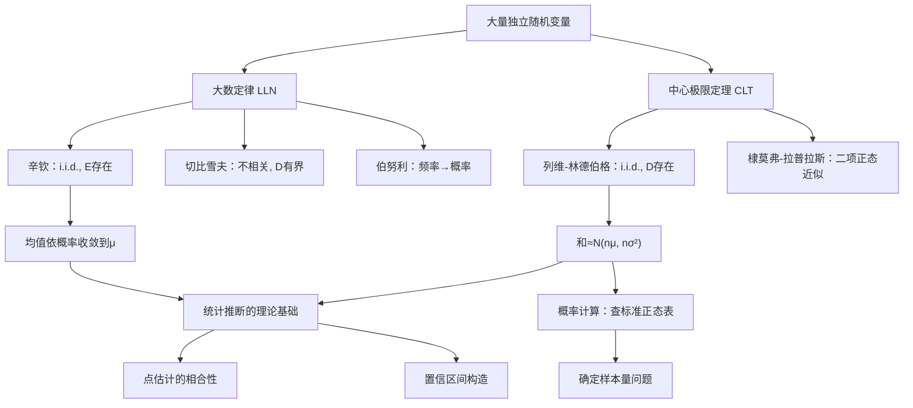

> 📌 大数定律说明"样本均值趋近总体均值"，中心极限定理说明"大量独立随机变量之和近似服从正态分布"。这两个定理是**概率论通向数理统计的桥梁**，也是理解统计推断合理性的根基。

---

## 📋 前置知识

- [[概率论第四章：随机变量的数字特征]] — 切比雪夫不等式是弱大数定律的证明工具，期望与方差是本章的核心参数
- [[概率论第二章：随机变量及其分布]] — 正态分布的标准化是中心极限定理的直接应用
- [[极限的 ε-N 语言]] — 依概率收敛是新的收敛概念，需要与数列极限区分

---

## 🤔 为什么这两个定理这么重要？

先问一个根本问题：**统计学为什么管用？**

我们用 1000 人的身高样本来估计全体人口的平均身高，凭什么这样做是合理的？

- **大数定律**给出理论保证：样本量足够大时，样本均值以极高概率非常接近总体均值。
- **中心极限定理**更进一步：无论总体分布是什么形状（正态、均匀、泊松……），只要样本量足够大，样本均值的分布就近似正态分布，可以用正态分布的工具（查表、置信区间）来推断。

这两个定理把"随机"和"规律"联系在一起，是整个统计推断体系的理论地基。

---

## 🧠 核心概念

### 一、依概率收敛

在讨论大数定律之前，需要一种新的收敛概念。

**依概率收敛（Convergence in Probability）**：

设 $X_1, X_2, \ldots$ 是一列随机变量，$a$ 是一个常数。若对任意 $\varepsilon > 0$，有

$$\lim_{n \to \infty} P(|X_n - a| \geq \varepsilon) = 0$$

则称随机变量序列 $\{X_n\}$ **依概率收敛**于 $a$，记作 $X_n \xrightarrow{P} a$。

> 🎯 **类比**：数列收敛 $x_n \to a$ 是说"$n$ 足够大后，$x_n$ 必然落在 $a$ 的 $\varepsilon$ 邻域内"（确定性）。依概率收敛是说"$n$ 足够大后，$X_n$ 落在 $a$ 的 $\varepsilon$ 邻域外的概率可以任意小"（概率意义）。后者是弱化版——允许偶尔偏离，但偏离的概率趋于零。

**性质**：若 $X_n \xrightarrow{P} a$，$Y_n \xrightarrow{P} b$，$g(x,y)$ 连续，则 $g(X_n, Y_n) \xrightarrow{P} g(a,b)$。

特别地：$X_n + Y_n \xrightarrow{P} a+b$，$X_n Y_n \xrightarrow{P} ab$，$X_n/Y_n \xrightarrow{P} a/b$（$b \neq 0$）。

---

### 二、大数定律

大数定律（Law of Large Numbers, LLN）的直觉：大量重复试验中，**频率稳定于概率**，**样本均值稳定于总体均值**。

#### 2.1 切比雪夫大数定律

**定理**：设 $X_1, X_2, \ldots$ 两两不相关，具有相同的期望 $\mu$ 和方差（方差有公共上界 $C$，即 $D(X_i) \leq C$）。令 $\bar{X}_n = \frac{1}{n}\sum_{i=1}^n X_i$，则

$$\bar{X}_n \xrightarrow{P} \mu$$

**证明思路**：

$E(\bar{X}_n) = \mu$，$D(\bar{X}_n) = \frac{1}{n^2}\sum D(X_i) \leq \frac{C}{n}$。

由切比雪夫不等式：$P(|\bar{X}_n - \mu| \geq \varepsilon) \leq \frac{D(\bar{X}_n)}{\varepsilon^2} \leq \frac{C}{n\varepsilon^2} \to 0$。

#### 2.2 辛钦大数定律（考研最常用）

**定理**：设 $X_1, X_2, \ldots$ 独立同分布（i.i.d.），$E(X_i) = \mu$（存在即可，不要求方差存在！），则

$$\boxed{\bar{X}_n = \frac{1}{n}\sum_{i=1}^n X_i \xrightarrow{P} \mu}$$

> 💡 辛钦大数定律比切比雪夫大数定律条件更弱（只需期望存在，不要求方差），但要求独立同分布（i.i.d.）。

**实际意义**：

1. **频率 → 概率**：对事件 $A$，令 $X_i = \mathbf{1}_{A_i}$（第 $i$ 次试验 $A$ 是否发生），则 $\bar{X}_n = \frac{n_A}{n}$（频率），$E(X_i) = P(A)$。辛钦大数定律说明：$\frac{n_A}{n} \xrightarrow{P} P(A)$，即**频率依概率收敛于概率**。
2. **理论基础**：保险精算、蒙特卡洛模拟的数学基础都是大数定律。

#### 2.3 伯努利大数定律

这是辛钦大数定律的特例，历史上最早的大数定律：

设 $n_A$ 是 $n$ 次独立试验中 $A$ 发生的次数，$p = P(A)$，则对任意 $\varepsilon > 0$：

$$\lim_{n \to \infty} P\left(\left|\frac{n_A}{n} - p\right| \geq \varepsilon\right) = 0$$

即 $\frac{n_A}{n} \xrightarrow{P} p$。

---

### 三、中心极限定理

中心极限定理（Central Limit Theorem, CLT）：**大量独立随机变量的和（或均值）近似服从正态分布**，无论各随机变量本身服从什么分布。

#### 3.1 列维-林德伯格定理（i.i.d. 情形，最常用）

**定理**：设 $X_1, X_2, \ldots$ 独立同分布，$E(X_i) = \mu$，$D(X_i) = \sigma^2 > 0$，令

$$Y_n = \frac{\sum_{i=1}^n X_i - n\mu}{\sqrt{n}\sigma} = \frac{\bar{X}_n - \mu}{\sigma/\sqrt{n}}$$

则对任意 $x$：

$$\boxed{\lim_{n \to \infty} P(Y_n \leq x) = \Phi(x)}$$

即 $Y_n$ 的分布函数收敛到标准正态分布函数。

**等价表述（实用版）**：当 $n$ 充分大时，

$$\sum_{i=1}^n X_i \approx N(n\mu, n\sigma^2)$$

$$\bar{X}_n \approx N\left(\mu, \frac{\sigma^2}{n}\right)$$

**标准化公式**：

$$\boxed{P\left(a \leq \sum_{i=1}^n X_i \leq b\right) \approx \Phi\left(\frac{b - n\mu}{\sqrt{n}\sigma}\right) - \Phi\left(\frac{a - n\mu}{\sqrt{n}\sigma}\right)}$$

> ⚠️ **使用条件**：$n$ 要足够大。通常 $n \geq 30$ 时近似效果较好；若总体分布接近正态，$n$ 更小也可以。

#### 3.2 二项分布的正态近似（棣莫弗-拉普拉斯定理）

这是中心极限定理在二项分布上的经典应用：

**定理**：$X \sim B(n, p)$，当 $n$ 充分大时，

$$\frac{X - np}{\sqrt{np(1-p)}} \approx N(0,1)$$

**概率计算**：

$$\boxed{P(X \leq k) \approx \Phi\left(\frac{k - np}{\sqrt{np(1-p)}}\right)}$$

$$P(k_1 \leq X \leq k_2) \approx \Phi\left(\frac{k_2 - np}{\sqrt{np(1-p)}}\right) - \Phi\left(\frac{k_1 - np}{\sqrt{np(1-p)}}\right)$$

**使用条件**：$n$ 大，且 $p$ 不太接近 0 或 1（通常要求 $np \geq 5$ 且 $n(1-p) \geq 5$）。

> 💡 **三种近似的使用场景**（二项分布的近似）：
> - $n$ 大，$p$ 小（$np$ 有限）：用**泊松近似** $P(\lambda = np)$
> - $n$ 大，$p$ 不极端：用**正态近似** $N(np, np(1-p))$
> - $n$ 不大，精确计算：直接用二项分布公式

---

## 💻 典型题型与详细解析

### 【题型一】大数定律的直接应用

**例题 1**：设 $X_1, X_2, \ldots$ 独立同分布，$E(X_i) = 2$，$D(X_i) = 9$。

（1）当 $n$ 多大时，可以保证 $P(|\bar{X}_n - 2| < 0.1) \geq 0.99$？（切比雪夫估计）

（2）当 $n = 100$ 时，用中心极限定理近似计算 $P(|\bar{X}_n - 2| < 0.3)$（$\Phi(1) = 0.8413$）。

**解答**：

（1）利用切比雪夫不等式，$D(\bar{X}_n) = \sigma^2/n = 9/n$：

$$P(|\bar{X}_n - 2| \geq 0.1) \leq \frac{9/n}{0.01} = \frac{900}{n}$$

要使 $P(|\bar{X}_n - 2| < 0.1) \geq 0.99$，即 $P(|\bar{X}_n - 2| \geq 0.1) \leq 0.01$：

$$\frac{900}{n} \leq 0.01 \Rightarrow n \geq 90000$$

（2）$n = 100$ 时，$\bar{X}_n \approx N(2, 9/100)$，标准差 $= 3/10 = 0.3$：

$$P(|\bar{X}_n - 2| < 0.3) = P\left(\left|\frac{\bar{X}_n - 2}{0.3}\right| < 1\right) \approx P(|Z| < 1) = 2\Phi(1) - 1 = 0.6826$$

> 💡 对比：切比雪夫给出 $n \geq 90000$ 才能保证某精度，而中心极限定理告诉我们 $n=100$ 时已有约 68% 的把握。切比雪夫非常保守，CLT 更精确但需要已知分布（或 $n$ 足够大的条件）。

---

### 【题型二】中心极限定理——和的分布

**例题 2**：某保险公司有 10000 名投保人，每人每年出险的概率为 0.01，出险时赔偿额为 1 万元。假设各人出险相互独立，求：

（1）该公司年赔偿总额不超过 120 万元的概率；  
（2）为使年赔偿总额超过 $M$ 万元的概率不超过 0.05，$M$ 至少为多少？

（$\Phi(1.645) = 0.95$，$\Phi(2) = 0.9772$）

**解答**：

设第 $i$ 人出险情况 $X_i \sim B(1, 0.01)$（伯努利），出险则赔 1 万，年赔偿总额 $S = \sum_{i=1}^{10000} X_i$（万元）。

$n = 10000$，$p = 0.01$，$np = 100$，$\sqrt{np(1-p)} = \sqrt{99} \approx 9.95$。

由中心极限定理（或棣莫弗-拉普拉斯），$S \approx N(100, 99)$。

（1）

$$P(S \leq 120) \approx \Phi\left(\frac{120 - 100}{\sqrt{99}}\right) = \Phi\left(\frac{20}{9.95}\right) \approx \Phi(2.01) \approx \Phi(2) = 0.9772$$

（2）要求 $P(S > M) \leq 0.05$，即 $P(S \leq M) \geq 0.95$：

$$\Phi\left(\frac{M - 100}{9.95}\right) \geq 0.95 = \Phi(1.645)$$

$$\frac{M - 100}{9.95} \geq 1.645 \Rightarrow M \geq 100 + 1.645 \times 9.95 \approx 100 + 16.37 = 116.37$$

故 $M$ 至少为 **116.37 万元**（实际中取 117 万元以保证偿付能力）。

---

### 【题型三】二项分布的正态近似

**例题 3**：一批产品的次品率为 0.2，随机抽取 400 件，求次品数在 70 至 90 件之间的概率。

（$\Phi(1.25) = 0.8944$，$\Phi(1.25) - \Phi(-1.25) = 0.7888$，$\Phi(2.5) = 0.9938$）

**解答**：

$X \sim B(400, 0.2)$，$np = 80$，$\sqrt{np(1-p)} = \sqrt{64} = 8$。

用正态近似：$X \approx N(80, 64)$。

$$P(70 \leq X \leq 90) \approx \Phi\left(\frac{90-80}{8}\right) - \Phi\left(\frac{70-80}{8}\right) = \Phi(1.25) - \Phi(-1.25)$$

$$= 2\Phi(1.25) - 1 = 2 \times 0.8944 - 1 = 0.7888$$

---

### 【题型四】中心极限定理——确定样本量

**例题 4**：用蒙特卡洛方法估计 $\pi$：在单位正方形内随机投点，落在内切圆内的概率为 $p = \pi/4$。设投了 $n$ 次，命中 $m$ 次，用 $\hat{p} = m/n$ 估计 $p$。

（1）用中心极限定理，确定 $n$ 使得 $P(|\hat{p} - p| < 0.01) \geq 0.95$；  
（2）在最坏情况下（$p(1-p)$ 最大），$n$ 至少为多少？

（$\Phi(1.96) = 0.975$）

**解答**：

$\hat{p} = m/n$ 是 $n$ 个独立伯努利随机变量的均值，由 CLT：

$$\hat{p} \approx N\left(p, \frac{p(1-p)}{n}\right)$$

（1）$P(|\hat{p} - p| < 0.01) \approx P\left(|Z| < \frac{0.01}{\sqrt{p(1-p)/n}}\right) = 2\Phi\left(\frac{0.01\sqrt{n}}{\sqrt{p(1-p)}}\right) - 1 \geq 0.95$

$$\Phi\left(\frac{0.01\sqrt{n}}{\sqrt{p(1-p)}}\right) \geq 0.975 = \Phi(1.96)$$

$$\frac{0.01\sqrt{n}}{\sqrt{p(1-p)}} \geq 1.96 \Rightarrow n \geq \frac{(1.96)^2 p(1-p)}{(0.01)^2} = 38416 \cdot p(1-p)$$

代入 $p = \pi/4 \approx 0.785$：$p(1-p) \approx 0.785 \times 0.215 \approx 0.169$，

$n \geq 38416 \times 0.169 \approx 6492$。

（2）最坏情况 $p=0.5$ 时，$p(1-p) = 0.25$ 最大（$n$ 最大）：

$$n \geq 38416 \times 0.25 = 9604$$

---

### 【题型五】独立不同分布的 CLT

**例题 5**：设 $X_1, X_2, \ldots, X_{100}$ 相互独立，$X_k \sim U\left(-k, k\right)$（$k = 1, 2, \ldots, 100$）。令 $S_{100} = \sum_{k=1}^{100} X_k$，用中心极限定理近似计算 $P(S_{100} > 200)$。

（$\Phi(0.346) \approx 0.635$）

**解答**：

$X_k \sim U(-k, k)$，$E(X_k) = 0$，$D(X_k) = \frac{(2k)^2}{12} = \frac{k^2}{3}$。

$$E(S_{100}) = \sum_{k=1}^{100} E(X_k) = 0$$

$$D(S_{100}) = \sum_{k=1}^{100} D(X_k) = \sum_{k=1}^{100} \frac{k^2}{3} = \frac{1}{3} \cdot \frac{100 \times 101 \times 201}{6} = \frac{100 \times 101 \times 201}{18} = \frac{2030100}{18} = 112783.\overline{3}$$

$\sqrt{D(S_{100})} = \sqrt{112783.\overline{3}} \approx 335.8$

由 CLT（独立但不同分布，满足林德伯格条件）：

$$P(S_{100} > 200) \approx 1 - \Phi\left(\frac{200 - 0}{335.8}\right) = 1 - \Phi(0.596) \approx 1 - \Phi(0.6) \approx 1 - 0.7257 = 0.2743$$

> 💡 此题验证了 CLT 对**独立不同分布**也适用（在满足林德伯格条件时），不局限于 i.i.d. 情形。

---

### 【题型六】综合应用——正态近似与误差分析

**例题 6**：工厂生产某种零件，每件质量（克）服从 $N(100, 16)$（$\mu=100$，$\sigma^2=16$，$\sigma=4$）。箱装 100 件，求：

（1）一箱零件总质量超过 10100 克的概率；  
（2）一箱零件总质量在 9920 至 10080 克之间的概率；  
（3）若用一台精度有限的秤，每次称量误差 $\varepsilon_i \sim U(-1, 1)$ 且相互独立，连续称量 100 次后取平均值作为读数，求平均误差 $\bar{\varepsilon}$ 超过 0.1 克的概率。

（$\Phi(2.5) = 0.9938$，$\Phi(2) = 0.9772$，$\Phi(1.732) \approx 0.9584$）

**解答**：

设 $X_i$ 为第 $i$ 件零件质量，$X_i \sim N(100, 16)$ i.i.d.，$S_{100} = \sum_{i=1}^{100} X_i$。

$E(S_{100}) = 10000$，$D(S_{100}) = 100 \times 16 = 1600$，$\sigma_{S} = 40$。

由 CLT（实际上 $X_i$ 本身就是正态，所以和**精确地**服从正态）：$S_{100} \sim N(10000, 1600)$。

（1）$P(S_{100} > 10100) = 1 - \Phi\left(\frac{10100-10000}{40}\right) = 1 - \Phi(2.5) = 1 - 0.9938 = 0.0062$

（2）$P(9920 \leq S_{100} \leq 10080) = \Phi\left(\frac{10080-10000}{40}\right) - \Phi\left(\frac{9920-10000}{40}\right)$

$= \Phi(2) - \Phi(-2) = 2\Phi(2) - 1 = 2 \times 0.9772 - 1 = 0.9544$

（3）$\varepsilon_i \sim U(-1,1)$，$E(\varepsilon_i) = 0$，$D(\varepsilon_i) = \frac{4}{12} = \frac{1}{3}$。

$\bar{\varepsilon} = \frac{1}{100}\sum\varepsilon_i$，$E(\bar{\varepsilon}) = 0$，$D(\bar{\varepsilon}) = \frac{1/3}{100} = \frac{1}{300}$，$\sigma_{\bar{\varepsilon}} = \frac{1}{\sqrt{300}} = \frac{1}{10\sqrt{3}} \approx 0.0577$。

由 CLT，$\bar{\varepsilon} \approx N(0, 1/300)$：

$$P(|\bar{\varepsilon}| > 0.1) = 2\left[1 - \Phi\left(\frac{0.1}{1/\sqrt{300}}\right)\right] = 2\left[1 - \Phi(0.1\sqrt{300})\right]$$

$0.1\sqrt{300} = 0.1 \times 10\sqrt{3} = \sqrt{3} \approx 1.732$

$$P(|\bar{\varepsilon}| > 0.1) = 2[1 - \Phi(1.732)] \approx 2(1-0.9584) = 2 \times 0.0416 = 0.0832$$

---

### 【题型七】综合难题——大数定律与 CLT 混合

**例题 7**：设 $X_1, X_2, \ldots$ i.i.d.，$P(X_i = 1) = P(X_i = -1) = \frac{1}{2}$（对称伯努利分布）。

（1）验证辛钦大数定律的条件，说明 $\bar{X}_n \xrightarrow{P} 0$；  
（2）令 $S_n = \sum_{i=1}^n X_i$，用 CLT 求 $P(S_{100} \geq 10)$；  
（3）证明：对任意 $\varepsilon > 0$，$P(|S_n| \geq \varepsilon\sqrt{n}) \to 2[1-\Phi(\varepsilon)]$（$n \to \infty$）；  
（4）$S_n$ 本身是否依概率收敛？收敛到什么？

**解答**：

$E(X_i) = 0$，$D(X_i) = E(X_i^2) - 0 = 1$。

（1）i.i.d.，期望 $E(X_i) = 0$ 存在，满足辛钦大数定律，故 $\bar{X}_n \xrightarrow{P} 0$。

（2）$S_{100} \sim$ 近似 $N(0, 100)$（CLT，$n\mu = 0$，$n\sigma^2 = 100$）：

$$P(S_{100} \geq 10) \approx 1 - \Phi\left(\frac{10}{\sqrt{100}}\right) = 1 - \Phi(1) = 1 - 0.8413 = 0.1587$$

（3）$\frac{S_n}{\sqrt{n}} = \frac{S_n - n\cdot 0}{\sqrt{n} \cdot 1}$，由 CLT，$\frac{S_n}{\sqrt{n}} \xrightarrow{d} N(0,1)$（依分布收敛）。

$$P\left(|S_n| \geq \varepsilon\sqrt{n}\right) = P\left(\left|\frac{S_n}{\sqrt{n}}\right| \geq \varepsilon\right) \to P(|Z| \geq \varepsilon) = 2[1-\Phi(\varepsilon)]$$

（4）$S_n$ 本身**不依概率收敛**到任何常数。因为 $D(S_n) = n \to \infty$，$S_n$ 越来越分散，不趋向任何固定值。

但 $S_n/\sqrt{n}$ 依分布收敛到 $N(0,1)$，$\bar{X}_n = S_n/n \xrightarrow{P} 0$（两种不同尺度的归一化）。

> 💡 这道题揭示了一个重要区别：$S_n$ 发散（$D(S_n) = n \to \infty$），$\bar{X}_n = S_n/n$ 收敛（大数定律），$S_n/\sqrt{n}$ 趋向标准正态（CLT）。三种不同的归一化，刻画了随机游走的不同侧面。

---

## ⚠️ 常见误区与踩坑点

> ❌ **误区1：CLT 要求各 $X_i$ 服从正态分布**
>
> 完全不需要！CLT 的神奇之处恰恰是：**无论** $X_i$ 服从什么分布（均匀、泊松、指数……），只要独立同分布且方差有限，和的分布就趋向正态。只有"独立""方差存在""$n$ 足够大"三个条件。

> ⚠️ **踩坑2：大数定律和 CLT 的区别**
>
> - 大数定律：$\bar{X}_n \xrightarrow{P} \mu$（均值收敛到常数，是确定性结论）
> - CLT：$\frac{\bar{X}_n - \mu}{\sigma/\sqrt{n}}$ 的分布趋向 $N(0,1)$（描述均值的波动规律，是分布的结论）
> - 两者不矛盾：LLN 说均值趋向 $\mu$，CLT 说趋向过程的误差大约是 $N(0, \sigma^2/n)$ 量级。

> ❌ **误区3：CLT 近似对所有 $n$ 成立**
>
> CLT 是极限定理，只有 $n$ **充分大**才能用正态近似。二项分布要求 $np \geq 5$ 且 $nq \geq 5$；一般分布通常 $n \geq 30$。若 $n$ 很小（比如 $n=3$），用 CLT 会有很大误差。

> ⚠️ **踩坑4：二项分布近似选泊松还是正态**
>
> - $n$ 大，$p$ 极小（$np$ 中等，比如 $\lambda = np \leq 10$）：泊松近似
> - $n$ 大，$p$ 不极端（$np \geq 5$，$nq \geq 5$）：正态近似
> - 两者都满足时，正态近似更常用（计算方便）

> ⚠️ **踩坑5：CLT 中的方差是 $\sigma^2/n$，不是 $\sigma^2$**
>
> $\bar{X}_n \approx N(\mu, \sigma^2/n)$，分母是 $n$。标准化时，$\bar{X}_n$ 的标准差是 $\sigma/\sqrt{n}$（不是 $\sigma$，也不是 $\sigma/n$）。这个错误在计算题中非常常见。

---

## 🔄 大数定律 vs 中心极限定理

| | 大数定律（LLN） | 中心极限定理（CLT） |
|---|---|---|
| 研究对象 | $\bar{X}_n$ 的值 | $\bar{X}_n$ 的分布 |
| 结论类型 | 依概率收敛到常数 $\mu$ | 分布趋向 $N(0,1)$ |
| 条件 | 期望存在（辛钦） | 期望方差均存在 |
| 用途 | 解释"频率稳定性" | 用正态分布近似求概率 |
| 类比 | "平均值趋向目标" | "误差服从正态" |

---

## 🏋️ 动手练习

### 练习 1：切比雪夫不等式 vs CLT（⭐⭐）

**题目**：掷一枚均匀骰子 $n$ 次，点数之和为 $S_n$，每次掷出点数均值 $E=3.5$，方差 $D=35/12$。

（1）用切比雪夫不等式，$n$ 至少多大，才能保证 $P(|S_n/n - 3.5| < 0.1) \geq 0.9$？  
（2）当 $n = 200$ 时，用 CLT 近似计算 $P(650 \leq S_{200} \leq 750)$（$\Phi(2.04) \approx 0.9793$）。

**参考答案**：

（1）$D(\bar{X}_n) = (35/12)/n$，切比雪夫：

$$P(|\bar{X}_n - 3.5| \geq 0.1) \leq \frac{35/12}{0.01 \cdot n} = \frac{35}{0.12n}$$

令 $\frac{35}{0.12n} \leq 0.1$，得 $n \geq \frac{35}{0.012} \approx 2917$。

（2）$S_{200} \approx N(200 \times 3.5, 200 \times 35/12) = N(700, 7000/12)$，$\sigma = \sqrt{7000/12} \approx 24.15$。

$$P(650 \leq S_{200} \leq 750) \approx \Phi\left(\frac{750-700}{24.15}\right) - \Phi\left(\frac{650-700}{24.15}\right) = \Phi(2.07) - \Phi(-2.07)$$

$$\approx 2\Phi(2.07) - 1 \approx 2 \times 0.9808 - 1 = 0.9616$$

---

### 练习 2：保险公司精算（⭐⭐）

**题目**：某人寿保险公司有 5000 名投保人，每人每年死亡概率为 0.006，死亡时赔偿 1 万元。

（1）求年赔偿总额的期望和标准差；  
（2）若公司向每人收取保费 70 元（即总保费 35 万），求年赔偿总额超过总保费的概率（$\Phi(1.69) = 0.9545$，$\Phi(1.7) = 0.9554$）。

**参考答案**：

设 $X_i$ 为第 $i$ 人的赔偿额，$P(X_i = 10000) = 0.006$，$P(X_i = 0) = 0.994$。

$E(X_i) = 10000 \times 0.006 = 60$（元），$E(X_i^2) = 10000^2 \times 0.006 = 600000$，$D(X_i) = 600000 - 3600 = 596400$。

$S = \sum_{i=1}^{5000} X_i$（年赔偿总额，元）。

（1）$E(S) = 5000 \times 60 = 300000$ 元 = **30 万元**

$D(S) = 5000 \times 596400 = 2982000000$，$\sigma_S = \sqrt{2.982 \times 10^9} \approx 54609$ 元 ≈ **5.46 万元**

（2）总保费 = 35 万元 = 350000 元。

$$P(S > 350000) \approx 1 - \Phi\left(\frac{350000 - 300000}{54609}\right) = 1 - \Phi\left(\frac{50000}{54609}\right) = 1 - \Phi(0.916)$$

$$\approx 1 - \Phi(0.92) \approx 1 - 0.8212 = 0.1788 \approx 17.9\%$$

> 💡 年赔偿超出保费的概率约 18%，说明保费设定偏低。这正是精算学的实际问题。

---

### 练习 3：CLT 确定样本量（⭐⭐）

**题目**：调查某城市居民月收入，设总体方差 $\sigma^2 = 10000$（元²）。要求样本均值与总体均值之差不超过 20 元的概率不低于 0.95，至少需要调查多少人？（$\Phi(1.96) = 0.975$）

**参考答案**：

$\bar{X} \approx N(\mu, 10000/n)$，标准差 $= 100/\sqrt{n}$。

$$P(|\bar{X}-\mu| \leq 20) \approx 2\Phi\left(\frac{20}{100/\sqrt{n}}\right) - 1 = 2\Phi\left(\frac{\sqrt{n}}{5}\right) - 1 \geq 0.95$$

$$\Phi\left(\frac{\sqrt{n}}{5}\right) \geq 0.975 = \Phi(1.96) \Rightarrow \frac{\sqrt{n}}{5} \geq 1.96 \Rightarrow \sqrt{n} \geq 9.8 \Rightarrow n \geq 96.04$$

至少需要调查 **97 人**（取整向上）。

---

### 练习 4：综合推导（⭐⭐⭐）

**题目**：设 $X_1, \ldots, X_n$ i.i.d.，$X_i \sim E(\lambda)$（指数分布，$\lambda > 0$）。

（1）利用大数定律，说明 $\bar{X}_n \xrightarrow{P} 1/\lambda$；  
（2）当 $n = 50$ 时，用 CLT 近似计算 $P\left(\bar{X}_{50} \leq \frac{1.3}{\lambda}\right)$（$\Phi(2.12) = 0.9830$）；  
（3）利用依概率收敛的性质，说明 $1/\bar{X}_n \xrightarrow{P} \lambda$，并解释其统计意义。

**参考答案**：

（1）$E(X_i) = 1/\lambda$，满足辛钦大数定律（i.i.d.，期望存在），故 $\bar{X}_n \xrightarrow{P} 1/\lambda$。

（2）$D(X_i) = 1/\lambda^2$，由 CLT：$\bar{X}_{50} \approx N(1/\lambda, 1/(50\lambda^2))$，标准差 $= 1/(\lambda\sqrt{50})$。

$$P\left(\bar{X}_{50} \leq \frac{1.3}{\lambda}\right) \approx \Phi\left(\frac{1.3/\lambda - 1/\lambda}{1/(\lambda\sqrt{50})}\right) = \Phi(0.3\sqrt{50}) = \Phi(0.3 \times 7.07) = \Phi(2.12) = 0.9830$$

（3）$\bar{X}_n \xrightarrow{P} 1/\lambda \neq 0$，由依概率收敛的性质（连续函数保持收敛），$g(x) = 1/x$ 在 $x = 1/\lambda > 0$ 处连续，故 $1/\bar{X}_n \xrightarrow{P} \lambda$。

**统计意义**：$1/\bar{X}_n$ 是参数 $\lambda$ 的**矩估计量**，大数定律保证了它的相合性（一致性）——样本量越大，估计值越接近真实参数。这是统计估计理论的理论依据。

---

## 📝 总结

### 本篇要点回顾

1. **依概率收敛** $X_n \xrightarrow{P} a$：偏离任意 $\varepsilon$ 的概率趋于零，是比数列收敛弱的概率意义收敛。

2. **大数定律**的核心结论：$\bar{X}_n \xrightarrow{P} \mu$（样本均值依概率收敛到总体均值）。辛钦大数定律只需 i.i.d. 且期望存在，无需方差有限。

3. **中心极限定理（CLT）**：i.i.d.，期望 $\mu$，方差 $\sigma^2$ 存在时，$\frac{\sum X_i - n\mu}{\sqrt{n}\sigma} \xrightarrow{d} N(0,1)$。实用：$\sum X_i \approx N(n\mu, n\sigma^2)$，$\bar{X}_n \approx N(\mu, \sigma^2/n)$。

4. **二项分布正态近似**（棣莫弗-拉普拉斯）：$n$ 大且 $p$ 不极端时，$B(n,p) \approx N(np, np(1-p))$。

5. **LLN 与 CLT 的关系**：LLN 说"均值趋向常数"（定性），CLT 说"均值的误差呈正态"（定量），两者互补。

6. **切比雪夫 vs CLT**：切比雪夫不需要知道分布（保守），CLT 需要 $n$ 大（精确）。

### 知识图谱

---

## 🔗 相关链接

- 上级概念：[[概率论第四章：随机变量的数字特征]]
- 下级概念：[[数理统计第六章 样本与抽样分布]]
- 同级延伸：[[数理统计 点估计与区间估计]]
- 实际应用：[[蒙特卡洛模拟]]、[[置信区间]]

## 📚 参考资料

- 浙大版《概率论与数理统计》第四版 第五章 — 定理证明完整
- 张宇《概率论 9 讲》第五讲 — 重点强调 CLT 的应用场景
- 李永乐《数学复习全书》— 历年真题中 CLT 的计算题型
