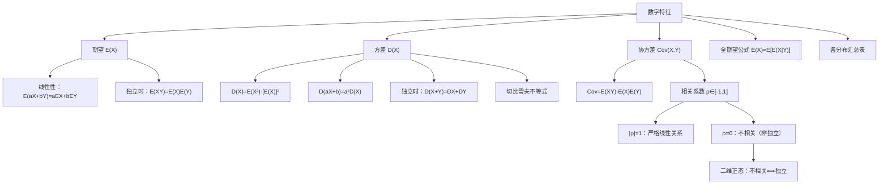

> 📌 分布函数描述随机变量的**全部信息**，但在很多场景下我们只需要几个**关键数字**来刻画其特征——"平均水平"用期望，"波动程度"用方差，"线性关联程度"用相关系数。这些数字就是**数字特征**。

---

## 📋 前置知识

- [[概率论第三章：多维随机变量及其分布]] — 多维情形的期望和协方差需要联合分布
- [[定积分与广义积分]] — 连续型期望的计算全是积分
- [[级数求和]] — 离散型期望可能涉及无穷级数（如泊松分布的期望推导）

---

## 🤔 为什么要引入数字特征？

分布函数虽然"完美"，但：

1. 太复杂，不直观：两个正态分布 $N(0,1)$ 和 $N(5,100)$ 差在哪里？需要看 $\mu=5$（均值）和 $\sigma^2=100$（方差）这两个数字，比较分布函数曲线费劲得多。
2. 实际中往往只需要部分信息：工程上关心"平均强度"和"最大偏差"，不需要完整分布。
3. 为统计推断铺路：后续的点估计（用样本均值估计总体均值）、假设检验（比较均值是否相等）全建立在数字特征上。

---

## 🧠 核心概念

### 一、数学期望（均值）

#### 1.1 定义

> 🎯 **类比**：期望就是"加权平均"。如果骰子不公平，点数1出现50%、点数6出现50%，那么期望点数 = $1 \times 0.5 + 6 \times 0.5 = 3.5$，而不是 $(1+6)/2=3.5$（这里碰巧一样）。本质上，期望是用**概率做权重**的加权平均。

**离散型**：若 $\sum_k |x_k| p_k < +\infty$（绝对收敛），则

$$\boxed{E(X) = \sum_k x_k p_k}$$

**连续型**：若 $\int_{-\infty}^{+\infty} |x| f(x) \, dx < +\infty$，则

$$\boxed{E(X) = \int_{-\infty}^{+\infty} x f(x) \, dx}$$

> ⚠️ **期望不一定存在**：若上述绝对收敛条件不满足（如柯西分布），则期望不存在。考研中遇到的分布一般都存在期望，但要有这个意识。

#### 1.2 随机变量函数的期望（重要！）

设 $Y = g(X)$，**不需要先求 $Y$ 的分布**，直接用 $X$ 的分布计算：

**离散型**：$E(g(X)) = \sum_k g(x_k) p_k$

**连续型**：$E(g(X)) = \int_{-\infty}^{+\infty} g(x) f(x) \, dx$

**二维情形**：

$$E(g(X,Y)) = \begin{cases} \displaystyle\sum_i \sum_j g(x_i, y_j) p_{ij} & \text{（离散）} \\[6pt] \displaystyle\int_{-\infty}^{+\infty}\int_{-\infty}^{+\infty} g(x,y) f(x,y) \, dx \, dy & \text{（连续）} \end{cases}$$

#### 1.3 期望的性质（考研必背）

设 $E(X), E(Y)$ 存在，$a, b, c$ 为常数：

**性质1（线性性）**：

$$\boxed{E(aX + bY + c) = aE(X) + bE(Y) + c}$$

推广：$E\left(\sum_{i=1}^n a_i X_i\right) = \sum_{i=1}^n a_i E(X_i)$（无需独立性）

**性质2（独立时乘积期望）**：若 $X, Y$ 独立，则

$$E(XY) = E(X) \cdot E(Y)$$

> ⚠️ **反之不然**：$E(XY) = E(X)E(Y)$ 不能推出 $X, Y$ 独立，只能说明 $X, Y$ **不相关**（见后面相关系数）。

**性质3（常数期望）**：$E(c) = c$

**性质4（单调性）**：若 $X \geq 0$，则 $E(X) \geq 0$；若 $X \geq Y$，则 $E(X) \geq E(Y)$

#### 1.4 常用分布的期望（汇总）

| 分布 | 参数 | 期望 $E(X)$ |
|------|------|-------------|
| 0-1 分布 $B(1,p)$ | $p$ | $p$ |
| 二项分布 $B(n,p)$ | $n, p$ | $np$ |
| 泊松分布 $P(\lambda)$ | $\lambda$ | $\lambda$ |
| 几何分布 $G(p)$ | $p$ | $1/p$ |
| 超几何分布 | $N, M, n$ | $nM/N$ |
| 均匀分布 $U(a,b)$ | $a, b$ | $(a+b)/2$ |
| 指数分布 $E(\lambda)$ | $\lambda$ | $1/\lambda$ |
| 正态分布 $N(\mu,\sigma^2)$ | $\mu, \sigma^2$ | $\mu$ |

---

### 二、方差与标准差

#### 2.1 定义

> 🎯 **类比**：期望告诉你"平均落在哪里"，方差告诉你"大多数时候离平均有多远"。射箭时，期望是瞄准点，方差是弹孔的分散程度。方差越小，射手越稳定。

**方差（Variance）**：

$$\boxed{D(X) = E\left[(X - E(X))^2\right]}$$

计算展开公式（常用）：

$$\boxed{D(X) = E(X^2) - [E(X)]^2}$$

**推导**：$D(X) = E[(X-\mu)^2] = E(X^2 - 2\mu X + \mu^2) = E(X^2) - 2\mu E(X) + \mu^2 = E(X^2) - \mu^2$

**标准差（Standard Deviation）**：$\sigma(X) = \sqrt{D(X)}$，量纲与 $X$ 相同。

**计算方法**：先求 $E(X)$，再求 $E(X^2)$，用公式 $D(X) = E(X^2) - [E(X)]^2$。

#### 2.2 方差的性质

**性质1（常数方差）**：$D(c) = 0$

**性质2（线性变换）**：$D(aX + b) = a^2 D(X)$（平移不影响方差，缩放影响的是方差的平方）

**性质3（独立时加法）**：若 $X, Y$ 独立，则

$$D(X + Y) = D(X) + D(Y)$$

推广：$D(X - Y) = D(X) + D(Y)$（独立时，差的方差也是和！）

**一般加法公式**（不要求独立）：

$$\boxed{D(X \pm Y) = D(X) + D(Y) \pm 2\text{Cov}(X, Y)}$$

**性质4（切比雪夫不等式）**：对任意 $\varepsilon > 0$，

$$\boxed{P(|X - E(X)| \geq \varepsilon) \leq \frac{D(X)}{\varepsilon^2}}$$

直觉：方差越小，$X$ 偏离均值超过 $\varepsilon$ 的概率越小。这是**大数定律的理论基础**。

#### 2.3 常用分布的方差（汇总）

| 分布 | 方差 $D(X)$ | 记忆技巧 |
|------|-------------|----------|
| 0-1 分布 $B(1,p)$ | $p(1-p)$ | 最大值在 $p=0.5$ 时取 $1/4$ |
| 二项分布 $B(n,p)$ | $np(1-p)$ | $n$ 倍的 0-1 分布方差 |
| 泊松分布 $P(\lambda)$ | $\lambda$ | 期望=方差，唯一这样的常见分布 |
| 几何分布 $G(p)$ | $(1-p)/p^2$ | |
| 均匀分布 $U(a,b)$ | $(b-a)^2/12$ | |
| 指数分布 $E(\lambda)$ | $1/\lambda^2$ | 标准差=期望=$1/\lambda$ |
| 正态分布 $N(\mu,\sigma^2)$ | $\sigma^2$ | 定义即方差 |

---

### 三、协方差与相关系数

#### 3.1 协方差

> 🎯 **类比**：协方差描述两个变量的"同向波动程度"。如果 $X$ 偏大时 $Y$ 也偏大（正相关），协方差为正；$X$ 偏大时 $Y$ 偏小（负相关），协方差为负；互不影响，协方差接近零。

**协方差（Covariance）**：

$$\boxed{\text{Cov}(X, Y) = E[(X - E(X))(Y - E(Y))]}$$

计算展开公式（常用）：

$$\boxed{\text{Cov}(X, Y) = E(XY) - E(X)E(Y)}$$

**推导**：$\text{Cov}(X,Y) = E(XY - XE(Y) - YE(X) + E(X)E(Y)) = E(XY) - E(X)E(Y)$

**特殊情况**：$\text{Cov}(X, X) = D(X)$（自己和自己的协方差就是方差）

**性质**：

- $\text{Cov}(X, Y) = \text{Cov}(Y, X)$（对称性）
- $\text{Cov}(aX, bY) = ab \cdot \text{Cov}(X, Y)$
- $\text{Cov}(X_1 + X_2, Y) = \text{Cov}(X_1, Y) + \text{Cov}(X_2, Y)$（双线性）
- $X, Y$ 独立 $\Rightarrow$ $\text{Cov}(X, Y) = 0$（反之不然）

#### 3.2 相关系数

协方差受量纲影响（单位不同，数值会变）。相关系数是标准化后的协方差：

$$\boxed{\rho_{XY} = \frac{\text{Cov}(X, Y)}{\sqrt{D(X)} \cdot \sqrt{D(Y)}}}$$

**性质**：

1. $-1 \leq \rho_{XY} \leq 1$
2. $|\rho_{XY}| = 1 \Leftrightarrow X$ 与 $Y$ 之间存在**严格线性关系**（即 $Y = aX + b$）
3. $\rho_{XY} = 0$ 称 $X, Y$ **不相关**（即无线性相关性，但可能有非线性相关）

> ⚠️ **不相关 vs 独立**：
> - 独立 $\Rightarrow$ 不相关（$\text{Cov}=0$）
> - 不相关 $\not\Rightarrow$ 独立（可能存在非线性关系）
> - **唯一例外**：二维正态分布中，不相关 $\Leftrightarrow$ 独立

**反例（不相关但不独立）**：设 $X \sim U(-1,1)$，$Y = X^2$。

$E(X) = 0$，$E(XY) = E(X^3) = 0$（奇函数在对称区间积分为零），故 $\text{Cov}(X,Y) = 0$，但显然 $Y$ 完全由 $X$ 决定，不独立。

---

### 四、矩

期望和方差都是矩的特例，考研涉及矩的定义，用于判断分布类型。

**$k$ 阶原点矩**：$\mu_k = E(X^k)$

- 一阶原点矩 = 期望：$\mu_1 = E(X)$

**$k$ 阶中心矩**：$\nu_k = E[(X - E(X))^k]$

- 二阶中心矩 = 方差：$\nu_2 = D(X)$

**混合矩（二维）**：$E(X^k Y^l)$，常用的是 $E(XY)$（一阶混合矩）。

---

### 五、条件期望（数一重点）

#### 5.1 条件期望的定义

在 $Y = y$ 的条件下，$X$ 的条件期望：

**离散型**：$E(X \mid Y = y) = \sum_k x_k P(X = x_k \mid Y = y)$

**连续型**：$E(X \mid Y = y) = \int_{-\infty}^{+\infty} x f_{X \mid Y}(x \mid y) \, dx$

#### 5.2 全期望公式（重要）

$$\boxed{E(X) = E[E(X \mid Y)]}$$

展开：$E(X) = \int_{-\infty}^{+\infty} E(X \mid Y=y) \cdot f_Y(y) \, dy$（连续型）

这是**全概率公式的期望版本**，计算复杂期望时非常有用。

> 🎯 **类比**：要算全体学生的平均成绩，可以先算各班的平均分（条件期望），再对各班平均分按人数加权平均（对 $Y$ 取期望）。

---

## 💻 典型题型与详细解析

### 【题型一】用展开公式求期望和方差

**例题 1**：设 $X \sim B(n, p)$，用定义推导 $E(X)$ 和 $D(X)$。

**解答**：

**期望**：

$$E(X) = \sum_{k=0}^n k \cdot C_n^k p^k q^{n-k}$$

注意 $k=0$ 项为零，$k \cdot C_n^k = n \cdot C_{n-1}^{k-1}$（利用组合数恒等式），令 $j = k-1$：

$$E(X) = n \sum_{k=1}^n C_{n-1}^{k-1} p^k q^{n-k} = np \sum_{j=0}^{n-1} C_{n-1}^j p^j q^{n-1-j} = np \cdot (p+q)^{n-1} = np$$

**方差**：先求 $E(X^2)$，用 $E(X^2) = E[X(X-1)] + E(X)$。

$$E[X(X-1)] = \sum_{k=0}^n k(k-1) C_n^k p^k q^{n-k}$$

利用 $k(k-1)C_n^k = n(n-1)C_{n-2}^{k-2}$，令 $j=k-2$：

$$E[X(X-1)] = n(n-1)p^2 \sum_{j=0}^{n-2} C_{n-2}^j p^j q^{n-2-j} = n(n-1)p^2$$

所以 $E(X^2) = n(n-1)p^2 + np$，

$$D(X) = E(X^2) - [E(X)]^2 = n(n-1)p^2 + np - n^2p^2 = np(1-p) = npq$$

---

### 【题型二】函数的期望（不求新分布直接算）

**例题 2**：设 $X \sim N(0,1)$，求 $E(X^2)$、$E(|X|)$、$E(e^X)$。

**解答**：

$f(x) = \frac{1}{\sqrt{2\pi}} e^{-x^2/2}$

**$E(X^2)$**：

$$E(X^2) = \int_{-\infty}^{+\infty} x^2 \cdot \frac{1}{\sqrt{2\pi}} e^{-x^2/2} \, dx$$

注意 $E(X^2) = D(X) + [E(X)]^2 = 1 + 0 = 1$（因为 $X \sim N(0,1)$，方差=1，均值=0）。

**$E(|X|)$**：利用对称性，

$$E(|X|) = 2\int_0^{+\infty} x \cdot \frac{1}{\sqrt{2\pi}} e^{-x^2/2} \, dx = \frac{2}{\sqrt{2\pi}} \int_0^{+\infty} x e^{-x^2/2} \, dx$$

令 $u = x^2/2$，$du = x\,dx$：

$$= \frac{2}{\sqrt{2\pi}} \int_0^{+\infty} e^{-u} \, du = \frac{2}{\sqrt{2\pi}} = \sqrt{\frac{2}{\pi}}$$

**$E(e^X)$**（矩母函数）：

$$E(e^X) = \int_{-\infty}^{+\infty} e^x \cdot \frac{1}{\sqrt{2\pi}} e^{-x^2/2} \, dx = \frac{1}{\sqrt{2\pi}} \int_{-\infty}^{+\infty} e^{x - x^2/2} \, dx$$

配方：$x - x^2/2 = -(x-1)^2/2 + 1/2$，

$$= e^{1/2} \cdot \frac{1}{\sqrt{2\pi}} \int_{-\infty}^{+\infty} e^{-(x-1)^2/2} \, dx = e^{1/2} \cdot 1 = \sqrt{e}$$

---

### 【题型三】协方差与相关系数

**例题 3**：设 $(X, Y)$ 的联合 PDF 为

$$f(x,y) = \begin{cases} 1, & 0 < x < 1, 0 < y < 1 \\ 0, & \text{其他} \end{cases}$$

（即 $X, Y$ 在单位正方形上均匀分布，独立。）求 $\text{Cov}(X+Y, X-Y)$。

**解答**：

利用协方差的双线性：

$$\text{Cov}(X+Y, X-Y) = \text{Cov}(X,X) - \text{Cov}(X,Y) + \text{Cov}(Y,X) - \text{Cov}(Y,Y)$$

$$= D(X) - \text{Cov}(X,Y) + \text{Cov}(X,Y) - D(Y) = D(X) - D(Y)$$

由 $X, Y$ 独立，$\text{Cov}(X,Y) = 0$（验证了上面的化简）。

$X, Y \sim U(0,1)$，所以 $D(X) = D(Y) = \frac{(1-0)^2}{12} = \frac{1}{12}$。

$$\text{Cov}(X+Y, X-Y) = \frac{1}{12} - \frac{1}{12} = 0$$

> 💡 这个结果有几何意义：$X+Y$（对角线方向）与 $X-Y$（反对角线方向）在单位正方形均匀分布下互不相关（实际上也独立，因为这是正态的线性变换……但这里是均匀分布，只能说不相关，不独立）。

---

### 【题型四】切比雪夫不等式应用

**例题 4**：设随机变量 $X$ 的期望 $E(X) = 3$，方差 $D(X) = 4$，用切比雪夫不等式估计：

（1）$P(|X - 3| \geq 3)$ 的上界；  
（2）$P(-1 < X < 7)$ 的下界；  
（3）$n$ 个独立同分布的随机变量 $X_1, \ldots, X_n$（同分布于 $X$），样本均值 $\bar{X} = \frac{1}{n}\sum X_i$，当 $n = 100$ 时，$P(|\bar{X} - 3| \geq 0.2)$ 的上界。

**解答**：

（1）直接套公式，$\varepsilon = 3$：

$$P(|X-3| \geq 3) \leq \frac{D(X)}{\varepsilon^2} = \frac{4}{9}$$

（2）$P(-1 < X < 7) = P(|X-3| < 4)= 1 - P(|X-3| \geq 4)$

$$P(|X-3| \geq 4) \leq \frac{4}{16} = \frac{1}{4}$$

故 $P(-1 < X < 7) \geq 1 - \frac{1}{4} = \frac{3}{4}$。

（3）$E(\bar{X}) = E(X) = 3$，$D(\bar{X}) = \frac{D(X)}{n} = \frac{4}{100} = 0.04$，$\varepsilon = 0.2$：

$$P(|\bar{X} - 3| \geq 0.2) \leq \frac{0.04}{0.04} = 1$$

这个上界太松了，说明切比雪夫不等式在这里不给力。但从理论角度，当 $n \to \infty$ 时，$D(\bar{X}) = 4/n \to 0$，上界趋于 $0$，体现了大数定律的精神。

---

### 【题型五】方差计算综合

**例题 5**：设 $X_1, X_2, \ldots, X_n$ 独立同分布，$E(X_i) = \mu$，$D(X_i) = \sigma^2$。令 $\bar{X} = \frac{1}{n}\sum_{i=1}^n X_i$，$S^2 = \frac{1}{n-1}\sum_{i=1}^n(X_i - \bar{X})^2$（样本方差）。

（1）求 $E(\bar{X})$ 和 $D(\bar{X})$；  
（2）证明 $E(S^2) = \sigma^2$（样本方差的无偏性）。

**解答**：

（1）

$$E(\bar{X}) = E\left(\frac{1}{n}\sum_{i=1}^n X_i\right) = \frac{1}{n} \cdot n\mu = \mu$$

$$D(\bar{X}) = D\left(\frac{1}{n}\sum_{i=1}^n X_i\right) = \frac{1}{n^2} \sum_{i=1}^n D(X_i) = \frac{n\sigma^2}{n^2} = \frac{\sigma^2}{n}$$

（独立时方差可加）

（2）核心技巧：$\sum(X_i - \bar{X})^2 = \sum X_i^2 - n\bar{X}^2$（化简平方和）

$$\sum_{i=1}^n (X_i - \bar{X})^2 = \sum_{i=1}^n X_i^2 - 2\bar{X}\sum_{i=1}^n X_i + n\bar{X}^2 = \sum X_i^2 - 2n\bar{X}^2 + n\bar{X}^2 = \sum X_i^2 - n\bar{X}^2$$

$$E\left(\sum X_i^2\right) = n[D(X) + (E(X))^2] = n(\sigma^2 + \mu^2)$$

$$E(n\bar{X}^2) = n[D(\bar{X}) + (E(\bar{X}))^2] = n\left(\frac{\sigma^2}{n} + \mu^2\right) = \sigma^2 + n\mu^2$$

$$E\left(\sum(X_i-\bar{X})^2\right) = n(\sigma^2+\mu^2) - (\sigma^2+n\mu^2) = (n-1)\sigma^2$$

$$E(S^2) = \frac{1}{n-1} \cdot (n-1)\sigma^2 = \sigma^2 \quad \checkmark$$

> 💡 这解释了为什么样本方差除以 $n-1$ 而不是 $n$：除以 $n-1$ 才能保证无偏性（$E(S^2) = \sigma^2$）。这是数理统计中的核心结论。

---

### 【题型六】协方差的双线性综合（较难）

**例题 6**：设 $X, Y, Z$ 两两不相关，$D(X) = 1$，$D(Y) = 4$，$D(Z) = 9$。令

$$U = X + 2Y, \quad V = 2Y + Z$$

求 $\rho_{UV}$（$U$ 与 $V$ 的相关系数）。

**解答**：

$X, Y, Z$ 两两不相关，故 $\text{Cov}(X,Y) = \text{Cov}(X,Z) = \text{Cov}(Y,Z) = 0$。

**求 $D(U)$**：

$$D(U) = D(X+2Y) = D(X) + 4D(Y) + 4\text{Cov}(X,Y) = 1 + 16 + 0 = 17$$

**求 $D(V)$**：

$$D(V) = D(2Y+Z) = 4D(Y) + D(Z) + 4\text{Cov}(Y,Z) = 16 + 9 + 0 = 25$$

**求 $\text{Cov}(U,V)$**：

$$\text{Cov}(U,V) = \text{Cov}(X+2Y, 2Y+Z)$$

$$= \text{Cov}(X,2Y) + \text{Cov}(X,Z) + \text{Cov}(2Y,2Y) + \text{Cov}(2Y,Z)$$

$$= 2\text{Cov}(X,Y) + \text{Cov}(X,Z) + 4D(Y) + 2\text{Cov}(Y,Z)$$

$$= 0 + 0 + 4 \times 4 + 0 = 16$$

**相关系数**：

$$\rho_{UV} = \frac{\text{Cov}(U,V)}{\sqrt{D(U)}\sqrt{D(V)}} = \frac{16}{\sqrt{17} \times 5} = \frac{16}{5\sqrt{17}} = \frac{16\sqrt{17}}{85}$$

---

### 【题型七】综合难题——全期望公式

**例题 7**：设 $N \sim P(\lambda)$（泊松分布），在 $N = n$ 的条件下，$X \sim B(n, p)$（二项分布）。求 $E(X)$ 和 $D(X)$。

**解答**：

**$E(X)$（用全期望公式）**：

$$E(X) = E[E(X \mid N)]$$

在 $N = n$ 的条件下，$X \sim B(n, p)$，故 $E(X \mid N = n) = np$，即 $E(X \mid N) = Np$。

$$E(X) = E(Np) = pE(N) = p\lambda = \lambda p$$

**$D(X)$（用全方差公式）**：

$$D(X) = E[D(X \mid N)] + D[E(X \mid N)]$$

- $D(X \mid N = n) = np(1-p)$，即 $D(X \mid N) = Np(1-p)$，故 $E[D(X \mid N)] = p(1-p)E(N) = \lambda p(1-p)$
- $E(X \mid N) = Np$，故 $D[E(X \mid N)] = D(Np) = p^2 D(N) = p^2\lambda$

$$D(X) = \lambda p(1-p) + \lambda p^2 = \lambda p[(1-p)+p] = \lambda p$$

> 💡 结论：$X \sim P(\lambda p)$（可以验证：$X$ 实际上服从参数为 $\lambda p$ 的泊松分布，这是泊松分布的稀释性质）。$E(X) = D(X) = \lambda p$，符合泊松分布期望等于方差的特性。

---

## ⚠️ 常见误区与踩坑点

> ❌ **误区1：$D(X+Y) = D(X) + D(Y)$ 无条件成立**
>
> **只有在 $X, Y$ 独立（或不相关）时**，才有 $D(X+Y) = D(X)+D(Y)$。一般情况下，$D(X+Y) = D(X)+D(Y)+2\text{Cov}(X,Y)$，不能漏掉交叉项。

> ⚠️ **踩坑2：方差的线性**
>
> $D(aX+b) = a^2 D(X)$，而不是 $a^2 D(X) + b$。**加常数不改变方差**（平移不影响分散程度），乘以常数让方差变为原来的 $a^2$ 倍。

> ❌ **误区3：不相关推出独立**
>
> $\text{Cov}(X,Y)=0$（不相关）不能推出独立，独立是更强的条件。但二维正态下两者等价。

> ⚠️ **踩坑4：$E(g(X)) \neq g(E(X))$（琴生不等式的场景）**
>
> 除非 $g$ 是线性函数，否则一般 $E(g(X)) \neq g(E(X))$。例如 $E(X^2) \neq [E(X)]^2$（差值恰好是方差 $D(X) \geq 0$）。$E(e^X) \neq e^{E(X)}$（指数是凸函数，$E(e^X) \geq e^{E(X)}$，这就是琴生不等式）。

> ⚠️ **踩坑5：样本方差除以 $n-1$，不是 $n$**
>
> $S^2 = \frac{1}{n-1}\sum(X_i-\bar{X})^2$ 是无偏的，$\frac{1}{n}\sum(X_i-\bar{X})^2$ 是有偏的（偏小）。考研题中出现样本方差，分母都是 $n-1$。

> ❌ **误区6：$E(XY) = E(X)E(Y)$ 等价于独立**
>
> $E(XY) = E(X)E(Y)$ 只是不相关的充要条件，不是独立的充要条件。

---

## 🔄 数字特征对比

| 特征 | 定义 | 物理意义 | 单位 |
|------|------|----------|------|
| 期望 $E(X)$ | $\int xf(x)dx$ | 概率加权平均 | 与 $X$ 相同 |
| 方差 $D(X)$ | $E[(X-\mu)^2]$ | 偏离均值的平均平方 | $X$ 的单位平方 |
| 标准差 $\sigma(X)$ | $\sqrt{D(X)}$ | 偏离均值的典型幅度 | 与 $X$ 相同 |
| 协方差 $\text{Cov}(X,Y)$ | $E(XY)-E(X)E(Y)$ | 两变量同向波动程度 | $X$ 与 $Y$ 单位之积 |
| 相关系数 $\rho$ | $\text{Cov}/(\sigma_X\sigma_Y)$ | 无量纲线性相关程度 | 无量纲，$[-1,1]$ |

---

## 🏋️ 动手练习

### 练习 1：常见分布数字特征（⭐）

**题目**：设 $X \sim P(3)$（泊松分布，$\lambda=3$）。求 $E(2X+1)$，$D(3X-2)$，$E(X^2)$。

**参考答案**：

$E(X) = \lambda = 3$，$D(X) = \lambda = 3$，$E(X^2) = D(X)+[E(X)]^2 = 3+9 = 12$。

$E(2X+1) = 2E(X)+1 = 7$

$D(3X-2) = 9D(X) = 27$

$E(X^2) = 12$

---

### 练习 2：协方差计算（⭐⭐）

**题目**：设 $X \sim N(0,1)$，$Y = 2X + 1$。求 $\text{Cov}(X, Y)$，$\rho_{XY}$，并问 $X$ 与 $Y$ 是否独立。

**参考答案**：

$\text{Cov}(X, Y) = \text{Cov}(X, 2X+1) = 2\text{Cov}(X,X) + \text{Cov}(X,1) = 2D(X) = 2$

$D(Y) = D(2X+1) = 4D(X) = 4$

$\rho_{XY} = \frac{2}{\sqrt{1}\sqrt{4}} = \frac{2}{2} = 1$

$|\rho|=1$ 说明 $X$ 与 $Y$ 有严格线性关系（$Y = 2X+1$，当然如此）。

$X, Y$ **不独立**（$Y$ 完全由 $X$ 确定）。相关系数为 1 时，不独立反而是"最强依赖"。

---

### 练习 3：切比雪夫不等式（⭐⭐）

**题目**：某工厂生产的螺钉直径 $X$（mm）满足 $E(X)=10$，$D(X)=0.04$。

（1）用切比雪夫不等式估计 $P(9.6 \leq X \leq 10.4)$ 的下界；  
（2）若 $X \sim N(10, 0.04)$，用正态分布精确计算上述概率（$\Phi(2)=0.9772$）并与（1）比较。

**参考答案**：

（1）$P(9.6 \leq X \leq 10.4) = P(|X-10| \leq 0.4) = 1 - P(|X-10| \geq 0.4)$

$P(|X-10| \geq 0.4) \leq \frac{0.04}{0.16} = 0.25$，故 $P(9.6 \leq X \leq 10.4) \geq 0.75$。

（2）$\sigma = \sqrt{0.04} = 0.2$，$P(9.6 \leq X \leq 10.4) = P\left(\frac{9.6-10}{0.2} \leq Z \leq \frac{10.4-10}{0.2}\right) = P(-2 \leq Z \leq 2)$

$= 2\Phi(2)-1 = 2\times0.9772-1 = 0.9544$

切比雪夫下界 $0.75$ 远低于精确值 $0.9544$，说明切比雪夫不等式给出的是非常保守的估计，它的优势在于**不需要知道具体分布**。

---

### 练习 4：综合——期望方差计算（⭐⭐⭐）

**题目**：设 $(X,Y)$ 的联合 PDF 为

$$f(x,y) = \begin{cases} \dfrac{3}{2}(x^2+y^2), & 0 \leq x \leq 1, 0 \leq y \leq 1 \\ 0, & \text{其他} \end{cases}$$

（1）求 $E(X)$，$E(Y)$，$D(X)$，$D(Y)$；  
（2）求 $\text{Cov}(X,Y)$ 和 $\rho_{XY}$；  
（3）$X$ 与 $Y$ 是否独立？

**参考答案**：

（1）由对称性（$x$ 和 $y$ 在 $f$ 中地位对称），$E(X) = E(Y)$，$D(X) = D(Y)$。

$$E(X) = \int_0^1 \int_0^1 x \cdot \frac{3}{2}(x^2+y^2)\,dy\,dx = \frac{3}{2}\int_0^1 x\left(\int_0^1(x^2+y^2)dy\right)dx$$

$$= \frac{3}{2}\int_0^1 x\left(x^2 + \frac{1}{3}\right)dx = \frac{3}{2}\int_0^1 \left(x^3 + \frac{x}{3}\right)dx = \frac{3}{2}\left(\frac{1}{4}+\frac{1}{6}\right) = \frac{3}{2} \cdot \frac{5}{12} = \frac{5}{8}$$

$$E(X^2) = \frac{3}{2}\int_0^1 x^2\left(x^2+\frac{1}{3}\right)dx = \frac{3}{2}\int_0^1\left(x^4+\frac{x^2}{3}\right)dx = \frac{3}{2}\left(\frac{1}{5}+\frac{1}{9}\right) = \frac{3}{2}\cdot\frac{14}{45} = \frac{7}{15}$$

$$D(X) = \frac{7}{15} - \left(\frac{5}{8}\right)^2 = \frac{7}{15} - \frac{25}{64} = \frac{448-375}{960} = \frac{73}{960}$$

（2）

$$E(XY) = \int_0^1\int_0^1 xy \cdot \frac{3}{2}(x^2+y^2)\,dx\,dy = \frac{3}{2}\int_0^1\int_0^1(x^3y+xy^3)\,dx\,dy$$

$$= \frac{3}{2}\left(\int_0^1 x^3 dx \cdot \int_0^1 y\,dy + \int_0^1 x\,dx \cdot \int_0^1 y^3\,dy\right) = \frac{3}{2}\left(\frac{1}{4}\cdot\frac{1}{2}+\frac{1}{2}\cdot\frac{1}{4}\right) = \frac{3}{2}\cdot\frac{1}{4} = \frac{3}{8}$$

$$\text{Cov}(X,Y) = E(XY) - E(X)E(Y) = \frac{3}{8} - \frac{5}{8}\cdot\frac{5}{8} = \frac{3}{8} - \frac{25}{64} = \frac{24-25}{64} = -\frac{1}{64}$$

$$\rho_{XY} = \frac{-1/64}{73/960} = -\frac{1}{64}\cdot\frac{960}{73} = -\frac{15}{73} \approx -0.205$$

（3）$f(x,y) = \frac{3}{2}(x^2+y^2)$ 不能写成 $g(x)h(y)$ 的形式（混合项无法分离），故 $X, Y$ **不独立**。

---

## 📝 总结

### 本篇要点回顾

1. **期望**是概率加权平均，线性性 $E(aX+bY) = aE(X)+bE(Y)$ 无需独立性；独立时乘积期望等于期望之积。

2. **方差**公式 $D(X) = E(X^2) - [E(X)]^2$ 是计算主力；$D(aX+b) = a^2D(X)$；独立时 $D(X\pm Y) = D(X)+D(Y)$，一般情况需加协方差项。

3. **切比雪夫不等式** $P(|X-\mu|\geq\varepsilon) \leq D(X)/\varepsilon^2$：不需要知道分布，只需均值和方差，是弱大数定律的基础。

4. **协方差** $\text{Cov}(X,Y) = E(XY)-E(X)E(Y)$，具有双线性；**相关系数** $\rho\in[-1,1]$，$|\rho|=1$ 对应严格线性关系，$\rho=0$ 为不相关。

5. **独立 $\Rightarrow$ 不相关，不相关 $\not\Rightarrow$ 独立**；二维正态例外，$\rho=0 \Leftrightarrow$ 独立。

6. **全期望公式** $E(X) = E[E(X|Y)]$ 是处理条件分布期望的利器。

### 知识图谱

---

## 🔗 相关链接

- 上级概念：[[概率论第三章：多维随机变量及其分布]]
- 下级概念：[[第五章 大数定律与中心极限定理]]
- 同级延伸：[[数理统计 点估计与区间估计]]
- 实际应用：[[方差分析]]、[[线性回归的最小二乘估计]]

## 📚 参考资料

- 浙大版《概率论与数理统计》第四版 第四章 — 数字特征推导详尽
- 张宇《概率论 9 讲》第四讲 — 切比雪夫不等式与大数定律衔接
- 李永乐《数学复习全书》— 协方差与相关系数历年真题解析
