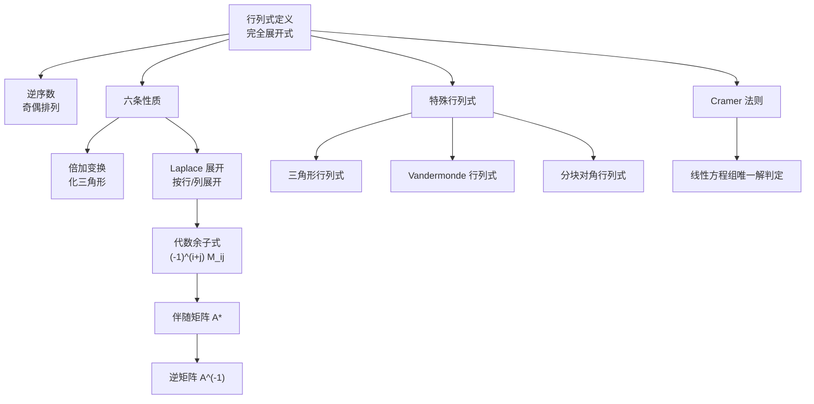

# 线性代数 第一章：行列式

> 📌 行列式是一个把方阵"压缩"成单个数值的运算，它编码了矩阵的几何变换能力——本质上反映了线性变换对空间体积（面积/体积/超体积）的缩放比例。

## 📋 前置知识

- [[排列与逆序数]] —— 行列式的完全展开式需要用逆序数判断符号
- [[高中二阶行列式]] —— $\begin{vmatrix} a & b \\ c & d \end{vmatrix} = ad - bc$，是本章的出发点

## 🤔 为什么要学行列式？

想象你在做二元一次方程组：

$$
\begin{cases}
a_1 x + b_1 y = c_1 \\
a_2 x + b_2 y = c_2
\end{cases}
$$

用消元法解这个方程组，最终 $x = \dfrac{c_1 b_2 - c_2 b_1}{a_1 b_2 - a_2 b_1}$。分母 $a_1 b_2 - a_2 b_1$ 决定了方程组是否有唯一解——这个分母，就是一个 $2$ 阶行列式。

当方程变成 $n$ 元时，手工消元极为繁琐，而行列式提供了一套统一的符号体系。它是求解线性方程组（Cramer法则）、判断矩阵是否可逆、计算特征值的核心工具，贯穿整个线性代数。

## 🧠 核心概念

### 一、$n$ 阶行列式的定义

#### 1.1 从几何直觉出发

> 🎯 **类比**：把 $n$ 阶行列式想象成"空间变形仪"的读数。
>
> 把 $\mathbb{R}^2$ 中的单位正方形（面积 = 1）放进一台机器，机器的参数由矩阵决定，输出的数就是变形后平行四边形的**有符号面积**。正数表示方向保持不变，负数表示方向翻转（镜像）。推广到 $\mathbb{R}^n$，行列式就是 $n$ 维"有符号体积"。

#### 1.2 排列与逆序数（符号来源）

在展开行列式之前，必须理解符号从何而来。

**排列（Permutation）**：$n$ 个不同自然数 $1, 2, \ldots, n$ 的一种全排列，例如 $n=3$ 时共有 $3! = 6$ 种排列：$123, 132, 213, 231, 312, 321$。

**逆序**：在排列 $j_1 j_2 \cdots j_n$ 中，若 $i < k$ 但 $j_i > j_k$，则称 $(j_i, j_k)$ 构成一个**逆序**。逆序的总数称为**逆序数**，记作 $\tau(j_1 j_2 \cdots j_n)$。

**奇排列 / 偶排列**：逆序数为奇数的排列叫奇排列，为偶数的叫偶排列。

> ⚠️ **踩坑**：逆序数是"大数排在小数前面"的对数，不是"相邻两个数是否逆序"。例如排列 $321$，逆序对为 $(3,2),(3,1),(2,1)$，共 $3$ 个，逆序数 $= 3$，奇排列。

**例**：计算 $\tau(3142)$：
- $3 > 1$：逆序
- $3 > 2$：逆序（3 排在 2 前面）
- $1 < 4$：不逆序
- $4 > 2$：逆序
- $1 < 2$：不逆序
- $3 < 4$：不逆序

共 $3$ 个逆序，$\tau(3142) = 3$，奇排列。

#### 1.3 $n$ 阶行列式的完全展开式定义

$$
D = \det(A) = \begin{vmatrix}
a_{11} & a_{12} & \cdots & a_{1n} \\
a_{21} & a_{22} & \cdots & a_{2n} \\
\vdots & \vdots & \ddots & \vdots \\
a_{n1} & a_{n2} & \cdots & a_{nn}
\end{vmatrix}
= \sum_{j_1 j_2 \cdots j_n} (-1)^{\tau(j_1 j_2 \cdots j_n)} a_{1j_1} a_{2j_2} \cdots a_{nj_n}
$$

其中求和是对所有 $n!$ 个排列进行的，每一项：
- 从每行取且只取一个元素（下标 $1j_1, 2j_2, \ldots, nj_n$，行标自然顺序 $1,2,\ldots,n$）
- 列标构成排列 $j_1 j_2 \cdots j_n$
- 符号由该排列的逆序数奇偶决定

**直观理解**：$n$ 阶行列式共有 $n!$ 项，每项是从矩阵中"不同行不同列"地各取一个元素的乘积，符号由取法的"混乱程度"（逆序数）决定。

#### 1.4 常用阶数的展开记忆

**2 阶行列式**（$2! = 2$ 项）：
$$
\begin{vmatrix} a & b \\ c & d \end{vmatrix} = ad - bc
$$

记忆口诀：**主对角线之积减副对角线之积**（仅对 $2$ 阶成立！）

**3 阶行列式**（$3! = 6$ 项，**沙路法 / 对角线法**）：

$$
\begin{vmatrix}
a_{11} & a_{12} & a_{13} \\
a_{21} & a_{22} & a_{23} \\
a_{31} & a_{32} & a_{33}
\end{vmatrix}
= a_{11}a_{22}a_{33} + a_{12}a_{23}a_{31} + a_{13}a_{21}a_{32}
- a_{13}a_{22}a_{31} - a_{12}a_{21}a_{33} - a_{11}a_{23}a_{32}
$$

> ⚠️ **致命踩坑**：**对角线法（沙路法）仅适用于 3 阶**，4 阶及以上行列式绝对不能用对角线法！考研中 4 阶行列式必须用按行（列）展开或行列变换。

### 二、行列式的性质

行列式的性质是计算的核心武器，必须烂熟于心。

#### 性质1：转置不变

$$
\det(A^T) = \det(A)
$$

行与列地位对等，对行成立的性质对列同样成立。

#### 性质2：互换两行（列）变号

交换行列式的任意两行（或两列），行列式变号。

**推论**：若行列式有两行（列）完全相同，则 $D = 0$。

**证明思路**：设两行相同，交换这两行后行列式既变号又不变（因为矩阵没变），故 $D = -D$，得 $D = 0$。

#### 性质3：行（列）提公因子

$$
\begin{vmatrix} \cdots \\ k \cdot \text{（某行）} \\ \cdots \end{vmatrix}
= k \begin{vmatrix} \cdots \\ \text{（某行）} \\ \cdots \end{vmatrix}
$$

某行（列）所有元素都有公因子 $k$，可提到行列式外面。

**重要推论**：
- 若某行（列）全为 $0$，则 $D = 0$
- $\det(kA) = k^n \det(A)$（$n$ 阶矩阵，每行都提出 $k$，共 $n$ 行）

> ⚠️ **高频踩坑**：$\det(kA) = k^n \det(A)$，**不是** $k \det(A)$！考研选择题常考这个陷阱。

#### 性质4：两行（列）成比例，$D = 0$

若行列式某两行（列）成比例（即一行是另一行的 $k$ 倍），则 $D = 0$。

这是性质2推论的推广：先提出公因子 $k$，剩下两行相同，故为 $0$。

#### 性质5：行（列）的线性可分拆

某行（列）是两组数之和，行列式可拆成两个行列式之和：

$$
\begin{vmatrix} a_1+b_1 & a_2+b_2 & a_3+b_3 \\ c_1 & c_2 & c_3 \\ d_1 & d_2 & d_3 \end{vmatrix}
=
\begin{vmatrix} a_1 & a_2 & a_3 \\ c_1 & c_2 & c_3 \\ d_1 & d_2 & d_3 \end{vmatrix}
+
\begin{vmatrix} b_1 & b_2 & b_3 \\ c_1 & c_2 & c_3 \\ d_1 & d_2 & d_3 \end{vmatrix}
$$

> ⚠️ 只能对**一行（列）**拆分，不能同时对多行拆分。

#### 性质6：倍加行（列）——最重要的化简工具

$$
r_i \leftarrow r_i + k \cdot r_j \quad \Rightarrow \quad D \text{ 不变}
$$

将某行的 $k$ 倍加到另一行，行列式值不变。这是将行列式化为上三角形的基础操作（类比高斯消元）。

**计算策略**：利用倍加行列变换，将行列式化为**上三角行列式**，其值等于主对角线元素之积：

$$
\begin{vmatrix}
a_{11} & * & \cdots & * \\
0 & a_{22} & \cdots & * \\
\vdots & & \ddots & \vdots \\
0 & 0 & \cdots & a_{nn}
\end{vmatrix}
= a_{11} \cdot a_{22} \cdots a_{nn}
$$

### 三、行列式按行（列）展开

#### 3.1 余子式与代数余子式

在 $n$ 阶行列式 $D$ 中，划去元素 $a_{ij}$ 所在的第 $i$ 行和第 $j$ 列，剩下的 $(n-1)$ 阶行列式称为 $a_{ij}$ 的**余子式**，记作 $M_{ij}$。

$a_{ij}$ 的**代数余子式**为：

$$
A_{ij} = (-1)^{i+j} M_{ij}
$$

符号 $(-1)^{i+j}$ 的规律——棋盘式正负交替：

$$
\begin{pmatrix}
+ & - & + & - \\
- & + & - & + \\
+ & - & + & - \\
- & + & - & +
\end{pmatrix}
$$

#### 3.2 按行（列）展开定理（Laplace展开）

$$
D = a_{i1}A_{i1} + a_{i2}A_{i2} + \cdots + a_{in}A_{in} = \sum_{k=1}^{n} a_{ik} A_{ik}
$$

即行列式等于**某行（列）各元素与其对应代数余子式乘积之和**。

**异行（列）展开为零**（极重要！）：

$$
\sum_{k=1}^{n} a_{ik} A_{jk} = 0 \quad (i \neq j)
$$

某行元素乘以**另一行**的代数余子式之和为 $0$。这个性质在求伴随矩阵时会大量用到。

> 🎯 **计算策略**：选择**零元素最多**的那行（列）展开，可以最大程度减少计算量。

### 四、几类重要行列式

#### 4.1 三角行列式

上三角、下三角、对角行列式的值均为主对角线元素之积：

$$
\begin{vmatrix}
\lambda_1 & & * \\
& \ddots & \\
0 & & \lambda_n
\end{vmatrix}
= \lambda_1 \lambda_2 \cdots \lambda_n
$$

#### 4.2 副对角线行列式

$$
\begin{vmatrix}
& & a_{1n} \\
& \iddots & \\
a_{n1} & &
\end{vmatrix}
= (-1)^{\frac{n(n-1)}{2}} a_{1n} a_{2,n-1} \cdots a_{n1}
$$

符号由 $\dfrac{n(n-1)}{2}$ 的奇偶性决定（即副对角线排列 $n, n-1, \ldots, 1$ 的逆序数）。

| $n$ | $\dfrac{n(n-1)}{2}$ | 符号 |
|-----|---------------------|------|
| $2$ | $1$ | $-$ |
| $3$ | $3$ | $-$ |
| $4$ | $6$ | $+$ |
| $5$ | $10$ | $+$ |

规律：$n = 4k$ 或 $n = 4k+1$ 时为正，$n = 4k+2$ 或 $n = 4k+3$ 时为负。

#### 4.3 分块对角行列式

$$
\begin{vmatrix} A & 0 \\ 0 & B \end{vmatrix} = |A| \cdot |B|
$$

$$
\begin{vmatrix} 0 & A \\ B & 0 \end{vmatrix} = (-1)^{mn} |A| \cdot |B|
$$

其中 $A$ 是 $m$ 阶矩阵，$B$ 是 $n$ 阶矩阵。

#### 4.4 Vandermonde（范德蒙德）行列式

$$
V_n = \begin{vmatrix}
1 & 1 & \cdots & 1 \\
x_1 & x_2 & \cdots & x_n \\
x_1^2 & x_2^2 & \cdots & x_n^2 \\
\vdots & \vdots & & \vdots \\
x_1^{n-1} & x_2^{n-1} & \cdots & x_n^{n-1}
\end{vmatrix}
= \prod_{1 \leq i < j \leq n} (x_j - x_i)
$$

即所有**大下标减小下标**的差之积（$j > i$ 时，取 $x_j - x_i$）。

**3 阶范德蒙德展开**：

$$
\begin{vmatrix}
1 & 1 & 1 \\
x_1 & x_2 & x_3 \\
x_1^2 & x_2^2 & x_3^2
\end{vmatrix}
= (x_2 - x_1)(x_3 - x_1)(x_3 - x_2)
$$

> 🎯 识别范德蒙德结构的关键：某一行（列）是另一行（列）的公比为 $x_i$ 的等比数列。

### 五、行列式与矩阵的关系

#### 5.1 乘法公式

$$
|AB| = |A| \cdot |B|
$$

注意：$|A + B| \neq |A| + |B|$（行列式对加法不满足分配律）。

#### 5.2 伴随矩阵

$A$ 的**伴随矩阵** $A^*$，其第 $i$ 行第 $j$ 列的元素是 $A_{ji}$（注意是**转置**关系）：

$$
A^* = \begin{pmatrix} A_{11} & A_{21} & \cdots & A_{n1} \\ A_{12} & A_{22} & \cdots & A_{n2} \\ \vdots & & \ddots & \vdots \\ A_{1n} & A_{2n} & \cdots & A_{nn} \end{pmatrix}
$$

关键公式：

$$
A A^* = A^* A = |A| \cdot E
$$

$$
|A^*| = |A|^{n-1}
$$

$$
(A^*)^* = |A|^{n-2} A \quad (n \geq 2)
$$

**推论**：若 $|A| \neq 0$，则 $A^{-1} = \dfrac{1}{|A|} A^*$。

#### 5.3 Cramer 法则

对 $n$ 元线性方程组 $Ax = b$，若 $|A| \neq 0$，则有唯一解：

$$
x_j = \frac{D_j}{D}, \quad j = 1, 2, \ldots, n
$$

其中 $D = |A|$，$D_j$ 是将 $A$ 的第 $j$ 列替换为 $b$ 后得到的行列式。

> ⚠️ Cramer 法则的理论价值大于实用价值——实际解方程组更常用高斯消元（行变换）。Cramer 法则常用于**证明唯一解的存在性**和**理论推导**。

## 💻 计算示例

### 示例 1：利用行变换计算 4 阶行列式

计算：

$$
D = \begin{vmatrix}
3 & 1 & -1 & 2 \\
-5 & 1 & 3 & -4 \\
2 & 0 & 1 & -1 \\
1 & -5 & 3 & -3
\end{vmatrix}
$$

**解**：目标是利用倍加行变换化为上三角形。选第 3 列有 $1$ 的位置做主元，或者将第 1 列化零。

**步骤 1**：以第 4 行为基准（第 1 列元素为 $1$，方便操作），将第 4 行换到第 1 行：

$$
r_1 \leftrightarrow r_4: \quad D \to -\begin{vmatrix}
1 & -5 & 3 & -3 \\
-5 & 1 & 3 & -4 \\
2 & 0 & 1 & -1 \\
3 & 1 & -1 & 2
\end{vmatrix}
$$

**步骤 2**：以第 1 行消去第 1 列：

- $r_2 \leftarrow r_2 + 5r_1$
- $r_3 \leftarrow r_3 - 2r_1$
- $r_4 \leftarrow r_4 - 3r_1$

$$
-\begin{vmatrix}
1 & -5 & 3 & -3 \\
0 & -24 & 18 & -19 \\
0 & 10 & -5 & 5 \\
0 & 16 & -10 & 11
\end{vmatrix}
$$

**步骤 3**：提公因子，第 3 行提 $5$：

$$
-5\begin{vmatrix}
1 & -5 & 3 & -3 \\
0 & -24 & 18 & -19 \\
0 & 2 & -1 & 1 \\
0 & 16 & -10 & 11
\end{vmatrix}
$$

**步骤 4**：以第 3 行的第 2 列元素 $2$ 为主元，继续消零（或交换 $r_2 \leftrightarrow r_3$ 使主元变小）：

$r_2 \leftrightarrow r_3$（再变号）：

$$
(-1)(-5)\begin{vmatrix}
1 & -5 & 3 & -3 \\
0 & 2 & -1 & 1 \\
0 & -24 & 18 & -19 \\
0 & 16 & -10 & 11
\end{vmatrix}
$$

$r_3 \leftarrow r_3 + 12r_2$，$r_4 \leftarrow r_4 - 8r_2$：

$$
5\begin{vmatrix}
1 & -5 & 3 & -3 \\
0 & 2 & -1 & 1 \\
0 & 0 & 6 & -7 \\
0 & 0 & -2 & 3
\end{vmatrix}
$$

**步骤 5**：$r_4 \leftarrow r_4 + \dfrac{1}{3} r_3$：

$$
5\begin{vmatrix}
1 & -5 & 3 & -3 \\
0 & 2 & -1 & 1 \\
0 & 0 & 6 & -7 \\
0 & 0 & 0 & \frac{2}{3}
\end{vmatrix}
= 5 \times 1 \times 2 \times 6 \times \frac{2}{3} = 5 \times 8 = \boxed{40}
$$

## ⚠️ 常见误区与踩坑点

> ❌ **误区 1：对角线法适用于所有阶数**
>
> 很多同学习惯用沙路法（对角线规则）算行列式，但这个方法**仅对 $3$ 阶行列式成立**。$4$ 阶行列式有 $24$ 项，对角线法只有 $8$ 项，会漏掉大量项，得到错误答案。$4$ 阶及以上必须用按行展开或行变换。

> ❌ **误区 2：$\det(kA) = k \det(A)$**
>
> 正确结论是 $\det(kA) = k^n \det(A)$，其中 $n$ 是矩阵的阶数。因为 $k$ 乘以矩阵是每行都乘以 $k$，共 $n$ 行，每行都能提出一个 $k$，共提出 $k^n$。

> ❌ **误区 3：$|A+B| = |A|+|B|$**
>
> 行列式不满足加法分配律。反例：$A = \begin{pmatrix} 1 & 0 \\ 0 & 0 \end{pmatrix}$，$B = \begin{pmatrix} 0 & 0 \\ 0 & 1 \end{pmatrix}$，则 $|A|=0$，$|B|=0$，$|A+B|=1 \neq 0$。

> ⚠️ **踩坑 4：伴随矩阵下标顺序搞反**
>
> $A^*$ 的第 $i$ 行第 $j$ 列元素是 $A_{ji}$（即代数余子式的下标是**转置**的）。很多人误写成 $A_{ij}$，导致整个计算出错。记忆口诀：**行列互换**，代数余子式的行列标与位置的行列标相反。

> ⚠️ **踩坑 5：行变换换行不变号**
>
> 倍加变换（$r_i + k r_j \to r_i$）不改变行列式值。但**互换两行**（$r_i \leftrightarrow r_j$）会使行列式**变号**，每换一次变一次，必须记录变号次数。

> ❌ **误区 6：展开时代数余子式符号错误**
>
> $(-1)^{i+j}$ 中 $i+j$ 是该元素的行标加列标。位于第 $2$ 行第 $3$ 列的元素代数余子式符号为 $(-1)^{2+3} = -1$。建议画棋盘图辅助记忆。

## 🔄 概念对比

| 特性 | 余子式 $M_{ij}$ | 代数余子式 $A_{ij}$ |
|------|----------------|---------------------|
| 定义 | 划去第 $i$ 行第 $j$ 列后的 $(n-1)$ 阶行列式 | $(-1)^{i+j} M_{ij}$ |
| 带符号 | 否 | 是 |
| 展开时使用 | 不直接用 | 直接用：$D = \sum a_{ij} A_{ij}$ |
| 伴随矩阵元素 | 不直接用 | $(A^*)_{ij} = A_{ji}$（转置！） |

| 变换类型 | 对行列式的影响 |
|----------|--------------|
| 互换两行（列） | 变号（乘以 $-1$） |
| 某行（列）乘以 $k$ | 乘以 $k$ |
| 某行的 $k$ 倍加到另一行 | **不变** |
| 转置 | **不变** |

## 🏋️ 动手练习

### 练习 1：逆序数与排列判断（⭐）

**题目**：计算排列 $52143$ 的逆序数，并判断奇偶性。

**参考答案**：

逐一统计每个数前面比它大的数的个数：

- $5$：前面没有数，贡献 $0$ 个逆序
- $2$：前面 $5 > 2$，贡献 $1$ 个逆序
- $1$：前面 $5 > 1$，$2 > 1$，贡献 $2$ 个逆序
- $4$：前面 $5 > 4$，贡献 $1$ 个逆序
- $3$：前面 $5 > 3$，$4 > 3$，贡献 $2$ 个逆序

$\tau(52143) = 0 + 1 + 2 + 1 + 2 = 6$

逆序数为 $6$（偶数），故 $52143$ 是**偶排列**，符号为 $+1$。

### 练习 2：利用性质计算行列式（⭐⭐）

**题目**：计算

$$
D = \begin{vmatrix}
1 & 1 & 1 & 1 \\
1 & 2 & 2 & 2 \\
1 & 2 & 3 & 3 \\
1 & 2 & 3 & 4
\end{vmatrix}
$$

**参考答案**：

逐步使用倍加变换消去下三角部分：

**$r_4 - r_3, \; r_3 - r_2, \; r_2 - r_1$**（从下往上做，避免相互影响）：

$$
\begin{vmatrix}
1 & 1 & 1 & 1 \\
0 & 1 & 1 & 1 \\
0 & 0 & 1 & 1 \\
0 & 0 & 0 & 1
\end{vmatrix}
= 1 \times 1 \times 1 \times 1 = \boxed{1}
$$

### 练习 3：按行展开计算含参数行列式（⭐⭐）

**题目**：计算

$$
D_n = \begin{vmatrix}
a & b & 0 & \cdots & 0 & 0 \\
0 & a & b & \cdots & 0 & 0 \\
0 & 0 & a & \cdots & 0 & 0 \\
\vdots & & & \ddots & & \vdots \\
0 & 0 & 0 & \cdots & a & b \\
b & 0 & 0 & \cdots & 0 & a
\end{vmatrix}
$$

（$n$ 阶，主对角线为 $a$，上次对角线和右下角为 $b$）

**参考答案**：

按第一列展开：

$$
D_n = a \cdot D_{n-1} - b \cdot (-1)^{n+1} \cdot b^{n-1}
$$

分析：第 $1$ 列只有 $a_{11} = a$ 和 $a_{n1} = b$ 非零。

- $a$ 对应的余子式：去掉第 $1$ 行第 $1$ 列，得到一个与 $D_n$ 同类型的 $(n-1)$ 阶行列式 $D_{n-1}$，系数为 $(-1)^{1+1} = +1$
- $b$ 对应的余子式（第 $n$ 行第 $1$ 列）：去掉第 $n$ 行第 $1$ 列，剩余矩阵的上三角部分，其行列式为 $b^{n-1}$（上次对角线连乘），系数为 $(-1)^{n+1}$

$$
D_n = a D_{n-1} + (-1)^{n+1} \cdot b \cdot b^{n-1} = a D_{n-1} + (-1)^{n+1} b^n
$$

递推：$D_1 = a$，$D_2 = a^2 - b^2$，利用递推关系可得：

$$
D_n = a^n + (-1)^{n+1} b^n
$$

**验证**：$D_2 = a^2 + (-1)^3 b^2 = a^2 - b^2$ ✓，$D_3 = a^3 + b^3$ ✓

### 练习 4：行列式的综合计算（⭐⭐⭐）

**题目**：已知 $A$ 是 $3$ 阶矩阵，$|A| = 2$，求 $|(3A)^{-1} - 2A^*|$。

**参考答案**：

**分析**：需要用到 $|kA| = k^n |A|$ 和 $A^* = |A| A^{-1}$。

**步骤 1**：化简矩阵表达式。

$$
(3A)^{-1} = \frac{1}{3} A^{-1}
$$

$$
A^* = |A| A^{-1} = 2 A^{-1}
$$

所以：

$$
(3A)^{-1} - 2A^* = \frac{1}{3} A^{-1} - 2 \cdot 2A^{-1} = \frac{1}{3} A^{-1} - 4A^{-1} = -\frac{11}{3} A^{-1}
$$

**步骤 2**：计算行列式。

$$
\left| -\frac{11}{3} A^{-1} \right| = \left(-\frac{11}{3}\right)^3 |A^{-1}| = -\frac{1331}{27} \cdot \frac{1}{|A|} = -\frac{1331}{27} \times \frac{1}{2} = \boxed{-\frac{1331}{54}}
$$

### 练习 5：范德蒙德行列式识别（⭐⭐⭐）

**题目**：计算

$$
D = \begin{vmatrix}
1 & 1 & 1 & 1 \\
1 & 2 & 3 & 4 \\
1 & 4 & 9 & 16 \\
1 & 8 & 27 & 64
\end{vmatrix}
$$

**参考答案**：

观察各列：第 $j$ 列从上到下分别为 $1, j, j^2, j^3$（$j = 1, 2, 3, 4$），这正好是以 $1, 2, 3, 4$ 为底数的范德蒙德行列式。

$$
D = \prod_{1 \leq i < j \leq 4} (j - i)
$$

按 $i < j$ 的对：$(j,i)$ 取 $(2,1),(3,1),(4,1),(3,2),(4,2),(4,3)$：

$$
D = (2-1)(3-1)(4-1)(3-2)(4-2)(4-3) = 1 \times 2 \times 3 \times 1 \times 2 \times 1 = \boxed{12}
$$

## 📝 总结

### 本篇要点回顾

1. **定义本质**：$n$ 阶行列式是 $n!$ 项带符号乘积的和，符号由列标排列的逆序数奇偶决定；几何上代表线性变换对有向体积的缩放。

2. **六条核心性质**：互换变号、提公因子、成比例为零、可加性、倍加不变、转置不变——这六条是所有计算技巧的理论基础。

3. **Laplace 展开**：按零元素最多的行（列）展开，代数余子式下标 $(-1)^{i+j}$；**异行（列）展开为零**是伴随矩阵的理论来源。

4. **重要行列式**：三角形（主对角线之积）、副对角线（符号规律）、分块对角（乘积）、Vandermonde（差之积）。

5. **伴随矩阵**：$A A^* = |A| E$，$|A^*| = |A|^{n-1}$，$(A^*)_{ij} = A_{ji}$（转置！）。

### 知识图谱

## 🔗 相关链接

- 上级概念：[[线性代数总览]]
- 同级概念：[[矩阵及其运算]]、[[向量与线性方程组]]
- 下级概念：[[代数余子式的性质]]、[[伴随矩阵与逆矩阵]]
- 实际应用：[[Cramer 法则]]、[[特征值与特征向量]]

## 📚 参考资料

- 同济大学数学系《线性代数》第七版 —— 考研核心教材，第一章行列式为标准参考
- 李永乐《线性代数辅导讲义》—— 考研专项训练，题型覆盖全面
- 张宇《线代 9 讲》—— 高阶题型与解题技巧
