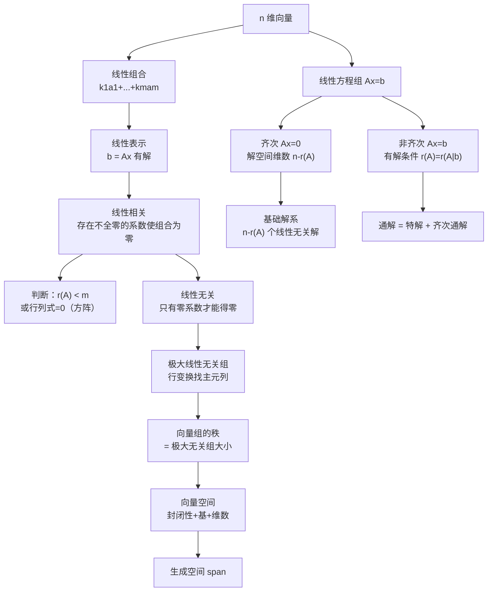

# 线性代数 第三章：向量组与线性相关性

> 📌 线性相关性研究的是：一组向量中，有没有"多余"的成员——某个向量能不能被其他向量"合成"出来？这是理解线性方程组解的结构、矩阵秩的几何意义、以及特征向量独立性的根本语言。

## 📋 前置知识

- [[线性代数 第二章：矩阵及其运算]] —— 向量组的线性相关性与矩阵的秩直接挂钩，判断方法本质是对矩阵做行变换
- [[线性代数 第一章：行列式]] —— $n$ 个 $n$ 维向量线性相关 $\iff$ 构成的行列式为零

## 🤔 为什么要学这一章？

你在第二章学了矩阵的秩，但秩到底在"度量"什么？答案就在本章：**秩度量的是矩阵列向量组（或行向量组）中真正独立的向量个数**。

线性方程组 $Ax = b$ 有没有解、解是不是唯一的，从根本上取决于 $b$ 能不能被 $A$ 的列向量"合成"出来——这正是线性相关性的语言。本章是连接矩阵与方程组的桥梁，是考研线代的核心中的核心。

## 🧠 核心概念

### 一、$n$ 维向量

**定义**：$n$ 个有序数 $(a_1, a_2, \ldots, a_n)$ 构成一个 $n$ **维向量**，可以写成行向量或列向量：

$$
\alpha = (a_1, a_2, \ldots, a_n), \quad \text{或} \quad \alpha = \begin{pmatrix} a_1 \\ a_2 \\ \vdots \\ a_n \end{pmatrix}
$$

> 🎯 **类比**：2 维向量是平面上的箭头（有方向和长度），3 维向量是空间中的箭头。$n$ 维向量是这个概念的数学推广——虽然无法直观画出来，但所有运算规则与 2、3 维完全一致。

**向量的运算**：加法（对应分量相加）、数乘（每个分量乘以同一个数），性质与矩阵加法、数乘相同（因为向量就是特殊的矩阵）。

**零向量**：$\mathbf{0} = (0, 0, \ldots, 0)$，是唯一没有方向的向量。

### 二、线性组合与线性表示

#### 2.1 线性组合

设有向量组 $\alpha_1, \alpha_2, \ldots, \alpha_m$（均为 $n$ 维），以及一组数 $k_1, k_2, \ldots, k_m$，则

$$
k_1 \alpha_1 + k_2 \alpha_2 + \cdots + k_m \alpha_m
$$

称为该向量组的一个**线性组合**，$k_1, \ldots, k_m$ 称为**组合系数**。

> 🎯 **类比**：做蛋糕时，面粉、鸡蛋、糖按不同比例混合，得到不同的成品——线性组合就是向量的"按比例混合"。系数可以是任意实数（包括负数），负系数相当于"反向添加"。

#### 2.2 线性表示

若向量 $\beta$ 能写成向量组 $\alpha_1, \ldots, \alpha_m$ 的线性组合，即存在 $k_1, \ldots, k_m$ 使得

$$
\beta = k_1 \alpha_1 + k_2 \alpha_2 + \cdots + k_m \alpha_m
$$

则称 $\beta$ 能被向量组 $\alpha_1, \ldots, \alpha_m$ **线性表示**（或 $\beta$ 在该向量组的**生成空间**中）。

**与矩阵方程的联系**（极重要！）：

设 $A = (\alpha_1, \alpha_2, \ldots, \alpha_m)$（以向量为列），则

$$
\beta \text{ 能被 } \alpha_1, \ldots, \alpha_m \text{ 线性表示} \iff Ax = \beta \text{ 有解} \iff r(A) = r(A \mid \beta)
$$

这个等价关系把"线性表示"问题直接转化为"方程组是否有解"，从而可以用矩阵方法（行变换）来判断。

### 三、线性相关与线性无关

#### 3.1 定义

对向量组 $\alpha_1, \alpha_2, \ldots, \alpha_m$，若存在**不全为零**的数 $k_1, k_2, \ldots, k_m$，使得

$$
k_1 \alpha_1 + k_2 \alpha_2 + \cdots + k_m \alpha_m = \mathbf{0}
$$

则称该向量组**线性相关**；否则（只有当 $k_1 = k_2 = \cdots = k_m = 0$ 时上式才成立），称该向量组**线性无关**。

> 🎯 **类比**：想象你在平面上有若干个箭头。如果其中一个箭头能用其他箭头"拼"出来（方向、大小刚好），那这组箭头就"线性相关"——有多余的成员。如果任何一个箭头都不能被其余的拼出来，就"线性无关"——每一个都提供了独特的方向信息。

**等价说法**：

$$
\alpha_1, \ldots, \alpha_m \text{ 线性相关} \iff \text{其中至少有一个向量能被其余向量线性表示}
$$

$$
\alpha_1, \ldots, \alpha_m \text{ 线性无关} \iff \text{任何一个向量都不能被其余向量线性表示}
$$

> ⚠️ 注意方向：线性相关 $\Rightarrow$ 某向量可被其余表示，但**不一定每一个**向量都可被其余表示（可能只有一个"多余"的）。

#### 3.2 判断线性相关性的方法

**方法一：定义法**（构造齐次方程组）

将向量组排成矩阵 $A = (\alpha_1, \alpha_2, \ldots, \alpha_m)$（$n \times m$ 矩阵），线性相关性等价于：

$$
\alpha_1, \ldots, \alpha_m \text{ 线性相关} \iff Ax = \mathbf{0} \text{ 有非零解} \iff r(A) < m
$$

$$
\alpha_1, \ldots, \alpha_m \text{ 线性无关} \iff Ax = \mathbf{0} \text{ 只有零解} \iff r(A) = m
$$

**方法二：行列式法**（仅适用于 $n$ 个 $n$ 维向量）

$$
n \text{ 个 } n \text{ 维向量线性相关} \iff \det(\alpha_1, \alpha_2, \ldots, \alpha_n) = 0
$$

$$
n \text{ 个 } n \text{ 维向量线性无关} \iff \det(\alpha_1, \alpha_2, \ldots, \alpha_n) \neq 0
$$

#### 3.3 线性相关性的重要定理

**定理 1（含零向量必相关）**：含有零向量的向量组一定线性相关。

证明：取 $k_1 = 1$，其余 $k_i = 0$，则 $1 \cdot \mathbf{0} + 0 \cdot \alpha_2 + \cdots = \mathbf{0}$，系数不全为零。

**定理 2（部分相关则整体相关）**：若向量组的一个**部分组**线性相关，则整体线性相关。

逆命题：整体线性无关 $\Rightarrow$ 任意部分组线性无关。

**定理 3（低维相关则高维仍可能相关）**：$m$ 个 $n$ 维向量，若 $m > n$，则必线性相关。

直觉：$n$ 维空间最多只有 $n$ 个"独立方向"，超过 $n$ 个向量必然有"多余的"。

**定理 4（延伸组与缩短组）**：

- 线性无关的向量组，在每个向量后面**延伸**（增加分量）后仍然线性无关
- 线性相关的向量组，在每个向量前面**截短**（去掉分量）后仍然线性相关

**定理 5（线性表示与相关性的关系）**：

$\beta$ 能被线性无关组 $\alpha_1, \ldots, \alpha_m$ 线性表示 $\iff$ 表示方式**唯一**。

若 $\alpha_1, \ldots, \alpha_m$ 线性相关，则表示方式有无穷多种（或不存在）。

**定理 6（向量组线性相关的充要条件）**：

向量组 $\alpha_1, \ldots, \alpha_m$（$m \geq 2$）线性相关 $\iff$ 其中至少有一个向量是其余向量的线性组合。

### 四、极大线性无关组与秩

#### 4.1 极大线性无关组

**定义**：向量组 $\alpha_1, \ldots, \alpha_m$ 的一个**极大线性无关组**，是满足以下两个条件的部分组 $\alpha_{i_1}, \ldots, \alpha_{i_r}$：

1. $\alpha_{i_1}, \ldots, \alpha_{i_r}$ **线性无关**
2. 从原向量组中再添加任何一个向量（若有剩余），得到的组**线性相关**

> 🎯 **类比**：极大线性无关组就像"最精简的代表团"——成员各自独立（没有人是多余的），但加入任何一个新成员后，就会有人变得"多余"（能被其他人表示）。整个向量组的信息完全被这个代表团"代表"了。

**等价条件**：$\alpha_{i_1}, \ldots, \alpha_{i_r}$ 是极大线性无关组 $\iff$ 原向量组中每个向量都能被 $\alpha_{i_1}, \ldots, \alpha_{i_r}$ 线性表示，且 $\alpha_{i_1}, \ldots, \alpha_{i_r}$ 线性无关。

#### 4.2 向量组的秩

向量组 $\alpha_1, \ldots, \alpha_m$ 的**极大线性无关组所含向量的个数**，称为该向量组的**秩**，记作 $r(\alpha_1, \ldots, \alpha_m)$。

**关键性质**：

- 向量组的极大线性无关组不唯一，但所有极大线性无关组含的向量数相同（秩唯一确定）
- 若向量组线性无关，则极大线性无关组就是它自身，秩等于向量个数
- 向量组的秩 = 以这些向量为列（行）构成的矩阵的秩

**矩阵的行秩 = 列秩 = $r(A)$**（这个结论不平凡，它说明用行向量组和列向量组算出的秩是同一个数）。

#### 4.3 极大线性无关组的求法

将向量组排成矩阵（向量作列），做**初等行变换**化为行阶梯形，主元所在的**列**对应的原向量，就构成一个极大线性无关组。

**例**：设

$$
\alpha_1 = \begin{pmatrix} 1 \\ 2 \\ 3 \end{pmatrix}, \;
\alpha_2 = \begin{pmatrix} 2 \\ 4 \\ 6 \end{pmatrix}, \;
\alpha_3 = \begin{pmatrix} 1 \\ 0 \\ 1 \end{pmatrix}, \;
\alpha_4 = \begin{pmatrix} 0 \\ 2 \\ 2 \end{pmatrix}
$$

构成矩阵并化阶梯形：

$$
(\alpha_1, \alpha_2, \alpha_3, \alpha_4) = \begin{pmatrix} 1 & 2 & 1 & 0 \\ 2 & 4 & 0 & 2 \\ 3 & 6 & 1 & 2 \end{pmatrix}
\rightarrow
\begin{pmatrix} 1 & 2 & 1 & 0 \\ 0 & 0 & -2 & 2 \\ 0 & 0 & -2 & 2 \end{pmatrix}
\rightarrow
\begin{pmatrix} 1 & 2 & 1 & 0 \\ 0 & 0 & -2 & 2 \\ 0 & 0 & 0 & 0 \end{pmatrix}
$$

主元在第 $1$ 列和第 $3$ 列，故 $\{\alpha_1, \alpha_3\}$ 是一个极大线性无关组，秩为 $2$。

$\alpha_2 = 2\alpha_1$，$\alpha_4 = \alpha_1 - \alpha_3$（由行化简过程可直接读出）。

> ⚠️ **踩坑**：极大线性无关组对应的是原矩阵（行变换之前）的列，不是变换后阶梯形的列！行变换改变了向量，但主元的列位置对应原来的向量。

### 五、向量空间

#### 5.1 向量空间的定义

设 $V$ 是 $n$ 维向量的非空集合，若 $V$ 对**加法和数乘封闭**（即对任意 $\alpha, \beta \in V$、任意实数 $k$，有 $\alpha + \beta \in V$，$k\alpha \in V$），则称 $V$ 是一个（实）**向量空间**（线性空间）。

**封闭**的意思：在 $V$ 内做加法和数乘，结果还在 $V$ 内，不会"跑出去"。

**最典型的向量空间**：$\mathbb{R}^n$（全体 $n$ 维实向量的集合）。

#### 5.2 子空间

$\mathbb{R}^n$ 的非空子集 $W$，若对加法和数乘封闭，则称 $W$ 是 $\mathbb{R}^n$ 的一个**子空间**。

**重要子空间**：

**生成子空间（张成空间）**：向量组 $\alpha_1, \ldots, \alpha_m$ 所有线性组合的集合，记作 $\text{span}(\alpha_1, \ldots, \alpha_m)$ 或 $L(\alpha_1, \ldots, \alpha_m)$：

$$
L(\alpha_1, \ldots, \alpha_m) = \{k_1 \alpha_1 + \cdots + k_m \alpha_m \mid k_i \in \mathbb{R}\}
$$

**齐次方程组的解空间（零空间）**：$Ax = \mathbf{0}$ 的所有解构成的集合，是 $\mathbb{R}^n$ 的子空间（因为两个解的线性组合仍是解）。

#### 5.3 基与维数

**基**：向量空间 $V$ 的一组**线性无关**的向量 $e_1, \ldots, e_r$，若 $V$ 中每个向量都能被它们线性表示，则称 $\{e_1, \ldots, e_r\}$ 是 $V$ 的一组**基**。

基就是向量空间的"坐标轴"——用最少的独立向量来"撑起"整个空间。

**维数**：基中向量的个数 $r$，称为向量空间 $V$ 的**维数**，记作 $\dim V = r$。

$$
\dim L(\alpha_1, \ldots, \alpha_m) = r(\alpha_1, \ldots, \alpha_m)
$$

生成空间的维数等于向量组的秩——极大线性无关组就是生成空间的一组基。

**坐标**：设 $\{e_1, \ldots, e_r\}$ 是 $V$ 的一组基，$V$ 中任意向量 $\alpha$ 的表示 $\alpha = x_1 e_1 + \cdots + x_r e_r$ 唯一，$(x_1, \ldots, x_r)$ 称为 $\alpha$ 在该基下的**坐标**。

#### 5.4 基变换与过渡矩阵

设 $\{e_1, \ldots, e_n\}$ 和 $\{\tilde{e}_1, \ldots, \tilde{e}_n\}$ 是 $\mathbb{R}^n$ 的两组基，则存在唯一可逆矩阵 $P$（称为**过渡矩阵**）使得：

$$
(\tilde{e}_1, \tilde{e}_2, \ldots, \tilde{e}_n) = (e_1, e_2, \ldots, e_n) P
$$

若向量 $\alpha$ 在两组基下的坐标分别为 $x = (x_1, \ldots, x_n)^T$ 和 $\tilde{x} = (\tilde{x}_1, \ldots, \tilde{x}_n)^T$，则：

$$
x = P \tilde{x}, \quad \tilde{x} = P^{-1} x
$$

> ⚠️ 记忆方向：基变换矩阵 $P$ 是"新基用旧基表示"，坐标变换方向**相反**：$x = P\tilde{x}$（旧坐标 = $P \times$ 新坐标）。

### 六、线性方程组解的结构（本章终极目标）

#### 6.1 齐次线性方程组 $Ax = \mathbf{0}$

**基础解系**：齐次方程组 $Ax = \mathbf{0}$ 的解空间的一组基，称为**基础解系**。

**基础解系所含向量个数**（解空间维数）：

$$
n - r(A)
$$

其中 $n$ 是未知数个数，$r(A)$ 是系数矩阵的秩。

直觉：$r(A)$ 个方程是"真正有效"的约束，剩下 $n - r(A)$ 个自由变量，每个自由变量对应一个独立的解方向。

**求基础解系的步骤**：

1. 对 $A$ 做行变换，化为行最简形（进一步消零，使主元列只有主元非零）
2. 确定自由变量（非主元列对应的变量），共 $n - r(A)$ 个
3. 依次令一个自由变量为 $1$，其余自由变量为 $0$，解出主元变量
4. 得到 $n - r(A)$ 个解向量 $\xi_1, \ldots, \xi_{n-r(A)}$，即基础解系

**通解**：$x = c_1 \xi_1 + c_2 \xi_2 + \cdots + c_{n-r(A)} \xi_{n-r(A)}$，$c_i \in \mathbb{R}$

#### 6.2 非齐次线性方程组 $Ax = b$

**有解判定**：

$$
Ax = b \text{ 有解} \iff r(A) = r(A \mid b) \iff b \text{ 能被 } A \text{ 的列向量线性表示}
$$

- 若 $r(A) = r(A \mid b) = n$：**唯一解**
- 若 $r(A) = r(A \mid b) < n$：**无穷多解**
- 若 $r(A) < r(A \mid b)$：**无解**

**通解结构**（有解时）：

$$
x = x^* + c_1 \xi_1 + \cdots + c_{n-r(A)} \xi_{n-r(A)}
$$

其中 $x^*$ 是方程组的**任意一个特解**，$\xi_1, \ldots, \xi_{n-r(A)}$ 是对应**齐次方程组** $Ax = \mathbf{0}$ 的基础解系。

> 🎯 **类比**：非齐次方程组的解就像"特定位置 + 自由漂移"。$x^*$ 是你已经"站到一个满足条件的点"，$c_1\xi_1 + \cdots$ 是你在解空间（一个平移过的子空间）中可以自由移动的方向。整个解集是一个平移的线性子空间（"仿射子空间"）。

**推论**：非齐次方程组的任意两个解之差，是对应齐次方程组的解。

## ⚠️ 常见误区与踩坑点

> ❌ **误区 1：线性无关的向量组添加向量后仍无关**
>
> 线性无关组添加新向量后，**不一定**仍然线性无关。例如 $\{\alpha_1\}$ 线性无关（$\alpha_1 \neq \mathbf{0}$），但 $\{\alpha_1, 2\alpha_1\}$ 线性相关。能保持线性无关的充要条件是：新向量不在原向量组的生成空间中。

> ❌ **误区 2：线性相关就是"某个向量是另一个的倍数"**
>
> "成比例"只是最简单的线性相关（两向量的情形）。三个及以上向量线性相关的含义是"存在不全为零的系数使线性组合为零"，比如 $\alpha_3 = \alpha_1 + \alpha_2$ 时三者线性相关，但任意两个可能都不成比例。

> ⚠️ **踩坑 3：极大线性无关组对应原矩阵的列，不是阶梯形的列**
>
> 做行变换找极大线性无关组时，主元所在的列位置告诉你选哪些原始向量，但实际选取的是**行变换之前**的原向量，不能把阶梯形里的列向量当成极大无关组的成员。

> ⚠️ **踩坑 4：基础解系不唯一**
>
> 基础解系是解空间的一组**基**，基是不唯一的（任意 $n - r(A)$ 个线性无关的解向量都是基础解系）。但基础解系包含的**向量个数**固定为 $n - r(A)$，不会变。

> ❌ **误区 5：$r(A) + r(B) \leq n$ 与 $AB = O$ 的关系方向搞错**
>
> 正确方向：$AB = O \Rightarrow r(A) + r(B) \leq n$（这是充分条件）。反过来 $r(A) + r(B) \leq n$ 不能推出 $AB = O$。

> ⚠️ **踩坑 6：非齐次方程组"通解"少写了齐次部分**
>
> 非齐次方程组的通解 = 一个特解 + 齐次通解，两部分缺一不可。很多人只写了特解，或者只写了齐次通解，都是错的。

## 🔄 概念对比

| 特性 | 线性相关 | 线性无关 |
|------|---------|---------|
| 定义 | $\exists$ 不全为零的 $k_i$ 使 $\sum k_i \alpha_i = \mathbf{0}$ | 只有 $k_i$ 全为零才使 $\sum k_i \alpha_i = \mathbf{0}$ |
| 向量个数 | $r(\alpha_1,\ldots,\alpha_m) < m$ | $r(\alpha_1,\ldots,\alpha_m) = m$ |
| 齐次方程组 | $Ax = \mathbf{0}$ 有非零解 | $Ax = \mathbf{0}$ 只有零解 |
| 线性表示 | 某向量可被其余表示 | 任意向量不能被其余表示 |
| 含零向量 | 必相关 | 不可能含零向量 |
| $m > n$ | 必相关（$m$ 个 $n$ 维向量） | 不可能（$m$ 超过空间维数） |

| 方程组类型 | 有解条件 | 解的个数 | 通解结构 |
|-----------|---------|---------|---------|
| $Ax = \mathbf{0}$ | 总有解（零解） | $r(A) = n$ 时唯一；$r(A) < n$ 时无穷 | $c_1\xi_1 + \cdots + c_{n-r}\xi_{n-r}$ |
| $Ax = b$ | $r(A) = r(A\mid b)$ | $r = n$ 唯一；$r < n$ 无穷 | $x^* + c_1\xi_1 + \cdots + c_{n-r}\xi_{n-r}$ |

## 🏋️ 动手练习

### 练习 1：判断线性相关性（⭐）

**题目**：判断以下向量组是否线性相关，若相关，将 $\alpha_3$ 用 $\alpha_1, \alpha_2$ 表示：

$$
\alpha_1 = \begin{pmatrix} 1 \\ 2 \\ 1 \end{pmatrix}, \quad \alpha_2 = \begin{pmatrix} 2 \\ 1 \\ 0 \end{pmatrix}, \quad \alpha_3 = \begin{pmatrix} 1 \\ -1 \\ -1 \end{pmatrix}
$$

**参考答案**：

构造矩阵并计算行列式（3个3维向量，用行列式法）：

$$
\det(\alpha_1, \alpha_2, \alpha_3) = \begin{vmatrix} 1 & 2 & 1 \\ 2 & 1 & -1 \\ 1 & 0 & -1 \end{vmatrix}
$$

按第三行展开：$1 \cdot (-2-1) - 0 + (-1)(1-4) = -3 + 3 = 0$

行列式为 $0$，向量组**线性相关**。

用行变换求表示：

$$
(\alpha_1, \alpha_2, \alpha_3) = \begin{pmatrix} 1 & 2 & 1 \\ 2 & 1 & -1 \\ 1 & 0 & -1 \end{pmatrix} \rightarrow \begin{pmatrix} 1 & 2 & 1 \\ 0 & -3 & -3 \\ 0 & -2 & -2 \end{pmatrix} \rightarrow \begin{pmatrix} 1 & 0 & -1 \\ 0 & 1 & 1 \\ 0 & 0 & 0 \end{pmatrix}
$$

读出：$x_1 = 1, x_2 = -1$（令 $x_3 = 1$），即 $\alpha_3 = \alpha_1 - \alpha_2$。

### 练习 2：求基础解系与通解（⭐⭐）

**题目**：求齐次线性方程组的基础解系与通解：

$$
\begin{cases}
x_1 + x_2 - x_3 - x_4 = 0 \\
2x_1 - 5x_2 + 3x_3 + 2x_4 = 0 \\
7x_2 - 5x_3 - 4x_4 = 0
\end{cases}
$$

**参考答案**：

系数矩阵化行最简形：

$$
A = \begin{pmatrix} 1 & 1 & -1 & -1 \\ 2 & -5 & 3 & 2 \\ 0 & 7 & -5 & -4 \end{pmatrix}
$$

$r_2 - 2r_1$：

$$
\begin{pmatrix} 1 & 1 & -1 & -1 \\ 0 & -7 & 5 & 4 \\ 0 & 7 & -5 & -4 \end{pmatrix}
$$

$r_3 + r_2$，再 $r_1 + r_2 \times \frac{1}{7}$，$r_2 \div (-7)$：

$$
\begin{pmatrix} 1 & 0 & -\frac{2}{7} & -\frac{3}{7} \\ 0 & 1 & -\frac{5}{7} & -\frac{4}{7} \\ 0 & 0 & 0 & 0 \end{pmatrix}
$$

$r(A) = 2$，$n = 4$，自由变量 $x_3, x_4$（$n - r = 4 - 2 = 2$ 个自由变量）。

令 $(x_3, x_4) = (7, 0)$：$x_1 = 2, x_2 = 5$，得 $\xi_1 = (2, 5, 7, 0)^T$

令 $(x_3, x_4) = (0, 7)$：$x_1 = 3, x_2 = 4$，得 $\xi_2 = (3, 4, 0, 7)^T$

（令自由变量取整数 $7$ 而不是 $1$ 是为了避免分数，更简洁）

基础解系：$\xi_1 = (2,5,7,0)^T$，$\xi_2 = (3,4,0,7)^T$

通解：$x = c_1 \xi_1 + c_2 \xi_2$，$c_1, c_2 \in \mathbb{R}$

### 练习 3：非齐次方程组的通解（⭐⭐）

**题目**：求非齐次方程组 $Ax = b$ 的通解，其中

$$
A = \begin{pmatrix} 1 & 1 & 1 \\ 1 & 2 & 3 \\ 2 & 3 & 4 \end{pmatrix}, \quad b = \begin{pmatrix} 2 \\ 3 \\ 5 \end{pmatrix}
$$

**参考答案**：

对增广矩阵 $(A \mid b)$ 做行变换：

$$
\left(\begin{array}{ccc|c} 1 & 1 & 1 & 2 \\ 1 & 2 & 3 & 3 \\ 2 & 3 & 4 & 5 \end{array}\right)
\rightarrow
\left(\begin{array}{ccc|c} 1 & 1 & 1 & 2 \\ 0 & 1 & 2 & 1 \\ 0 & 1 & 2 & 1 \end{array}\right)
\rightarrow
\left(\begin{array}{ccc|c} 1 & 0 & -1 & 1 \\ 0 & 1 & 2 & 1 \\ 0 & 0 & 0 & 0 \end{array}\right)
$$

$r(A) = r(A \mid b) = 2 < 3$，有无穷多解。自由变量 $x_3$。

**特解**：令 $x_3 = 0$，得 $x^* = (1, 1, 0)^T$

**齐次通解**：令 $x_3 = 1$，得 $\xi = (1, -2, 1)^T$

**通解**：$x = (1, 1, 0)^T + c(1, -2, 1)^T$，$c \in \mathbb{R}$

### 练习 4：向量组的秩与极大无关组（⭐⭐）

**题目**：设向量组 $\alpha_1, \ldots, \alpha_4$ 的秩为 $3$，已知 $\alpha_1, \alpha_2, \alpha_3$ 线性无关，证明 $\alpha_1, \alpha_2, \alpha_4$ 也线性无关，并证明 $\{\alpha_1, \alpha_2, \alpha_3\}$ 是极大线性无关组。

**参考答案**：

**第一步**：证明 $\alpha_1, \alpha_2, \alpha_3$ 是极大线性无关组。

向量组的秩为 $3$，$\alpha_1, \alpha_2, \alpha_3$ 线性无关且含 $3$ 个向量，恰好等于秩 $3$，故 $\{\alpha_1, \alpha_2, \alpha_3\}$ 就是一个极大线性无关组（因为无关组个数已达到秩，不能再扩充）。

**第二步**：$\alpha_4$ 能被 $\alpha_1, \alpha_2, \alpha_3$ 线性表示（极大无关组能表示所有向量）。

**第三步**：设 $k_1\alpha_1 + k_2\alpha_2 + k_4\alpha_4 = \mathbf{0}$，将 $\alpha_4$ 的表示 $\alpha_4 = l_1\alpha_1 + l_2\alpha_2 + l_3\alpha_3$ 代入：

$$
k_1\alpha_1 + k_2\alpha_2 + k_4(l_1\alpha_1 + l_2\alpha_2 + l_3\alpha_3) = \mathbf{0}
$$

$$
(k_1 + k_4 l_1)\alpha_1 + (k_2 + k_4 l_2)\alpha_2 + k_4 l_3 \alpha_3 = \mathbf{0}
$$

由 $\alpha_1, \alpha_2, \alpha_3$ 线性无关：$k_4 l_3 = 0$。

若 $l_3 = 0$，则 $\alpha_4 = l_1\alpha_1 + l_2\alpha_2$，$\{\alpha_1, \alpha_2, \alpha_4\}$ 线性相关，$r(\alpha_1, \alpha_2, \alpha_3, \alpha_4) \leq 2$，与秩为 $3$ 矛盾，故 $l_3 \neq 0$，从而 $k_4 = 0$，进而 $k_1 = k_2 = 0$。

因此 $\alpha_1, \alpha_2, \alpha_4$ 线性无关。$\square$

### 练习 5：含参数的方程组有解条件（⭐⭐⭐）

**题目**：当 $\lambda$ 取何值时，方程组

$$
\begin{cases}
x_1 + x_2 + x_3 = 1 \\
x_1 + \lambda x_2 + x_3 = \lambda \\
x_1 + x_2 + \lambda x_3 = \lambda^2
\end{cases}
$$

有唯一解、无穷多解、无解？有解时求出解。

**参考答案**：

$$
(A \mid b) = \left(\begin{array}{ccc|c} 1 & 1 & 1 & 1 \\ 1 & \lambda & 1 & \lambda \\ 1 & 1 & \lambda & \lambda^2 \end{array}\right)
$$

$r_2 - r_1$，$r_3 - r_1$：

$$
\left(\begin{array}{ccc|c} 1 & 1 & 1 & 1 \\ 0 & \lambda-1 & 0 & \lambda-1 \\ 0 & 0 & \lambda-1 & \lambda^2-1 \end{array}\right)
$$

注意 $\lambda^2 - 1 = (\lambda-1)(\lambda+1)$。

**情形一**：$\lambda = 1$

$$
\left(\begin{array}{ccc|c} 1 & 1 & 1 & 1 \\ 0 & 0 & 0 & 0 \\ 0 & 0 & 0 & 0 \end{array}\right)
$$

$r(A) = r(A \mid b) = 1 < 3$，**无穷多解**。自由变量 $x_2, x_3$，通解：$x = (1,0,0)^T + c_1(-1,1,0)^T + c_2(-1,0,1)^T$。

**情形二**：$\lambda \neq 1$，$r_2 \div (\lambda-1)$，$r_3 \div (\lambda-1)$：

$$
\left(\begin{array}{ccc|c} 1 & 1 & 1 & 1 \\ 0 & 1 & 0 & 1 \\ 0 & 0 & 1 & \lambda+1 \end{array}\right)
$$

$r(A) = r(A \mid b) = 3 = n$，**唯一解**，无论 $\lambda$ 取何非 $1$ 的值。

回代：$x_3 = \lambda + 1$，$x_2 = 1$，$x_1 = 1 - 1 - (\lambda+1) = -\lambda - 1$。

唯一解：$x = (-\lambda-1, 1, \lambda+1)^T$。

（此题不存在无解情形，因为 $r(A \mid b)$ 始终等于 $r(A)$。）

## 📝 总结

### 本篇要点回顾

1. **线性相关 = 存在多余向量**：某向量能被其余的线性表示；判断方法：$r(A) < m$（向量数） $\iff$ $Ax = \mathbf{0}$ 有非零解。

2. **极大线性无关组 = 向量组的"骨架"**：用初等行变换找主元列，对应原矩阵的列向量就是极大线性无关组。

3. **解空间的维数 = $n - r(A)$**：自由变量个数决定了解空间的"自由度"，基础解系含 $n - r(A)$ 个向量。

4. **非齐次通解 = 特解 + 齐次通解**：两部分缺一不可；有解条件是 $r(A) = r(A \mid b)$。

5. **关键等价链**：$\alpha_1, \ldots, \alpha_m$ 线性无关 $\iff$ $r(A) = m$ $\iff$ $Ax = \mathbf{0}$ 只有零解 $\iff$（当 $m = n$ 时）$|A| \neq 0$。

### 知识图谱

## 🔗 相关链接

- 上级概念：[[线性代数总览]]
- 前置章节：[[线性代数 第一章：行列式]]、[[线性代数 第二章：矩阵及其运算]]
- 下一章节：[[线性代数 第四章：线性方程组]]
- 同级概念：[[矩阵的秩]]
- 下级概念：[[特征值与特征向量]]、[[二次型]]

## 📚 参考资料

- 同济大学数学系《线性代数》第七版 第三章、第四章 —— 向量与方程组的标准教材
- 李永乐《线性代数辅导讲义》—— 线性相关性判断与方程组解结构专项
- 张宇《线代 9 讲》第三讲 —— 向量组秩与方程组综合证明题
