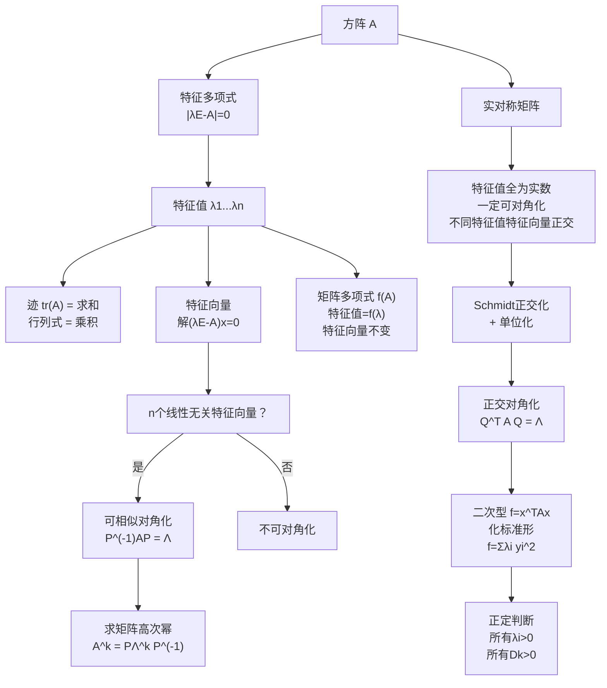

# 线性代数 第五章：特征值、特征向量与二次型

> 📌 特征值揭示矩阵"最本质的方向"——在这些特殊方向上，矩阵的作用仅仅是拉伸或压缩，不改变方向。相似对角化把复杂矩阵分解成最简形式；二次型则把这套理论应用到判断多变量二次函数的几何形状（椭球、双曲面……）。

## 📋 前置知识

- [[线性代数 第四章：线性方程组]] —— 求特征向量的本质是求齐次方程组 $(\lambda E - A)x = \mathbf{0}$ 的基础解系
- [[线性代数 第二章：矩阵及其运算]] —— 矩阵的幂、转置、逆、迹均在本章大量出现
- [[线性代数 第一章：行列式]] —— 特征多项式 $|\lambda E - A|$ 的计算是第一章行列式的综合运用

## 🤔 为什么要学这一章？

考研线代五大板块中，**本章分值最高、综合性最强**，历年大题几乎必考。

特征值与特征向量是矩阵理论的"终极分析工具"：
- **矩阵的幂次计算**：$A^{100}$ 不能直接算，但对角化后 $A^{100} = P\Lambda^{100}P^{-1}$ 轻松搞定
- **微分方程组求解**：工程中大量方程组的解依赖特征值
- **二次型的标准化**：判断曲面类型（椭球、抛物面、双曲面）
- **正定性判断**：多元函数极值的充分条件

这一章的难度在于概念多、关联复杂，但结构极为清晰，本章将梳理出一条清楚的主线。

## 🧠 核心概念

### 一、特征值与特征向量

#### 1.1 定义

设 $A$ 是 $n$ 阶方阵，若存在数 $\lambda$ 和**非零向量** $\xi$，使得

$$
A\xi = \lambda \xi
$$

则称 $\lambda$ 是 $A$ 的一个**特征值**，$\xi$ 是 $A$ 对应于特征值 $\lambda$ 的**特征向量**。

> 🎯 **类比**：对大多数向量，矩阵 $A$ 的作用是"旋转 + 缩放"——方向改变了。但特征向量是特殊的：$A$ 作用于它时**只缩放，不改变方向**（允许反向，即 $\lambda < 0$）。$\lambda$ 就是缩放的倍数。
>
> 直觉上：把 $A$ 想象成一台照相机的"变形镜头"，大多数方向的物体都会被扭曲；但存在几个特殊方向，物体沿这些方向只会被拉伸或压缩。

**两个关键点**：

- 特征向量**必须是非零向量**（零向量代入 $A\xi = \lambda\xi$ 对任意 $\lambda$ 均成立，无意义）
- 一个特征值可以对应**多个线性无关的特征向量**（它们构成特征子空间）
- 一个特征向量**只对应一个特征值**（若 $A\xi = \lambda_1 \xi$ 且 $A\xi = \lambda_2 \xi$，则 $\lambda_1 = \lambda_2$）

#### 1.2 求特征值与特征向量的步骤

**第一步**：求特征值

$A\xi = \lambda\xi \iff (\lambda E - A)\xi = \mathbf{0}$ 有非零解 $\iff |\lambda E - A| = 0$

定义**特征多项式**：$f(\lambda) = |\lambda E - A|$，它是关于 $\lambda$ 的 $n$ 次多项式。

解方程 $|\lambda E - A| = 0$，得到所有特征值 $\lambda_1, \lambda_2, \ldots$。

**第二步**：对每个特征值求特征向量

对每个 $\lambda_i$，求齐次方程组 $(\lambda_i E - A)x = \mathbf{0}$ 的**基础解系**，即为 $\lambda_i$ 对应的线性无关特征向量组。

> ⚠️ 特征向量是基础解系的**非零线性组合**，不单单指基础解系中的向量。$k\xi$（$k \neq 0$）也是特征向量，但一般取基础解系中的向量作为代表。

**例**：求 $A = \begin{pmatrix} 3 & 1 \\ 1 & 3 \end{pmatrix}$ 的特征值与特征向量。

$$
|\lambda E - A| = \begin{vmatrix} \lambda - 3 & -1 \\ -1 & \lambda - 3 \end{vmatrix} = (\lambda-3)^2 - 1 = \lambda^2 - 6\lambda + 8 = (\lambda-2)(\lambda-4) = 0
$$

特征值 $\lambda_1 = 2$，$\lambda_2 = 4$。

$\lambda_1 = 2$：$(2E - A)x = \mathbf{0}$，即 $\begin{pmatrix} -1 & -1 \\ -1 & -1 \end{pmatrix}x = \mathbf{0}$，基础解系 $\xi_1 = (1, -1)^T$。

$\lambda_2 = 4$：$(4E - A)x = \mathbf{0}$，即 $\begin{pmatrix} 1 & -1 \\ -1 & 1 \end{pmatrix}x = \mathbf{0}$，基础解系 $\xi_2 = (1, 1)^T$。

### 二、特征值的性质与关系式

#### 2.1 迹与行列式

设 $\lambda_1, \lambda_2, \ldots, \lambda_n$ 是 $A$ 的全部特征值（含重复），则：

$$
\lambda_1 + \lambda_2 + \cdots + \lambda_n = \text{tr}(A) = a_{11} + a_{22} + \cdots + a_{nn}
$$

$$
\lambda_1 \cdot \lambda_2 \cdots \lambda_n = |A|
$$

其中 $\text{tr}(A)$（trace，**迹**）是主对角线元素之和。

**推论**：$|A| = 0 \iff$ $A$ 至少有一个特征值为 $0$。

#### 2.2 常见矩阵变换对特征值的影响

| 矩阵 | 特征值 | 特征向量 |
|------|--------|---------|
| $A$ | $\lambda$ | $\xi$ |
| $kA$ | $k\lambda$ | $\xi$（不变） |
| $A^m$ | $\lambda^m$ | $\xi$（不变） |
| $A + kE$ | $\lambda + k$ | $\xi$（不变） |
| $A^{-1}$（若 $A$ 可逆） | $\lambda^{-1} = \dfrac{1}{\lambda}$ | $\xi$（不变） |
| $A^*$（伴随矩阵） | $\dfrac{|A|}{\lambda}$ | $\xi$（不变） |
| $f(A)$（多项式） | $f(\lambda)$ | $\xi$（不变） |
| $A^T$ | $\lambda$（相同） | **不一定相同** |
| $P^{-1}AP$ | $\lambda$（相同） | $P^{-1}\xi$（变了） |

> 🎯 **关键规律**：对同一特征向量 $\xi$，无论做多项式运算、求逆、求幂，$\xi$ 始终是对应变换后矩阵的特征向量，只有特征值按相应公式变化。这就是"特征向量的稳定性"。

**记忆伴随矩阵特征值的推导**：由 $AA^* = |A|E$，两边作用于 $\xi$：

$$
A(A^*\xi) = |A|\xi \implies A^*\xi = \frac{|A|}{\lambda}\xi
$$

所以 $A^*$ 的特征值是 $\dfrac{|A|}{\lambda}$，特征向量仍是 $\xi$。

#### 2.3 特征多项式的展开

$n$ 阶矩阵 $A$ 的特征多项式：

$$
|\lambda E - A| = \lambda^n - \text{tr}(A)\lambda^{n-1} + \cdots + (-1)^n |A|
$$

- 最高次系数为 $1$
- $\lambda^{n-1}$ 的系数为 $-\text{tr}(A)$
- 常数项为 $(-1)^n |A|$（令 $\lambda = 0$ 即得）

#### 2.4 不同特征值对应的特征向量线性无关

**定理**：$A$ 的对应于不同特征值 $\lambda_1, \lambda_2, \ldots, \lambda_m$（$\lambda_i$ 互不相同）的特征向量 $\xi_1, \xi_2, \ldots, \xi_m$ 线性无关。

这是相似对角化理论的基石。

### 三、相似矩阵与相似对角化

#### 3.1 相似矩阵

若存在可逆矩阵 $P$ 使得 $P^{-1}AP = B$，则称 $A$ 与 $B$ **相似**，记作 $A \sim B$。

**相似矩阵的共同性质**（相似不变量）：

$$
|A| = |B|, \quad \text{tr}(A) = \text{tr}(B), \quad r(A) = r(B)
$$

$$
|\lambda E - A| = |\lambda E - B| \quad \text{（特征多项式相同）}
$$

$$
\text{特征值相同（含重数）}
$$

> ⚠️ 相似矩阵具有相同的特征值，但**逆命题不成立**：特征值相同的两个矩阵未必相似（反例：$E$ 与 $\begin{pmatrix} 1 & 1 \\ 0 & 1 \end{pmatrix}$ 虽特征值相同，但不相似）。

#### 3.2 相似对角化

若 $A$ 与对角矩阵 $\Lambda = \text{diag}(\lambda_1, \ldots, \lambda_n)$ 相似，称 $A$ **可相似对角化**，简称 $A$ **可对角化**。

**$A$ 可对角化的充要条件**：$A$ 有 $n$ 个线性无关的特征向量。

**充分条件**（更实用）：$A$ 有 $n$ 个不同的特征值 $\Rightarrow$ $A$ 可对角化。

**一般情形**：若 $\lambda_i$ 是 $k_i$ 重特征值，则 $\lambda_i$ 对应的线性无关特征向量个数 $s_i \leq k_i$。

$$
A \text{ 可对角化} \iff \text{对每个特征值 } \lambda_i，s_i = k_i
$$

即"几何重数 = 代数重数"对所有特征值成立。

> 🎯 **类比**：$\lambda_i$ 的代数重数 $k_i$ 是它作为特征多项式根的重数（"名义上的自由度"），几何重数 $s_i = n - r(\lambda_i E - A)$ 是实际线性无关特征向量个数（"实际的自由度"）。可对角化要求两者匹配——没有"缺货"的特征方向。

#### 3.3 对角化的操作步骤

**第一步**：求 $A$ 的全部特征值 $\lambda_1, \ldots, \lambda_n$（可重复）

**第二步**：对每个特征值求对应的线性无关特征向量组

**第三步**：将所有特征向量按列排成矩阵 $P = (\xi_1, \xi_2, \ldots, \xi_n)$

**第四步**：则 $P^{-1}AP = \Lambda = \text{diag}(\lambda_1, \ldots, \lambda_n)$

**注意**：$\Lambda$ 中对角线特征值的顺序，必须与 $P$ 中特征向量的排列顺序完全对应。

#### 3.4 用对角化求矩阵的高次幂

$$
A^k = P \Lambda^k P^{-1} = P \begin{pmatrix} \lambda_1^k & & \\ & \ddots & \\ & & \lambda_n^k \end{pmatrix} P^{-1}
$$

这是对角化最重要的应用之一，避免了直接计算 $A^k$ 的指数级复杂度。

### 四、实对称矩阵的特殊性质

实对称矩阵（$A = A^T$，元素为实数）拥有比一般矩阵强得多的性质，是考研的重点。

#### 4.1 三大特殊性质

**性质 1**：实对称矩阵的特征值**全是实数**。

**性质 2**：实对称矩阵**一定可以相似对角化**（无论特征值是否重复）。

**性质 3**：实对称矩阵**不同特征值对应的特征向量相互正交**。

> 🎯 **直觉**：对称矩阵在几何上代表"没有旋转"的变换（只有拉伸），因此它的特征方向（拉伸方向）两两垂直，可以构成一组正交坐标轴。

#### 4.2 正交对角化

对实对称矩阵 $A$，存在**正交矩阵** $Q$（$Q^T = Q^{-1}$，即列向量两两正交且单位化）使得：

$$
Q^T A Q = \Lambda \quad \text{（即 } Q^{-1}AQ = \Lambda\text{）}
$$

**正交对角化步骤**：

**第一步**：求特征值 $\lambda_1, \ldots, \lambda_n$

**第二步**：求每个特征值对应的基础解系（特征向量组）

**第三步**：对同一特征值对应的多个线性无关特征向量，做 **Schmidt 正交化**

**第四步**：将所有特征向量**单位化**（除以自身的模长）

**第五步**：将单位正交特征向量按列排成正交矩阵 $Q$

#### 4.3 Schmidt 正交化

设 $\xi_1, \xi_2, \xi_3$ 线性无关，正交化为 $\eta_1, \eta_2, \eta_3$：

$$
\eta_1 = \xi_1
$$

$$
\eta_2 = \xi_2 - \frac{(\xi_2, \eta_1)}{(\eta_1, \eta_1)} \eta_1
$$

$$
\eta_3 = \xi_3 - \frac{(\xi_3, \eta_1)}{(\eta_1, \eta_1)} \eta_1 - \frac{(\xi_3, \eta_2)}{(\eta_2, \eta_2)} \eta_2
$$

其中 $(\alpha, \beta) = \alpha^T \beta$ 是向量的**内积**（点积）。

再单位化：$e_i = \dfrac{\eta_i}{|\eta_i|}$，其中 $|\eta_i| = \sqrt{(\eta_i, \eta_i)}$。

> ⚠️ 不同特征值对应的特征向量自动正交，**无需 Schmidt 正交化**；只有**同一特征值对应多个线性无关特征向量**时，才需要对这组向量做 Schmidt 正交化。

#### 4.4 正交矩阵的性质

$$
Q^T Q = QQ^T = E, \quad |Q| = \pm 1, \quad Q^{-1} = Q^T
$$

正交矩阵的列向量（也是行向量）构成 $\mathbb{R}^n$ 的一组标准正交基。

### 五、二次型

#### 5.1 定义

$n$ 个变量 $x_1, x_2, \ldots, x_n$ 的**二次型**是只含二次项（无一次项和常数项）的多项式：

$$
f(x_1, \ldots, x_n) = \sum_{i=1}^{n} \sum_{j=1}^{n} a_{ij} x_i x_j
$$

规定 $a_{ij} = a_{ji}$（对称化），用矩阵表示为：

$$
f = x^T A x
$$

其中 $A = (a_{ij})$ 是**实对称矩阵**（二次型的**矩阵**），$x = (x_1, \ldots, x_n)^T$。

**二次型的矩阵**：$a_{ii}$ 是 $x_i^2$ 的系数，$a_{ij} = a_{ji} = \dfrac{1}{2} \times x_i x_j$ 的系数（$i \neq j$ 时交叉项系数平均分配给 $a_{ij}$ 和 $a_{ji}$）。

**例**：$f = x_1^2 + 4x_1 x_2 - 2x_2^2 + 6x_2 x_3 + x_3^2$ 的矩阵为：

$$
A = \begin{pmatrix} 1 & 2 & 0 \\ 2 & -2 & 3 \\ 0 & 3 & 1 \end{pmatrix}
$$

（$x_1 x_2$ 系数为 $4$，分配 $a_{12} = a_{21} = 2$；$x_2 x_3$ 系数为 $6$，分配 $a_{23} = a_{32} = 3$）

#### 5.2 标准形与规范形

**标准形**：只含平方项的二次型 $f = d_1 y_1^2 + d_2 y_2^2 + \cdots + d_n y_n^2$，矩阵为对角矩阵。

**规范形**：系数只有 $+1$、$-1$、$0$ 的标准形：$f = y_1^2 + \cdots + y_p^2 - y_{p+1}^2 - \cdots - y_r^2$。

**惯性定理（Sylvester）**：二次型的规范形唯一（正系数个数 $p$ 和负系数个数 $r-p$ 不依赖于化法）。

- $p$ 称为**正惯性指数**，$r-p$ 称为**负惯性指数**，$r = r(A)$

#### 5.3 化二次型为标准形的方法

**方法一：正交变换法**（利用实对称矩阵的正交对角化）

令 $x = Qy$（$Q$ 是正交矩阵），则：

$$
f = x^T A x = y^T (Q^T A Q) y = y^T \Lambda y = \lambda_1 y_1^2 + \lambda_2 y_2^2 + \cdots + \lambda_n y_n^2
$$

标准形的系数**就是 $A$ 的特征值**。这是考研最常考的化法。

**方法二：配方法**

逐步对变量配方，通过换元将二次型化为标准形。

- 若有平方项：以含 $x_1$ 的项配方，再对剩余变量递归配方
- 若无平方项但有交叉项：令 $x_i = y_i + y_j$，$x_j = y_i - y_j$，制造平方项后再配方

**方法三：初等变换法**（合同变换）

对矩阵 $A$ 做合同变换（同时对行和列做相同的初等变换），将 $A$ 化为对角矩阵。

#### 5.4 合同与合同变换

若存在可逆矩阵 $C$ 使得 $C^T A C = B$，则称 $A$ 与 $B$ **合同**。

**关键区别**：

| 变换 | 条件 | 不变量 |
|------|------|--------|
| 相等 | $A = B$ | 所有 |
| 相似 | $P^{-1}AP = B$ | 特征值、秩、行列式、迹 |
| 合同 | $C^TAC = B$ | 秩、正/负惯性指数（符号数）、正定性 |

> ⚠️ 合同不一定相似，相似不一定合同！实对称矩阵之间，合同等价于具有相同的正负惯性指数。

### 六、正定二次型与正定矩阵

#### 6.1 定义

若对任意**非零向量** $x$，都有 $f = x^T A x > 0$，则称二次型 $f$（或其矩阵 $A$）**正定**。

类似地定义**半正定**（$\geq 0$）、**负定**（$< 0$）、**半负定**（$\leq 0$）、**不定**（有正有负）。

> 🎯 **类比**：正定二次型就像碗口朝上的抛物面——无论你从哪个方向"投入一块石头"，都落在碗底以上（值始终为正）。负定是碗口朝下，半正定是"平底碗"（某些方向值为零）。

#### 6.2 正定的判定方法

**方法一（特征值法）**：

$$
A \text{ 正定} \iff A \text{ 的所有特征值} > 0
$$

推广：半正定 $\iff$ 所有特征值 $\geq 0$；负定 $\iff$ 所有特征值 $< 0$。

**方法二（顺序主子式法）**：

$A$ 的 $k$ 阶**顺序主子式** $D_k$ 是左上角 $k \times k$ 子矩阵的行列式：

$$
D_1 = a_{11}, \quad D_2 = \begin{vmatrix} a_{11} & a_{12} \\ a_{21} & a_{22} \end{vmatrix}, \quad \ldots, \quad D_n = |A|
$$

$$
A \text{ 正定} \iff D_1 > 0, D_2 > 0, \ldots, D_n > 0 \text{（所有顺序主子式均正）}
$$

$$
A \text{ 负定} \iff D_1 < 0, D_2 > 0, D_3 < 0, \ldots \text{（顺序主子式正负交替，首项为负）}
$$

**方法三（合同于单位矩阵）**：

$$
A \text{ 正定} \iff A \text{ 合同于单位矩阵 } E \iff \text{正惯性指数 } p = n
$$

**方法四（Cholesky 分解）**：

$$
A \text{ 正定} \iff \exists \text{ 可逆矩阵 } C \text{ 使得 } A = C^T C
$$

#### 6.3 正定矩阵的性质

$$
A \text{ 正定} \Rightarrow |A| > 0 \Rightarrow A \text{ 可逆}
$$

$$
A \text{ 正定} \Rightarrow a_{ii} > 0 \text{（主对角元素全为正）}
$$

$$
A \text{ 正定} \Rightarrow A^{-1} \text{ 正定}, \quad A^* \text{ 正定}, \quad A^T \text{ 正定（显然，因 } A^T = A\text{）}
$$

$$
A, B \text{ 都正定} \Rightarrow A + B \text{ 正定}
$$

> ⚠️ **踩坑**：$A$ 正定且 $B$ 正定，**不能推出** $AB$ 正定（$AB$ 不一定是对称矩阵）。

**正定的充分条件**：对角元素全正且严格对角占优（即 $a_{ii} > \sum_{j \neq i} |a_{ij}|$），则正定。但这只是充分条件，不是必要条件。

### 七、考研综合知识点串联

#### 7.1 用特征值判断矩阵的各种性质

| 性质 | 特征值条件 |
|------|----------|
| $A$ 可逆 | 所有特征值 $\neq 0$ |
| $|A| = k$ | 所有特征值之积 $= k$ |
| $\text{tr}(A) = k$ | 所有特征值之和 $= k$ |
| $A$ 正定 | 所有特征值 $> 0$ |
| $A$ 半正定 | 所有特征值 $\geq 0$ |
| $A^2 = A$（幂等） | 特征值只能是 $0$ 或 $1$ |
| $A^2 = E$（对合） | 特征值只能是 $\pm 1$ |
| $A^k = O$（幂零） | 特征值全为 $0$ |

#### 7.2 实对称矩阵的完整分析链

$$
A \text{ 实对称} \Rightarrow \begin{cases} \text{特征值全为实数} \\ \text{一定可对角化} \\ \text{不同特征值的特征向量正交} \\ \exists \text{ 正交矩阵 } Q, Q^TAQ = \Lambda \end{cases}
$$

#### 7.3 二次型的完整分析链

$$
f = x^T A x \xrightarrow{\text{求 } A \text{ 的特征值}} \lambda_1, \ldots, \lambda_n
\xrightarrow{\text{正交对角化}} f = \lambda_1 y_1^2 + \cdots + \lambda_n y_n^2
$$

$$
\xrightarrow{\text{正定判断}} \text{所有 } \lambda_i > 0 \iff f \text{ 正定}
$$

$$
\xrightarrow{\text{规范形}} p \text{ 个 } +1, (r-p) \text{ 个 } -1
$$

## ⚠️ 常见误区与踩坑点

> ❌ **误区 1：特征值相同的两个矩阵一定相似**
>
> 完全错误。例如 $A = \begin{pmatrix} 1 & 1 \\ 0 & 1 \end{pmatrix}$ 和 $E = \begin{pmatrix} 1 & 0 \\ 0 & 1 \end{pmatrix}$ 都只有特征值 $1$（二重），但 $A$ 不可对角化，而 $E$ 已是对角阵，两者不相似。判断相似必须同时考察特征值和每个特征值的几何重数。

> ⚠️ **踩坑 2：重特征值的特征向量个数**
>
> $\lambda$ 是 $k$ 重特征值，对应的线性无关特征向量个数 $s = n - r(\lambda E - A)$，满足 $1 \leq s \leq k$。不是"$k$ 重就有 $k$ 个特征向量"，实际个数要算。若 $s < k$，则 $A$ 不可对角化。

> ❌ **误区 3：实对称矩阵的特征向量自动正交**
>
> 只有**不同特征值**对应的特征向量才自动正交。同一特征值的多个线性无关特征向量之间**不自动正交**，需要做 Schmidt 正交化。

> ⚠️ **踩坑 4：写二次型矩阵时交叉项系数搞错**
>
> $x_i x_j$（$i \neq j$）的系数是 $2a_{ij}$（因为 $a_{ij} x_i x_j + a_{ji} x_j x_i = 2a_{ij} x_i x_j$）。已知二次型写矩阵时，交叉项系数要**除以 $2**$ 分配给 $a_{ij}$ 和 $a_{ji}$。

> ❌ **误区 5：合同变换保持特征值不变**
>
> 合同变换 $C^T AC$ 保持的是**秩和正负惯性指数**，不保持特征值。相似变换 $P^{-1}AP$ 保持特征值。两种变换效果不同，不能混淆。

> ⚠️ **踩坑 5：正定矩阵所有元素均正**
>
> 正定只要求所有顺序主子式为正，不要求所有元素为正。例如 $A = \begin{pmatrix} 2 & -3 \\ -3 & 5 \end{pmatrix}$，$D_1 = 2 > 0$，$D_2 = 10 - 9 = 1 > 0$，正定；但 $a_{12} = -3 < 0$。

> ⚠️ **踩坑 6：$A^T A$ 一定是正定矩阵？**
>
> $A^T A$ 是**半正定**矩阵（所有特征值 $\geq 0$），不一定正定。$A^T A$ 正定当且仅当 $A$ 列满秩（即 $r(A) = n$，$A$ 的列向量线性无关）。

> ⚠️ **踩坑 7：正交对角化中 $Q$ 的列向量顺序与 $\Lambda$ 对角线顺序必须对应**
>
> $Q^T A Q = \Lambda$ 中，$\Lambda$ 对角线上第 $k$ 个特征值，必须对应 $Q$ 的第 $k$ 列特征向量。如果写错对应关系，等式不成立。

## 🔄 概念对比

| 关系 | 定义 | 不变量 | 典型用途 |
|------|------|--------|---------|
| 相似 $A \sim B$ | $\exists P$ 可逆，$P^{-1}AP=B$ | 特征值、迹、行列式、秩、特征多项式 | 对角化，求 $A^n$ |
| 合同 $A \simeq B$ | $\exists C$ 可逆，$C^TAC=B$ | 秩、正负惯性指数 | 二次型化标准形 |
| 等价 $A \cong B$ | $\exists P,Q$ 可逆，$PAQ=B$ | 秩（仅秩） | 最弱的等价关系 |

对于实对称矩阵：$A \sim B \iff A \simeq B$（合同 $\iff$ 相似，因为实对称矩阵都正交相似于对角矩阵，正交矩阵满足 $Q^{-1} = Q^T$，即相似变换同时也是合同变换）。

| 正定判定 | 方法 | 备注 |
|---------|------|------|
| 特征值法 | 所有 $\lambda_i > 0$ | 最直接，需先求特征值 |
| 顺序主子式法 | 所有 $D_k > 0$ | 常用于理论推导和小阶矩阵 |
| 合同于 $E$ | 正惯性指数 $p = n$ | 等价定义 |
| 分解法 | $\exists C$ 可逆，$A = C^TC$ | 充要条件，偶尔用于证明 |

## 🏋️ 动手练习

### 练习 1：求特征值与特征向量（⭐⭐）

**题目**：求矩阵 $A = \begin{pmatrix} 0 & 0 & 1 \\ 0 & 1 & 0 \\ 1 & 0 & 0 \end{pmatrix}$ 的特征值与特征向量。

**参考答案**：

$$
|\lambda E - A| = \begin{vmatrix} \lambda & 0 & -1 \\ 0 & \lambda-1 & 0 \\ -1 & 0 & \lambda \end{vmatrix}
= (\lambda-1)\begin{vmatrix} \lambda & -1 \\ -1 & \lambda \end{vmatrix}
= (\lambda-1)(\lambda^2-1) = (\lambda-1)^2(\lambda+1)
$$

特征值：$\lambda_1 = \lambda_2 = 1$（二重），$\lambda_3 = -1$。

**$\lambda = 1$**：$(E - A)x = \mathbf{0}$，即 $\begin{pmatrix} 1 & 0 & -1 \\ 0 & 0 & 0 \\ -1 & 0 & 1 \end{pmatrix} x = \mathbf{0}$

行变换：$\begin{pmatrix} 1 & 0 & -1 \\ 0 & 0 & 0 \\ 0 & 0 & 0 \end{pmatrix}$，自由变量 $x_2, x_3$，基础解系：

$$
\xi_1 = (0,1,0)^T, \quad \xi_2 = (1,0,1)^T
$$

**$\lambda = -1$**：$(-E - A)x = \mathbf{0}$，即 $\begin{pmatrix} -1 & 0 & -1 \\ 0 & -2 & 0 \\ -1 & 0 & -1 \end{pmatrix} x = \mathbf{0}$

化简得 $x_1 = -x_3$，$x_2 = 0$，基础解系：

$$
\xi_3 = (1,0,-1)^T
$$

注意 $A$ 是实对称矩阵，验证：$\xi_1 \cdot \xi_3 = 0$ ✓，$\xi_2 \cdot \xi_3 = 0$ ✓（不同特征值的特征向量自动正交），而 $\xi_1 \cdot \xi_2 = 0$ ✓（恰好也正交，省去 Schmidt 正交化步骤）。

### 练习 2：正交对角化实对称矩阵（⭐⭐）

**题目**：对矩阵 $A = \begin{pmatrix} 2 & 0 & 0 \\ 0 & 1 & 1 \\ 0 & 1 & 1 \end{pmatrix}$ 求正交矩阵 $Q$，使 $Q^T A Q = \Lambda$。

**参考答案**：

**特征值**：

$$
|\lambda E - A| = (\lambda - 2) \begin{vmatrix} \lambda-1 & -1 \\ -1 & \lambda-1 \end{vmatrix} = (\lambda-2)[(\lambda-1)^2 - 1] = (\lambda-2)\lambda(\lambda-2) = \lambda(\lambda-2)^2
$$

特征值：$\lambda_1 = 0$，$\lambda_2 = \lambda_3 = 2$。

**$\lambda_1 = 0$**：$-Ax = \mathbf{0}$，即 $Ax = \mathbf{0}$：

$$
A = \begin{pmatrix} 2&0&0 \\ 0&1&1 \\ 0&1&1 \end{pmatrix} \rightarrow \begin{pmatrix} 1&0&0 \\ 0&1&1 \\ 0&0&0 \end{pmatrix}
$$

$\xi_1 = (0, -1, 1)^T$，单位化：$e_1 = \dfrac{1}{\sqrt{2}}(0,-1,1)^T$

**$\lambda_2 = 2$**：$(2E - A)x = \mathbf{0}$：

$$
2E - A = \begin{pmatrix} 0&0&0 \\ 0&1&-1 \\ 0&-1&1 \end{pmatrix} \rightarrow \begin{pmatrix} 0&1&-1 \\ 0&0&0 \\ 0&0&0 \end{pmatrix}
$$

自由变量 $x_1, x_3$，基础解系：$\xi_2 = (1,0,0)^T$，$\xi_3 = (0,1,1)^T$

验证 $\xi_2 \cdot \xi_3 = 0$ ✓（已正交，无需 Schmidt 正交化）

单位化：$e_2 = (1,0,0)^T$，$e_3 = \dfrac{1}{\sqrt{2}}(0,1,1)^T$

正交矩阵：

$$
Q = \begin{pmatrix} 0 & 1 & 0 \\ -\frac{1}{\sqrt{2}} & 0 & \frac{1}{\sqrt{2}} \\ \frac{1}{\sqrt{2}} & 0 & \frac{1}{\sqrt{2}} \end{pmatrix}, \quad \Lambda = \begin{pmatrix} 0 & 0 & 0 \\ 0 & 2 & 0 \\ 0 & 0 & 2 \end{pmatrix}
$$

### 练习 3：利用特征值求矩阵行列式与迹（⭐⭐）

**题目**：设 $3$ 阶矩阵 $A$ 的特征值为 $1, -1, 2$，求 $|A^3 - 2A^2 + A|$ 和 $\text{tr}(A^2 + 3A)$。

**参考答案**：

设 $f(\lambda) = \lambda^3 - 2\lambda^2 + \lambda = \lambda(\lambda-1)^2$，则 $f(A) = A^3 - 2A^2 + A$ 的特征值为 $f(1), f(-1), f(2)$：

$$
f(1) = 1(1-1)^2 = 0
$$
$$
f(-1) = (-1)(-1-1)^2 = -4
$$
$$
f(2) = 2(2-1)^2 = 2
$$

$$
|f(A)| = |A^3 - 2A^2 + A| = 0 \times (-4) \times 2 = \boxed{0}
$$

对于 $g(\lambda) = \lambda^2 + 3\lambda$，特征值为 $g(1) = 4$，$g(-1) = -2$，$g(2) = 10$：

$$
\text{tr}(A^2 + 3A) = 4 + (-2) + 10 = \boxed{12}
$$

### 练习 4：判断正定性与求标准形（⭐⭐⭐）

**题目**：设 $f = x_1^2 + 4x_2^2 + x_3^2 + 2tx_1 x_2 + 2x_1 x_3$，问 $t$ 取何值时 $f$ 正定？并在 $t = 0$ 时用正交变换化为标准形。

**参考答案**：

二次型矩阵：

$$
A = \begin{pmatrix} 1 & t & 1 \\ t & 4 & 0 \\ 1 & 0 & 1 \end{pmatrix}
$$

用顺序主子式法：

$$
D_1 = 1 > 0 \quad \checkmark
$$

$$
D_2 = \begin{vmatrix} 1 & t \\ t & 4 \end{vmatrix} = 4 - t^2 > 0 \implies -2 < t < 2
$$

$$
D_3 = |A| = 1(4-0) - t(t-0) + 1(0-4) = 4 - t^2 - 4 = -t^2
$$

$D_3 = -t^2 > 0$ 要求 $t^2 < 0$，无实数解！

故**对任意实数 $t$，$f$ 都不正定**。（$D_3 \leq 0$）

**当 $t = 0$ 时**，$A = \begin{pmatrix} 1 & 0 & 1 \\ 0 & 4 & 0 \\ 1 & 0 & 1 \end{pmatrix}$。

特征多项式：

$$
|\lambda E - A| = \begin{vmatrix} \lambda-1 & 0 & -1 \\ 0 & \lambda-4 & 0 \\ -1 & 0 & \lambda-1 \end{vmatrix} = (\lambda-4)[(\lambda-1)^2 - 1] = (\lambda-4)\lambda(\lambda-2)
$$

特征值：$\lambda_1 = 0$，$\lambda_2 = 2$，$\lambda_3 = 4$，三个不同特征值。

正交变换后标准形：

$$
f = 0 \cdot y_1^2 + 2y_2^2 + 4y_3^2 = 2y_2^2 + 4y_3^2
$$

（特征向量求法从略，结构与练习 2 类似）

### 练习 5：反求矩阵（⭐⭐⭐）

**题目**：已知 $3$ 阶实对称矩阵 $A$ 的特征值为 $\lambda_1 = 0$，$\lambda_2 = \lambda_3 = 1$，对应 $\lambda_1 = 0$ 的特征向量为 $\xi_1 = (1, 1, 1)^T$，求矩阵 $A$。

**参考答案**：

**思路**：$A$ 是实对称矩阵，$\lambda_2 = \lambda_3 = 1$ 对应的特征向量与 $\xi_1$ 正交，且 $A$ 可正交对角化。

求与 $\xi_1 = (1,1,1)^T$ 正交的向量空间（即解 $\xi_1^T x = 0$，即 $x_1 + x_2 + x_3 = 0$）：

基础解系：$\xi_2 = (1,-1,0)^T$，$\xi_3 = (1,0,-1)^T$（两者已线性无关）

Schmidt 正交化（$\xi_2, \xi_3$ 不一定正交）：

$$
\eta_2 = \xi_2 = (1,-1,0)^T
$$

$$
\eta_3 = \xi_3 - \frac{(\xi_3, \eta_2)}{(\eta_2, \eta_2)}\eta_2 = (1,0,-1) - \frac{1}{2}(1,-1,0) = \left(\frac{1}{2}, \frac{1}{2}, -1\right)^T
$$

单位化（为求 $A$ 可不必单位化，直接用正交特征向量）：

$A$ 有谱分解：

$$
A = \sum_{i=1}^{3} \lambda_i \frac{\xi_i \xi_i^T}{\xi_i^T \xi_i} = 0 \cdot \frac{\xi_1 \xi_1^T}{3} + 1 \cdot \frac{\eta_2 \eta_2^T}{2} + 1 \cdot \frac{\eta_3 \eta_3^T}{\frac{3}{2}}
$$

$$
= \frac{1}{2}\begin{pmatrix}1\\-1\\0\end{pmatrix}(1,-1,0) + \frac{2}{3}\begin{pmatrix}\frac{1}{2}\\\frac{1}{2}\\-1\end{pmatrix}\left(\frac{1}{2},\frac{1}{2},-1\right)
$$

$$
= \frac{1}{2}\begin{pmatrix}1&-1&0\\-1&1&0\\0&0&0\end{pmatrix} + \frac{2}{3}\begin{pmatrix}\frac{1}{4}&\frac{1}{4}&-\frac{1}{2}\\\frac{1}{4}&\frac{1}{4}&-\frac{1}{2}\\-\frac{1}{2}&-\frac{1}{2}&1\end{pmatrix}
$$

$$
= \begin{pmatrix}\frac{1}{2}&-\frac{1}{2}&0\\-\frac{1}{2}&\frac{1}{2}&0\\0&0&0\end{pmatrix} + \begin{pmatrix}\frac{1}{6}&\frac{1}{6}&-\frac{1}{3}\\\frac{1}{6}&\frac{1}{6}&-\frac{1}{3}\\-\frac{1}{3}&-\frac{1}{3}&\frac{2}{3}\end{pmatrix} = \frac{1}{3}\begin{pmatrix}2&-1&-1\\-1&2&-1\\-1&-1&2\end{pmatrix}
$$

**验证**：$A\xi_1 = \frac{1}{3}\begin{pmatrix}2-1-1\\-1+2-1\\-1-1+2\end{pmatrix} = \mathbf{0} = 0 \cdot \xi_1$ ✓，$\text{tr}(A) = \frac{1}{3}(2+2+2) = 2 = \lambda_1 + \lambda_2 + \lambda_3$ ✓。

## 📝 总结

### 本篇要点回顾

1. **特征值求法**：$|\lambda E - A| = 0$，得特征值；代入 $(\lambda E - A)x = \mathbf{0}$，求基础解系，得特征向量。

2. **矩阵变换对特征值的影响**：$f(A)$ 的特征值是 $f(\lambda)$，特征向量不变——这是求矩阵多项式行列式和迹的核心工具。

3. **可对角化条件**：有 $n$ 个线性无关特征向量；等价于每个特征值的几何重数 = 代数重数。

4. **实对称矩阵**：特征值实、必可对角化、不同特征值特征向量正交；正交对角化给出 $Q^TAQ = \Lambda$。

5. **二次型**：$f = x^TAx$，正交变换化标准形，系数是特征值；正定 $\iff$ 所有特征值 $> 0$ $\iff$ 所有顺序主子式 $> 0$。

### 知识图谱

## 🔗 相关链接

- 上级概念：[[线性代数总览]]
- 前置章节：[[线性代数 第四章：线性方程组]]
- 同级概念：[[二次型与正定矩阵]]
- 应用延伸：[[多元函数极值的充分条件]]、[[微分方程组的矩阵解法]]
- 关联工具：[[正交矩阵与正交变换]]

## 📚 参考资料

- 同济大学数学系《线性代数》第七版 第五章、第六章 —— 特征值与二次型的标准教材
- 李永乐《线性代数辅导讲义》—— 相似对角化、正交对角化专项，二次型正定判断
- 张宇《线代 9 讲》第五、六讲 —— 反求矩阵、综合证明与高难度题型
- 历年考研真题 —— 本章几乎每年有大题（2016、2018、2020、2021、2023 均有正交对角化或二次型大题）
