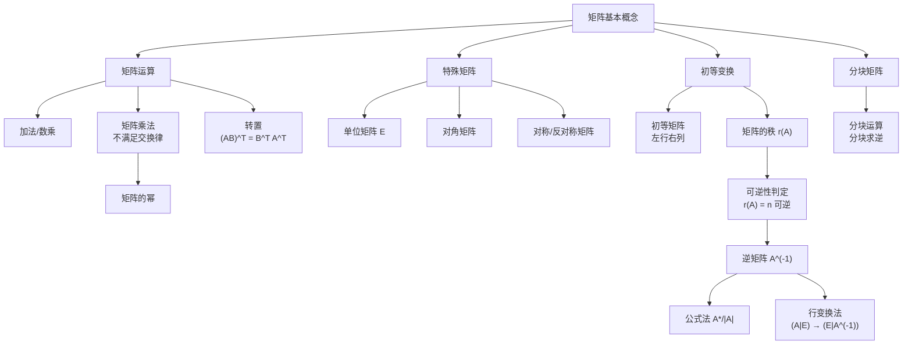

> 📌 矩阵是描述线性变换的"说明书"——它把一个向量空间中的点，按照固定规则映射到另一个（或同一个）空间，而矩阵的各种运算正是在刻画这些变换的复合、逆转与结构。

## 📋 前置知识

- [[线性代数 第一章：行列式]] —— 行列式是判断矩阵可逆性的核心工具，本章大量依赖第一章结论
- [[向量的基本概念]] —— 矩阵本质上是向量的有序集合

## 🤔 为什么要学矩阵？

考研线性代数五大板块（行列式、矩阵、向量、线性方程组、特征值）中，**矩阵是绝对核心**。原因很简单：

- 行列式是矩阵的一个函数
- 向量组的线性相关性通过矩阵的秩来判断
- 线性方程组写成矩阵方程 $Ax = b$ 来求解
- 特征值是矩阵作用在特殊向量上的结果

可以说，不懂矩阵，后面三章全部架空。

## 🧠 核心概念

### 一、矩阵的基本概念

#### 1.1 定义与记号

由 $m \times n$ 个数排成 $m$ 行 $n$ 列的数表，称为 $m \times n$ **矩阵**：

$$
A = \begin{pmatrix}
a_{11} & a_{12} & \cdots & a_{1n} \\
a_{21} & a_{22} & \cdots & a_{2n} \\
\vdots & \vdots & \ddots & \vdots \\
a_{m1} & a_{m2} & \cdots & a_{mn}
\end{pmatrix}
$$

记作 $A_{m \times n}$ 或 $(a_{ij})_{m \times n}$，其中 $a_{ij}$ 表示第 $i$ 行第 $j$ 列的元素。

> 🎯 **类比**：把矩阵想象成一张 Excel 表格。行数和列数是表格的"规格"，每个格子里是具体数值。矩阵运算就是在规定的规则下对表格进行操作。

**行矩阵（行向量）**：只有 $1$ 行的矩阵，$A = (a_1, a_2, \ldots, a_n)$。

**列矩阵（列向量）**：只有 $1$ 列的矩阵，$\beta = \begin{pmatrix} b_1 \\ b_2 \\ \vdots \\ b_m \end{pmatrix}$。

**方阵**：$m = n$ 的矩阵，称为 $n$ 阶方阵，此时行列式 $|A|$ 有意义。

**零矩阵**：所有元素都是 $0$ 的矩阵，记作 $O$。注意不同规格的零矩阵是不同的。

#### 1.2 几类特殊矩阵

**单位矩阵 $E$（或 $I$）**：主对角线全为 $1$，其余为 $0$ 的 $n$ 阶方阵：

$$
E_n = \begin{pmatrix} 1 & & \\ & \ddots & \\ & & 1 \end{pmatrix}
$$

性质：$AE = EA = A$（单位矩阵是矩阵乘法的"乘法单位元"，相当于数字 $1$）。

**对角矩阵 $\Lambda$**：非主对角线元素全为 $0$：

$$
\Lambda = \text{diag}(\lambda_1, \lambda_2, \ldots, \lambda_n) = \begin{pmatrix} \lambda_1 & & \\ & \ddots & \\ & & \lambda_n \end{pmatrix}
$$

**对称矩阵**：$A^T = A$，即 $a_{ij} = a_{ji}$（关于主对角线对称）。

**反对称矩阵**：$A^T = -A$，即 $a_{ij} = -a_{ji}$，且 $a_{ii} = 0$。

**上（下）三角矩阵**：主对角线以下（上）全为 $0$ 的方阵。

> ⚠️ **踩坑**：零矩阵 $O$ 不等于数字 $0$，$AO = O$ 不能推出 $A = O$ 或 $O = 0$；单位矩阵 $E \neq 1$，但 $|E| = 1$、$E^{-1} = E$。

### 二、矩阵的运算

#### 2.1 加法

**条件**：两矩阵必须是**同型矩阵**（行数列数相同）。

**规则**：对应位置元素相加，$(A+B)_{ij} = a_{ij} + b_{ij}$。

**性质**：满足交换律、结合律，$A + O = A$，$A + (-A) = O$。

#### 2.2 数乘

$\lambda A$ 的每个元素都乘以 $\lambda$：$(\lambda A)_{ij} = \lambda a_{ij}$。

**注意区分**：

$$
\lambda A \neq |\lambda A|
$$

数乘矩阵与行列式完全不同：$|\lambda A| = \lambda^n |A|$（$n$ 阶方阵）。

#### 2.3 矩阵乘法（重点！）

**条件**：$A$ 是 $m \times s$ 矩阵，$B$ 是 $s \times n$ 矩阵，$A$ 的**列数** = $B$ 的**行数**，乘积 $C = AB$ 是 $m \times n$ 矩阵。

**规则**：$C$ 的第 $i$ 行第 $j$ 列元素 = $A$ 的第 $i$ 行与 $B$ 的第 $j$ 列的**内积**：

$$
c_{ij} = \sum_{k=1}^{s} a_{ik} b_{kj} = a_{i1}b_{1j} + a_{i2}b_{2j} + \cdots + a_{is}b_{sj}
$$

> 🎯 **类比**：矩阵乘法就像"行碰列"。把左矩阵的一行横着铺开，把右矩阵的一列竖着站好，一一对应相乘再相加，得到结果矩阵对应位置的一个数。

**矩阵乘法的"反常识"性质**（考研高频陷阱）：

| 普通数的性质 | 矩阵乘法中的情况 |
|------------|-----------------|
| $ab = ba$ | $AB \neq BA$（一般不成立，**不可交换**） |
| $ab = 0 \Rightarrow a=0$ 或 $b=0$ | $AB = O$ **不能推出** $A=O$ 或 $B=O$ |
| $ab = ac, a\neq 0 \Rightarrow b=c$ | $AB = AC, A \neq O$ **不能推出** $B=C$ |
| $(ab)^2 = a^2 b^2$ | $(AB)^2 \neq A^2 B^2$（一般不成立） |

> ⚠️ **致命踩坑**：上面四条是考研最高频的"陷阱命题"，每年都考！根本原因是矩阵乘法**不满足交换律**，由此引发一系列连锁错误。

**例子说明 $AB = O$ 不能推出 $A = O$ 或 $B = O$**：

$$
A = \begin{pmatrix} 1 & 0 \\ 0 & 0 \end{pmatrix}, \quad B = \begin{pmatrix} 0 & 0 \\ 0 & 1 \end{pmatrix}
$$

$$
AB = \begin{pmatrix} 0 & 0 \\ 0 & 0 \end{pmatrix} = O, \quad \text{但 } A \neq O, B \neq O
$$

**矩阵乘法满足的性质**（结合律、分配律）：

$$
(AB)C = A(BC), \quad A(B+C) = AB + AC, \quad (B+C)A = BA + CA
$$

$$
\lambda(AB) = (\lambda A)B = A(\lambda B)
$$

#### 2.4 矩阵的幂

对 $n$ 阶方阵 $A$，定义 $A^0 = E$，$A^k = \underbrace{AA\cdots A}_{k \text{ 个}}$。

$$
A^m A^n = A^{m+n}, \quad (A^m)^n = A^{mn}
$$

> ⚠️ 一般情况下 $(AB)^k \neq A^k B^k$！**只有当 $AB = BA$ 时才成立**。

**计算矩阵高次幂的常见思路**：

1. **归纳找规律**：计算 $A^2, A^3$，观察规律
2. **相似对角化**：若 $A$ 可相似对角化（见第五章），$A = P\Lambda P^{-1}$，则 $A^k = P\Lambda^k P^{-1}$
3. **Hamilton-Cayley 定理**（超纲，了解即可）：$A$ 满足自己的特征多项式

**特殊技巧：秩为 $1$ 的矩阵的幂**

若 $A = \alpha \beta^T$（$\alpha$ 是列向量，$\beta^T$ 是行向量），则 $A^2 = (\beta^T \alpha) A$，即 $A^2 = \lambda A$（$\lambda = \beta^T \alpha$ 是一个数），从而 $A^n = \lambda^{n-1} A$。

#### 2.5 转置

将矩阵 $A$ 的行列互换，得到**转置矩阵** $A^T$：$(A^T)_{ij} = a_{ji}$。

**性质**（考研常考）：

$$
(A^T)^T = A
$$

$$
(A + B)^T = A^T + B^T
$$

$$
(\lambda A)^T = \lambda A^T
$$

$$
(AB)^T = B^T A^T \quad \text{（注意顺序颠倒！）}
$$

$$
(ABC)^T = C^T B^T A^T
$$

> ⚠️ $(AB)^T = B^T A^T$，顺序倒过来，不是 $A^T B^T$！记忆口诀：**穿衣服和脱衣服的顺序相反**（先穿袜子后穿鞋，脱的时候先脱鞋后脱袜）。

### 三、逆矩阵

#### 3.1 定义

对 $n$ 阶方阵 $A$，若存在 $n$ 阶方阵 $B$ 使得 $AB = BA = E$，则称 $A$ **可逆**，$B$ 是 $A$ 的逆矩阵，记作 $A^{-1}$。

> 🎯 **类比**：逆矩阵就是矩阵世界里的"倒数"。$3 \times \frac{1}{3} = 1$，而 $A \times A^{-1} = E$。有了逆矩阵，就能从 $Ax = b$ 中"除以 $A$"得到 $x = A^{-1} b$。

**逆矩阵的唯一性**：若 $A$ 可逆，则 $A^{-1}$ 唯一（证明：若 $B, C$ 都是逆，则 $B = BE = B(AC) = (BA)C = EC = C$）。

#### 3.2 矩阵可逆的充要条件

$$
A \text{ 可逆} \iff |A| \neq 0 \iff r(A) = n \iff A \text{ 的列（行）向量组线性无关}
$$

这四个条件等价，任意一个都是可逆的充要条件。

#### 3.3 求逆矩阵的方法

**方法一：公式法（用伴随矩阵）**

$$
A^{-1} = \frac{1}{|A|} A^*
$$

适合**二阶矩阵**（或理论推导）。2 阶矩阵的逆有专用公式：

$$
\begin{pmatrix} a & b \\ c & d \end{pmatrix}^{-1} = \frac{1}{ad-bc} \begin{pmatrix} d & -b \\ -c & a \end{pmatrix}
$$

记忆口诀：**主对角互换，副对角变号，除以行列式**。

**方法二：初等行变换法（最常用！）**

构造增广矩阵 $(A \mid E)$，对其做初等行变换，将左侧的 $A$ 化为单位矩阵 $E$，右侧自动变成 $A^{-1}$：

$$
(A \mid E) \xrightarrow{\text{初等行变换}} (E \mid A^{-1})
$$

**方法三：分块矩阵求逆**（见第五节）

#### 3.4 逆矩阵的运算性质

$$
(A^{-1})^{-1} = A
$$

$$
(\lambda A)^{-1} = \frac{1}{\lambda} A^{-1} \quad (\lambda \neq 0)
$$

$$
(AB)^{-1} = B^{-1} A^{-1} \quad \text{（顺序颠倒！）}
$$

$$
(A^T)^{-1} = (A^{-1})^T
$$

$$
|A^{-1}| = |A|^{-1} = \frac{1}{|A|}
$$

> ⚠️ $(AB)^{-1} = B^{-1} A^{-1}$，顺序同样颠倒，与转置规律一致。记忆方法同"穿脱衣服"类比。

### 四、初等变换与初等矩阵

#### 4.1 三种初等行（列）变换

| 编号 | 操作 | 符号 |
|------|------|------|
| 第一类 | 互换第 $i$ 行与第 $j$ 行 | $r_i \leftrightarrow r_j$ |
| 第二类 | 第 $i$ 行乘以非零常数 $k$ | $r_i \times k$ |
| 第三类 | 第 $j$ 行的 $k$ 倍加到第 $i$ 行 | $r_i + k r_j$ |

对列同理：$c_i \leftrightarrow c_j$，$c_i \times k$，$c_i + k c_j$。

#### 4.2 初等矩阵

对单位矩阵 $E$ 做一次初等变换，得到**初等矩阵**，记作 $E(i,j)$，$E(i(k))$，$E(ij(k))$。

**关键性质**：
- 对矩阵 $A$ 做一次初等**行**变换，等价于**左乘**对应的初等矩阵
- 对矩阵 $A$ 做一次初等**列**变换，等价于**右乘**对应的初等矩阵

> 🎯 口诀：**左行右列**——左乘控制行变换，右乘控制列变换。

**初等矩阵都可逆**，且其逆矩阵也是初等矩阵：
- $E(i,j)$ 的逆是自身（再换一次恢复原样）
- $E(i(k))$ 的逆是 $E(i(k^{-1}))$
- $E(ij(k))$ 的逆是 $E(ij(-k))$

#### 4.3 行等价与列等价

若 $A$ 经有限次初等行变换变成 $B$，则 $A$ 与 $B$ **行等价**，记作 $A \sim B$。

**定理**：$A$ 可逆 $\iff$ $A$ 经初等行变换可化为 $E$。

这也是初等行变换法求逆矩阵的理论基础。

### 五、矩阵的秩

#### 5.1 定义

矩阵 $A$ 中不为零的子式的最高阶数，称为 $A$ 的**秩**，记作 $r(A)$ 或 $\text{rank}(A)$。

**$k$ 阶子式**：从 $A$ 中任取 $k$ 行 $k$ 列，交叉位置的元素构成的 $k$ 阶行列式。

**直觉理解**：秩反映了矩阵中"真正独立"的行（或列）的数量，是矩阵信息量的度量。

> 🎯 **类比**：把矩阵的每一行看作 $n$ 维空间中的一个向量。秩就是这些向量"张成的空间"的维数——有多少个方向是真正独立的（其余方向都是这些方向的线性组合）。

#### 5.2 秩的计算

**方法（唯一方法）**：对矩阵做初等行变换，化为**行阶梯形矩阵**（非零行的行数就是秩）。

行阶梯形矩阵的特征：
- 零行（全为 $0$ 的行）在最下面
- 每个非零行的首个非零元素（称为**主元**）的列标，严格大于上一行主元的列标

$$
\begin{pmatrix}
2 & 1 & -1 & 3 \\
0 & 0 & 3 & -2 \\
0 & 0 & 0 & 5 \\
0 & 0 & 0 & 0
\end{pmatrix}
$$

此矩阵有 $3$ 个非零行，$r(A) = 3$。

#### 5.3 秩的重要性质与不等式

$$
r(A) = r(A^T) = r(A^T A) = r(A A^T)
$$

$$
r(A + B) \leq r(A) + r(B)
$$

$$
r(AB) \leq \min\{r(A), r(B)\}
$$

$$
r(A) + r(B) - n \leq r(AB) \leq \min\{r(A), r(B)\}
$$

（其中 $A$ 是 $m \times n$ 矩阵，$B$ 是 $n \times s$ 矩阵，$n$ 是中间维度）

$$
r\begin{pmatrix} A & O \\ O & B \end{pmatrix} = r(A) + r(B)
$$

**满秩矩阵**：$r(A) = \min\{m, n\}$。对于方阵，$r(A) = n \iff A$ 可逆。

**秩与行列式**：对 $n$ 阶方阵，$|A| \neq 0 \iff r(A) = n$。

> ⚠️ **重要不等式记忆**：$r(AB) \leq \min\{r(A), r(B)\}$，意思是乘法只会让秩变小或不变，不会增大。乘以可逆矩阵不改变秩：若 $P, Q$ 可逆，则 $r(PAQ) = r(A)$。

### 六、分块矩阵

#### 6.1 概念

用横竖线将矩阵分割成多个小矩阵（子块），整体看作是以子块为元素的"矩阵"，称为**分块矩阵**。

$$
A = \begin{pmatrix} A_{11} & A_{12} \\ A_{21} & A_{22} \end{pmatrix}
$$

#### 6.2 分块矩阵的运算

**加法**：同型分块矩阵，对应子块相加（要求分法一致）。

**数乘**：每个子块都乘以该数。

**乘法**：按照矩阵乘法规则，把子块当作"元素"处理（需保证子块维度匹配）。

**转置**：

$$
\begin{pmatrix} A_{11} & A_{12} \\ A_{21} & A_{22} \end{pmatrix}^T = \begin{pmatrix} A_{11}^T & A_{21}^T \\ A_{12}^T & A_{22}^T \end{pmatrix}
$$

**注意**：不仅子块要换位置，每个子块自身也要转置！

#### 6.3 分块对角矩阵的逆

$$
\begin{pmatrix} A & O \\ O & B \end{pmatrix}^{-1} = \begin{pmatrix} A^{-1} & O \\ O & B^{-1} \end{pmatrix}
$$

**副对角分块（陷阱！）**：

$$
\begin{pmatrix} O & A \\ B & O \end{pmatrix}^{-1} = \begin{pmatrix} O & B^{-1} \\ A^{-1} & O \end{pmatrix}
$$

> ⚠️ 副对角分块矩阵求逆，位置互换的同时各自求逆，且**顺序也颠倒**（$A$ 去 $B^{-1}$ 的位置，$B$ 去 $A^{-1}$ 的位置）。

#### 6.4 含非零子块的分块矩阵求逆

$$
\begin{pmatrix} A & C \\ O & B \end{pmatrix}^{-1} = \begin{pmatrix} A^{-1} & -A^{-1}CB^{-1} \\ O & B^{-1} \end{pmatrix}
$$

这个公式不需要背，用**待定系数法**推导：设逆矩阵为 $\begin{pmatrix} X & Y \\ Z & W \end{pmatrix}$，乘以原矩阵等于 $E$，列方程组求解。

## ⚠️ 常见误区与踩坑点

> ❌ **误区 1：矩阵乘法满足交换律**
>
> $AB = BA$ 只在特殊情况下成立（如 $B = E$，或 $A, B$ 都是对角矩阵，或 $A, B$ 共享特征向量）。一般情况下 $AB \neq BA$，甚至 $AB$ 有意义但 $BA$ 可能不合法（维度不匹配）。

> ❌ **误区 2：$(A+B)^2 = A^2 + 2AB + B^2$**
>
> 正确展开：$(A+B)^2 = A^2 + AB + BA + B^2$。只有 $AB = BA$ 时才能合并为 $A^2 + 2AB + B^2$。同理，$(A+B)(A-B) = A^2 - AB + BA - B^2 \neq A^2 - B^2$。

> ⚠️ **踩坑 3：矩阵方程中的"移项"**
>
> 从 $AX = B$ 解 $X$，不能写成 $X = B/A$，要写 $X = A^{-1}B$（左乘 $A^{-1}$）。从 $XA = B$ 解 $X$，则 $X = BA^{-1}$（右乘 $A^{-1}$）。两者完全不同，搞混就错。

> ⚠️ **踩坑 4：$|A^n| = |A|^n$ 与 $|nA| = n^n|A|$ 的混淆**
>
> $|A^n| = |A|^n$（矩阵幂的行列式 = 行列式的幂，由 $|AB| = |A||B|$ 逐步推导）；$|nA| = n^n |A|$（数乘矩阵，每行都提出 $n$）。这两个公式形式相似，但含义完全不同。

> ❌ **误区 5：$r(A) = 0 \Rightarrow A = O$**
>
> 这个方向是正确的：$r(A) = 0$ 当且仅当 $A = O$（因为零矩阵没有任何非零子式）。但容易被考题利用的是它的等价命题——注意 $r(A) \geq 1 \iff A \neq O$。

> ⚠️ **踩坑 6：初等行/列变换改变矩阵秩？**
>
> 初等变换**不改变矩阵的秩**。因此求秩的标准方法就是用初等行变换化阶梯形，数非零行数即可。但要注意：初等变换可能改变行列式的值（互换变号、乘以 $k$ 则行列式乘以 $k$），所以化阶梯形计算行列式时要记录变换带来的符号变化。

## 🔄 概念对比

| 特性 | 矩阵加法 | 矩阵乘法 |
|------|---------|---------|
| 条件 | 同型矩阵 | $A$ 列数 = $B$ 行数 |
| 交换律 | ✅ $A+B = B+A$ | ❌ 一般 $AB \neq BA$ |
| 结合律 | ✅ | ✅ |
| 消去律 | ✅ $A+C=B+C \Rightarrow A=B$ | ❌ $AC=BC$ 且 $C \neq O$ 不能推 $A=B$ |
| 零元 | $O$（零矩阵） | $O$（但 $AB=O$ 不能推 $A=O$ 或 $B=O$） |
| 单位元 | 无 | $E$（单位矩阵） |

| 运算 | 顺序规律 | 记忆方法 |
|------|---------|---------|
| $(AB)^T$ | $= B^T A^T$ | 穿脱衣服顺序相反 |
| $(AB)^{-1}$ | $= B^{-1} A^{-1}$ | 穿脱衣服顺序相反 |
| $(AB)^*$ | $= B^* A^*$ | 同样颠倒（由前两者推导） |
| $(ABC)^T$ | $= C^T B^T A^T$ | 完全颠倒 |

## 🏋️ 动手练习

### 练习 1：矩阵运算基础（⭐）

**题目**：设 $A = \begin{pmatrix} 1 & 2 \\ 0 & 1 \end{pmatrix}$，$B = \begin{pmatrix} 1 & 0 \\ 1 & 1 \end{pmatrix}$，计算 $AB$，$BA$，$(AB)^T - B^T A^T$。

**参考答案**：

$$
AB = \begin{pmatrix} 1 \cdot 1 + 2 \cdot 1 & 1 \cdot 0 + 2 \cdot 1 \\ 0 \cdot 1 + 1 \cdot 1 & 0 \cdot 0 + 1 \cdot 1 \end{pmatrix} = \begin{pmatrix} 3 & 2 \\ 1 & 1 \end{pmatrix}
$$

$$
BA = \begin{pmatrix} 1 & 2 \\ 1 & 3 \end{pmatrix}
$$

$AB \neq BA$，验证不可交换。

$(AB)^T = \begin{pmatrix} 3 & 1 \\ 2 & 1 \end{pmatrix}$，$B^T A^T = \begin{pmatrix} 1 & 1 \\ 0 & 1 \end{pmatrix}\begin{pmatrix} 1 & 0 \\ 2 & 1 \end{pmatrix} = \begin{pmatrix} 3 & 1 \\ 2 & 1 \end{pmatrix}$。

$(AB)^T - B^T A^T = O$，验证 $(AB)^T = B^T A^T$ ✓

### 练习 2：用初等行变换求逆矩阵（⭐⭐）

**题目**：求矩阵 $A = \begin{pmatrix} 2 & 1 & 0 \\ 1 & 2 & 1 \\ 0 & 1 & 2 \end{pmatrix}$ 的逆矩阵。

**参考答案**：

构造 $(A \mid E)$ 并做初等行变换：

$$
\left(\begin{array}{ccc|ccc}
2 & 1 & 0 & 1 & 0 & 0 \\
1 & 2 & 1 & 0 & 1 & 0 \\
0 & 1 & 2 & 0 & 0 & 1
\end{array}\right)
$$

$r_1 \leftrightarrow r_2$：

$$
\left(\begin{array}{ccc|ccc}
1 & 2 & 1 & 0 & 1 & 0 \\
2 & 1 & 0 & 1 & 0 & 0 \\
0 & 1 & 2 & 0 & 0 & 1
\end{array}\right)
$$

$r_2 - 2r_1$：

$$
\left(\begin{array}{ccc|ccc}
1 & 2 & 1 & 0 & 1 & 0 \\
0 & -3 & -2 & 1 & -2 & 0 \\
0 & 1 & 2 & 0 & 0 & 1
\end{array}\right)
$$

$r_2 \leftrightarrow r_3$，$r_2 \times (-1)$（合并：$r_2 = r_3$，再把原 $r_2$ 处理）；更简洁地，$r_2 + 3r_3$：

$$
\left(\begin{array}{ccc|ccc}
1 & 2 & 1 & 0 & 1 & 0 \\
0 & 1 & 2 & 0 & 0 & 1 \\
0 & -3 & -2 & 1 & -2 & 0
\end{array}\right)
$$

（交换 $r_2 \leftrightarrow r_3$ 后）$r_3 + 3r_2$：

$$
\left(\begin{array}{ccc|ccc}
1 & 2 & 1 & 0 & 1 & 0 \\
0 & 1 & 2 & 0 & 0 & 1 \\
0 & 0 & 4 & 1 & -2 & 3
\end{array}\right)
$$

$r_3 \div 4$，$r_2 - 2r_3$，$r_1 - r_3$，$r_1 - 2r_2$（回代消零）：

最终得：

$$
A^{-1} = \frac{1}{4}\begin{pmatrix} 3 & -2 & 1 \\ -2 & 4 & -2 \\ 1 & -2 & 3 \end{pmatrix}
$$

验证：$|A| = 2(4-1) - 1(2-0) + 0 = 4$（分母为 $4$，与结果吻合）。

### 练习 3：秩的计算与矩阵方程（⭐⭐）

**题目**：已知矩阵

$$
A = \begin{pmatrix}
1 & -1 & 2 & 1 \\
2 & -2 & 4 & 2 \\
3 & 0 & 6 & -1 \\
1 & 1 & 2 & -3
\end{pmatrix}
$$

求 $r(A)$。

**参考答案**：

$r_2 - 2r_1$，$r_3 - 3r_1$，$r_4 - r_1$：

$$
\begin{pmatrix}
1 & -1 & 2 & 1 \\
0 & 0 & 0 & 0 \\
0 & 3 & 0 & -4 \\
0 & 2 & 0 & -4
\end{pmatrix}
$$

$r_2 \leftrightarrow r_3$，$r_2 \leftrightarrow r_3$（将零行移到下面）：

$$
\begin{pmatrix}
1 & -1 & 2 & 1 \\
0 & 3 & 0 & -4 \\
0 & 2 & 0 & -4 \\
0 & 0 & 0 & 0
\end{pmatrix}
$$

$r_3 \times 3 - r_2 \times 2$（消去第 2 列）：$r_3 = (0, 6-6, 0, -12+8) = (0, 0, 0, -4)$：

$$
\begin{pmatrix}
1 & -1 & 2 & 1 \\
0 & 3 & 0 & -4 \\
0 & 0 & 0 & -4 \\
0 & 0 & 0 & 0
\end{pmatrix}
$$

有 $3$ 个非零行，$\boxed{r(A) = 3}$。

### 练习 4：矩阵乘法陷阱综合题（⭐⭐⭐）

**题目**：设 $A$ 是 $n$ 阶矩阵，满足 $A^2 - 3A - 4E = O$，证明 $A$ 可逆，并求 $A^{-1}$。

**参考答案**：

**思路**：从已知等式中"凑出" $AX = E$ 的形式，$X$ 就是 $A^{-1}$。

由 $A^2 - 3A - 4E = O$，整理：

$$
A^2 - 3A = 4E
$$

$$
A(A - 3E) = 4E
$$

$$
A \cdot \frac{1}{4}(A - 3E) = E
$$

所以 $A$ 可逆，且：

$$
A^{-1} = \frac{1}{4}(A - 3E)
$$

**验证**：$(A - 3E)A = A^2 - 3A = 4E$ ✓（右乘也成立，说明左逆 = 右逆）

### 练习 5：分块矩阵与秩不等式（⭐⭐⭐）

**题目**：设 $A$ 是 $m \times n$ 矩阵，$B$ 是 $n \times s$ 矩阵，且 $AB = O$，证明 $r(A) + r(B) \leq n$。

**参考答案**：

设 $r(B) = r$，$B$ 的列向量组生成的空间是 $\mathbb{R}^n$ 的一个 $r$ 维子空间。

由 $AB = O$，$B$ 的每一列 $\beta_j$ 满足 $A \beta_j = 0$，即 $B$ 的所有列向量都是方程组 $Ax = 0$ 的解。

方程组 $Ax = 0$（$A$ 是 $m \times n$ 矩阵）的解空间维数为 $n - r(A)$（基础解系含 $n - r(A)$ 个向量）。

$B$ 的所有列向量在解空间中，而解空间的维数为 $n - r(A)$，所以 $B$ 的列向量组的秩（即 $r(B)$）不超过解空间维数：

$$
r(B) \leq n - r(A)
$$

即 $r(A) + r(B) \leq n$。$\square$

## 📝 总结

### 本篇要点回顾

1. **矩阵乘法不可交换**：$AB \neq BA$ 是最根本的"反常识"，由此导致 $(AB)^T = B^T A^T$、$(AB)^{-1} = B^{-1}A^{-1}$、$AB = O$ 不能推 $A = O$ 或 $B = O$ 等一系列结论。

2. **可逆的充要条件**：$|A| \neq 0 \iff r(A) = n \iff$ 行（列）向量线性无关，三者等价。

3. **求逆三招**：公式法（$A^{-1} = A^*/|A|$，适合二阶）、行变换法（$(A|E) \to (E|A^{-1})$，最通用）、待定系数法（分块矩阵）。

4. **秩的本质**：反映矩阵中独立行（列）的数量；初等变换不改变秩；乘以可逆矩阵不改变秩。

5. **$AB = O \Rightarrow r(A) + r(B) \leq n$**：这个不等式是考研证明题的高频考点。

### 知识图谱

## 🔗 相关链接

- 上级概念：[[线性代数总览]]
- 前置章节：[[线性代数 第一章：行列式]]
- 同级概念：[[向量与线性相关性]]
- 下级概念：[[线性方程组的解]]、[[特征值与特征向量]]
- 关键联系：[[伴随矩阵与逆矩阵]]、[[矩阵的秩与线性方程组]]

## 📚 参考资料

- 同济大学数学系《线性代数》第七版 第二章 —— 矩阵运算的标准教材
- 李永乐《线性代数辅导讲义》—— 矩阵乘法陷阱与逆矩阵计算专项训练
- 张宇《线代 9 讲》第二讲 —— 高阶矩阵方程与综合证明题
