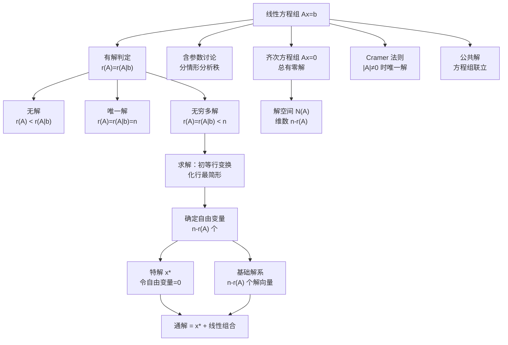

> 📌 线性方程组是线性代数最直接的应用出口——前三章建立的所有工具（行列式、矩阵、向量组的秩）在这里汇聚成一套完整的判解、求解体系。本章的核心任务是：判断有没有解、有多少解、解长什么样。

## 📋 前置知识

- [[线性代数 第二章：矩阵及其运算]] —— 初等行变换、矩阵的秩是本章全部计算的基础
- [[线性代数 第三章：向量组与线性相关性]] —— 解的结构（基础解系 + 特解）直接来自第三章的结论
- [[线性代数 第一章：行列式]] —— Cramer 法则需要行列式

## 🤔 为什么要学这一章？

前三章是"语言体系"的建立，本章是"用这套语言解决实际问题"。

考研数学一中，线性方程组相关题目覆盖面极广：
- **直接考**：给出方程组，判断解的情况，求通解
- **间接考**：矩阵方程 $AX = B$、向量能否被线性表示、秩的不等式证明
- **综合考**：含参数的方程组讨论、与特征值结合（$(\lambda E - A)x = 0$）

本章看似简单（核心操作只有"行变换"），但考研真题里的变形极多，需要把判解条件和解结构理解得非常透彻。

## 🧠 核心概念

### 一、线性方程组的矩阵表示

一般的 $m$ 个方程、$n$ 个未知数的线性方程组：

$$
\begin{cases}
a_{11}x_1 + a_{12}x_2 + \cdots + a_{1n}x_n = b_1 \\
a_{21}x_1 + a_{22}x_2 + \cdots + a_{2n}x_n = b_2 \\
\quad \vdots \\
a_{m1}x_1 + a_{m2}x_2 + \cdots + a_{mn}x_n = b_m
\end{cases}
$$

写成矩阵方程：$Ax = b$，其中

$$
A = \begin{pmatrix} a_{11} & \cdots & a_{1n} \\ \vdots & \ddots & \vdots \\ a_{m1} & \cdots & a_{mn} \end{pmatrix}_{m \times n}, \quad
x = \begin{pmatrix} x_1 \\ \vdots \\ x_n \end{pmatrix}, \quad
b = \begin{pmatrix} b_1 \\ \vdots \\ b_m \end{pmatrix}
$$

**增广矩阵**：$(A \mid b)$，将 $b$ 作为最后一列并入 $A$，是行变换求解的操作对象。

写成列向量的线性组合形式（揭示几何本质）：

$$
x_1 \alpha_1 + x_2 \alpha_2 + \cdots + x_n \alpha_n = b
$$

其中 $\alpha_j$ 是 $A$ 的第 $j$ 列。这说明：**方程组有解 $\iff$ $b$ 能被 $A$ 的列向量线性表示**。

### 二、有解判定定理（最重要的定理）

$$
\boxed{Ax = b \text{ 有解} \iff r(A) = r(A \mid b)}
$$

进一步细分解的个数：

| 条件 | 解的情况 |
|------|---------|
| $r(A) \neq r(A \mid b)$ | **无解** |
| $r(A) = r(A \mid b) = n$（$n$ 是未知数个数） | **唯一解** |
| $r(A) = r(A \mid b) = r < n$ | **无穷多解**（有 $n - r$ 个自由变量） |

> 🎯 **直觉理解**：$r(A \mid b) > r(A)$ 意味着 $b$ 提供了 $A$ 的列空间"之外"的新方向——$b$ 无法被 $A$ 的列向量合成，方程组矛盾无解。$r(A) = r(A \mid b)$ 说明 $b$ 完全在 $A$ 的列空间里，方程组相容。

**特殊情形**：

- 齐次方程组 $Ax = \mathbf{0}$：$r(A \mid \mathbf{0}) = r(A)$ 恒成立，故**总有解**（至少有零解）
  - $r(A) = n$：只有零解
  - $r(A) < n$：有非零解（无穷多解）
- 方程个数 $m < n$：$r(A) \leq m < n$，若有解则必有无穷多解（不可能唯一解）
- 方程个数 $m = n$（方阵情形）：$|A| \neq 0 \iff$ 唯一解（Cramer 法则适用）

### 三、求解过程：初等行变换法

**核心算法**：对增广矩阵 $(A \mid b)$ 做初等行变换，化为**行最简形**（reduced row echelon form），直接读出解。

**步骤**：

**第一步**：写出增广矩阵 $(A \mid b)$

**第二步**：初等行变换化为行阶梯形，确定 $r(A)$ 和 $r(A \mid b)$，判断有无解

**第三步**（有解时）：继续化为行最简形（主元列只保留主元，其余化零）

**第四步**：确定自由变量（非主元列对应的变量），令自由变量取特殊值

**第五步**：
- 非齐次：令所有自由变量为 $0$，读出**特解** $x^*$；再令每个自由变量依次为 $1$ 其余为 $0$，读出**基础解系** $\xi_1, \ldots, \xi_{n-r}$
- 齐次：直接从行最简形读出基础解系

**第六步**：写出通解

**非齐次**：$x = x^* + c_1 \xi_1 + \cdots + c_{n-r} \xi_{n-r}$，$c_i \in \mathbb{R}$

**齐次**：$x = c_1 \xi_1 + \cdots + c_{n-r} \xi_{n-r}$，$c_i \in \mathbb{R}$

> ⚠️ 化行最简形而非仅化阶梯形，是为了直接读解而不需要反代，避免反代时出错。考研中建议一律化行最简形。

### 四、含参数的线性方程组

含参数的方程组是考研的高频题型，核心思路是：**对增广矩阵做行变换，观察参数在何值时秩发生变化**（即某行出现"$0 = \text{非零常数}$"或某列主元消失）。

**标准分析框架**：

1. 对 $(A \mid b)$ 做行变换，化到参数出现"是否为零"的判断点
2. 分情况讨论参数的值
3. 每种情况下分别判断 $r(A)$ 与 $r(A \mid b)$，给出结论

**常见分支点**：
- 某行变成 $(0, 0, \ldots, 0 \mid c)$：若 $c \neq 0$ 则无解
- 某列的主元变成含参数的表达式 $f(\lambda)$：$f(\lambda) = 0$ 与 $f(\lambda) \neq 0$ 两种情况下秩不同

### 五、矩阵方程 $AX = B$

将矩阵方程 $AX = B$ 看作多个线性方程组并列求解：若 $B = (b_1, b_2, \ldots, b_k)$（按列分块），则

$$
AX = B \iff A x_j = b_j \quad (j = 1, 2, \ldots, k)
$$

即同时求解 $k$ 个以 $A$ 为系数矩阵、右端项分别为 $b_j$ 的方程组。

**实用操作**：对 $(A \mid B)$ 做初等行变换，同时处理所有右端项：

$$
(A \mid B) \xrightarrow{\text{行变换}} (E \mid A^{-1}B) \quad \text{（若 } A \text{ 可逆）}
$$

若 $A$ 不可逆，则对各列分别分析有解条件。

**解的个数**：$AX = B$ 有解 $\iff$ $r(A) = r(A \mid B)$（即 $r(A) = r(A, B)$，合并矩阵的秩不增）。

### 六、齐次方程组解空间的深入理解

#### 6.1 解空间

$Ax = \mathbf{0}$ 的全部解构成的集合，记作 $N(A)$（零空间，Null Space），是 $\mathbb{R}^n$ 的子空间，维数为 $n - r(A)$。

$$
\dim N(A) = n - r(A)
$$

这个等式称为**秩-零化度定理**（Rank-Nullity Theorem），是线性代数最基本的维数公式。

#### 6.2 基础解系的不唯一性与等价性

同一个方程组 $Ax = \mathbf{0}$ 可以有不同的基础解系，但任意两个基础解系等价（可以互相线性表示），且都含 $n - r(A)$ 个向量。

判断某组向量 $\xi_1, \ldots, \xi_s$ 是基础解系需同时验证：
1. $\xi_1, \ldots, \xi_s$ 都是 $Ax = \mathbf{0}$ 的解
2. $\xi_1, \ldots, \xi_s$ 线性无关
3. $s = n - r(A)$（个数正确）

> ⚠️ 三个条件缺一不可。只满足前两条（解且无关）但 $s < n - r(A)$，则不是基础解系（遗漏了解的方向）。

#### 6.3 两个方程组同解的条件

$Ax = \mathbf{0}$ 与 $Bx = \mathbf{0}$ 同解 $\iff$ 两个方程组的解空间相同 $\iff$ $r(A) = r(B)$ 且两个方程组互相包含对方的解（实际判断：若 $A$ 的行向量能被 $B$ 的行向量线性表示，反之亦然，则同解）。

**实用结论**：$Ax = \mathbf{0}$ 与 $A^T A x = \mathbf{0}$ 同解（因为 $r(A) = r(A^T A)$）。

### 七、Cramer 法则

当方程个数 = 未知数个数 = $n$，且 $|A| \neq 0$ 时，方程组 $Ax = b$ 有唯一解：

$$
x_j = \frac{D_j}{D}, \quad j = 1, 2, \ldots, n
$$

其中 $D = |A|$，$D_j$ 是把 $A$ 的第 $j$ 列替换为 $b$ 得到的行列式。

**Cramer 法则的主要用途**（考研语境）：

1. **理论推导**：证明方程组有唯一解，或用解的表达式推导性质
2. **反推条件**：已知方程组有唯一解，反推 $|A| \neq 0$
3. **特殊情形计算**：当只需要求某一个 $x_j$ 时比高斯消元快

> ⚠️ Cramer 法则不适合作为常规计算工具（当 $n \geq 4$ 时计算量极大）。考研中若题目给出方程组要求求解，**首选行变换**；Cramer 法则主要出现在理论证明和选择题中。

**齐次方程组的 Cramer 推论**：

$$
Ax = \mathbf{0} \text{ 只有零解} \iff |A| \neq 0
$$

$$
Ax = \mathbf{0} \text{ 有非零解} \iff |A| = 0
$$

### 八、公共解与同解问题

这是考研线代的高阶考点，本质是对多个方程组联立分析。

#### 8.1 公共解

$Ax = \mathbf{0}$ 与 $Bx = \mathbf{0}$ 的**公共解**，是同时满足两个方程组的向量，即

$$
\begin{pmatrix} A \\ B \end{pmatrix} x = \mathbf{0}
$$

的解（将两个方程组上下拼接，联立求解）。

#### 8.2 同解

两方程组**同解** $\iff$ 它们的解空间完全相同。

判断方法：$Ax = \mathbf{0}$ 的基础解系的每个向量满足 $Bx = \mathbf{0}$，且 $Bx = \mathbf{0}$ 的基础解系的每个向量满足 $Ax = \mathbf{0}$。等价地，两方程组互相"包含"对方的解。

实用技巧：若 $r(A) = r(B)$，且 $A$ 的行向量组与 $B$ 的行向量组等价（互相线性表示），则两方程组同解。

## ⚠️ 常见误区与踩坑点

> ❌ **误区 1：方程个数多于未知数，方程组一定无解**
>
> 方程个数多（$m > n$）只说明约束多，但不代表矛盾。只要多余的方程是已有方程的线性组合（$r(A) = r(A \mid b)$），方程组仍然有解。例如 3 个方程 2 个未知数，若第 3 个方程是前两个的和，则有解。

> ❌ **误区 2：特解可以随便取**
>
> 非齐次方程组的特解必须是方程组的**一个真实的解**。令所有自由变量为 $0$ 是最简单的取法，但也可以令自由变量取其他值。关键是：代入方程组必须满足。不能随意凑一个向量当特解。

> ⚠️ **踩坑 3：通解中忘记写参数范围**
>
> 通解 $x = x^* + c_1\xi_1 + \cdots + c_k\xi_k$ 必须注明 $c_1, \ldots, c_k$ 是任意实数（$c_i \in \mathbb{R}$）。考研答题时若漏写，可能被扣分。

> ⚠️ **踩坑 4：齐次方程组也要写"通解"，不能只写基础解系**
>
> 基础解系是一组向量，通解是这组向量的线性组合加上任意系数。题目若问"通解"，必须写出 $x = c_1\xi_1 + \cdots$，不能只列出 $\xi_1, \ldots$ 了事。

> ❌ **误区 5：$r(A) < r(A \mid b)$ 等价于 $b = \mathbf{0}$**
>
> $r(A) < r(A \mid b)$ 仅说明 $b$ 不在 $A$ 的列空间中，与 $b$ 是否为零向量无关。$b = \mathbf{0}$ 时方程是齐次方程组，$r(A \mid \mathbf{0}) = r(A)$ 恒成立，不可能无解。

> ⚠️ **踩坑 6：含参数讨论时漏情形**
>
> 含参数讨论时，分支条件通常是"参数等于某特殊值"与"参数不等于某特殊值"。若行变换后出现多个含参数的行，可能有多个关键值需要分情况讨论，必须逐一列举，不能遗漏。特别注意：某参数值可能同时让 $r(A)$ 下降且让 $r(A \mid b)$ 也下降，未必一定无解。

> ❌ **误区 7：矩阵方程 $AX = B$ 的解法与 $Ax = b$ 完全相同**
>
> 形式上相似，但 $AX = B$ 中 $X$ 是矩阵，要对 $(A \mid B)$ 的增广矩阵做行变换，得到的每一列分别对应 $X$ 的每一列。不能把 $B$ 当成单列向量处理。

## 🔄 概念对比

| 问题类型 | 判解条件 | 解的个数 | 通解结构 |
|----------|---------|---------|---------|
| $Ax = \mathbf{0}$（齐次） | 总有解 | $r(A) = n$：唯一零解；$r(A) < n$：无穷多 | $\sum c_i \xi_i$ |
| $Ax = b$（非齐次） | $r(A) = r(A \mid b)$ | 同上规则（$r$ 换成 $r(A)$） | $x^* + \sum c_i \xi_i$ |
| $AX = B$（矩阵方程） | $r(A) = r(A \mid B)$ | 类似分析，按列独立判断 | 每列分别写通解 |

| 工具 | 适用场景 | 优点 | 缺点 |
|------|---------|------|------|
| 初等行变换 | 所有情形 | 通用、系统 | 含参数时需分情况 |
| Cramer 法则 | $n$ 阶方阵、$\vert A \vert \neq 0$ | 公式直接 | 计算量大（$n \geq 4$ 时不实用） |
| 逆矩阵法 | $A$ 可逆时，$x = A^{-1}b$ | 形式简洁 | 需先求逆，计算量也大 |

## 🏋️ 动手练习

### 练习 1：标准求解流程（⭐）

**题目**：求方程组的通解：

$$
\begin{cases}
2x_1 + x_2 - x_3 + x_4 = 1 \\
4x_1 + 2x_2 - 2x_3 + x_4 = 2 \\
2x_1 + x_2 - x_3 - x_4 = 1
\end{cases}
$$

**参考答案**：

对增广矩阵做行变换：

$$
\left(\begin{array}{cccc|c}
2 & 1 & -1 & 1 & 1 \\
4 & 2 & -2 & 1 & 2 \\
2 & 1 & -1 & -1 & 1
\end{array}\right)
$$

$r_2 - 2r_1$，$r_3 - r_1$：

$$
\left(\begin{array}{cccc|c}
2 & 1 & -1 & 1 & 1 \\
0 & 0 & 0 & -1 & 0 \\
0 & 0 & 0 & -2 & 0
\end{array}\right)
$$

$r_3 - 2r_2$，$r_2 \times (-1)$：

$$
\left(\begin{array}{cccc|c}
2 & 1 & -1 & 1 & 1 \\
0 & 0 & 0 & 1 & 0 \\
0 & 0 & 0 & 0 & 0
\end{array}\right)
$$

$r_1 - r_2$，$r_1 \div 2$（化行最简形）：

$$
\left(\begin{array}{cccc|c}
1 & \frac{1}{2} & -\frac{1}{2} & 0 & \frac{1}{2} \\
0 & 0 & 0 & 1 & 0 \\
0 & 0 & 0 & 0 & 0
\end{array}\right)
$$

$r(A) = r(A \mid b) = 2$，$n = 4$，自由变量为 $x_2, x_3$（$n - r = 2$ 个）。

方程为：$x_1 = \dfrac{1}{2} - \dfrac{1}{2}x_2 + \dfrac{1}{2}x_3$，$x_4 = 0$。

**特解**（令 $x_2 = x_3 = 0$）：$x^* = \left(\dfrac{1}{2}, 0, 0, 0\right)^T$

**基础解系**：

令 $(x_2, x_3) = (1, 0)$：$\xi_1 = \left(-\dfrac{1}{2}, 1, 0, 0\right)^T$，乘以 $2$ 取整：$\xi_1 = (-1, 2, 0, 0)^T$

令 $(x_2, x_3) = (0, 1)$：$\xi_2 = \left(\dfrac{1}{2}, 0, 1, 0\right)^T$，乘以 $2$：$\xi_2 = (1, 0, 2, 0)^T$

**通解**：

$$
x = \begin{pmatrix} 1 \\ 0 \\ 0 \\ 0 \end{pmatrix} \cdot \frac{1}{2} + c_1 \begin{pmatrix} -1 \\ 2 \\ 0 \\ 0 \end{pmatrix} + c_2 \begin{pmatrix} 1 \\ 0 \\ 2 \\ 0 \end{pmatrix}, \quad c_1, c_2 \in \mathbb{R}
$$

（特解保留分数或化整均可，通解中基础解系的倍数不影响结果）

### 练习 2：含参数方程组的讨论（⭐⭐）

**题目**：讨论 $\lambda$ 取何值时，方程组

$$
\begin{cases}
\lambda x_1 + x_2 + x_3 = 1 \\
x_1 + \lambda x_2 + x_3 = 1 \\
x_1 + x_2 + \lambda x_3 = 1
\end{cases}
$$

有唯一解、无穷多解、无解？有解时求解。

**参考答案**：

系数矩阵的行列式：

$$
|A| = \begin{vmatrix} \lambda & 1 & 1 \\ 1 & \lambda & 1 \\ 1 & 1 & \lambda \end{vmatrix}
$$

三行相加得公因子 $\lambda + 2$，第一行减去后两行：

$$
|A| = (\lambda + 2) \begin{vmatrix} 1 & 1 & 1 \\ 1 & \lambda & 1 \\ 1 & 1 & \lambda \end{vmatrix} \xrightarrow{r_2-r_1,r_3-r_1} (\lambda+2) \begin{vmatrix} 1 & 1 & 1 \\ 0 & \lambda-1 & 0 \\ 0 & 0 & \lambda-1 \end{vmatrix} = (\lambda+2)(\lambda-1)^2
$$

**情形一**：$\lambda \neq -2$ 且 $\lambda \neq 1$，$|A| \neq 0$，**唯一解**。

用 Cramer 法则（或行变换），由对称性 $x_1 = x_2 = x_3 = \dfrac{1}{\lambda + 2}$。

**情形二**：$\lambda = 1$，系数矩阵每行相同为 $(1,1,1)$，增广矩阵：

$$
\left(\begin{array}{ccc|c} 1&1&1&1 \\ 1&1&1&1 \\ 1&1&1&1 \end{array}\right) \rightarrow \left(\begin{array}{ccc|c} 1&1&1&1 \\ 0&0&0&0 \\ 0&0&0&0 \end{array}\right)
$$

$r(A) = r(A \mid b) = 1 < 3$，**无穷多解**。自由变量 $x_2, x_3$。

通解：$x = (1,0,0)^T + c_1(-1,1,0)^T + c_2(-1,0,1)^T$，$c_1, c_2 \in \mathbb{R}$

**情形三**：$\lambda = -2$，增广矩阵：

$$
\left(\begin{array}{ccc|c} -2&1&1&1 \\ 1&-2&1&1 \\ 1&1&-2&1 \end{array}\right)
$$

三行相加：$0 \cdot x_1 + 0 \cdot x_2 + 0 \cdot x_3 = 3$，即 $0 = 3$，矛盾。

$r(A) = 2$，$r(A \mid b) = 3$，**无解**。

### 练习 3：由解的信息反推方程组（⭐⭐）

**题目**：已知 $4$ 阶方阵 $A$ 的秩 $r(A) = 3$，$\eta_1 = (1,0,0,1)^T$，$\eta_2 = (0,1,0,1)^T$ 是 $Ax = \mathbf{0}$ 的两个解，$\xi$ 是 $Ax = b$ 的一个解。判断以下哪些是 $Ax = b$ 的解：

（1）$\xi + \eta_1$　（2）$\xi + \eta_1 - \eta_2$　（3）$2\xi - \eta_1$　（4）$\xi + \eta_1 + \eta_2$

**参考答案**：

$r(A) = 3$，$n = 4$，故 $Ax = \mathbf{0}$ 的基础解系含 $n - r = 1$ 个向量。

$\eta_1, \eta_2$ 都是齐次解，且均非零，故 $\eta_1, \eta_2$ 都可作为基础解系（各自是 $1$ 维解空间的基）。$\eta_1, \eta_2$ 线性相关（都在同一个 $1$ 维解空间里），故 $\eta_2 = k \eta_1$ 对某个 $k$ 成立。

设 $A\xi = b$，则：

**判断 $Ax = b$ 的解的方法**：$\eta$ 是该解 $\iff$ $A\eta = b$。

$$
A(\xi + \eta_1) = A\xi + A\eta_1 = b + \mathbf{0} = b \quad \checkmark \text{（1）是解}
$$

$$
A(\xi + \eta_1 - \eta_2) = b + \mathbf{0} - \mathbf{0} = b \quad \checkmark \text{（2）是解}
$$

$$
A(2\xi - \eta_1) = 2b - \mathbf{0} = 2b \neq b \text{（一般情况下）} \quad \times \text{（3）不是解}
$$

$$
A(\xi + \eta_1 + \eta_2) = b + \mathbf{0} + \mathbf{0} = b \quad \checkmark \text{（4）是解}
$$

故（1）（2）（4）是 $Ax = b$ 的解，（3）不是（除非 $b = \mathbf{0}$）。

**规律总结**：特解 + 任意齐次解 = 新的特解；$k$ 个特解的线性组合，若系数之和为 $1$，则仍是特解；系数之和为 $0$，则是齐次解。

### 练习 4：两方程组的公共解（⭐⭐⭐）

**题目**：求方程组（I）和（II）的公共解：

$$
\text{（I）} \begin{cases} x_1 + x_2 = 0 \\ x_2 - x_4 = 0 \end{cases} \qquad
\text{（II）} \begin{cases} x_1 - x_2 + x_3 = 0 \\ x_2 + x_3 + x_4 = 0 \end{cases}
$$

**参考答案**：

公共解即满足两个方程组全部方程的解，将四个方程联立：

$$
\begin{cases}
x_1 + x_2 = 0 \\
x_2 - x_4 = 0 \\
x_1 - x_2 + x_3 = 0 \\
x_2 + x_3 + x_4 = 0
\end{cases}
$$

系数矩阵：

$$
\begin{pmatrix}
1 & 1 & 0 & 0 \\
0 & 1 & 0 & -1 \\
1 & -1 & 1 & 0 \\
0 & 1 & 1 & 1
\end{pmatrix}
$$

$r_3 - r_1$：$(0, -2, 1, 0)$；$r_4 - r_2$：$(0, 0, 1, 2)$

$$
\rightarrow \begin{pmatrix}
1 & 1 & 0 & 0 \\
0 & 1 & 0 & -1 \\
0 & -2 & 1 & 0 \\
0 & 0 & 1 & 2
\end{pmatrix}
$$

$r_3 + 2r_2$：$(0, 0, 1, -2)$；再 $r_4 - r_3$：$(0,0,0,4)$，$r_4 \div 4$：$(0,0,0,1)$

$$
\rightarrow \begin{pmatrix}
1 & 1 & 0 & 0 \\
0 & 1 & 0 & -1 \\
0 & 0 & 1 & -2 \\
0 & 0 & 0 & 1
\end{pmatrix}
$$

$r(A) = 4 = n$，只有零解。

**公共解为零向量** $x = \mathbf{0}$。

### 练习 5：解方程组的综合证明（⭐⭐⭐）

**题目**：设 $A$ 是 $m \times n$ 矩阵，$B$ 是 $n \times s$ 矩阵，且 $AB = O$。证明：$B$ 的列向量都是 $Ax = \mathbf{0}$ 的解，并由此证明 $r(A) + r(B) \leq n$。

**参考答案**：

设 $B = (\beta_1, \beta_2, \ldots, \beta_s)$（按列分块），则

$$
AB = A(\beta_1, \ldots, \beta_s) = (A\beta_1, \ldots, A\beta_s) = O
$$

故 $A\beta_j = \mathbf{0}$，即 $\beta_j$ 满足 $Ax = \mathbf{0}$，$B$ 的每一列都是 $Ax = \mathbf{0}$ 的解。

$Ax = \mathbf{0}$ 的解空间维数为 $n - r(A)$，而 $B$ 的列向量组的秩为 $r(B)$（$r(B)$ 个线性无关的解），这些向量都在维数为 $n - r(A)$ 的解空间中，故

$$
r(B) \leq n - r(A)
$$

即 $r(A) + r(B) \leq n$。$\square$

## 📝 总结

### 本篇要点回顾

1. **有解判定**：$r(A) = r(A \mid b)$——这是最核心的定理，必须熟练到条件反射。

2. **解的个数**：等于 $n$（唯一）或无穷（$r < n$）；没有"恰好 $k$ 个解"（$k \geq 2$ 有限个）的情况。

3. **通解结构**：非齐次通解 = 特解 + 齐次通解；特解 + 齐次解 = 新特解；两个特解之差 = 齐次解。

4. **基础解系**：含 $n - r(A)$ 个线性无关的解向量，三要素（是解、无关、个数对）缺一不可。

5. **含参数**：行变换找到参数的关键值（使秩下降的值），逐情形讨论 $r(A)$ 与 $r(A \mid b)$ 的大小关系。

### 知识图谱

## 🔗 相关链接

- 上级概念：[[线性代数总览]]
- 前置章节：[[线性代数 第三章：向量组与线性相关性]]
- 下一章节：[[线性代数 第五章：特征值与特征向量]]
- 关键工具：[[初等行变换]]、[[矩阵的秩]]
- 应用延伸：[[二次型与正定矩阵]]

## 📚 参考资料

- 同济大学数学系《线性代数》第七版 第四章、第五章 —— 向量与方程组的理论基础
- 李永乐《线性代数辅导讲义》—— 含参数方程组讨论、公共解与同解专项
- 张宇《线代 9 讲》第四讲 —— 方程组的综合证明与反推题型
- 历年考研真题 —— 线性方程组几乎每年必考，2010、2015、2019、2022 年均有大题
