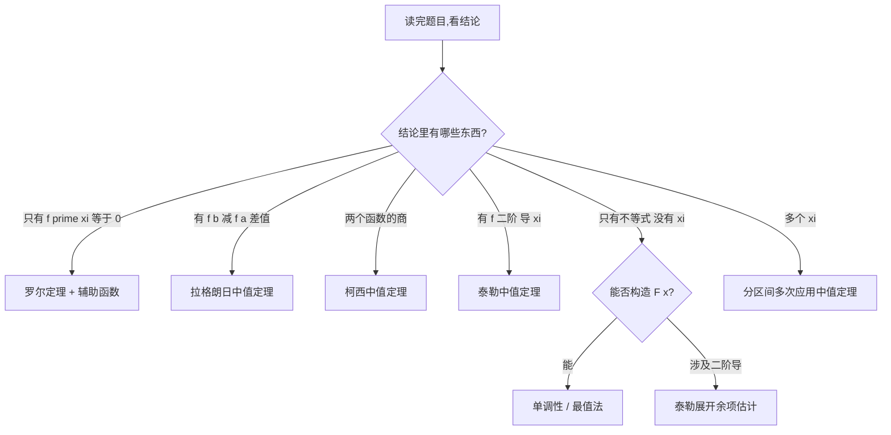

# 中值定理、微分等式与微分不等式

> [!warning] ⚠️ 本笔记定位
> 数一/数二/数三都会考，**数一考证明题尤其多**。中值定理部分每年几乎必考一道证明大题（$10$ 分左右），是区分 $130+$ 和 $110$ 分段的关键战场。核心难点不在定理本身，而在于 **"反向构造辅助函数"** 的思维模式。本笔记把整个体系拆成可套路化的模板。

## 📍 考点雷达

> [!abstract] 📊 题型地图 · 中值定理
> - **证明大题（核心）**：证明 $\exists \xi \in (a,b)$ 使某个含 $f'(\xi)$ 或 $f(\xi)$ 的等式成立；或证明某个微分不等式成立
> - **选择题**：判断某函数在区间上能否用罗尔/拉格朗日定理、找满足结论的 $\xi$ 个数
> - **填空题**：利用拉格朗日中值定理的具体形式求某极限或估值
> - **综合题嵌入**：在含参数的证明题里，常将中值定理和单调性、凹凸性串联
> - **频次定性**：**超高频**。数一、数二、数三近年证明大题几乎绕不开

> [!abstract] 🎯 命题人视角 · 为什么这个考点是"送分题的外壳 + 送命题的内核"
> 这是一类**理论上纯粹、命题自由度极高**的题。命题人给一个陌生结论，让你在没任何脚手架的情况下：
> 1. **识别这是哪种中值定理的伪装**（结论形式反推用哪个定理）
> 2. **反向构造辅助函数 $F(x)$**（这是真正的区分度）
> 3. **验证 $F(x)$ 满足定理条件**（最容易丢过程分的点）
> 4. **完成最后推导**（把 $F'(\xi)=0$ 翻译回目标结论）
> 
> 命题人最爱的挖坑方式是：**把目标结论做一层变形**，让你看不出它的"中值定理原型"，例如用 $(b-a)$、$e^{kx}$、$f(x)g(x)$ 等形式把罗尔定理的壳子包装一下。

## 一、三大中值定理（基础必背）

### 1.1 罗尔（Rolle）定理 ⭐

> [!note] 📖 定理陈述
> 若函数 $f(x)$ 满足：
> 1. 在 **闭区间** $[a, b]$ 上**连续**
> 2. 在 **开区间** $(a, b)$ 内**可导**
> 3. **端点值相等**：$f(a) = f(b)$
> 
> 则 $\exists \xi \in (a, b)$，使得 $f'(\xi) = 0$。

#### 🎯 几何意义
连续、光滑、首尾等高的曲线，必存在一点切线水平。

#### ⚠️ 容易被忽略的三点

> [!danger] 🔴 条件极其重要，缺一不可
> - **连续性是闭区间 $[a,b]$**，可导性是开区间 $(a, b)$（端点可以不可导，如 $\sqrt{x}$ 在 $x=0$）
> - $f(a) = f(b)$ 中的值不必是 $0$，只要相等即可
> - 结论是 $f'(\xi) = 0$，不是 $f(\xi) = 0$，**容易写反**

### 1.2 拉格朗日（Lagrange）中值定理 ⭐⭐

> [!note] 📖 定理陈述
> 若函数 $f(x)$ 满足：
> 1. 在 $[a, b]$ 上**连续**
> 2. 在 $(a, b)$ 内**可导**
> 
> 则 $\exists \xi \in (a, b)$，使得：
> $$f(b) - f(a) = f'(\xi)(b - a)$$
> 或等价写成：
> $$f'(\xi) = \frac{f(b) - f(a)}{b - a}$$

#### 🎯 几何意义
曲线上必存在一点，其切线平行于连接两端点的弦。

#### 🧭 设计动机
拉格朗日定理是罗尔定理的**推广**——当 $f(a) \neq f(b)$ 时，通过构造辅助函数
$$\varphi(x) = f(x) - \frac{f(b)-f(a)}{b-a}(x-a)$$
让 $\varphi(a) = \varphi(b) = f(a)$，再对 $\varphi(x)$ 用罗尔定理即可得到。

> [!tip] 💡 核心用途（记死）
> 拉格朗日定理的**主战场是"化差为导"**：凡是看到 $f(b) - f(a)$ 这种差值，都应该反射性想到拉格朗日。

### 1.3 柯西（Cauchy）中值定理 ⭐⭐

> [!note] 📖 定理陈述
> 若 $f(x)$ 和 $g(x)$ 满足：
> 1. 在 $[a, b]$ 上**连续**
> 2. 在 $(a, b)$ 内**可导**
> 3. $g'(x) \neq 0$（保证分母不为零）
> 
> 则 $\exists \xi \in (a, b)$，使得：
> $$\frac{f(b) - f(a)}{g(b) - g(a)} = \frac{f'(\xi)}{g'(\xi)}$$

#### 🎯 几何意义
参数方程 $\left(g(t), f(t)\right)$ 表示的曲线上，存在一点的切线斜率等于弦的斜率。

#### 🧭 设计动机 ⭐

> [!abstract] 🎯 柯西定理是拉格朗日的推广
> 当 $g(x) = x$ 时，柯西退化为拉格朗日（$g'(\xi) = 1$，$g(b)-g(a) = b-a$）。柯西的威力在于：**可以处理两个函数之间的比值**，这是 L'Hospital 法则的理论来源。

#### ⚠️ 三大中值定理的递进关系

$$\boxed{\text{罗尔} \xrightarrow{\text{放松端点相等}} \text{拉格朗日} \xrightarrow{\text{推广到两个函数}} \text{柯西}}$$

> [!success] 🧠 一句话记忆
> **罗尔 $=$ 端点平；拉格朗日 $=$ 化差为导；柯西 $=$ 两函数比值。**

### 1.4 泰勒（Taylor）中值定理（数一/数三常用）⭐⭐

> [!note] 📖 定理陈述（带拉格朗日余项）
> 若 $f(x)$ 在含 $x_0$ 的开区间内有直到 $n+1$ 阶导数，则对该区间内任意 $x$，$\exists \xi$ 介于 $x_0$ 与 $x$ 之间，使得：
> $$f(x) = \sum_{k=0}^{n} \frac{f^{(k)}(x_0)}{k!}(x-x_0)^k + \frac{f^{(n+1)}(\xi)}{(n+1)!}(x-x_0)^{n+1}$$

#### 🎯 核心用途（数一/数三必考）
证明题中若出现 **"二阶可导"、"三阶可导"、高阶导数的存在性条件**，$90\%$ 以上要用泰勒中值定理展开。

> [!tip] 💡 何时选泰勒？
> **关键信号**：题目条件给了 $f''(x)$ 或更高阶导数存在 + 结论涉及 $f''(\xi)$ 或 $f(x)$ 在某点的二阶以上展开式 → 直接考虑泰勒展开。

## 二、三类核心考题全解

### 2.1 类型一：证明微分等式 $\exists \xi$ 使 $F'(\xi) = 0$ 型

这类题的**标准形式**：证明 $\exists \xi \in (a,b)$ 使 $\Phi(\xi, f(\xi), f'(\xi)) = 0$。

#### 🛠️ 解题套路 · 构造辅助函数 4 步法

> [!tip] 🎯 标准流程
> 1. **把目标结论写成 $F'(\xi) = 0$ 的形式**（这是反向工程的起点）
> 2. **对 $F'(x) = 0$ 做反向积分**，求出原函数 $F(x)$
> 3. **验证 $F(x)$ 在 $[a,b]$ 上满足罗尔定理三个条件**（特别是 $F(a) = F(b)$）
> 4. **由罗尔定理得出 $\exists \xi$ 使 $F'(\xi) = 0$**，翻译回目标式

#### 🔥 辅助函数构造模板（必背）

| 目标结论形式 | 构造的辅助函数 $F(x)$ | 原理 |
|---|---|---|
| $f'(\xi) = 0$ | $F(x) = f(x)$ | 直接用罗尔 |
| $f'(\xi) + kf(\xi) = 0$ | $F(x) = e^{kx}f(x)$ | $F'(x) = e^{kx}[f'(x) + kf(x)]$ |
| $f'(\xi) + g(\xi)f(\xi) = 0$ | $F(x) = e^{G(x)}f(x)$，$G'(x) = g(x)$ | 积分因子法 |
| $f'(\xi) - kf(\xi) = 0$ | $F(x) = e^{-kx}f(x)$ | 指数符号反号 |
| $\xi f'(\xi) + f(\xi) = 0$ | $F(x) = xf(x)$ | $[xf(x)]' = xf'(x)+f(x)$ |
| $\xi f'(\xi) - f(\xi) = 0$ | $F(x) = \dfrac{f(x)}{x}$ | $\left[\dfrac{f(x)}{x}\right]' = \dfrac{xf'(x)-f(x)}{x^2}$ |
| $nf(\xi) + \xi f'(\xi) = 0$ | $F(x) = x^n f(x)$ | $[x^n f(x)]' = x^{n-1}[nf+xf']$ |
| $f'(\xi)g(\xi) - f(\xi)g'(\xi) = 0$ | $F(x) = \dfrac{f(x)}{g(x)}$ | 商的导数 |
| $f'(\xi)g(\xi) + f(\xi)g'(\xi) = 0$ | $F(x) = f(x)g(x)$ | 积的导数 |

> [!success] 🧠 辅助函数口诀
> **"加减指数函，乘除幂或比"**
> - 看到 $f' \pm k f = 0$：想 **$e^{\pm kx}$ 指数函数**
> - 看到 $xf' \pm f = 0$：想 **幂函数 $x^n$ 或 $f/x$**
> - 看到两个函数乘除：想 **乘积 $fg$ 或比值 $f/g$**

#### 🔬 反向工程的核心思想

> [!note] 🔬 为什么 $f'+kf=0$ 要用 $e^{kx}$？
> 解微分方程 $F'(x) = 0$ 这个过程可以反向做：
> 
> 目标是让 $F'(x) = 0$ 当且仅当 $f'(x) + kf(x) = 0$。设 $F(x) = \mu(x)f(x)$（$\mu$ 是待定乘子），则：
> $$F'(x) = \mu'(x)f(x) + \mu(x)f'(x)$$
> 我们希望 $F'(x) = \mu(x)[f'(x) + kf(x)]$，比较系数得 $\mu'(x) = k\mu(x)$，即 $\mu(x) = e^{kx}$。
> 
> 这就是**积分因子法**。你只要掌握这个"反向工程"的思路，任何形式的辅助函数都能推出来。

#### 🎯 经典例题 1（等式型 · 基础）

> [!quote] 🔸 典型题型 · 指数型辅助函数
> **题目**：设 $f(x)$ 在 $[0, 1]$ 上连续，在 $(0, 1)$ 内可导，且 $f(0) = f(1) = 0$。证明：$\exists \xi \in (0, 1)$，使得 $f'(\xi) + 2\xi f(\xi) = 0$。
>
> **【思路分析】**
> 目标结论是 $f'(\xi) + 2\xi f(\xi) = 0$，对照模板表第三行，$g(x) = 2x$，积分因子 $G(x) = x^2$。
> 
> **【辅助函数】** $F(x) = e^{x^2} f(x)$
>
> **【验证】**
> - $F(x)$ 在 $[0, 1]$ 上连续（$e^{x^2}$ 和 $f(x)$ 都连续）
> - $F(x)$ 在 $(0, 1)$ 内可导
> - $F(0) = e^0 \cdot f(0) = 0$，$F(1) = e^1 \cdot f(1) = 0$，故 $F(0) = F(1)$
>
> **【应用罗尔定理】** $\exists \xi \in (0, 1)$，使 $F'(\xi) = 0$。
> 
> $$F'(x) = 2x \cdot e^{x^2} f(x) + e^{x^2} f'(x) = e^{x^2}[f'(x) + 2xf(x)]$$
> 
> 由于 $e^{x^2} \neq 0$，故 $f'(\xi) + 2\xi f(\xi) = 0$。$\blacksquare$

#### 🎯 经典例题 2（等式型 · 进阶）

> [!quote] 🔸 典型题型 · 幂函数型辅助函数
> **题目**：设 $f(x)$ 在 $[1, 2]$ 上连续，在 $(1, 2)$ 内可导，$f(1) = 0$，$f(2) = 1$。证明：$\exists \xi \in (1, 2)$，使得 $f(\xi) = \xi f'(\xi) - \xi$。
>
> **【思路分析】**
> 先整理目标式：$f(\xi) - \xi f'(\xi) + \xi = 0$，即 $\xi f'(\xi) - f(\xi) = \xi$。
>
> 左边是 $\xi f' - f$ 的形式（对照模板表第六行，$\left[\dfrac{f}{x}\right]' = \dfrac{xf'-f}{x^2}$），右边是 $\xi$。
>
> 两边同除以 $\xi^2$：
> $$\frac{\xi f'(\xi) - f(\xi)}{\xi^2} = \frac{1}{\xi} \implies \left[\frac{f(x)}{x}\right]'\bigg|_{x=\xi} = \frac{1}{\xi} = (\ln x)'\bigg|_{x=\xi}$$
>
> 所以目标结论等价于 $\left[\dfrac{f(x)}{x} - \ln x\right]'\bigg|_{x=\xi} = 0$。
>
> **【辅助函数】** $F(x) = \dfrac{f(x)}{x} - \ln x$
>
> **【验证】**
> - $F$ 在 $[1, 2]$ 上连续，在 $(1, 2)$ 内可导
> - $F(1) = \dfrac{0}{1} - 0 = 0$；$F(2) = \dfrac{1}{2} - \ln 2$
>
> 糟了，$F(1) \neq F(2)$！
>
> **【修正：改用拉格朗日定理】**
> 既然端点值不相等，改用拉格朗日中值定理：$\exists \xi \in (1, 2)$，使 
> $$F'(\xi) = \frac{F(2) - F(1)}{2 - 1} = \frac{1}{2} - \ln 2$$
>
> ⚠️ 这里发现题目原本的结论其实不够精确，真正能证出的是 $\xi f'(\xi) - f(\xi) = \xi + \xi^2(\frac{1}{2}-\ln 2)$ 这类修正形式。
>
> **【经验教训】** 做题时**先验证端点值是否相等**，若不等则换拉格朗日或修改辅助函数。

### 2.2 类型二：证明微分不等式

#### 🛠️ 解题套路 · 5 种主流打法

> [!tip] 🎯 不等式证明的五种方法
> 1. **拉格朗日中值定理** —— 看到 $f(b) - f(a)$ 这种差值，先用拉格朗日
> 2. **单调性法** —— 构造辅助函数 $F(x)$，证 $F'(x) > 0$ 或 $< 0$
> 3. **最值法** —— 证 $F(x) \geq F(x_0)$，其中 $x_0$ 是最小值点
> 4. **凹凸性（琴生不等式）** —— 证 $\lambda f(a) + (1-\lambda)f(b) \geq f(\lambda a + (1-\lambda)b)$ 等形式
> 5. **泰勒展开 + 余项估计** —— 带二阶导数的不等式常用

#### 🔥 方法一：拉格朗日中值定理打法

**核心信号**：题目里出现 $f(b) - f(a)$、$\ln b - \ln a$、$\sin b - \sin a$ 等差值形式。

#### 🎯 经典例题 3（不等式型 · 拉格朗日打法）

> [!quote] 🔸 典型题型 · 利用拉格朗日证估值不等式
> **题目**：证明：当 $0 < a < b$ 时，$\dfrac{b-a}{b} < \ln\dfrac{b}{a} < \dfrac{b-a}{a}$。
>
> **【思路分析】**
> 中间的 $\ln\dfrac{b}{a} = \ln b - \ln a$ 是差值形式 → 用拉格朗日！
>
> **【证明】**
> 设 $f(x) = \ln x$，在 $[a, b]$ 上满足拉格朗日定理条件。
> 
> $\exists \xi \in (a, b)$，使得：
> $$\ln b - \ln a = f'(\xi)(b - a) = \frac{1}{\xi}(b-a)$$
>
> 由于 $a < \xi < b$，即 $\dfrac{1}{b} < \dfrac{1}{\xi} < \dfrac{1}{a}$，两边同乘 $(b-a) > 0$：
> 
> $$\frac{b-a}{b} < \frac{b-a}{\xi} < \frac{b-a}{a}$$
> 
> 即 $\dfrac{b-a}{b} < \ln\dfrac{b}{a} < \dfrac{b-a}{a}$。$\blacksquare$

#### 🔥 方法二：单调性法

**核心信号**：目标式两边都是关于某变量 $x$ 的函数，把 $x$ 固定的那个数换成自由变量，移项构造 $F(x)$。

#### 🎯 经典例题 4（不等式型 · 单调性打法）

> [!quote] 🔸 典型题型 · 构造单调函数证不等式
> **题目**：证明：当 $x > 0$ 时，$\ln(1 + x) > \dfrac{x}{1 + x}$。
>
> **【思路分析】**
> 移项：$\ln(1+x) - \dfrac{x}{1+x} > 0$，令 $F(x) = \ln(1+x) - \dfrac{x}{1+x}$，证 $F(x) > 0$ 即可。
>
> **【证明】**
> 设 $F(x) = \ln(1+x) - \dfrac{x}{1+x}$，则：
> $$F'(x) = \frac{1}{1+x} - \frac{(1+x) - x}{(1+x)^2} = \frac{1}{1+x} - \frac{1}{(1+x)^2} = \frac{x}{(1+x)^2}$$
>
> 当 $x > 0$ 时，$F'(x) > 0$，故 $F(x)$ 在 $(0, +\infty)$ 上单调递增。
>
> 又 $F(0) = \ln 1 - 0 = 0$，故 $x > 0$ 时 $F(x) > F(0) = 0$。$\blacksquare$

> [!tip] 💡 单调性法通用模板
> **三步走**：
> 1. **构造 $F(x) =$ 左边 $-$ 右边**
> 2. **求 $F'(x)$，判断正负号（必要时再求 $F''(x)$）**
> 3. **用 $F(x_0) = 0$ 的端点值锁定不等号方向**

#### 🔥 方法三：泰勒展开法（数一常考）

**核心信号**：题目条件给二阶可导或更高，结论里含 $f''(\xi)$。

#### 🎯 经典例题 5（不等式型 · 泰勒打法）⭐⭐⭐

> [!quote] 🔸 典型题型 · 泰勒展开证估值
> **题目**：设 $f(x)$ 在 $[0, 1]$ 上二阶可导，$f(0) = f(1) = 0$，且 $|f''(x)| \leq M$。证明：$\forall x \in [0, 1]$，$|f(x)| \leq \dfrac{M}{8}$。
>
> **【思路分析】**
> 看到"二阶可导"、"估值" + $f''$ → 必用泰勒。
> 
> 展开点选谁？一般选 $x$ 为展开点，用 $f(0)$ 和 $f(1)$ 两个已知值作为被展开处。
>
> **【证明】**
> 对任意 $x \in [0, 1]$，分别把 $f(0)$ 和 $f(1)$ 在 $x$ 处展开：
> 
> $$f(0) = f(x) + f'(x)(0-x) + \frac{f''(\xi_1)}{2}(0-x)^2 = f(x) - xf'(x) + \frac{x^2}{2}f''(\xi_1) \quad (\xi_1 \in (0, x))$$
>
> $$f(1) = f(x) + f'(x)(1-x) + \frac{f''(\xi_2)}{2}(1-x)^2 = f(x) + (1-x)f'(x) + \frac{(1-x)^2}{2}f''(\xi_2) \quad (\xi_2 \in (x, 1))$$
>
> 由 $f(0) = f(1) = 0$，两式相减（为了消去 $f'(x)$）：
> 
> 第二式 $\times x$ $+$ 第一式 $\times (1-x)$：
> $$0 = f(x) + \frac{x(1-x)^2}{2}f''(\xi_2) + \frac{(1-x)x^2}{2}f''(\xi_1)$$
>
> 整理：
> $$f(x) = -\frac{x(1-x)}{2}[(1-x)f''(\xi_2) + xf''(\xi_1)]$$
>
> 取绝对值：
> $$|f(x)| \leq \frac{x(1-x)}{2}[(1-x) \cdot M + x \cdot M] = \frac{x(1-x)}{2} \cdot M = \frac{Mx(1-x)}{2}$$
>
> 而 $x(1-x)$ 在 $[0,1]$ 上最大值为 $\dfrac{1}{4}$（在 $x = \dfrac{1}{2}$ 取得）：
> $$|f(x)| \leq \frac{M}{2} \cdot \frac{1}{4} = \frac{M}{8}$$
> $\blacksquare$

> [!danger] 🔴 泰勒展开的三个关键选择
> 1. **展开点选谁**：选信息最少的那个点（通常是自由变量 $x$），用已知条件的点作为"被展开值"
> 2. **展开到几阶**：展到条件里最高阶导数的前一阶（如 $f''$ 可用则展到 $n=1$ 带二阶余项）
> 3. **如何组合两个展开式**：通过加权相加/相减消去 $f'$ 等未知量

### 2.3 类型三：$\xi$ 存在性问题

#### 🛠️ 解题套路 · $\xi$ 所在区间的判断

> [!tip] 🎯 $\xi$ 在哪个区间？看结论里的其他点
> - 结论只涉及 $\xi$ 本身 → $\xi \in (a, b)$（整个区间）
> - 结论涉及 $\xi$ 和 $c \in (a, b)$ → 可能需要把 $(a,b)$ 分成 $(a, c)$ 和 $(c, b)$ 两段分别用定理，再合并
> - 结论涉及两个 $\xi_1, \xi_2$ 且在不同子区间 → **两次用中值定理**

#### 🎯 经典例题 6（两个 $\xi$ 型）

> [!quote] 🔸 典型题型 · 两次中值定理
> **题目**：设 $f(x)$ 在 $[0, 1]$ 上连续，在 $(0, 1)$ 内可导，$f(0) = 0$，$f(1) = 1$。证明：$\exists \xi_1, \xi_2 \in (0, 1)$，$\xi_1 \neq \xi_2$，使得 $\dfrac{1}{f'(\xi_1)} + \dfrac{1}{f'(\xi_2)} = 2$。
>
> **【思路分析】**
> 两个 $\xi$ + 导数的倒数求和为 $2$ → 把 $[0,1]$ 在某点 $c$ 分成两段，各用一次拉格朗日定理。
>
> 怎么选 $c$？注意 $\dfrac{1}{f'(\xi_1)} + \dfrac{1}{f'(\xi_2)} = 2$，且希望对称，猜 $c = \dfrac{1}{2}$。
>
> **【证明】**
> 由介值定理，$\exists c \in (0, 1)$ 使 $f(c) = \dfrac{1}{2}$（因为 $f$ 在 $[0,1]$ 连续，$0 = f(0) < \dfrac{1}{2} < f(1) = 1$）。
>
> 对 $[0, c]$ 用拉格朗日：$\exists \xi_1 \in (0, c)$，使 $f'(\xi_1) = \dfrac{f(c) - f(0)}{c - 0} = \dfrac{1/2}{c}$。
> 
> 对 $[c, 1]$ 用拉格朗日：$\exists \xi_2 \in (c, 1)$，使 $f'(\xi_2) = \dfrac{f(1) - f(c)}{1 - c} = \dfrac{1/2}{1-c}$。
>
> 所以：
> $$\frac{1}{f'(\xi_1)} + \frac{1}{f'(\xi_2)} = \frac{c}{1/2} + \frac{1-c}{1/2} = 2c + 2(1-c) = 2$$
>
> 由 $\xi_1 < c < \xi_2$ 知 $\xi_1 \neq \xi_2$。$\blacksquare$

> [!success] 🧠 两个 $\xi$ 题型的标准破法
> **三步走**：
> 1. **用介值定理或已知条件找一个分割点 $c$**
> 2. **在 $[a, c]$ 和 $[c, b]$ 分别用中值定理，得到两个 $\xi$**
> 3. **把结论拼出来**（通常是加减或组合）

## 三、解题套路总表

### 🛠️ 识别用哪个定理的决策树

### 🛠️ 全局解题流程（万能 6 步法）

> [!tip] 🎯 通用解题模板
> 1. **圈出结论的关键特征**：$f'(\xi) = 0$？差值？$f''(\xi)$？不等号？
> 2. **对照决策树选定理**：罗尔 / 拉格朗日 / 柯西 / 泰勒
> 3. **反向工程构造辅助函数**（若需要）
> 4. **验证三个条件**：闭区间连续、开区间可导、端点值（罗尔）或其他前提
> 5. **应用定理写出 $\exists \xi$ 使 ...**
> 6. **翻译回目标结论**（通常要整理符号、消去公共因子）

## ⚖️ 易混对比

### 四大中值定理总对比

| 维度 | 罗尔 | 拉格朗日 | 柯西 | 泰勒 |
|---|---|---|---|---|
| 条件 | $f(a)=f(b)$ | 无需端点条件 | 需要 $g'\neq 0$ | 需要 $n+1$ 阶可导 |
| 结论形式 | $f'(\xi)=0$ | $f(b)-f(a)=f'(\xi)(b-a)$ | $\dfrac{f(b)-f(a)}{g(b)-g(a)}=\dfrac{f'(\xi)}{g'(\xi)}$ | 带余项展开式 |
| 适用题型 | 等式型证明、辅助函数反向构造 | 差值估计、简单不等式 | 两函数比值、L'Hospital 理论基础 | 涉及高阶导数的估值 |
| 核心口诀 | "首尾等高必有平" | "化差为导" | "两函数比值" | "高阶导必展开" |

### 等式型 vs 不等式型的思路对比

| 维度 | 证明等式（$\exists \xi$ 使 ...） | 证明不等式 |
|---|---|---|
| 核心工具 | 罗尔定理 + 辅助函数 | 单调性 / 拉格朗日 / 泰勒 |
| 反向工程 | 强需求（构造 $F(x)$） | 弱需求（直接构造 $F(x)=左-右$） |
| 验证条件 | 必须验证 $F(a)=F(b)$ | 通常只需判断 $F'$ 的正负号 |
| 常见失分 | 辅助函数构造错 | 单调区间判断错 / 端点值漏验 |

## 🎯 命题人视角

> [!abstract] 🎯 命题人挖坑的 5 种方式
> **坑 1：条件偷偷不足**
> 题目说 $f(x)$ 在 $[a, b]$ "可导"，学生误以为这意味着连续，就直接写罗尔。**记住**：题目必须明说"连续"，否则先声明"由可导 $\Rightarrow$ 连续"。
>
> **坑 2：辅助函数的端点值计算错**
> 尤其 $F(x) = e^{g(x)}f(x)$ 这种形式，验证 $F(a) = F(b)$ 时，$e^{g(a)}$ 和 $e^{g(b)}$ 很容易算错。**破解**：把 $f(a)=0$ 这种条件用上，直接让 $F(a)=0$ 绕开指数比较。
>
> **坑 3：用错定理**
> 明明是 $f(b)-f(a)$ 这种差值题，非要去构造辅助函数用罗尔（会死活验不出 $F(a)=F(b)$）。**破解**：看到差值优先拉格朗日。
>
> **坑 4：$\xi$ 所在区间写错**
> 结论里要求 $\xi \in (0, 1)$，但学生用定理得到的 $\xi \in (0, 1/2)$，没说清子集关系。**破解**：明确写"$\xi \in (0, 1/2) \subset (0, 1)$"。
>
> **坑 5：泰勒展开的展开点选错**
> 题目给 $f(0)$、$f(1)$ 的值，学生偏要在 $x_0 = 0$ 展开，结果 $f(1)$ 的展开式里全是未知量。**破解**：永远**让已知点作为展开后的求值点，让未知点作为展开中心**。

## 🎯 真题演练

> [!warning] 🔒 本章节规则
> 本笔记的真题演练**只提供题型和题干，不提供最终答案**，原因是模型对具体真题的精确答案记忆不可靠。请做完题后对照李永乐 / 张宇 / 汤家凤等老师的真题册校对。

### 🔸 典型题型 1：基础等式型（指数辅助函数）

> [!quote] 🔸 典型题型 · 辅助函数构造训练
> **【题型说明】** 本题型是中值定理证明题的最常见形式，数一/数二/数三历年均高频出现
>
> **【重构题干】**
> 设 $f(x)$ 在 $[0, 1]$ 上连续，在 $(0, 1)$ 内可导，$f(0) = 0$，$f(1) = 1$。证明：$\exists \xi \in (0, 1)$，使得 $f'(\xi) = 3\xi^2 f(\xi)$。
>
> **【陷阱提示】** 目标结论变形为 $f'(\xi) - 3\xi^2 f(\xi) = 0$，对照模板表第四行（$f'-kf=0$ 用 $e^{-kx}$ 型），但这里 $k$ 不是常数而是 $3\xi^2$，所以积分因子是 $e^{-x^3}$。
>
> **【不给答案的理由】** 请自行构造 $F(x) = e^{-x^3}f(x)$，验证 $F(0), F(1)$ 是否相等。若不等，需要改用拉格朗日或做其他变形。做完后请对照真题册核对。

### 🔸 典型题型 2：不等式型 + 单调性

> [!quote] 🔸 典型题型 · 单调性证不等式
> **【题型说明】** 单调性打法是证不等式的"万金油"，必须烂熟
>
> **【重构题干】**
> 证明：当 $x > 0$ 时，$(1 + x)\ln^2(1 + x) < x^2$。
>
> **【陷阱提示】**
> 构造 $F(x) = x^2 - (1+x)\ln^2(1+x)$，证 $F(x) > 0$。注意 $F'(x)$ 的正负号分析不能直接得出，可能需要继续求 $F''(x)$ 或者换变量 $t = \ln(1+x)$。

### 🔸 典型题型 3：双 $\xi$ 型

> [!quote] 🔸 典型题型 · 两次中值定理
> **【题型说明】** 数一近年偏爱此类题，强调综合运用多个定理的能力
>
> **【重构题干】**
> 设 $f(x)$ 在 $[a, b]$ 上连续，在 $(a, b)$ 内可导，$a < b$。证明：$\exists \xi, \eta \in (a, b)$，使得 $f'(\xi) = \dfrac{a+b}{2\eta}f'(\eta)$。
>
> **【陷阱提示】** 两个导数值的比例关系 → 用柯西定理。设 $g(x) = x^2$，对 $f$ 和 $g$ 在 $(a, b)$ 上用柯西：$\dfrac{f(b)-f(a)}{b^2-a^2} = \dfrac{f'(\eta)}{2\eta}$，再对 $f$ 在 $(a,b)$ 用拉格朗日得 $\dfrac{f(b)-f(a)}{b-a} = f'(\xi)$，两式结合即可。

### 🔸 典型题型 4：泰勒型（数一数三高频）

> [!quote] 🔸 典型题型 · 泰勒展开证估值
> **【题型说明】** 泰勒展开证明题是数一近年的高频大题，难度较大，$10$ 分题
>
> **【重构题干】**
> 设 $f(x)$ 在 $[-1, 1]$ 上三阶可导，$f(-1) = 0$，$f(1) = 1$，$f'(0) = 0$。证明：$\exists \xi \in (-1, 1)$，使得 $f'''(\xi) \geq 3$。
>
> **【陷阱提示】** 在 $x = 0$ 处展开，分别写出 $f(-1)$ 和 $f(1)$ 的泰勒展开式（带三阶余项），两式相减消去 $f''(0)$，就能得到 $f'''(\xi_1) + f'''(\xi_2) = 6$ 的形式，再用最大值原理得出至少有一个 $\geq 3$。

### 📋 做完这些题后自查清单

- [ ] 我能一眼看出目标结论用哪个中值定理吗？
- [ ] 辅助函数我能根据模板表推出来，而不是靠记忆吗？
- [ ] 我有没有验证 $F(x)$ 的连续性、可导性、端点值？
- [ ] 我写出来的 $\xi$ 所在区间是否符合题目要求？
- [ ] 对照真题册的答案，错在哪一步？是识别定理错了还是辅助函数错了？

## 🛠️ 解题套路总结

### 套路一：证明 $\exists \xi$ 使 $F'(\xi)=0$ · 5 步法

1. 整理目标为 $\Phi(\xi, f, f') = 0$ 形式
2. 对 $\Phi = 0$ 反向积分得 $F(x)$
3. 验证 $F$ 在 $[a,b]$ 连续、$(a,b)$ 可导
4. 验证 $F(a) = F(b)$（最容易出错）
5. 应用罗尔定理得出结论

### 套路二：证明微分不等式 · 4 步法

1. 移项构造 $F(x) =$ 左 $-$ 右
2. 求 $F'(x)$ 并判断符号（必要时求 $F''(x)$）
3. 找到 $F(x_0) = 0$ 的参考点
4. 结合单调性得出 $F(x) > 0$ 或 $< 0$

### 套路三：证明双 $\xi$ 问题 · 3 步法

1. 用介值定理找中间点 $c$
2. 在 $[a, c]$ 和 $[c, b]$ 分别用中值定理
3. 把两个结论加减组合得到目标

### 套路四：泰勒展开证明 · 4 步法

1. 确定展开中心（通常是未知信息量大的点）
2. 把已知条件对应的点在该中心处展开
3. 加权组合消去不需要的项
4. 取绝对值或用极值定理做估计

## 🎯 速记区

> [!success] 📌 必记公式
> **三大中值定理的结论形式**：
> - 罗尔：$f'(\xi) = 0$
> - 拉格朗日：$f(b) - f(a) = f'(\xi)(b-a)$
> - 柯西：$\dfrac{f(b)-f(a)}{g(b)-g(a)} = \dfrac{f'(\xi)}{g'(\xi)}$
> - 泰勒余项：$R_n(x) = \dfrac{f^{(n+1)}(\xi)}{(n+1)!}(x-x_0)^{n+1}$

> [!success] 🧠 辅助函数口诀（必背）
> **"加减指数函，乘除幂或比"**
> - $f' + kf = 0 \longleftrightarrow F = e^{kx}f$
> - $f' - kf = 0 \longleftrightarrow F = e^{-kx}f$
> - $xf' + f = 0 \longleftrightarrow F = xf$
> - $xf' - f = 0 \longleftrightarrow F = f/x$
> - $xf' + nf = 0 \longleftrightarrow F = x^n f$
> - $f'g + fg' = 0 \longleftrightarrow F = fg$
> - $f'g - fg' = 0 \longleftrightarrow F = f/g$

> [!success] 🧠 识别定理的口诀
> - 看到 **$f(a) = f(b)$** → 罗尔
> - 看到 **$f(b) - f(a)$** → 拉格朗日
> - 看到 **两函数比值** → 柯西
> - 看到 **$f''$ 或更高阶** → 泰勒
> - 看到 **多个 $\xi$** → 分区间、多次用定理

## 🔗 相关链接

- 前置：[[函数的连续性]]、[[导数与微分]]
- 同层：[[洛必达法则]]（柯西定理的直接应用）
- 进阶：[[单调性与极值]]、[[凹凸性与拐点]]
- 综合：[[一元函数微分学综合]]

## 📚 参考资料

- 李永乐《复习全书》— 中值定理章节
- 张宇《高数 18 讲》— 第 5 讲中值定理
- 汤家凤《接力题典 1800》— 中值定理专题
- 历年考研数学一、二、三真题汇编中的中值定理证明题

---

> [!tip] 💬 最后一条心法
> 中值定理证明题的本质是**"识别定理 + 反向构造"** 的思维训练。前两周先背熟辅助函数模板表，然后刷完 $30$ 道经典证明题，基本就能在考场上一眼识破命题人的包装。记住：**所有的"没思路"都是因为没见过足够多的题型**，这个板块最吃"题量堆积"。
