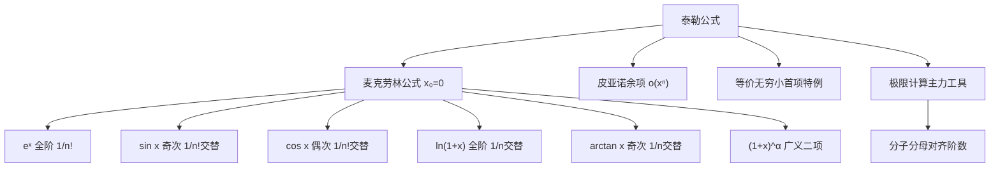

# 泰勒公式汇总（数学一）

> 📌 泰勒公式是用**多项式**来近似任意光滑函数的工具：在 $x = x_0$ 附近，用 $f(x_0), f'(x_0), f''(x_0), \ldots$ 构造出一个多项式，使它在 $x_0$ 处与原函数"吻合到任意阶"。考研数学一最常用的是 $x_0 = 0$ 时的特殊情形，称为**麦克劳林（Maclaurin）公式**。

## 📋 前置知识

- [[导数与高阶导数]] — 泰勒系数由各阶导数决定：$a_n = \dfrac{f^{(n)}(0)}{n!}$
- [[等价无穷小汇总（数学一）]] — 等价无穷小是泰勒展开只取首项的情形，两者紧密关联
- [[极限的概念与运算]] — 泰勒公式最主要的考研用途是计算 $\dfrac{0}{0}$ 型极限

## 🤔 为什么要学泰勒公式？

考研极限题中最难处理的类型是分子（或分母）中含**加减运算**的情形，例如：

$$\lim_{x \to 0} \frac{x - \sin x}{x^3}, \quad \lim_{x \to 0} \frac{e^x - e^{-x} - 2x}{x^3}$$

这类题目不能直接用[[等价无穷小汇总（数学一）|等价无穷小替换]]（替换会消掉有效项），洛必达法则也会越求越复杂。

泰勒公式的解题逻辑是：**把函数展开成多项式，然后"对齐阶数"直接读出极限**。这是考研数学一处理此类题目最优雅、最稳定的方法。

## 🧠 核心概念

### 泰勒公式的一般形式

设 $f(x)$ 在 $x = x_0$ 处有 $n$ 阶导数，则：

$$f(x) = \sum_{k=0}^{n} \frac{f^{(k)}(x_0)}{k!}(x - x_0)^k + R_n(x)$$

其中余项（**皮亚诺余项**，考研中最常用）为：

$$R_n(x) = o\left((x-x_0)^n\right), \quad x \to x_0$$

> 💡 $o\left((x-x_0)^n\right)$ 读作"$x \to x_0$ 时比 $(x-x_0)^n$ 高阶的无穷小"，意思是展开式之后的项都比 $n$ 次项更快地趋于 0，可以忽略。

考研中 $x_0 = 0$，公式变为**麦克劳林公式**：

$$\boxed{f(x) = f(0) + f'(0)x + \frac{f''(0)}{2!}x^2 + \frac{f'''(0)}{3!}x^3 + \cdots + \frac{f^{(n)}(0)}{n!}x^n + o(x^n)}$$

> 🎯 **类比**：把函数想象成一首复杂的乐曲，泰勒展开就是把它分解成一个个简单的"音符"（各阶 $x^n$ 项）。我们保留前几个音符，就得到了曲子的"大致轮廓"，阶数越高，近似越精确。

## 📋 八大常用麦克劳林公式（必背）

以下所有展开均在 $x \to 0$ 时成立。

### 1. 指数函数 $e^x$

$$e^x = 1 + x + \frac{x^2}{2!} + \frac{x^3}{3!} + \frac{x^4}{4!} + \cdots + \frac{x^n}{n!} + o(x^n)$$

规律：所有阶数都有，系数为 $\dfrac{1}{n!}$，全为正。

### 2. 正弦函数 $\sin x$

$$\sin x = x - \frac{x^3}{3!} + \frac{x^5}{5!} - \frac{x^7}{7!} + \cdots + \frac{(-1)^{n-1}x^{2n-1}}{(2n-1)!} + o(x^{2n})$$

规律：只有**奇数次**项，符号交替，首项为 $+x$。

### 3. 余弦函数 $\cos x$

$$\cos x = 1 - \frac{x^2}{2!} + \frac{x^4}{4!} - \frac{x^6}{6!} + \cdots + \frac{(-1)^n x^{2n}}{(2n)!} + o(x^{2n+1})$$

规律：只有**偶数次**项，符号交替，常数项为 $1$。

> 📌 **验证等价无穷小**：$\cos x = 1 - \dfrac{x^2}{2} + O(x^4)$，所以 $1 - \cos x = \dfrac{x^2}{2} + O(x^4) \sim \dfrac{x^2}{2}$，与[[等价无穷小汇总（数学一）]]中的结论一致。

### 4. 自然对数 $\ln(1+x)$

$$\ln(1+x) = x - \frac{x^2}{2} + \frac{x^3}{3} - \frac{x^4}{4} + \cdots + \frac{(-1)^{n-1}x^n}{n} + o(x^n)$$

规律：所有阶数都有，系数为 $\dfrac{1}{n}$（没有阶乘！），符号交替。

### 5. 反正切函数 $\arctan x$

$$\arctan x = x - \frac{x^3}{3} + \frac{x^5}{5} - \frac{x^7}{7} + \cdots + \frac{(-1)^{n-1}x^{2n-1}}{2n-1} + o(x^{2n})$$

规律：只有**奇数次**项，系数为 $\dfrac{1}{2n-1}$，符号交替。与 $\sin x$ 形似但系数不同。

### 6. 幂函数 $(1+x)^\alpha$

$$(1+x)^\alpha = 1 + \alpha x + \frac{\alpha(\alpha-1)}{2!}x^2 + \frac{\alpha(\alpha-1)(\alpha-2)}{3!}x^3 + \cdots$$

特别地，当 $\alpha$ 为正整数时，展开式有限项；当 $\alpha$ 为其他值时，展开式为无穷级数。

**常用特例**：

$$\frac{1}{1+x} = 1 - x + x^2 - x^3 + \cdots = \sum_{n=0}^{\infty}(-1)^n x^n, \quad |x| < 1$$

$$\frac{1}{1-x} = 1 + x + x^2 + x^3 + \cdots = \sum_{n=0}^{\infty} x^n, \quad |x| < 1$$

$$\sqrt{1+x} = 1 + \frac{x}{2} - \frac{x^2}{8} + \cdots$$

$$\frac{1}{\sqrt{1+x}} = 1 - \frac{x}{2} + \frac{3x^2}{8} - \cdots$$

### 7. $\tan x$（考研较少要求背，但要会推）

$$\tan x = x + \frac{x^3}{3} + \frac{2x^5}{15} + \cdots$$

> ⚠️ $\tan x$ 的泰勒系数没有简洁规律，通常用 $\sin x / \cos x$ 做多项式除法或用导数逐项计算。考研中一般只用到三阶：$\tan x \approx x + \dfrac{x^3}{3}$。

### 8. 反正弦函数 $\arcsin x$（数学一有时考）

$$\arcsin x = x + \frac{x^3}{6} + \frac{3x^5}{40} + \cdots$$

> ⚠️ 同样没有简洁的通项，考研中只需记到三阶：$\arcsin x \approx x + \dfrac{x^3}{6}$。

## 💡 关键差异对比表

| 函数 | 展开式（到 $x^3$ 或 $x^4$） | 奇/偶次项 | 系数特点 |
|------|--------------------------|----------|---------|
| $e^x$ | $1+x+\dfrac{x^2}{2}+\dfrac{x^3}{6}+\dfrac{x^4}{24}$ | 都有 | $\dfrac{1}{n!}$ |
| $\sin x$ | $x-\dfrac{x^3}{6}+\dfrac{x^5}{120}$ | 仅奇次 | $\dfrac{1}{n!}$，交替 |
| $\cos x$ | $1-\dfrac{x^2}{2}+\dfrac{x^4}{24}$ | 仅偶次 | $\dfrac{1}{n!}$，交替 |
| $\ln(1+x)$ | $x-\dfrac{x^2}{2}+\dfrac{x^3}{3}-\dfrac{x^4}{4}$ | 都有 | $\dfrac{1}{n}$，交替 |
| $\arctan x$ | $x-\dfrac{x^3}{3}+\dfrac{x^5}{5}$ | 仅奇次 | $\dfrac{1}{2n-1}$，交替 |
| $\tan x$ | $x+\dfrac{x^3}{3}+\dfrac{2x^5}{15}$ | 仅奇次 | 无规律 |
| $\arcsin x$ | $x+\dfrac{x^3}{6}+\dfrac{3x^5}{40}$ | 仅奇次 | 无规律 |

> 💡 **记忆技巧**：$\sin x$ 和 $\arctan x$ 都只有奇次项，但 $\sin x$ 的系数有阶乘（$\dfrac{1}{n!}$），$\arctan x$ 没有（$\dfrac{1}{n}$）。这是两者最容易混淆的地方。

## 🔧 考研解题步骤：用泰勒公式求极限

**核心策略**：展开到"分母的阶数"为止，对齐后直接读结果。

**步骤**：
1. 判断分母（或整体）是几阶无穷小，记为 $k$ 阶
2. 把分子中每个函数展开到第 $k$ 阶（含余项 $o(x^k)$）
3. 展开后合并同类项，保留最低阶非零项
4. 用最低阶项除以分母，取极限

### 例题 1：$\lim_{x \to 0} \dfrac{x - \sin x}{x^3}$

分母是 $x^3$，三阶。展开 $\sin x$ 到三阶：

$$\sin x = x - \frac{x^3}{6} + o(x^3)$$

$$x - \sin x = x - \left(x - \frac{x^3}{6} + o(x^3)\right) = \frac{x^3}{6} + o(x^3)$$

$$\lim_{x \to 0} \frac{x - \sin x}{x^3} = \lim_{x \to 0} \frac{\frac{x^3}{6} + o(x^3)}{x^3} = \frac{1}{6}$$

### 例题 2：$\lim_{x \to 0} \dfrac{e^x + e^{-x} - 2}{x^2}$

分母二阶，展开 $e^x$ 和 $e^{-x}$ 到二阶：

$$e^x = 1 + x + \frac{x^2}{2} + o(x^2)$$

$$e^{-x} = 1 - x + \frac{x^2}{2} + o(x^2)$$

$$e^x + e^{-x} - 2 = \left(1+x+\frac{x^2}{2}\right) + \left(1-x+\frac{x^2}{2}\right) - 2 + o(x^2) = x^2 + o(x^2)$$

$$\lim_{x \to 0} \frac{e^x + e^{-x} - 2}{x^2} = 1$$

### 例题 3：$\lim_{x \to 0} \dfrac{\sin x - x\cos x}{x^3}$

分母三阶，展开 $\sin x$ 和 $x\cos x$ 到三阶：

$$\sin x = x - \frac{x^3}{6} + o(x^3)$$

$$\cos x = 1 - \frac{x^2}{2} + o(x^3)$$

$$x\cos x = x\left(1 - \frac{x^2}{2}\right) + o(x^3) = x - \frac{x^3}{2} + o(x^3)$$

$$\sin x - x\cos x = \left(x - \frac{x^3}{6}\right) - \left(x - \frac{x^3}{2}\right) + o(x^3) = \frac{x^3}{3} + o(x^3)$$

$$\lim_{x \to 0} \frac{\sin x - x\cos x}{x^3} = \frac{1}{3}$$

## ⚠️ 常见误区与踩坑点

> ❌ **误区 1：展开阶数不够，导致分子为 0**
>
> 分母是 $x^3$，就必须把分子展开到 $x^3$ 项为止。如果只展开到 $x^2$，分子可能消成 0，看起来"极限为 0"，实际上是展开不足。**原则：分子的展开阶数 ≥ 分母阶数**。

> ⚠️ **踩坑 2：余项 $o(x^n)$ 的处理**
>
> $o(x^3) + o(x^3) = o(x^3)$（两个高阶小量之和还是高阶小量），$x \cdot o(x^2) = o(x^3)$（乘以 $x$ 后阶数提升）。不要把余项当作普通项参与计算，也不要把它省略成"无"——它始终存在，只是最后极限时消失了。

> ⚠️ **踩坑 3：$\ln(1+x)$ 与 $e^x - 1$ 的系数混淆**
>
> $\ln(1+x) = x - \dfrac{x^2}{2} + \dfrac{x^3}{3} - \cdots$，系数是 $\dfrac{1}{n}$（无阶乘）。
>
> $e^x - 1 = x + \dfrac{x^2}{2} + \dfrac{x^3}{6} + \cdots$，系数是 $\dfrac{1}{n!}$（有阶乘）。
>
> 两者首项都是 $x$，但二阶系数一个是 $-\dfrac{1}{2}$，一个是 $+\dfrac{1}{2}$，符号和有无阶乘都不同。

> ⚠️ **踩坑 4：$1-\cos x$ 和 $\cos x - 1$ 的符号**
>
> $1 - \cos x = \dfrac{x^2}{2} - \dfrac{x^4}{24} + \cdots$（正号开头）
>
> $\cos x - 1 = -\dfrac{x^2}{2} + \dfrac{x^4}{24} - \cdots$（负号开头）
>
> 符号搞反，整道题的正负都会反。

## 🏋️ 动手练习

### 练习 1：直接用公式（⭐）

**题目**：求 $\lim_{x \to 0} \dfrac{\ln(1+x) - x}{x^2}$

**参考答案**：

$\ln(1+x) = x - \dfrac{x^2}{2} + o(x^2)$

$\ln(1+x) - x = -\dfrac{x^2}{2} + o(x^2)$

$$\lim_{x \to 0} \frac{\ln(1+x) - x}{x^2} = -\frac{1}{2}$$

### 练习 2：多函数组合（⭐⭐）

**题目**：求 $\lim_{x \to 0} \dfrac{\cos x - e^{-x^2/2}}{x^4}$

**参考答案**：

展开到 $x^4$ 阶：

$$\cos x = 1 - \frac{x^2}{2} + \frac{x^4}{24} + o(x^4)$$

$$e^{-x^2/2} = 1 + \left(-\frac{x^2}{2}\right) + \frac{\left(-\frac{x^2}{2}\right)^2}{2} + o(x^4) = 1 - \frac{x^2}{2} + \frac{x^4}{8} + o(x^4)$$

$$\cos x - e^{-x^2/2} = \frac{x^4}{24} - \frac{x^4}{8} + o(x^4) = -\frac{x^4}{12} + o(x^4)$$

$$\lim_{x \to 0} \frac{\cos x - e^{-x^2/2}}{x^4} = -\frac{1}{12}$$

### 练习 3：确定参数（⭐⭐⭐）

**题目**：设 $\lim_{x \to 0} \dfrac{e^x - (ax^2 + bx + 1)}{x^2} = 2$，求 $a, b$ 的值。

**参考答案**：

$e^x = 1 + x + \dfrac{x^2}{2} + o(x^2)$

$$e^x - (ax^2 + bx + 1) = (1-b)x + \left(\frac{1}{2}-a\right)x^2 + o(x^2)$$

要使极限存在且等于 2（分母是 $x^2$），分子中 $x^1$ 项系数必须为 0，否则极限为 $\pm \infty$。

因此：$1 - b = 0 \Rightarrow b = 1$

$$\lim_{x \to 0} \frac{\left(\frac{1}{2}-a\right)x^2 + o(x^2)}{x^2} = \frac{1}{2} - a = 2$$

$$\Rightarrow a = -\frac{3}{2}$$

## 📝 总结

### 本篇要点回顾

1. 泰勒公式的核心思想：用多项式近似函数，阶数越高越精确。
2. 考研必背的展开：$e^x$、$\sin x$、$\cos x$、$\ln(1+x)$、$\arctan x$、$(1+x)^\alpha$，至少背到四阶。
3. 解题步骤：**判断分母阶数 → 展开到该阶 → 合并同类项 → 取极限**。
4. $\sin x$、$\tan x$、$\arcsin x$、$\arctan x$ 都只有奇次项，但系数不同，注意区分。
5. 等价无穷小是泰勒展开只取首项：两者是一对工具，加减用泰勒，乘除用等价。

### 知识图谱

## 🔗 相关链接

- 上级概念：[[极限的计算方法]]
- 同级概念：[[等价无穷小汇总（数学一）]]、[[洛必达法则]]
- 下级概念：[[幂级数与函数展开]]（数三/物理系更常用）
- 实际应用：[[考研数学一真题极限专题]]

## 📚 参考资料

- 张宇《高等数学 18 讲》— 第一讲，泰勒公式求极限讲解极为详细
- 李永乐《数学复习全书》— 泰勒公式应用例题丰富
- 武忠祥《考研数学辅导讲义》— 对"展开阶数如何选"有专门讨论
