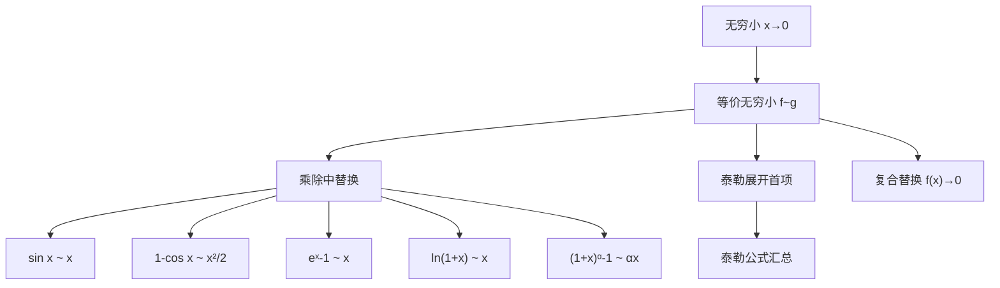

# 等价无穷小汇总（数学一）

> 📌 当 $x \to 0$ 时，如果两个无穷小之比的极限等于 1，则称它们是**等价无穷小**，记作 $f(x) \sim g(x)$。在求极限时，可以用等价无穷小替换乘除因子，从而化简计算。

## 📋 前置知识

在开始之前，你需要了解这些概念：

- [[极限的概念与运算]] — 等价无穷小本质上是极限等于 1 的特殊情形
- [[无穷小与无穷大]] — 无穷小是极限为 0 的量，等价无穷小是"同阶且比值为 1"的无穷小

## 🤔 为什么要用等价无穷小？

直接求 $\lim_{x \to 0} \dfrac{\sin x - \tan x}{x^3}$ 如果硬算，需要通分、展开，步骤繁琐。

但如果你知道 $\sin x \sim x$、$\tan x \sim x$，你能 **不能** 直接替换得到 $\dfrac{x - x}{x^3} = 0$？

**不能！** 这是最大的坑。等价无穷小只能替换**乘除**关系中的因子，**加减结构中绝对不能随便替换**——因为等价无穷小替换的误差项恰好在加减时被放大。

正确做法是用[[泰勒公式汇总（数学一）]]展开到足够高阶。这也说明两者相辅相成：等价无穷小处理乘除，泰勒公式处理加减。

## 🧠 核心公式表

### 基本型（$x \to 0$ 时）

| 等价关系 | 备注 |
|----------|------|
| $\sin x \sim x$ | 最基础，必背 |
| $\tan x \sim x$ | 注意和 $\sin x$ 同阶 |
| $\arcsin x \sim x$ | $\sin$ 的反函数，对称 |
| $\arctan x \sim x$ | $\tan$ 的反函数，对称 |
| $1 - \cos x \sim \dfrac{x^2}{2}$ | ⭐ 高频，注意是**二阶**无穷小 |
| $\cos x - 1 \sim -\dfrac{x^2}{2}$ | 上式的变形，符号为负 |
| $e^x - 1 \sim x$ | 指数函数展开首项 |
| $a^x - 1 \sim x \ln a$ | $e^x - 1$ 的推广，$a > 0$ 且 $a \neq 1$ |
| $\ln(1+x) \sim x$ | 对数函数展开首项 |
| $(1+x)^\alpha - 1 \sim \alpha x$ | 幂函数，$\alpha$ 为任意常数 |
| $\sqrt[n]{1+x} - 1 \sim \dfrac{x}{n}$ | 上式取 $\alpha = \dfrac{1}{n}$ 的特例 |
| $1 - \cos^n x \sim \dfrac{n}{2} x^2$ | 复合型，$1-\cos x$ 的推广 |

### 高阶替换（加减结构优先用泰勒，但乘除中可用）

| 等价关系 | 精确到几阶 |
|----------|-----------|
| $x - \sin x \sim \dfrac{x^3}{6}$ | 三阶 |
| $\tan x - x \sim \dfrac{x^3}{3}$ | 三阶 |
| $\arcsin x - x \sim \dfrac{x^3}{6}$ | 三阶 |
| $x - \arctan x \sim \dfrac{x^3}{3}$ | 三阶 |
| $x - \ln(1+x) \sim \dfrac{x^2}{2}$ | 二阶 |
| $e^x - 1 - x \sim \dfrac{x^2}{2}$ | 二阶 |
| $1 - \cos x - \dfrac{x^2}{2} \sim -\dfrac{x^4}{24}$ | 四阶（少见） |

### 复合替换技巧

当自变量不是 $x$ 而是 $f(x) \to 0$ 时，直接用 $f(x)$ 替换 $x$ 即可。例如：

$$\sin(x^2) \sim x^2 \quad (x \to 0)$$

$$e^{x^2} - 1 \sim x^2 \quad (x \to 0)$$

$$1 - \cos(2x) \sim \frac{(2x)^2}{2} = 2x^2 \quad (x \to 0)$$

> 🎯 **关键原则**：括号里的整体趋近于 0，就把整体视为"新的 $x$"代入公式。

## ⚠️ 使用规则与常见误区

> ❌ **误区 1：在加减中直接替换**
>
> 错误写法：$\lim_{x \to 0} \dfrac{\sin x - x}{x^3}$ 中用 $\sin x \sim x$ 替换，得 $\dfrac{x - x}{x^3} = \dfrac{0}{x^3}$，然后说极限为 0。
>
> **实际答案是** $-\dfrac{1}{6}$。等价无穷小替换只保留了最低阶项，加减中的"差"恰好消掉了最低阶，必须用泰勒展开到更高阶。

> ✅ **正确规则：只在乘除因子中替换**
>
> 如果极限式的结构是 $\dfrac{f(x) \cdot A(x)}{g(x) \cdot B(x)}$，其中 $f(x) \sim f_1(x)$，$g(x) \sim g_1(x)$，则可以替换：
>
> $$\lim \frac{f(x) \cdot A(x)}{g(x) \cdot B(x)} = \lim \frac{f_1(x) \cdot A(x)}{g_1(x) \cdot B(x)}$$

> ⚠️ **踩坑 2：忘记 $1 - \cos x$ 是二阶**
>
> $1 - \cos x \sim \dfrac{x^2}{2}$ 而不是 $\sim x$！很多同学在分母里看到 $1 - \cos x$ 时误认为它是一阶，导致阶数判断错误。

> ⚠️ **踩坑 3：$\ln(1+x) \sim x$ 的使用范围**
>
> 必须是 $x \to 0$，整体趋于 0。如果是 $\ln(1 + \sin x)$，当 $x \to 0$ 时 $\sin x \to 0$，可以替换为 $\sin x$，再用 $\sin x \sim x$，最终 $\ln(1+\sin x) \sim x$。

## 🔄 等价无穷小与[[泰勒公式汇总（数学一）]]的关系

| 场景 | 推荐工具 | 原因 |
|------|---------|------|
| 分子分母都是乘积/幂次 | 等价无穷小替换 | 快速简洁 |
| 分子或分母含加减，相减结果趋于 0 | 泰勒公式展开 | 等价替换会丢失信息 |
| 不确定型需要精确阶数 | 泰勒公式 | 可以控制展开到任意阶 |
| 需要求高阶导数/麦克劳林系数 | 泰勒公式 | 等价替换只给最低阶 |

> 💡 **一句话总结**：等价无穷小是泰勒展开只取首项的特殊情形。加减用泰勒，乘除用等价，是处理 $\frac{0}{0}$ 型极限的黄金组合。

## 🏋️ 动手练习

### 练习 1：基础替换（⭐）

**题目**：求 $\lim_{x \to 0} \dfrac{\tan(3x)}{\sin(2x)}$

**参考答案**：

当 $x \to 0$ 时，$\tan(3x) \sim 3x$，$\sin(2x) \sim 2x$，因此：

$$\lim_{x \to 0} \frac{\tan(3x)}{\sin(2x)} = \lim_{x \to 0} \frac{3x}{2x} = \frac{3}{2}$$

### 练习 2：复合替换（⭐⭐）

**题目**：求 $\lim_{x \to 0} \dfrac{e^{x^2} - 1}{1 - \cos x}$

**参考答案**：

当 $x \to 0$ 时，$e^{x^2} - 1 \sim x^2$，$1 - \cos x \sim \dfrac{x^2}{2}$，因此：

$$\lim_{x \to 0} \frac{e^{x^2}-1}{1-\cos x} = \lim_{x \to 0} \frac{x^2}{\dfrac{x^2}{2}} = 2$$

### 练习 3：加减结构（⭐⭐⭐，等价替换的陷阱）

**题目**：求 $\lim_{x \to 0} \dfrac{1 - \cos x - \frac{x^2}{2}}{x^4}$（提示：需要泰勒展开到四阶）

**参考答案**：

$\cos x$ 的麦克劳林展开为：

$$\cos x = 1 - \frac{x^2}{2} + \frac{x^4}{24} - \cdots$$

因此：

$$1 - \cos x - \frac{x^2}{2} = \frac{x^4}{24} + O(x^6)$$

$$\lim_{x \to 0} \frac{1-\cos x - \frac{x^2}{2}}{x^4} = \lim_{x \to 0} \frac{\frac{x^4}{24}}{x^4} = \frac{1}{24}$$

这道题如果用等价无穷小替换 $1 - \cos x \sim \dfrac{x^2}{2}$，分子就变成 $0$，完全丢失了有效信息。

## 📝 总结

### 本篇要点回顾

1. 等价无穷小本质是"在趋于 0 的过程中，比值趋于 1"的两个量可以互相替换。
2. **只能在乘除中替换**，加减中会丢失高阶信息，导致错误结果。
3. $1 - \cos x \sim \dfrac{x^2}{2}$ 是**二阶**无穷小，是考研最容易出错的公式。
4. 复合结构（如 $\sin(f(x))$）：只要整体 $f(x) \to 0$，直接把 $f(x)$ 当作新变量代入。
5. 加减结构请使用[[泰勒公式汇总（数学一）]]，两者配合使用才能应对所有情形。

### 知识图谱

## 🔗 相关链接

- 上级概念：[[极限的计算方法]]
- 同级概念：[[泰勒公式汇总（数学一）]]、[[洛必达法则]]
- 下级概念：[[无穷小的阶与比较]]
- 实际应用：[[考研数学一真题极限专题]]

## 📚 参考资料

- 张宇《高等数学 18 讲》— 第一讲极限部分，等价无穷小列表最全面
- 李永乐《数学复习全书》— 例题覆盖等价替换的各类陷阱
