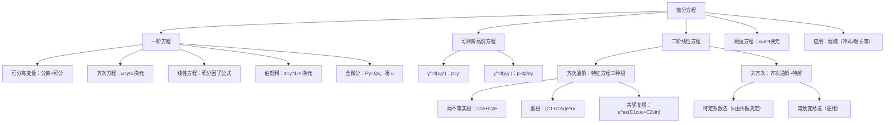

> 📌 微分方程是描述"变化规律"的方程——已知量的变化率（导数），求量本身。物理、工程、经济中绝大多数动态模型都是微分方程。考研中微分方程是计算题的重要来源。

---

## 📋 前置知识

- [[高等数学 第四章：不定积分]] — 求解微分方程的核心步骤就是积分，各种积分技巧在这里全部用到
- [[高等数学 第二章：导数与微分]] — 理解方程中 $y'$、$y''$ 的含义；分离变量后凑微分
- [[高等数学 第六章：多元函数微积分]] — 全微分方程需要用到全微分的概念

---

## 🤔 为什么需要微分方程？

牛顿第二定律 $F = ma = m\dfrac{d^2x}{dt^2}$ 就是一个微分方程——它告诉我们力与加速度的关系，但要知道物体的位置 $x(t)$，必须"解"这个方程。

人口增长模型 $\dfrac{dN}{dt} = rN$（增长率正比于当前人口），RC 电路方程，热传导方程……这些都是微分方程。微分方程是数学与现实世界之间最重要的桥梁之一。

---

## 🧠 第一节：基本概念

### 1.1 微分方程的定义

含有未知函数及其导数的方程称为**微分方程**。若未知函数只是一个自变量的函数，称为**常微分方程**（ODE）。

**阶**：方程中出现的最高阶导数的阶数。

$$y' + P(x)y = Q(x) \quad \text{（一阶）}$$

$$y'' + p(x)y' + q(x)y = f(x) \quad \text{（二阶）}$$

### 1.2 解的概念

**通解**：含有任意常数（个数等于方程阶数）的解。

**特解**：由初始条件确定了任意常数后的解。

**初值问题**：

$$y' = f(x, y), \quad y(x_0) = y_0$$

> ⚠️ **通解不一定包含所有解**：有些方程存在不包含在通解中的**奇解**（例如克莱罗方程），考研中需注意检验。

---

## 🧠 第二节：一阶微分方程

### 2.1 可分离变量方程

**形式**：$\dfrac{dy}{dx} = f(x) \cdot g(y)$

**方法**：将含 $y$ 的项移到左边，含 $x$ 的项移到右边，两边积分：

$$\frac{dy}{g(y)} = f(x)\,dx \implies \int \frac{dy}{g(y)} = \int f(x)\,dx$$

> 🎯 **类比**：就像把一个方程"按变量分家"——$x$ 家族的住左边，$y$ 家族的住右边，然后双方各自积分。

**示例**：$\dfrac{dy}{dx} = xy$

$$\frac{dy}{y} = x\,dx \implies \ln|y| = \frac{x^2}{2} + C_1 \implies y = Ce^{x^2/2} \quad (C \neq 0)$$

> ⚠️ **踩坑**：分离变量时若 $g(y_0) = 0$，则 $y = y_0$（常数）也是一个解，需单独验证是否包含在通解中（代入 $C$ 取特殊值是否能得到）。

### 2.2 齐次方程

**形式**：$\dfrac{dy}{dx} = \varphi\!\left(\dfrac{y}{x}\right)$（方程右边是 $\dfrac{y}{x}$ 的函数）

**方法**：令 $u = \dfrac{y}{x}$，即 $y = ux$，则 $y' = u + xu'$，代入方程：

$$u + xu' = \varphi(u) \implies x\frac{du}{dx} = \varphi(u) - u$$

这又变成可分离变量方程：$\dfrac{du}{\varphi(u)-u} = \dfrac{dx}{x}$，两边积分。

**识别技巧**：将方程右边的 $f(x, y)$ 中 $x$ 和 $y$ 同时换成 $tx$ 和 $ty$，若结果不变（即 $f(tx, ty) = f(x, y)$），则是齐次方程。

### 2.3 一阶线性方程

**形式**：$y' + P(x)y = Q(x)$

- $Q(x) = 0$：**齐次线性方程**（可分离变量）
- $Q(x) \neq 0$：**非齐次线性方程**

**通解公式**（积分因子法）：

$$y = e^{-\int P(x)\,dx}\!\left[\int Q(x)e^{\int P(x)\,dx}\,dx + C\right]$$

> 🎯 **记忆方法**：积分因子 $\mu = e^{\int P\,dx}$，两边同乘 $\mu$，左边恰好凑成 $(\mu y)'$，右边积分，除以 $\mu$。

**推导思路**（不要死记公式，理解推导）：

两边乘以 $e^{\int P\,dx}$：

$$e^{\int P\,dx} y' + P e^{\int P\,dx} y = Q e^{\int P\,dx}$$

左边是 $\left(y \cdot e^{\int P\,dx}\right)'$，故：

$$\left(y e^{\int P\,dx}\right)' = Q e^{\int P\,dx}$$

两边积分，再除以 $e^{\int P\,dx}$，得通解公式。

**示例**：$y' - \dfrac{2y}{x} = x^2$

$P(x) = -\dfrac{2}{x}$，$Q(x) = x^2$

$$e^{\int P\,dx} = e^{-2\ln|x|} = x^{-2}$$

$$y = x^2\!\left[\int x^2 \cdot x^{-2}\,dx + C\right] = x^2\!\left[x + C\right] = x^3 + Cx^2$$

### 2.4 伯努利方程

**形式**：$y' + P(x)y = Q(x)y^n$（$n \neq 0, 1$）

**方法**：令 $z = y^{1-n}$，方程化为关于 $z$ 的一阶线性方程：

$$z' + (1-n)P(x)z = (1-n)Q(x)$$

> 💡 **推导**：两边除以 $y^n$，得 $y^{-n}y' + P(x)y^{1-n} = Q(x)$。注意 $(y^{1-n})' = (1-n)y^{-n}y'$，令 $z = y^{1-n}$ 即可。

### 2.5 全微分方程

**形式**：$P(x,y)\,dx + Q(x,y)\,dy = 0$

若 $\dfrac{\partial P}{\partial y} = \dfrac{\partial Q}{\partial x}$，则方程是**全微分方程**，存在 $u(x,y)$ 使 $du = P\,dx + Q\,dy$，通解为 $u(x,y) = C$。

**求 $u$ 的方法（凑原函数）**：

$$u(x,y) = \int_{x_0}^x P(x,y_0)\,dx + \int_{y_0}^y Q(x,y)\,dy$$

或用偏积分法：先对 $x$ 积分（视 $y$ 为常数）：$u = \int P\,dx + \varphi(y)$，再对 $y$ 求偏导与 $Q$ 比较，确定 $\varphi(y)$。

---

## 🧠 第三节：可降阶的高阶方程

### 3.1 $y^{(n)} = f(x)$ 型

直接逐次积分 $n$ 次，每次引入一个任意常数。

$$y'' = \sin x \implies y' = -\cos x + C_1 \implies y = -\sin x + C_1 x + C_2$$

### 3.2 $y'' = f(x, y')$ 型（不显含 $y$）

令 $p = y'$，则 $y'' = p'$，方程化为关于 $p$ 和 $x$ 的一阶方程：

$$p' = f(x, p)$$

解出 $p(x)$ 后再积分得 $y$。

### 3.3 $y'' = f(y, y')$ 型（不显含 $x$）

令 $p = y'$，则 $y'' = \dfrac{dp}{dx} = \dfrac{dp}{dy}\cdot\dfrac{dy}{dx} = p\dfrac{dp}{dy}$，方程化为：

$$p\frac{dp}{dy} = f(y, p)$$

解出 $p(y)$ 后，再由 $\dfrac{dy}{dx} = p(y)$ 分离变量积分得 $y$。

> ⚠️ **踩坑**：不显含 $x$ 型，$y'' \neq p'(x)$，而是 $y'' = p\dfrac{dp}{dy}$，这个换元是考研中最容易出错的地方。

---

## 🧠 第四节：二阶线性微分方程

### 4.1 二阶线性方程的结构

**标准形式**：$y'' + p(x)y' + q(x)y = f(x)$

- $f(x) = 0$：**齐次方程** $y'' + p(x)y' + q(x)y = 0$
- $f(x) \neq 0$：**非齐次方程**

**叠加原理**：
- 齐次方程的任意两个解 $y_1$、$y_2$ 的线性组合 $C_1y_1 + C_2y_2$ 也是解
- 若 $y_1$、$y_2$ **线性无关**（$\dfrac{y_1}{y_2} \neq$ 常数），则 $y = C_1y_1 + C_2y_2$ 是齐次方程的**通解**
- 非齐次方程的通解 $= $ 齐次通解 $+$ 非齐次特解：$y = C_1y_1 + C_2y_2 + y^*$

### 4.2 二阶常系数齐次线性方程

**形式**：$y'' + py' + qy = 0$（$p, q$ 为常数）

**特征方程**：$r^2 + pr + q = 0$

**特征根与通解**：

| 特征根情况 | 通解 |
|-----------|------|
| 两个不等实根 $r_1 \neq r_2$ | $y = C_1 e^{r_1 x} + C_2 e^{r_2 x}$ |
| 两个相等实根 $r_1 = r_2 = r$ | $y = (C_1 + C_2 x)e^{rx}$ |
| 一对共轭复根 $r = \alpha \pm \beta i$ | $y = e^{\alpha x}(C_1\cos\beta x + C_2\sin\beta x)$ |

> 🎯 **类比**：特征方程就是"解码器"——把微分方程翻译成代数方程，代数方程的根直接告诉我们解的形式。

> ⚠️ **踩坑：重根时通解**：若 $r_1 = r_2 = r$，通解不是 $C_1e^{rx} + C_2e^{rx} = Ce^{rx}$（这只有一个任意常数，不是通解！），正确是 $(C_1+C_2x)e^{rx}$。

### 4.3 二阶常系数非齐次线性方程

**形式**：$y'' + py' + qy = f(x)$

**方法**：通解 $=$ 对应齐次方程的通解 $+$ 非齐次方程的一个特解 $y^*$。

关键是用**待定系数法**求特解 $y^*$：

**类型一**：$f(x) = e^{\lambda x} P_m(x)$（$P_m$ 是 $m$ 次多项式）

设特解 $y^* = x^k e^{\lambda x} Q_m(x)$，其中 $Q_m(x)$ 是 $m$ 次多项式，$k$ 的取值：

$$k = \begin{cases} 0, & \lambda \text{ 不是特征根} \\ 1, & \lambda \text{ 是单特征根} \\ 2, & \lambda \text{ 是二重特征根} \end{cases}$$

**类型二**：$f(x) = e^{\lambda x}[P_m(x)\cos\beta x + P_n(x)\sin\beta x]$

设特解 $y^* = x^k e^{\lambda x}[R_l(x)\cos\beta x + S_l(x)\sin\beta x]$，其中 $l = \max(m, n)$，$k$ 取值：

$$k = \begin{cases} 0, & \lambda \pm \beta i \text{ 不是特征根} \\ 1, & \lambda \pm \beta i \text{ 是特征根} \end{cases}$$

> 💡 **核心逻辑**：特解的形式由右端函数 $f(x)$ 决定，若 $f(x)$ 中的"频率"恰好与齐次方程的特征根"共振"，则需要乘以 $x^k$ 来避免与齐次解重复。

### 4.4 常数变易法（求特解的通用方法）

对一阶线性方程 $y' + P(x)y = Q(x)$，先解齐次得 $y = Ce^{-\int P\,dx}$，再将 $C$ 换成待定函数 $C(x)$，代入原方程确定 $C(x)$，即可得特解。

对二阶方程，已知齐次通解 $y = C_1y_1 + C_2y_2$，设特解 $y^* = C_1(x)y_1 + C_2(x)y_2$，联立方程组：

$$\begin{cases} C_1'(x)y_1 + C_2'(x)y_2 = 0 \\ C_1'(x)y_1' + C_2'(x)y_2' = f(x) \end{cases}$$

解出 $C_1'(x)$、$C_2'(x)$ 后积分，得 $C_1(x)$、$C_2(x)$（不加常数），则 $y^* = C_1(x)y_1 + C_2(x)y_2$。

---

## 🧠 第五节：欧拉方程

**形式**：$x^2y'' + pxy' + qy = f(x)$（$p, q$ 为常数）

**方法**：令 $x = e^t$（即 $t = \ln x$，$x > 0$），则：

$$xy' = \frac{dy}{dt} \triangleq Dy, \quad x^2y'' = D(D-1)y$$

其中 $D = \dfrac{d}{dt}$，方程化为常系数线性方程：

$$[D(D-1) + pD + q]y = f(e^t)$$

即 $y'' + (p-1)y' + qy = f(e^t)$（对 $t$ 的方程），再用常系数方程的方法求解，最后将 $t = \ln x$ 代回。

---

## 🧠 第六节：微分方程的应用

### 6.1 建模思路

1. **分析变化规律**：根据题意，写出"变化率 $=$ 某个表达式"
2. **列方程**：用导数表达变化率
3. **求解方程**：用上述方法求通解
4. **确定特解**：代入初始条件

**常见模型**：

| 模型 | 方程 | 解 |
|------|------|---|
| 指数增长/衰减 | $\dfrac{dy}{dt} = ky$ | $y = y_0 e^{kt}$ |
| 牛顿冷却定律 | $\dfrac{dT}{dt} = k(T - T_\infty)$ | $T - T_\infty = Ce^{kt}$ |
| RC 电路 | $RC\dfrac{dU}{dt} + U = E$ | $U = E + Ce^{-t/(RC)}$ |
| 逻辑斯谛增长 | $\dfrac{dN}{dt} = rN\!\left(1-\dfrac{N}{K}\right)$ | $S$ 形曲线 |

---

## 💻 代码验证

```python
import sympy as sp

x = sp.Symbol('x')
y = sp.Function('y')

# ---- 可分离变量方程 ----
print("=== 可分离变量方程 ===")
# y' = xy
ode1 = sp.Eq(y(x).diff(x), x * y(x))
sol1 = sp.dsolve(ode1)
print(f"y' = xy 的通解: {sol1}")

print()

# ---- 一阶线性方程 ----
print("=== 一阶线性方程 ===")
# y' - 2y/x = x^2
ode2 = sp.Eq(y(x).diff(x) - 2*y(x)/x, x**2)
sol2 = sp.dsolve(ode2)
print(f"y' - 2y/x = x² 的通解: {sol2}")

print()

# ---- 二阶常系数齐次方程 ----
print("=== 二阶常系数方程 ===")
# y'' - 3y' + 2y = 0，特征根 r=1, r=2
ode3 = sp.Eq(y(x).diff(x,2) - 3*y(x).diff(x) + 2*y(x), 0)
sol3 = sp.dsolve(ode3)
print(f"y'' - 3y' + 2y = 0 的通解: {sol3}")

# y'' + 2y' + 5y = 0，特征根 r = -1 ± 2i
ode4 = sp.Eq(y(x).diff(x,2) + 2*y(x).diff(x) + 5*y(x), 0)
sol4 = sp.dsolve(ode4)
print(f"y'' + 2y' + 5y = 0 的通解: {sol4}")

# y'' - 2y' + y = 0，重根 r=1
ode5 = sp.Eq(y(x).diff(x,2) - 2*y(x).diff(x) + y(x), 0)
sol5 = sp.dsolve(ode5)
print(f"y'' - 2y' + y = 0 的通解: {sol5}")

print()

# ---- 二阶常系数非齐次 ----
print("=== 二阶非齐次方程 ===")
# y'' - 3y' + 2y = e^x（lambda=1 是单特征根，k=1）
ode6 = sp.Eq(y(x).diff(x,2) - 3*y(x).diff(x) + 2*y(x), sp.exp(x))
sol6 = sp.dsolve(ode6)
print(f"y'' - 3y' + 2y = e^x 的通解: {sol6}")

# y'' + y = sin(x)（共振情形，lambda±i = ±i 是特征根）
ode7 = sp.Eq(y(x).diff(x,2) + y(x), sp.sin(x))
sol7 = sp.dsolve(ode7)
print(f"y'' + y = sin(x) 的通解: {sol7}")
```

```bash
python3 chapter7_ode.py
```

**预期输出**：

```text
=== 可分离变量方程 ===
y' = xy 的通解: Eq(y(x), C1*exp(x**2/2))

=== 一阶线性方程 ===
y' - 2y/x = x² 的通解: Eq(y(x), x**2*(C1 + x))

=== 二阶常系数方程 ===
y'' - 3y' + 2y = 0 的通解: Eq(y(x), C1*exp(x) + C2*exp(2*x))
y'' + 2y' + 5y = 0 的通解: Eq(y(x), (C1*sin(2*x) + C2*cos(2*x))*exp(-x))
y'' - 2y' + y = 0 的通解: Eq(y(x), (C1 + C2*x)*exp(x))

=== 二阶非齐次方程 ===
y'' - 3y' + 2y = e^x 的通解: Eq(y(x), (C1 + C2*exp(x) - x)*exp(x))
y'' + y = sin(x) 的通解: Eq(y(x), C1*sin(x) + C2*cos(x) - x*cos(x)/2)
```

---

## ⚠️ 常见误区与踩坑点

> ❌ **误区 1：可分离变量方程分离后忘记讨论 $g(y)=0$ 的情形**
> 分离变量时要求 $g(y) \neq 0$。需单独验证 $g(y)=0$ 对应的常数解是否满足原方程，以及是否已包含在通解中。

> ⚠️ **踩坑 2：一阶线性方程通解公式中 $\int P\,dx$ 不加常数**
> 通解公式 $e^{-\int P\,dx}$ 中的积分是不定积分，但在计算积分因子时取其一个原函数即可（不加 $C$），加了 $C$ 会产生多余的系数，最终被 $C_1$ 吸收，但过程会更混乱。

> ❌ **误区 3：重特征根的通解只写 $Ce^{rx}$**
> 重根 $r_1 = r_2 = r$ 的通解是 $(C_1 + C_2 x)e^{rx}$，必须含有 $xe^{rx}$ 项，否则只有一个独立解，不是完整通解。

> ⚠️ **踩坑 3：待定系数法 $k$ 的确定忘记看 $\lambda$ 是否为特征根**
> $f(x) = e^{\lambda x}P_m(x)$ 型特解中，$k$ 不是固定的，要根据 $\lambda$ 与特征根的关系决定。最常见的错误是 $\lambda$ 恰好是特征根时仍设 $k=0$，导致待定系数无解。

> ⚠️ **踩坑 4：不显含 $x$ 的方程中 $y''$ 的换元错误**
> $y'' = f(y, y')$ 型，令 $p = y'$，则 $y'' = p\dfrac{dp}{dy}$，**不是** $\dfrac{dp}{dx}$。混淆这两种情形是高频失误。

> ❌ **误区 4：非齐次方程通解 $=$ 两个特解之和**
> 非齐次方程通解 $=$ **齐次通解** $+$ 非齐次**特解**，而不是两个非齐次特解之和（两个非齐次特解之差才是齐次方程的解）。

> ⚠️ **踩坑 5：欧拉方程换元后对 $t$ 求导忘记链式法则**
> $x = e^t$ 后，$\dfrac{dy}{dx} = \dfrac{1}{x}\dfrac{dy}{dt}$ 而不是 $\dfrac{dy}{dt}$，整理时要特别小心因子 $\dfrac{1}{x}$。

---

## 🔄 方程类型与解法速查

| 方程类型 | 识别特征 | 解法 |
|---------|---------|------|
| 可分离变量 | $y' = f(x)g(y)$ | 分离变量，两边积分 |
| 齐次方程 | $y' = \varphi(y/x)$ | 令 $u = y/x$，化为可分离 |
| 一阶线性 | $y' + P(x)y = Q(x)$ | 积分因子公式 |
| 伯努利方程 | $y' + Py = Qy^n$ | 令 $z = y^{1-n}$，化为线性 |
| 全微分方程 | $P\,dx+Q\,dy=0$，$P_y=Q_x$ | 凑原函数 $u$，解 $u=C$ |
| $y^{(n)}=f(x)$ | 仅含最高阶导数 | 逐次积分 |
| $y''=f(x,y')$ | 不含 $y$ | 令 $p=y'$，化为一阶 |
| $y''=f(y,y')$ | 不含 $x$ | 令 $p=y'$，$y''=p\frac{dp}{dy}$ |
| 常系数齐次线性 | $y''+py'+qy=0$ | 特征方程，按根分三类 |
| 常系数非齐次线性 | $y''+py'+qy=f(x)$ | 齐次通解 $+$ 待定系数特解 |
| 欧拉方程 | $x^2y''+pxy'+qy=f(x)$ | 令 $x=e^t$，化为常系数 |

---

## 🏋️ 动手练习

### 练习 1：可分离变量（⭐⭐ 中等）

**题目**：求方程 $(1+x^2)y' = xy$ 满足初始条件 $y(0)=2$ 的特解。

**参考答案**：

分离变量：

$$\frac{dy}{y} = \frac{x\,dx}{1+x^2} = \frac{1}{2}\cdot\frac{d(1+x^2)}{1+x^2}$$

两边积分：

$$\ln|y| = \frac{1}{2}\ln(1+x^2) + C_1$$

$$y = C\sqrt{1+x^2} \quad (C \neq 0)$$

代入初始条件 $y(0) = 2$：$2 = C\sqrt{1} = C$，故 $C = 2$。

特解：$y = 2\sqrt{1+x^2}$

---

### 练习 2：一阶线性方程（⭐⭐ 中等）

**题目**：求 $y' + y\cos x = e^{-\sin x}$ 的通解。

**参考答案**：

$P(x) = \cos x$，$Q(x) = e^{-\sin x}$

积分因子：$e^{\int \cos x\,dx} = e^{\sin x}$

代入通解公式：

$$y = e^{-\sin x}\!\left[\int e^{-\sin x} \cdot e^{\sin x}\,dx + C\right] = e^{-\sin x}\!\left[\int 1\,dx + C\right]$$

$$y = e^{-\sin x}(x + C)$$

---

### 练习 3：可降阶方程（⭐⭐⭐ 较难）

**题目**：求 $yy'' = (y')^2$ 满足 $y(0) = 1$，$y'(0) = 2$ 的特解。

**参考答案**：

方程不显含 $x$，令 $p = y'$，则 $y'' = p\dfrac{dp}{dy}$，方程变为：

$$y \cdot p\frac{dp}{dy} = p^2$$

若 $p \neq 0$，两边除以 $p$：

$$y\frac{dp}{dy} = p \implies \frac{dp}{p} = \frac{dy}{y}$$

积分：$\ln|p| = \ln|y| + C_1$，即 $p = C_1 y$（$C_1$ 为任意非零常数）。

代入初始条件：$y'(0) = 2$，$y(0) = 1$，故 $2 = C_1 \cdot 1$，$C_1 = 2$。

所以 $\dfrac{dy}{dx} = 2y$，分离变量：

$$\frac{dy}{y} = 2\,dx \implies \ln|y| = 2x + C_2 \implies y = C_2 e^{2x}$$

代入 $y(0) = 1$：$C_2 = 1$。

特解：$y = e^{2x}$

---

### 练习 4：二阶常系数齐次方程（⭐⭐ 中等）

**题目**：求 $y'' + 4y' + 4y = 0$ 的通解，并求满足 $y(0) = 1$，$y'(0) = 0$ 的特解。

**参考答案**：

特征方程：$r^2 + 4r + 4 = (r+2)^2 = 0$

重根 $r = -2$，通解：

$$y = (C_1 + C_2 x)e^{-2x}$$

代入初始条件：

$y(0) = C_1 = 1$

$y' = C_2 e^{-2x} + (C_1 + C_2 x)(-2)e^{-2x}$，故 $y'(0) = C_2 - 2C_1 = 0$，$C_2 = 2$。

特解：$y = (1 + 2x)e^{-2x}$

---

### 练习 5：二阶常系数非齐次方程（⭐⭐⭐ 较难）

**题目**：求 $y'' - 2y' + y = xe^x$ 的通解。

**参考答案**：

**第一步——求齐次通解**：

特征方程 $r^2 - 2r + 1 = (r-1)^2 = 0$，重根 $r = 1$：

$$Y = (C_1 + C_2 x)e^x$$

**第二步——求非齐次特解**：

$f(x) = xe^x$，$\lambda = 1$ 是二重特征根，$P_1(x) = x$（一次多项式），故 $k = 2$：

$$y^* = x^2(ax + b)e^x = (ax^3 + bx^2)e^x$$

求导：

$$y^{*'} = (3ax^2 + 2bx)e^x + (ax^3 + bx^2)e^x = (ax^3 + (3a+b)x^2 + 2bx)e^x$$

$$y^{*''} = [ax^3 + (6a+b)x^2 + (6a+4b)x + 2b]e^x$$

代入方程（$e^x$ 提出后比较系数）：

$$y^{*''} - 2y^{*'} + y^* = [6ax + 2b]e^x = xe^x$$

比较系数：$6a = 1 \Rightarrow a = \dfrac{1}{6}$；$2b = 0 \Rightarrow b = 0$

$$y^* = \frac{x^3}{6}e^x$$

**通解**：

$$y = (C_1 + C_2 x)e^x + \frac{x^3}{6}e^x = \left(C_1 + C_2 x + \frac{x^3}{6}\right)e^x$$

---

### 练习 6：非齐次共振型（⭐⭐⭐ 较难）

**题目**：求 $y'' + y = \cos x$ 的通解。

**参考答案**：

**齐次通解**：特征方程 $r^2 + 1 = 0$，$r = \pm i$，齐次通解：

$$Y = C_1\cos x + C_2\sin x$$

**特解**：$f(x) = \cos x$，$\lambda = 0$，$\beta = 1$，特征根 $\pm i$ 即为 $0 \pm i$，故 $k = 1$：

$$y^* = x(a\cos x + b\sin x)$$

求导：

$$y^{*'} = (a\cos x + b\sin x) + x(-a\sin x + b\cos x)$$

$$y^{*''} = (-a\sin x + b\cos x) + (-a\sin x + b\cos x) + x(-a\cos x - b\sin x)$$

$$= 2(-a\sin x + b\cos x) - x(a\cos x + b\sin x)$$

代入：

$$y^{*''} + y^* = 2(-a\sin x + b\cos x) - x(a\cos x + b\sin x) + x(a\cos x + b\sin x)$$

$$= 2(-a\sin x + b\cos x) = \cos x$$

比较系数：$-2a = 0 \Rightarrow a = 0$；$2b = 1 \Rightarrow b = \dfrac{1}{2}$

$$y^* = \frac{x\sin x}{2}$$

**通解**：

$$y = C_1\cos x + C_2\sin x + \frac{x\sin x}{2}$$

---

### 练习 7：综合建模——初值问题（⭐⭐⭐⭐ 难）

**题目**：一物体冷却，设其温度 $T$ 随时间 $t$ 的变化满足牛顿冷却定律：$\dfrac{dT}{dt} = -k(T - 20)$（环境温度为 $20°C$，$k > 0$）。已知 $T(0) = 100°C$，$T(10) = 60°C$，求 $T(t)$ 的表达式及物体冷却到 $30°C$ 所需时间。

**参考答案**：

方程 $\dfrac{dT}{dt} = -k(T-20)$ 是可分离变量方程：

$$\frac{dT}{T-20} = -k\,dt \implies \ln|T-20| = -kt + C_1$$

$$T - 20 = Ce^{-kt} \implies T = 20 + Ce^{-kt}$$

代入 $T(0) = 100$：$100 = 20 + C$，$C = 80$，故 $T = 20 + 80e^{-kt}$。

代入 $T(10) = 60$：$60 = 20 + 80e^{-10k}$，$e^{-10k} = \dfrac{1}{2}$，故 $k = \dfrac{\ln 2}{10}$。

$$T(t) = 20 + 80 \cdot 2^{-t/10} = 20 + 80e^{-\frac{\ln 2}{10}t}$$

令 $T = 30$：$30 = 20 + 80 \cdot 2^{-t/10}$，$2^{-t/10} = \dfrac{1}{8} = 2^{-3}$，故 $\dfrac{t}{10} = 3$，$t = 30$。

物体冷却到 $30°C$ 需要 **$30$ 分钟**。

---

## 📝 总结

### 本章要点回顾

1. **一阶方程四种类型**：可分离变量（分离后积分）→ 齐次方程（$u=y/x$ 化为可分离）→ 线性方程（积分因子公式）→ 伯努利方程（换元 $z=y^{1-n}$ 化为线性）；遇到全微分方程先验证 $P_y = Q_x$，再凑原函数。

2. **可降阶方程**：不含 $y$（令 $p=y'$）；不含 $x$（令 $p=y'$，$y''=p\dfrac{dp}{dy}$，这个换元是核心）。

3. **二阶常系数方程**：特征方程 $r^2+pr+q=0$ 的三种根（两实不等根、重根、共轭复根）对应三种通解形式——必须背熟。

4. **待定系数法**：$f(x) = e^{\lambda x}P_m(x)$ 型，特解 $y^* = x^k e^{\lambda x}Q_m(x)$，$k$ 由 $\lambda$ 是否为特征根（0次/1次/2次）决定；共振情形（$\lambda$ 是特征根）必须乘以 $x^k$。

5. **解的结构**：非齐次通解 $=$ 齐次通解 $+$ 非齐次特解；两个非齐次特解之差是齐次方程的解。

### 知识图谱



---

## 🔗 相关链接

- 前置章节：[[高等数学 第四章：不定积分]]
- 前置章节：[[高等数学 第六章：多元函数微积分]]
- 关联概念：[[线性代数：特征值与特征向量]]（特征方程的代数背景）
- 应用延伸：[[偏微分方程简介]]、[[数学物理方程]]

## 📚 参考资料

- 同济大学数学系《高等数学》（第七版）下册第十二章 —— 微分方程的标准教材讲解
- 张宇《高等数学 18 讲》第 16、17 讲 —— 二阶线性方程结构与待定系数法最为清晰
- 武忠祥《高等数学辅导讲义》—— 可降阶方程与伯努利方程分类讲解详尽
- 李永乐《数学复习全书》—— 微分方程应用题（建模）历年真题汇总
