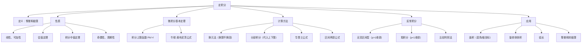

> 📌 定积分是"无限个无穷小量的求和"——用来计算面积、体积、弧长、质量等一切"积累量"。牛顿-莱布尼茨公式把定积分与不定积分联系起来，是整个微积分的顶峰之作。

---

## 📋 前置知识

- [[高等数学 第四章：不定积分]] — 牛顿-莱布尼茨公式需要求原函数；换元法和分部积分在定积分中同样适用
- [[高等数学 第一章：函数、极限与连续]] — 定积分的定义本质是极限；连续函数可积是重要结论
- [[极限的定义与夹逼准则]] — 定积分定义用到黎曼和的极限，夹逼准则用于估值

---

## 🤔 为什么需要定积分？

不定积分解决"已知变化率求原量"，但有时我们需要的是**有范围的积累**：

- 一块不规则土地的面积（不是矩形，不能直接乘）
- 变速运动在 $[0, T]$ 内的总位移
- 一段弯曲管道的总质量

这些问题的共同结构是：**把区间分成无数小段，每小段近似处理，再把无限多个近似值加起来取极限**。这就是定积分的思想。

---

## 🧠 第一节：定积分的定义

### 1.1 黎曼积分的定义

> 🎯 **类比**：用很多细长矩形拼出曲线下的面积。矩形越细（$n$ 越大），拼出的面积越精确。当矩形无限细（$\lambda \to 0$）时，面积之和的极限就是定积分。

设 $f(x)$ 在 $[a, b]$ 上有界。

**第一步——分割**：用分点 $a = x_0 < x_1 < \cdots < x_n = b$ 将 $[a,b]$ 分成 $n$ 个小区间，第 $i$ 个区间长度为 $\Delta x_i = x_i - x_{i-1}$，令 $\lambda = \max_i \Delta x_i$（最大小区间长度）。

**第二步——近似**：在每个 $[x_{i-1}, x_i]$ 上任取一点 $\xi_i$，以 $f(\xi_i)\Delta x_i$ 近似该小区间上曲线下的面积。

**第三步——求和**：$\displaystyle S_n = \sum_{i=1}^n f(\xi_i)\Delta x_i$（**黎曼和**）

**第四步——取极限**：若当 $\lambda \to 0$ 时，$S_n$ 的极限存在且与分割方式和 $\xi_i$ 的选取无关，则称该极限为 $f(x)$ 在 $[a,b]$ 上的**定积分**，记作

$$\int_a^b f(x)\,dx = \lim_{\lambda \to 0} \sum_{i=1}^n f(\xi_i)\Delta x_i$$

其中 $a$ 是**积分下限**，$b$ 是**积分上限**，$f(x)$ 是**被积函数**。

### 1.2 可积的充分条件

- $f(x)$ 在 $[a,b]$ 上**连续** $\Rightarrow$ $f(x)$ 可积
- $f(x)$ 在 $[a,b]$ 上**单调有界** $\Rightarrow$ $f(x)$ 可积
- $f(x)$ 在 $[a,b]$ 上**有界且只有有限个间断点** $\Rightarrow$ $f(x)$ 可积

### 1.3 定积分的几何意义

$$\int_a^b f(x)\,dx = \text{曲线 } y=f(x) \text{ 与 } x \text{ 轴之间的"有符号面积"}$$

- $f(x) > 0$ 的部分面积取**正**
- $f(x) < 0$ 的部分面积取**负**

> ⚠️ **定积分 $\neq$ 面积**！若要求曲线下方的实际面积，需对 $f(x) < 0$ 的部分取绝对值：$\displaystyle\int_a^b |f(x)|\,dx$。

### 1.4 补充规定

$$\int_a^a f(x)\,dx = 0$$

$$\int_a^b f(x)\,dx = -\int_b^a f(x)\,dx$$

---

## 🧠 第二节：定积分的性质

### 2.1 线性性质

$$\int_a^b [\alpha f(x) + \beta g(x)]\,dx = \alpha\int_a^b f(x)\,dx + \beta\int_a^b g(x)\,dx$$

### 2.2 区间可加性

$$\int_a^b f(x)\,dx = \int_a^c f(x)\,dx + \int_c^b f(x)\,dx$$

（对任意 $c$，无论 $c$ 是否在 $[a,b]$ 内均成立）

### 2.3 保号性与估值

若 $f(x) \geq 0$，$x \in [a,b]$，则 $\displaystyle\int_a^b f(x)\,dx \geq 0$。

若 $f(x) \leq g(x)$，$x \in [a,b]$，则 $\displaystyle\int_a^b f(x)\,dx \leq \int_a^b g(x)\,dx$。

**估值定理**：若 $m \leq f(x) \leq M$，则

$$m(b-a) \leq \int_a^b f(x)\,dx \leq M(b-a)$$

**绝对值不等式**：

$$\left|\int_a^b f(x)\,dx\right| \leq \int_a^b |f(x)|\,dx$$

### 2.4 积分中值定理

若 $f(x)$ 在 $[a,b]$ 上连续，则存在 $\xi \in (a, b)$，使得

$$\int_a^b f(x)\,dx = f(\xi)(b-a)$$

> 🎯 **几何直觉**：曲线下方的面积，等于以某点 $\xi$ 处的函数值为高、以 $[a,b]$ 为底的矩形面积。即在某个"平均高度"处有精确对应点。

> ⚠️ **与拉格朗日中值定理区别**：积分中值定理的 $\xi$ 在**开区间** $(a,b)$ 内（连续函数保证），而不只是 $[a,b]$ 上。

### 2.5 奇偶函数在对称区间上的积分

若积分区间关于原点对称，即 $[-a, a]$：

$$\int_{-a}^a f(x)\,dx = \begin{cases} 0, & f(x) \text{ 为奇函数} \\ 2\displaystyle\int_0^a f(x)\,dx, & f(x) \text{ 为偶函数} \end{cases}$$

> 💡 **考研高频技巧**：遇到对称区间，先判断奇偶性，奇函数直接为零，偶函数化简为一半区间。这能大幅简化计算。

### 2.6 周期函数的积分

若 $f(x)$ 以 $T$ 为周期，则

$$\int_a^{a+T} f(x)\,dx = \int_0^T f(x)\,dx$$

$$\int_0^{nT} f(x)\,dx = n\int_0^T f(x)\,dx$$

---

## 🧠 第三节：微积分基本定理

### 3.1 积分上限函数

**定义**：设 $f(x)$ 在 $[a,b]$ 上可积，称

$$\Phi(x) = \int_a^x f(t)\,dt, \quad x \in [a, b]$$

为**积分上限函数**（变上限积分）。

**定理（微积分第一基本定理）**：若 $f(x)$ 在 $[a,b]$ 上连续，则 $\Phi(x)$ 在 $[a,b]$ 上可导，且

$$\Phi'(x) = \frac{d}{dx}\int_a^x f(t)\,dt = f(x)$$

> 🎯 **意义**：这个定理说明，连续函数**一定有原函数**，且积分上限函数就是一个原函数。它架起了积分与导数之间的桥梁。

**推广——链式法则**：

$$\frac{d}{dx}\int_a^{\varphi(x)} f(t)\,dt = f(\varphi(x)) \cdot \varphi'(x)$$

$$\frac{d}{dx}\int_{\psi(x)}^{\varphi(x)} f(t)\,dt = f(\varphi(x))\cdot\varphi'(x) - f(\psi(x))\cdot\psi'(x)$$

> ⚠️ **踩坑**：上下限都是 $x$ 的函数时，分别对上限和下限用链式法则，下限那项要**乘以 $(-1)$**（相当于对调上下限后取负）。

### 3.2 牛顿-莱布尼茨公式

**定理（微积分第二基本定理）**：若 $F(x)$ 是 $f(x)$ 在 $[a,b]$ 上的一个原函数，则

$$\int_a^b f(x)\,dx = F(b) - F(a) \triangleq \Big[F(x)\Big]_a^b$$

> 🎯 **重要性**：这个公式把"无限求和取极限"（定积分的定义）转化为"求原函数后作差"，使得定积分的计算变得可操作。这是整个微积分最核心的公式，没有之一。

**使用步骤**：
1. 求出 $f(x)$ 的一个原函数 $F(x)$（不需要加 $C$，相减时抵消）
2. 计算 $F(b) - F(a)$

---

## 🧠 第四节：定积分的计算方法

### 4.1 换元法

**定积分换元公式**：设 $x = \varphi(t)$，$\varphi(\alpha) = a$，$\varphi(\beta) = b$，$\varphi'(t)$ 在 $[\alpha,\beta]$ 上连续，则

$$\int_a^b f(x)\,dx = \int_\alpha^\beta f(\varphi(t))\,\varphi'(t)\,dt$$

> ⚠️ **关键区别**：定积分换元后**上下限也要换**，换成关于新变量 $t$ 的范围，计算完**不必换回 $x$**，直接代入新的上下限求值。这与不定积分不同！

**示例**：$\displaystyle\int_0^1 \sqrt{1-x^2}\,dx$

令 $x = \sin t$，$dx = \cos t\,dt$；$x=0$ 时 $t=0$，$x=1$ 时 $t=\dfrac{\pi}{2}$：

$$\int_0^{\pi/2} \sqrt{1-\sin^2 t}\,\cos t\,dt = \int_0^{\pi/2} \cos^2 t\,dt = \int_0^{\pi/2}\frac{1+\cos 2t}{2}\,dt$$

$$= \left[\frac{t}{2} + \frac{\sin 2t}{4}\right]_0^{\pi/2} = \frac{\pi}{4}$$

（几何验证：这是单位圆第一象限部分的面积 $= \dfrac{\pi}{4}$ ✓）

### 4.2 分部积分

$$\int_a^b u\,dv = \Big[uv\Big]_a^b - \int_a^b v\,du$$

与不定积分分部完全相同，只是最后代入上下限。

### 4.3 利用奇偶性和周期性

见第二节 2.5 和 2.6，这是考研中最常被考查的"快速计算"技巧。

### 4.4 华里士公式（Wallis 公式）

$$\int_0^{\pi/2} \sin^n x\,dx = \int_0^{\pi/2} \cos^n x\,dx = \begin{cases} \dfrac{(n-1)!!}{n!!} \cdot \dfrac{\pi}{2}, & n \text{ 为正偶数} \\[8pt] \dfrac{(n-1)!!}{n!!}, & n \text{ 为正奇数} \end{cases}$$

其中 $n!! = n(n-2)(n-4)\cdots$（双阶乘）。

**常用值**：

$$\int_0^{\pi/2}\sin^2 x\,dx = \int_0^{\pi/2}\cos^2 x\,dx = \frac{\pi}{4}$$

$$\int_0^{\pi/2}\sin^4 x\,dx = \frac{3\pi}{16}, \quad \int_0^{\pi/2}\sin^3 x\,dx = \frac{2}{3}$$

> 💡 **华里士公式在考研中非常实用**，遇到 $\int_0^{\pi/2}\sin^n x\,dx$ 或 $\int_0^\pi \sin^n x\,dx$ 等形式，直接套公式，大幅节省时间。

### 4.5 区间再现公式

$$\int_0^{\pi} xf(\sin x)\,dx = \frac{\pi}{2}\int_0^{\pi} f(\sin x)\,dx$$

**推导**：令 $x = \pi - t$：

$$\int_0^\pi xf(\sin x)\,dx = \int_0^\pi (\pi-t)f(\sin t)\,dt = \pi\int_0^\pi f(\sin t)\,dt - \int_0^\pi tf(\sin t)\,dt$$

设原积分为 $I$，则 $I = \pi\int_0^\pi f(\sin t)\,dt - I$，故 $I = \dfrac{\pi}{2}\int_0^\pi f(\sin t)\,dt$。

---

## 🧠 第五节：反常积分

### 5.1 无穷区间上的反常积分

**定义**：

$$\int_a^{+\infty} f(x)\,dx = \lim_{b \to +\infty} \int_a^b f(x)\,dx$$

$$\int_{-\infty}^b f(x)\,dx = \lim_{a \to -\infty} \int_a^b f(x)\,dx$$

$$\int_{-\infty}^{+\infty} f(x)\,dx = \int_{-\infty}^0 f(x)\,dx + \int_0^{+\infty} f(x)\,dx$$

若极限存在（有限值），称反常积分**收敛**；否则**发散**。

**重要结论**（$p$ 积分）：

$$\int_1^{+\infty} \frac{dx}{x^p} \begin{cases} \text{收敛}，& p > 1 \\ \text{发散}，& p \leq 1 \end{cases}$$

$$\int_0^1 \frac{dx}{x^p} \begin{cases} \text{收敛}，& p < 1 \\ \text{发散}，& p \geq 1 \end{cases}$$

> 💡 **记忆口诀**："$\int_1^{+\infty}$ 收敛要 $p>1$（大于1才行）；$\int_0^1$ 收敛要 $p<1$（小于1才行）"——两个 $p$ 积分方向相反。

### 5.2 无界函数的反常积分（瑕积分）

若 $f(x)$ 在 $x = c$（$c \in [a,b]$）处无界（称 $c$ 为**瑕点**），则

$$\int_a^b f(x)\,dx = \lim_{\varepsilon \to 0^+} \int_{c+\varepsilon}^b f(x)\,dx \quad (c = a \text{ 时})$$

$$\int_a^b f(x)\,dx = \lim_{\varepsilon \to 0^+}\left[\int_a^{c-\varepsilon} f(x)\,dx + \int_{c+\varepsilon}^b f(x)\,dx\right] \quad (c \in (a,b) \text{ 时})$$

> ⚠️ **踩坑**：若 $c \in (a,b)$ 是瑕点，必须把区间在 $c$ 处分开，**分别取极限**。不能直接用牛顿-莱布尼茨公式代入端点！

**经典错误示范**：计算 $\displaystyle\int_{-1}^1 \frac{dx}{x^2}$

❌ 错误做法：$\left[-\dfrac{1}{x}\right]_{-1}^1 = -1 - 1 = -2$（$x=0$ 是瑕点，直接代入错误）

✓ 正确做法：$\displaystyle\int_{-1}^0 \frac{dx}{x^2} = \lim_{\varepsilon\to 0^+}\left[-\frac{1}{x}\right]_{-1}^{-\varepsilon} = \lim_{\varepsilon\to 0^+}\left(\frac{1}{\varepsilon} - 1\right) = +\infty$，故原积分**发散**。

### 5.3 反常积分的比较判别法

若 $0 \leq f(x) \leq g(x)$：
- 若 $\displaystyle\int_a^{+\infty} g(x)\,dx$ 收敛，则 $\displaystyle\int_a^{+\infty} f(x)\,dx$ 也收敛
- 若 $\displaystyle\int_a^{+\infty} f(x)\,dx$ 发散，则 $\displaystyle\int_a^{+\infty} g(x)\,dx$ 也发散

**极限比较法**：若 $\displaystyle\lim_{x\to+\infty}\frac{f(x)}{g(x)} = c$（$0 < c < +\infty$），则 $\int_a^{+\infty}f$ 与 $\int_a^{+\infty}g$ 同敛散。

---

## 🧠 第六节：定积分的应用

### 6.1 面积

**直角坐标**：曲线 $y = f(x)$ 与 $y = g(x)$（$f \geq g$）在 $[a,b]$ 上围成的面积：

$$S = \int_a^b [f(x) - g(x)]\,dx$$

**参数方程**：$\begin{cases}x = \varphi(t) \\ y = \psi(t)\end{cases}$，$t \in [\alpha,\beta]$：

$$S = \int_\alpha^\beta |\psi(t)|\,|\varphi'(t)|\,dt$$

**极坐标**：曲线 $r = r(\theta)$，$\theta \in [\alpha,\beta]$ 围成的扇形面积：

$$S = \frac{1}{2}\int_\alpha^\beta r^2(\theta)\,d\theta$$

### 6.2 体积

**旋转体体积**：

曲线 $y = f(x)$（$f \geq 0$），$x \in [a,b]$ 绕 $x$ 轴旋转：

$$V_x = \pi\int_a^b f^2(x)\,dx$$

绕 $y$ 轴旋转（柱壳法）：

$$V_y = 2\pi\int_a^b x\,|f(x)|\,dx$$

**截面面积法**：若已知垂直于 $x$ 轴的截面面积为 $A(x)$，则

$$V = \int_a^b A(x)\,dx$$

### 6.3 弧长

**直角坐标**：$y = f(x)$，$x \in [a,b]$：

$$L = \int_a^b \sqrt{1 + [f'(x)]^2}\,dx$$

**参数方程**：$\begin{cases}x = \varphi(t) \\ y = \psi(t)\end{cases}$，$t \in [\alpha,\beta]$：

$$L = \int_\alpha^\beta \sqrt{[\varphi'(t)]^2 + [\psi'(t)]^2}\,dt$$

**极坐标**：$r = r(\theta)$，$\theta \in [\alpha,\beta]$：

$$L = \int_\alpha^\beta \sqrt{r^2 + (r')^2}\,d\theta$$

### 6.4 物理应用

**变力做功**：$W = \displaystyle\int_a^b F(x)\,dx$

**液体静压力**：$F = \displaystyle\int_a^b \rho g\, x\, w(x)\,dx$（$w(x)$ 为深度 $x$ 处截面宽度，$\rho$ 为液体密度）

---

## 💻 代码验证

```python
import sympy as sp
import numpy as np

x, t = sp.Symbol('x'), sp.Symbol('t')

# ---- 牛顿-莱布尼茨公式 ----
print("=== 牛顿-莱布尼茨公式验证 ===")
cases = [
    (x**2, 0, 1, "∫₀¹ x² dx"),
    (sp.sin(x), 0, sp.pi, "∫₀^π sin(x) dx"),
    (sp.exp(x), 0, 1, "∫₀¹ e^x dx"),
    (1/x, 1, sp.E, "∫₁^e 1/x dx"),
]
for f, a, b, name in cases:
    val = sp.integrate(f, (x, a, b))
    print(f"  {name} = {val} = {sp.simplify(val)}")

print()

# ---- 积分上限函数求导 ----
print("=== 积分上限函数求导 ===")
# d/dx ∫₀^(x²) sin(t) dt
upper = x**2
F = sp.integrate(sp.sin(t), (t, 0, upper))
dF = sp.diff(F, x)
print(f"  d/dx ∫₀^(x²) sin(t) dt = {sp.simplify(dF)}")
# 用链式法则验证：f(x²)·2x = sin(x²)·2x
print(f"  链式法则验证: sin(x²)·2x = {sp.simplify(sp.sin(x**2)*2*x)}")

print()

# ---- 奇偶性简化 ----
print("=== 奇偶性验证 ===")
# ∫_{-1}^{1} x³ dx（奇函数，应为 0）
val_odd = sp.integrate(x**3, (x, -1, 1))
print(f"  ∫_(-1)^1 x³ dx = {val_odd}（奇函数，= 0 ✓）")

# ∫_{-π/2}^{π/2} cos(x) dx（偶函数）
val_even = sp.integrate(sp.cos(x), (x, -sp.pi/2, sp.pi/2))
half = 2 * sp.integrate(sp.cos(x), (x, 0, sp.pi/2))
print(f"  ∫_(-π/2)^(π/2) cos(x) dx = {val_even}，2∫₀^(π/2) = {half} ✓")

print()

# ---- 反常积分 ----
print("=== 反常积分 ===")
# p 积分
for p in [sp.Rational(1,2), 1, 2]:
    val = sp.integrate(1/x**p, (x, 1, sp.oo))
    print(f"  ∫₁^∞ x^(-{p}) dx = {val}")

print()

# ---- 面积计算 ----
print("=== 应用：面积 ===")
# y=x² 与 y=x 围成的面积
f1, f2 = x, x**2
# 交点
pts = sp.solve(f1 - f2, x)
area = sp.integrate(f1 - f2, (x, pts[0], pts[1]))
print(f"  y=x 与 y=x² 的交点: x={pts}")
print(f"  围成面积 = {area}")
```

```bash
python3 chapter5_definite.py
```

**预期输出**：

```text
=== 牛顿-莱布尼茨公式验证 ===
  ∫₀¹ x² dx = 1/3
  ∫₀^π sin(x) dx = 2
  ∫₀¹ e^x dx = -1 + E
  ∫₁^e 1/x dx = 1

=== 积分上限函数求导 ===
  d/dx ∫₀^(x²) sin(t) dt = 2*x*sin(x**2)
  链式法则验证: sin(x²)·2x = 2*x*sin(x**2)

=== 奇偶性验证 ===
  ∫_(-1)^1 x³ dx = 0（奇函数，= 0 ✓）
  ∫_(-π/2)^(π/2) cos(x) dx = 2，2∫₀^(π/2) = 2 ✓

=== 反常积分 ===
  ∫₁^∞ x^(-1/2) dx = oo
  ∫₁^∞ x^(-1) dx = oo
  ∫₁^∞ x^(-2) dx = 1

=== 应用：面积 ===
  y=x 与 y=x² 的交点: x=[0, 1]
  围成面积 = 1/6
```

---

## ⚠️ 常见误区与踩坑点

> ❌ **误区 1：定积分结果一定是正数**
> 定积分是"有符号面积"，若被积函数在积分区间上有负值，定积分可以为负。求实际面积要用 $\displaystyle\int_a^b|f(x)|\,dx$。

> ⚠️ **踩坑 2：换元后忘记换上下限**
> 定积分换元后，上下限必须换成新变量对应的值，计算完**不用**换回原变量，直接代新限求值。

> ❌ **误区 3：对含瑕点的积分直接用 N-L 公式**
> 若被积函数在积分区间内某点无界（瑕点），不能直接套牛顿-莱布尼茨公式，必须先转化为反常积分（极限形式），再判断敛散性。

> ⚠️ **踩坑 3：积分上限函数求导时被积函数含 $x$**
> 若 $\displaystyle\frac{d}{dx}\int_a^x xf(t)\,dt$，注意 $x$ 在被积函数里不是积分变量，不能直接套公式。应先把 $x$ 提出：$x\displaystyle\int_a^x f(t)\,dt$，再用乘积求导。

> ⚠️ **踩坑 4：$\int_{-a}^a f(x)\,dx$ 奇偶性判断忽视定义域**
> 使用奇偶对称性简化前，必须确认 $f(x)$ 在 $[-a,a]$ 上**处处有定义**。若区间内有无定义的点（如 $f(x) = \ln x$ 在 $x<0$ 无意义），不能直接用奇偶性。

> ❌ **误区 4：两个 $p$ 积分的收敛条件弄反**
> $\displaystyle\int_1^{+\infty}\frac{dx}{x^p}$：$p > 1$ 收敛；$\displaystyle\int_0^1\frac{dx}{x^p}$：$p < 1$ 收敛。方向相反，务必记准。

---

## 🔄 定积分 vs 不定积分对比

| 特征 | 不定积分 | 定积分 |
|------|---------|-------|
| 结果类型 | 函数族（含 $C$） | 一个数 |
| 几何意义 | 原函数 | 有符号面积 |
| 换元后 | 必须换回原变量 | 只需换上下限，不必换回 |
| 分部积分 | $\int u\,dv = uv - \int v\,du$ | $\int_a^b u\,dv = [uv]_a^b - \int_a^b v\,du$ |
| 是否加 $C$ | 必须加 | 不加（结果是数） |
| 联系 | 牛顿-莱布尼茨公式：$\int_a^b f\,dx = F(b)-F(a)$ | — |

> 💡 **一句话总结**：不定积分是"找家族"，定积分是"算面积"；两者通过牛顿-莱布尼茨公式相连，使得"无穷求和"变成"原函数作差"。

---

## 🏋️ 动手练习

### 练习 1：积分上限函数求导（⭐⭐ 中等）

**题目**：求 $F(x) = \displaystyle\int_0^{x^2} \frac{\sin t}{t}\,dt$ 的导数 $F'(x)$（$x > 0$）。

**参考答案**：

令 $u = x^2$，$F(x) = \displaystyle\int_0^u \dfrac{\sin t}{t}\,dt$。

由链式法则：

$$F'(x) = \frac{\sin u}{u} \cdot \frac{du}{dx} = \frac{\sin(x^2)}{x^2} \cdot 2x = \frac{2\sin(x^2)}{x}$$

---

### 练习 2：奇偶性与对称区间（⭐⭐ 中等）

**题目**：计算 $\displaystyle\int_{-1}^1 \frac{x^4 \sin x + x^2 + 1}{1 + x^2}\,dx$

**参考答案**：

将被积函数拆分为奇函数部分和偶函数部分：

$$\frac{x^4\sin x + x^2 + 1}{1+x^2} = \underbrace{\frac{x^4\sin x}{1+x^2}}_{\text{奇函数}} + \underbrace{\frac{x^2+1}{1+x^2}}_{\text{偶函数}} = \frac{x^4\sin x}{1+x^2} + 1$$

奇函数部分在 $[-1,1]$ 上积分为 $0$，故：

$$\int_{-1}^1 \frac{x^4\sin x + x^2 + 1}{1+x^2}\,dx = 0 + \int_{-1}^1 1\,dx = 2$$

---

### 练习 3：定积分换元（⭐⭐ 中等）

**题目**：计算 $\displaystyle\int_0^4 \frac{x}{\sqrt{2x+1}}\,dx$

**参考答案**：

令 $t = \sqrt{2x+1}$，则 $t^2 = 2x+1$，$x = \dfrac{t^2-1}{2}$，$dx = t\,dt$；

$x=0$ 时 $t=1$，$x=4$ 时 $t=3$：

$$\int_1^3 \frac{\dfrac{t^2-1}{2}}{t} \cdot t\,dt = \frac{1}{2}\int_1^3 (t^2-1)\,dt = \frac{1}{2}\left[\frac{t^3}{3} - t\right]_1^3$$

$$= \frac{1}{2}\left[\left(9-3\right) - \left(\frac{1}{3}-1\right)\right] = \frac{1}{2}\left[6 + \frac{2}{3}\right] = \frac{1}{2} \cdot \frac{20}{3} = \frac{10}{3}$$

---

### 练习 4：分部积分 + 区间再现（⭐⭐⭐ 较难）

**题目**：计算 $\displaystyle\int_0^\pi x\sin x\,dx$

**参考答案**：

**方法一（分部积分）**：

令 $u = x$，$dv = \sin x\,dx$，则 $du = dx$，$v = -\cos x$：

$$\int_0^\pi x\sin x\,dx = \Big[-x\cos x\Big]_0^\pi + \int_0^\pi \cos x\,dx = \pi + \Big[\sin x\Big]_0^\pi = \pi + 0 = \pi$$

**方法二（区间再现）**：

令 $f(\sin x) = \sin x$，由区间再现公式：

$$\int_0^\pi x\sin x\,dx = \frac{\pi}{2}\int_0^\pi \sin x\,dx = \frac{\pi}{2}\Big[-\cos x\Big]_0^\pi = \frac{\pi}{2} \cdot 2 = \pi \checkmark$$

---

### 练习 5：反常积分收敛性判断（⭐⭐⭐ 较难）

**题目**：讨论 $\displaystyle\int_0^{+\infty} \frac{x}{(1+x)^3}\,dx$ 的敛散性，若收敛求其值。

**参考答案**：

当 $x \to +\infty$ 时，$\dfrac{x}{(1+x)^3} \sim \dfrac{x}{x^3} = \dfrac{1}{x^2}$，而 $\displaystyle\int_1^{+\infty}\dfrac{dx}{x^2}$ 收敛（$p=2>1$），故原积分收敛。

计算（令 $u = 1+x$，$du = dx$，$x = u-1$；$x=0$ 时 $u=1$，$x \to +\infty$ 时 $u \to +\infty$）：

$$\int_0^{+\infty}\frac{x}{(1+x)^3}\,dx = \int_1^{+\infty}\frac{u-1}{u^3}\,du = \int_1^{+\infty}\left(\frac{1}{u^2} - \frac{1}{u^3}\right)du$$

$$= \left[-\frac{1}{u} + \frac{1}{2u^2}\right]_1^{+\infty} = \left(0 + 0\right) - \left(-1 + \frac{1}{2}\right) = \frac{1}{2}$$

---

### 练习 6：旋转体体积（⭐⭐⭐ 较难）

**题目**：求曲线 $y = \sin x$（$x \in [0,\pi]$）绕 $x$ 轴旋转一周所得旋转体的体积。

**参考答案**：

$$V = \pi\int_0^\pi \sin^2 x\,dx = \pi\int_0^\pi \frac{1-\cos 2x}{2}\,dx$$

$$= \frac{\pi}{2}\left[x - \frac{\sin 2x}{2}\right]_0^\pi = \frac{\pi}{2}\left[\pi - 0 - 0 + 0\right] = \frac{\pi^2}{2}$$

---

### 练习 7：综合大题——极限转化为定积分（⭐⭐⭐⭐ 难）

**题目**：计算 $\displaystyle\lim_{n\to\infty} \sum_{k=1}^n \frac{1}{n} \sin\frac{k\pi}{n}$

**参考答案**：

将求和识别为**黎曼和**。令 $x_k = \dfrac{k}{n}$，$\Delta x = \dfrac{1}{n}$，则：

$$\sum_{k=1}^n \frac{1}{n}\sin\frac{k\pi}{n} = \sum_{k=1}^n \sin(\pi x_k) \cdot \Delta x$$

这正是 $f(x) = \sin(\pi x)$ 在 $[0,1]$ 上的黎曼和，故：

$$\lim_{n\to\infty}\sum_{k=1}^n \frac{1}{n}\sin\frac{k\pi}{n} = \int_0^1 \sin(\pi x)\,dx = \left[-\frac{\cos(\pi x)}{\pi}\right]_0^1 = \frac{-\cos\pi + \cos 0}{\pi} = \frac{2}{\pi}$$

---

## 📝 总结

### 本章要点回顾

1. **定积分的本质**是黎曼和的极限；几何上是有符号面积；连续函数必可积。

2. **牛顿-莱布尼茨公式** $\displaystyle\int_a^b f\,dx = F(b)-F(a)$ 是计算定积分的核心工具，把无限求和化为原函数作差。

3. **计算技巧**：换元法（换元同时换上下限，不必换回）；分部积分（代入上下限）；奇偶性（对称区间快速化简）；华里士公式（$\int_0^{\pi/2}\sin^n x\,dx$ 直接套）；区间再现（$\int_0^\pi xf(\sin x)\,dx$ 的处理）。

4. **反常积分**分两类：无穷区间（转化为极限）和瑕积分（瑕点处取极限）；$p$ 积分的收敛条件必须记准，方向相反。

5. **定积分应用**：面积（直角/极坐标）、旋转体体积（$\pi\int f^2\,dx$）、弧长；认识"黎曼和 $\to$ 定积分"的转化，是处理极限求和型题目的关键。

### 知识图谱



---

## 🔗 相关链接

- 前置章节：[[高等数学 第四章：不定积分]]
- 下一章节：[[高等数学 第六章：多元函数微积分]]
- 关联概念：[[反常积分的审敛法]]、[[级数收敛]]（与反常积分敛散性类比）
- 应用延伸：[[定积分的物理应用]]、[[极坐标系]]

## 📚 参考资料

- 同济大学数学系《高等数学》（第七版）第五、六章 —— 定积分定义严格，应用例题丰富
- 张宇《高等数学 18 讲》第 6、7 讲 —— 反常积分审敛和华里士公式专项讲解
- 武忠祥《高等数学辅导讲义》—— 区间再现公式和对称区间技巧整理全面
- 李永乐《数学复习全书》—— 定积分应用（面积、体积、弧长）真题汇总
