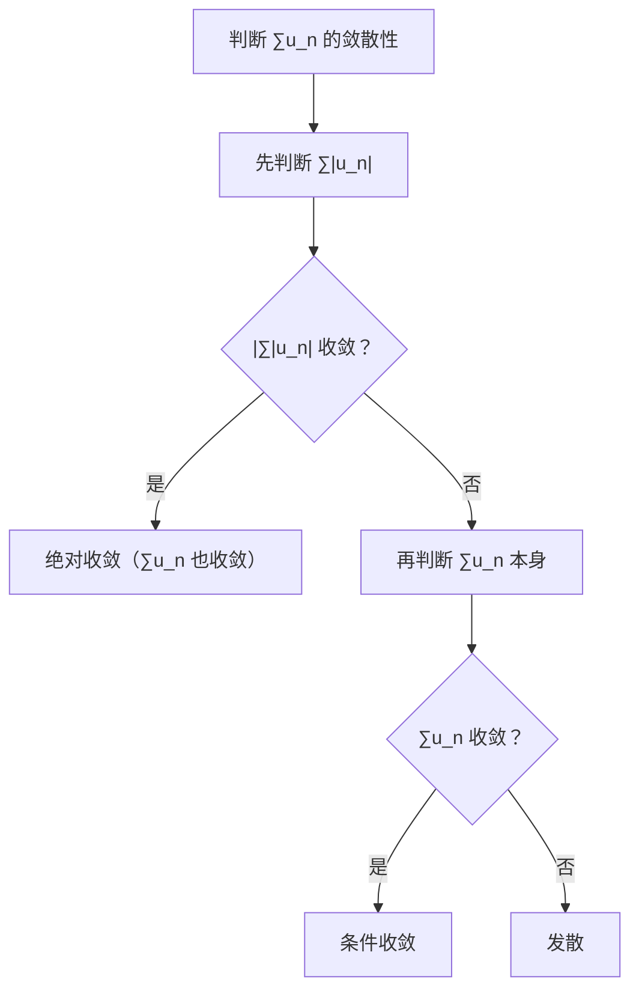
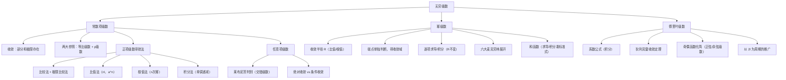

> 📌 无穷级数是"把无穷多项加起来"的数学工具。常数项级数研究收敛性；幂级数将函数展开为多项式的极限形式；傅里叶级数将函数展开为三角函数的叠加。本章是数学一的高频考点，也是衔接分析与应用的桥梁。

---

## 📋 前置知识

- [[高等数学 第一章：函数、极限与连续]] — 级数收敛本质上是部分和数列的极限；夹逼准则在敛散性判断中用到
- [[高等数学 第三章：微分中值定理与导数的应用]] — 泰勒公式是幂级数展开的理论基础，六个麦克劳林展开式在此全面应用
- [[高等数学 第五章：定积分]] — 幂级数逐项积分、傅里叶系数的计算都要用到定积分

---

## 🤔 为什么需要无穷级数？

$e^x$、$\sin x$、$\ln(1+x)$ 这些函数，计算机是怎么计算的？答案是用**多项式近似**——因为多项式只需要加减乘，计算机最擅长。而把函数表示成无穷多项多项式之和，就是**幂级数展开**，也就是无穷级数最重要的应用。

此外，音频信号处理、图像压缩、量子力学中的波函数——这些都依赖**傅里叶级数**，把复杂信号分解为不同频率的正弦波叠加。

---

## 🧠 第一节：常数项级数

### 1.1 级数的定义

设有数列 $\{u_n\}$，将其各项依次相加，得到表达式

$$\sum_{n=1}^{\infty} u_n = u_1 + u_2 + u_3 + \cdots$$

称为**无穷级数**（简称**级数**）。

**部分和**：$S_n = \displaystyle\sum_{k=1}^n u_k = u_1 + u_2 + \cdots + u_n$

**收敛与发散**：

- 若 $\lim_{n\to\infty} S_n = S$（有限数），则级数**收敛**，$S$ 称为级数的**和**
- 若 $\lim_{n\to\infty} S_n$ 不存在或为 $\pm\infty$，则级数**发散**

> 🎯 **类比**：级数就像银行存款——每个月存 $u_n$ 元，$S_n$ 是第 $n$ 个月末的总存款。若总存款趋向某个有限值 $S$，说明"存款收敛"；若无限增长，则"发散"。

### 1.2 两个重要级数

**① 等比级数（几何级数）**：$\displaystyle\sum_{n=0}^{\infty} aq^n = a + aq + aq^2 + \cdots$

$$\sum_{n=0}^{\infty} aq^n = \begin{cases} \dfrac{a}{1-q}, & |q| < 1 \text{（收敛）} \\ \text{发散}, & |q| \geq 1 \end{cases}$$

**② $p$ 级数**：$\displaystyle\sum_{n=1}^{\infty} \frac{1}{n^p}$

$$\sum_{n=1}^{\infty} \frac{1}{n^p} \begin{cases} \text{收敛}, & p > 1 \\ \text{发散}, & p \leq 1 \end{cases}$$

> 💡 **$p=1$ 时是调和级数** $\displaystyle\sum_{n=1}^\infty \frac{1}{n}$，发散，但发散得极慢（前 $n$ 项和约为 $\ln n$）。这是最重要的发散级数例子。

### 1.3 级数收敛的必要条件

$$\sum_{n=1}^\infty u_n \text{ 收敛} \implies \lim_{n\to\infty} u_n = 0$$

> ⚠️ **逆命题不成立**：$\lim_{n\to\infty} u_n = 0$ **不能**推出级数收敛！调和级数 $\sum \dfrac{1}{n}$ 就是反例：$\dfrac{1}{n}\to 0$，但级数发散。

**推论（逆否命题，常用来判断发散）**：若 $\lim_{n\to\infty} u_n \neq 0$，则级数一定发散。

### 1.4 级数的基本性质

$$\sum_{n=1}^\infty (au_n + bv_n) = a\sum u_n + b\sum v_n \quad (\text{两级数均收敛时})$$

- 收敛级数加括号后仍收敛，和不变（但加括号后收敛不能推出原级数收敛）
- 去掉、增加或改变有限项，不影响敛散性（但影响和的值）

---

## 🧠 第二节：正项级数的审敛法

正项级数 $\sum u_n$（$u_n \geq 0$）的部分和数列 $\{S_n\}$ 单调不减，故正项级数收敛当且仅当 $\{S_n\}$ 有上界。

### 2.1 比较审敛法

若 $0 \leq u_n \leq v_n$：
- $\sum v_n$ 收敛 $\Rightarrow$ $\sum u_n$ 收敛（大的收敛，小的也收敛）
- $\sum u_n$ 发散 $\Rightarrow$ $\sum v_n$ 发散（小的发散，大的也发散）

**极限比较法**：若 $\displaystyle\lim_{n\to\infty} \frac{u_n}{v_n} = l$：

| $l$ 的值 | 结论 |
|---------|------|
| $0 < l < +\infty$ | $\sum u_n$ 与 $\sum v_n$ **同敛散** |
| $l = 0$ | $\sum v_n$ 收敛 $\Rightarrow$ $\sum u_n$ 收敛 |
| $l = +\infty$ | $\sum v_n$ 发散 $\Rightarrow$ $\sum u_n$ 发散 |

> 💡 **使用技巧**：将 $u_n$ 与 $p$ 级数或等比级数比较，是最常见的方法。先判断 $u_n$ 的"量级"，再选合适的参照级数 $\sum v_n$。

### 2.2 比值审敛法（达朗贝尔判别法）

若 $\displaystyle\lim_{n\to\infty} \frac{u_{n+1}}{u_n} = \rho$，则：

$$\begin{cases} \rho < 1 & \Rightarrow \sum u_n \text{ 收敛} \\ \rho > 1 & \Rightarrow \sum u_n \text{ 发散} \\ \rho = 1 & \Rightarrow \text{无法判断（失效）} \end{cases}$$

> 💡 **适用场景**：$u_n$ 含阶乘 $n!$、指数 $a^n$、幂次 $n^n$ 等，相邻项之比容易化简时优先使用。

### 2.3 根值审敛法（柯西判别法）

若 $\displaystyle\lim_{n\to\infty} \sqrt[n]{u_n} = \rho$，则结论与比值法相同：

$$\begin{cases} \rho < 1 & \Rightarrow \sum u_n \text{ 收敛} \\ \rho > 1 & \Rightarrow \sum u_n \text{ 发散} \\ \rho = 1 & \Rightarrow \text{失效} \end{cases}$$

> 💡 **适用场景**：$u_n$ 含 $n$ 次方（如 $\left(\dfrac{n}{2n+1}\right)^n$），取 $n$ 次根后化简。

### 2.4 积分审敛法

若 $f(x)$ 在 $[1, +\infty)$ 上非负单调递减，且 $u_n = f(n)$，则

$$\sum_{n=1}^\infty u_n \text{ 与 } \int_1^{+\infty} f(x)\,dx \text{ 同敛散}$$

> 💡 **这正是 $p$ 级数结论的来源**：$f(x) = x^{-p}$，$\int_1^{+\infty} x^{-p}\,dx$ 在 $p>1$ 时收敛，$p\leq1$ 时发散。

---

## 🧠 第三节：交错级数与绝对收敛

### 3.1 交错级数与莱布尼茨判别法

**交错级数**：各项正负交替的级数 $\displaystyle\sum_{n=1}^\infty (-1)^{n-1} u_n$（$u_n > 0$）。

**莱布尼茨判别法**：若满足：
1. $u_n \geq u_{n+1}$（单调不增）
2. $\lim_{n\to\infty} u_n = 0$

则交错级数收敛，且其和 $S$ 满足 $|S| \leq u_1$，余项 $|r_n| \leq u_{n+1}$。

> 🎯 **类比**：交错级数像一个钟摆——先向右摆 $u_1$，再向左摆 $u_2$，再向右摆 $u_3$……若摆幅越来越小趋于零，最终会稳定在某个位置（收敛）。

**经典例子**：$\displaystyle\sum_{n=1}^\infty \frac{(-1)^{n-1}}{n} = 1 - \frac{1}{2} + \frac{1}{3} - \frac{1}{4} + \cdots = \ln 2$（收敛）

### 3.2 绝对收敛与条件收敛

**绝对收敛**：若 $\displaystyle\sum_{n=1}^\infty |u_n|$ 收敛，则称 $\sum u_n$ **绝对收敛**。

**条件收敛**：若 $\sum u_n$ 收敛但 $\sum |u_n|$ 发散，则称 $\sum u_n$ **条件收敛**。

**定理**：绝对收敛 $\Rightarrow$ 收敛（绝对收敛是比收敛更强的条件）。

> ⚠️ **条件收敛的"危险性"**：条件收敛级数重新排列后，和可能改变，甚至可以变成任意值（黎曼重排定理）！绝对收敛级数则无此问题。

**判断流程**：



---

## 🧠 第四节：幂级数

### 4.1 幂级数的定义

形如

$$\sum_{n=0}^\infty a_n(x - x_0)^n = a_0 + a_1(x-x_0) + a_2(x-x_0)^2 + \cdots$$

的级数称为**幂级数**。最常见的情形是 $x_0 = 0$（麦克劳林幂级数）：

$$\sum_{n=0}^\infty a_n x^n = a_0 + a_1 x + a_2 x^2 + \cdots$$

### 4.2 收敛半径与收敛域

**阿贝尔定理**：若幂级数在 $x = x_1 \neq 0$ 处收敛，则对所有 $|x| < |x_1|$ 均绝对收敛；若在 $x = x_2$ 处发散，则对所有 $|x| > |x_2|$ 均发散。

由此得到**收敛区间**的概念：存在 $R \geq 0$，使得：
- $|x| < R$ 时绝对收敛
- $|x| > R$ 时发散
- $|x| = R$ 时（即 $x = \pm R$）需单独判断

$R$ 称为**收敛半径**，$(-R, R)$ 称为**收敛区间**，加上收敛的端点后称为**收敛域**。

**收敛半径的计算公式**：

$$R = \lim_{n\to\infty} \left|\frac{a_n}{a_{n+1}}\right| \quad \text{（比值法）}$$

$$R = \frac{1}{\displaystyle\lim_{n\to\infty} \sqrt[n]{|a_n|}} \quad \text{（根值法）}$$

> ⚠️ **端点必须单独判断**：收敛半径给出的是开区间 $(-R, R)$，两端点 $x = \pm R$ 处级数可能收敛也可能发散，代入后用常数项级数的审敛法判断。

### 4.3 幂级数的运算性质

**逐项求导**：收敛域内（端点可能丢失），

$$\left(\sum_{n=0}^\infty a_n x^n\right)' = \sum_{n=1}^\infty n a_n x^{n-1}$$

**逐项积分**：收敛域内（端点可能增加），

$$\int_0^x \sum_{n=0}^\infty a_n t^n\,dt = \sum_{n=0}^\infty \frac{a_n}{n+1} x^{n+1}$$

> 💡 **重要结论**：逐项求导和逐项积分不改变收敛半径，但端点的收敛性可能改变（求导可能使端点从收敛变发散；积分可能使发散端点变收敛）。

### 4.4 函数展开为幂级数

**方法一（直接法）**：利用泰勒公式，逐步计算各阶导数在 $x_0 = 0$ 处的值。

**方法二（间接法）**：从六个已知展开式出发，通过**变量替换、逐项求导、逐项积分、四则运算**推导出目标函数的展开式。

**六个必背麦克劳林展开**（见第三章，此处汇总）：

$$e^x = \sum_{n=0}^\infty \frac{x^n}{n!}, \quad x \in (-\infty, +\infty)$$

$$\sin x = \sum_{n=0}^\infty \frac{(-1)^n x^{2n+1}}{(2n+1)!}, \quad x \in (-\infty, +\infty)$$

$$\cos x = \sum_{n=0}^\infty \frac{(-1)^n x^{2n}}{(2n)!}, \quad x \in (-\infty, +\infty)$$

$$\ln(1+x) = \sum_{n=1}^\infty \frac{(-1)^{n-1} x^n}{n}, \quad x \in (-1, 1]$$

$$\frac{1}{1-x} = \sum_{n=0}^\infty x^n, \quad x \in (-1, 1)$$

$$\frac{1}{1+x} = \sum_{n=0}^\infty (-1)^n x^n, \quad x \in (-1, 1)$$

$$(1+x)^\alpha = \sum_{n=0}^\infty \binom{\alpha}{n} x^n, \quad x \in (-1, 1)$$

> 💡 **间接法示例**：求 $\ln(1-x)$ 的幂级数展开。将 $\ln(1+x)$ 中 $x$ 换成 $-x$：
> $$\ln(1-x) = -\sum_{n=1}^\infty \frac{x^n}{n}, \quad x \in [-1, 1)$$

---

## 🧠 第五节：傅里叶级数

### 5.1 三角级数与傅里叶系数

**三角级数**：

$$\frac{a_0}{2} + \sum_{n=1}^\infty (a_n \cos nx + b_n \sin nx)$$

**傅里叶系数**：若 $f(x)$ 以 $2\pi$ 为周期，

$$a_n = \frac{1}{\pi}\int_{-\pi}^\pi f(x)\cos nx\,dx, \quad n = 0, 1, 2, \ldots$$

$$b_n = \frac{1}{\pi}\int_{-\pi}^\pi f(x)\sin nx\,dx, \quad n = 1, 2, \ldots$$

> 🎯 **类比**：傅里叶系数就像"滤波器"——$a_n$ 和 $b_n$ 告诉我们 $f(x)$ 中含有多少"频率为 $n$ 的正弦/余弦成分"，就像 EQ 均衡器分析音频中各频率的强度。

### 5.2 收敛定理（狄利克雷条件）

若 $f(x)$ 满足：
1. 在 $[-\pi, \pi]$ 上**绝对可积**
2. 在 $[-\pi, \pi]$ 上只有**有限个间断点**，且均为第一类间断点
3. 在 $[-\pi, \pi]$ 上只有**有限个极值点**

则 $f(x)$ 的傅里叶级数收敛，且在 $x$ 处：

$$\frac{a_0}{2} + \sum_{n=1}^\infty(a_n\cos nx + b_n\sin nx) = \frac{f(x^-) + f(x^+)}{2}$$

特别地：
- 在 $f(x)$ 的**连续点**处，级数收敛到 $f(x)$
- 在 $f(x)$ 的**间断点** $x_0$ 处，级数收敛到左右极限的平均值 $\dfrac{f(x_0^-)+f(x_0^+)}{2}$
- 在端点 $x = \pm\pi$ 处，级数收敛到 $\dfrac{f(-\pi^+)+f(\pi^-)}{2}$

### 5.3 奇偶函数的傅里叶展开

**偶函数**（$f(-x) = f(x)$）：$b_n = 0$，级数只含余弦项（**余弦级数**）：

$$f(x) \sim \frac{a_0}{2} + \sum_{n=1}^\infty a_n \cos nx, \quad a_n = \frac{2}{\pi}\int_0^\pi f(x)\cos nx\,dx$$

**奇函数**（$f(-x) = -f(x)$）：$a_n = 0$，级数只含正弦项（**正弦级数**）：

$$f(x) \sim \sum_{n=1}^\infty b_n \sin nx, \quad b_n = \frac{2}{\pi}\int_0^\pi f(x)\sin nx\,dx$$

> 💡 **实用技巧**：定义在 $[0, \pi]$ 上的函数，可以进行**奇延拓**（只含 $\sin$ 项）或**偶延拓**（只含 $\cos$ 项），根据题目需要选择。

### 5.4 以 $2l$ 为周期的傅里叶级数

若 $f(x)$ 以 $2l$ 为周期，则令 $x = \dfrac{lt}{\pi}$（即将 $[-l,l]$ 映射到 $[-\pi,\pi]$），傅里叶系数：

$$a_n = \frac{1}{l}\int_{-l}^l f(x)\cos\frac{n\pi x}{l}\,dx, \quad b_n = \frac{1}{l}\int_{-l}^l f(x)\sin\frac{n\pi x}{l}\,dx$$

$$f(x) \sim \frac{a_0}{2} + \sum_{n=1}^\infty\left(a_n\cos\frac{n\pi x}{l} + b_n\sin\frac{n\pi x}{l}\right)$$

---

## 💻 代码验证

```python
import sympy as sp
import numpy as np

n, x = sp.Symbol('n', positive=True, integer=True), sp.Symbol('x')

# ---- 等比级数 ----
print("=== 等比级数 ===")
q_vals = [sp.Rational(1,2), sp.Rational(2,3), 1, 2]
for q in q_vals:
    s = sp.summation(q**n, (n, 0, sp.oo))
    print(f"  ∑(1/2)^n ... q={q}: 和 = {s}")

print()

# ---- p 级数 ----
print("=== p 级数收敛性验证 ===")
for p in [sp.Rational(1,2), 1, sp.Rational(3,2), 2]:
    s = sp.summation(1/n**p, (n, 1, sp.oo))
    print(f"  ∑1/n^{p} = {s}")

print()

# ---- 幂级数展开 ----
print("=== 幂级数展开验证 ===")
funcs = [
    (sp.exp(x),      "e^x"),
    (sp.sin(x),      "sin(x)"),
    (sp.cos(x),      "cos(x)"),
    (sp.ln(1+x),     "ln(1+x)"),
    (1/(1-x),        "1/(1-x)"),
]
for f, name in funcs:
    series = sp.series(f, x, 0, 7)
    print(f"  {name} = {series}")

print()

# ---- 收敛半径计算 ----
print("=== 收敛半径 ===")
# sum n*x^n: a_n = n，R = lim |a_n/a_{n+1}| = lim n/(n+1) = 1
a_n = n
a_n1 = n + 1
R1 = sp.limit(a_n / a_n1, n, sp.oo)
print(f"  ∑n·xⁿ 的收敛半径 R = {R1}")

# sum x^n/n!: a_n = 1/n!，R = lim (1/n!) / (1/(n+1)!) = n+1 → ∞
R2 = sp.limit(sp.factorial(n+1) / sp.factorial(n), n, sp.oo)
print(f"  ∑xⁿ/n! 的收敛半径 R = {R2}")

print()

# ---- 傅里叶系数计算 ----
print("=== 傅里叶系数（f(x)=x，x∈[-π,π]）===")
# f(x)=x 是奇函数，a_n=0
# b_n = (1/π) ∫_{-π}^{π} x·sin(nx) dx = (2/π)∫_0^π x·sin(nx) dx
for k in range(1, 5):
    b_k = sp.Rational(2,1) / sp.pi * sp.integrate(
        x * sp.sin(k*x), (x, 0, sp.pi))
    print(f"  b_{k} = {sp.simplify(b_k)}")
```

```bash
python3 chapter8_series.py
```

**预期输出**：

```text
=== 等比级数 ===
  ∑(1/2)^n ... q=1/2: 和 = 2
  ∑(1/2)^n ... q=2/3: 和 = 3
  ∑(1/2)^n ... q=1: 和 = oo
  ∑(1/2)^n ... q=2: 和 = oo

=== p 级数收敛性验证 ===
  ∑1/n^(1/2) = oo
  ∑1/n^1 = oo
  ∑1/n^(3/2) = zeta(3/2)
  ∑1/n^2 = pi**2/6

=== 幂级数展开验证 ===
  e^x = 1 + x + x**2/2 + x**3/6 + x**4/24 + x**5/120 + x**6/720 + O(x**7)
  sin(x) = x - x**3/6 + x**5/120 + O(x**7)
  cos(x) = 1 - x**2/2 + x**4/24 - x**6/720 + O(x**7)
  ln(1+x) = x - x**2/2 + x**3/3 - x**4/4 + x**5/5 - x**6/6 + O(x**7)
  1/(1-x) = 1 + x + x**2 + x**3 + x**4 + x**5 + x**6 + O(x**7)

=== 收敛半径 ===
  ∑n·xⁿ 的收敛半径 R = 1
  ∑xⁿ/n! 的收敛半径 R = oo

=== 傅里叶系数（f(x)=x，x∈[-π,π]）===
  b_1 = 2
  b_2 = -1
  b_3 = 2/3
  b_4 = -1/2
```

---

## ⚠️ 常见误区与踩坑点

> ❌ **误区 1：$u_n \to 0$ 就认为级数收敛**
> $u_n \to 0$ 只是收敛的**必要条件**，不是充分条件。调和级数 $\sum \dfrac{1}{n}$ 中 $\dfrac{1}{n} \to 0$，但级数发散。

> ⚠️ **踩坑 2：比值法/根值法 $\rho = 1$ 时直接下结论**
> $\rho = 1$ 时比值法和根值法均**失效**，不能据此判断收敛或发散，必须换用其他方法（比较法、积分法、直接观察）。

> ❌ **误区 3：幂级数收敛域就是收敛区间 $(-R, R)$**
> 收敛域还需在端点 $x = \pm R$ 处单独代入判断，有时端点可以纳入收敛域（如 $\ln(1+x)$ 在 $x=1$ 处收敛）。

> ⚠️ **踩坑 3：逐项求导/积分后忘记重新检验端点**
> 幂级数逐项求导后，收敛半径不变，但原来收敛的端点可能变为发散；逐项积分后原来发散的端点可能变为收敛。端点必须在运算后重新验证。

> ❌ **误区 4：傅里叶级数在间断点处收敛到函数值**
> 在间断点 $x_0$ 处，傅里叶级数收敛到 $\dfrac{f(x_0^-) + f(x_0^+)}{2}$（左右极限的**平均值**），而不是 $f(x_0)$。

> ⚠️ **踩坑 4：计算傅里叶系数时忘记周期延拓的影响**
> 定义在 $[0, \pi]$ 上的函数做奇延拓，延拓后在 $x=0$ 和 $x=\pm\pi$ 处的值由收敛定理决定（通常为 $0$），不是原函数值。

> ⚠️ **踩坑 5：幂级数求和函数时忘记标注收敛域**
> 求出幂级数的和函数后，必须标注该表达式成立的收敛域范围。在收敛域之外，和函数表达式无意义。

---

## 🔄 各审敛法适用场景对比

| 审敛法 | 适用对象 | 关键量 | 失效情形 |
|--------|---------|--------|---------|
| 比较法 | 正项级数 | 与已知级数比大小 | 找不到合适参照 |
| 极限比较法 | 正项级数 | $\lim u_n/v_n = l$ | $l=0$ 或 $l=\infty$ 时信息不完整 |
| 比值法 | 正项级数（含 $n!$、$a^n$） | $\lim u_{n+1}/u_n = \rho$ | $\rho = 1$ |
| 根值法 | 正项级数（含 $n$ 次幂） | $\lim \sqrt[n]{u_n} = \rho$ | $\rho = 1$ |
| 积分法 | 正项单调递减 | 与反常积分比较 | 不易积分 |
| 莱布尼茨法 | 交错级数 | 单调递减且趋于零 | 非交错型 |

---

## 🏋️ 动手练习

### 练习 1：正项级数审敛（⭐⭐ 中等）

**题目**：判断 $\displaystyle\sum_{n=1}^\infty \frac{n^2}{3^n}$ 的敛散性。

**参考答案**：

用比值法：

$$\frac{u_{n+1}}{u_n} = \frac{(n+1)^2}{3^{n+1}} \cdot \frac{3^n}{n^2} = \frac{(n+1)^2}{3n^2} \to \frac{1}{3} < 1 \quad (n\to\infty)$$

$\rho = \dfrac{1}{3} < 1$，故级数**收敛**。

---

### 练习 2：交错级数与绝对/条件收敛（⭐⭐ 中等）

**题目**：判断 $\displaystyle\sum_{n=1}^\infty \frac{(-1)^n}{\sqrt{n}}$ 的敛散性，并判断是绝对收敛还是条件收敛。

**参考答案**：

**绝对收敛性**：$\displaystyle\sum_{n=1}^\infty \frac{1}{\sqrt{n}} = \sum \frac{1}{n^{1/2}}$ 是 $p=\dfrac{1}{2} < 1$ 的 $p$ 级数，**发散**。

**条件收敛性**：$u_n = \dfrac{1}{\sqrt{n}}$，满足：
- $u_n = \dfrac{1}{\sqrt{n}} > \dfrac{1}{\sqrt{n+1}} = u_{n+1}$（单调递减）✓
- $\lim_{n\to\infty} \dfrac{1}{\sqrt{n}} = 0$ ✓

由莱布尼茨判别法，交错级数**收敛**。

故 $\displaystyle\sum_{n=1}^\infty \frac{(-1)^n}{\sqrt{n}}$ **条件收敛**。

---

### 练习 3：求幂级数的收敛域（⭐⭐⭐ 较难）

**题目**：求幂级数 $\displaystyle\sum_{n=1}^\infty \frac{(-1)^{n-1}}{n \cdot 3^n} x^n$ 的收敛域。

**参考答案**：

**收敛半径**：$a_n = \dfrac{(-1)^{n-1}}{n \cdot 3^n}$，

$$R = \lim_{n\to\infty}\left|\frac{a_n}{a_{n+1}}\right| = \lim_{n\to\infty} \frac{\dfrac{1}{n\cdot 3^n}}{\dfrac{1}{(n+1)\cdot 3^{n+1}}} = \lim_{n\to\infty} \frac{3(n+1)}{n} = 3$$

收敛区间 $(-3, 3)$。

**检验端点**：

$x = 3$：$\displaystyle\sum_{n=1}^\infty \frac{(-1)^{n-1}}{n}$，交错级数，莱布尼茨判别法，**收敛**。

$x = -3$：$\displaystyle\sum_{n=1}^\infty \frac{(-1)^{n-1}}{n} \cdot (-1)^n = -\sum_{n=1}^\infty \frac{1}{n}$，调和级数，**发散**。

**收敛域**：$(-3, 3]$

---

### 练习 4：幂级数求和函数（⭐⭐⭐ 较难）

**题目**：求幂级数 $\displaystyle\sum_{n=1}^\infty n x^{n-1}$ 的和函数。

**参考答案**：

注意到 $\displaystyle\sum_{n=1}^\infty n x^{n-1} = \frac{d}{dx}\left(\sum_{n=1}^\infty x^n\right) = \frac{d}{dx}\left(\frac{x}{1-x}\right)$（$|x|<1$）

$$\sum_{n=0}^\infty x^n = \frac{1}{1-x} \implies \sum_{n=1}^\infty x^n = \frac{x}{1-x}$$

对两边关于 $x$ 求导：

$$\sum_{n=1}^\infty nx^{n-1} = \frac{d}{dx}\!\left(\frac{x}{1-x}\right) = \frac{(1-x) + x}{(1-x)^2} = \frac{1}{(1-x)^2}$$

**和函数**：$S(x) = \dfrac{1}{(1-x)^2}$，$x \in (-1, 1)$

---

### 练习 5：将函数展开为幂级数（⭐⭐⭐ 较难）

**题目**：将 $f(x) = \arctan x$ 展开为 $x$ 的幂级数，并确定收敛域。

**参考答案**：

注意到 $(\arctan x)' = \dfrac{1}{1+x^2}$，而

$$\frac{1}{1+x^2} = \frac{1}{1-(-x^2)} = \sum_{n=0}^\infty (-1)^n x^{2n}, \quad |x^2| < 1 \text{，即 } |x| < 1$$

对两边从 $0$ 到 $x$ 逐项积分：

$$\arctan x = \int_0^x \frac{dt}{1+t^2} = \sum_{n=0}^\infty (-1)^n \frac{x^{2n+1}}{2n+1}$$

$$= x - \frac{x^3}{3} + \frac{x^5}{5} - \frac{x^7}{7} + \cdots$$

**检验端点**：

$x=1$：$\displaystyle\sum_{n=0}^\infty \frac{(-1)^n}{2n+1}$，莱布尼茨判别法，收敛，和为 $\arctan 1 = \dfrac{\pi}{4}$（莱布尼茨公式）✓

$x=-1$：类似，收敛。

**收敛域**：$[-1, 1]$

---

### 练习 6：傅里叶展开（⭐⭐⭐ 较难）

**题目**：设 $f(x) = x$，$x \in [-\pi, \pi]$，求其傅里叶级数，并写出级数在各点的收敛值。

**参考答案**：

$f(x) = x$ 是奇函数，故 $a_n = 0$（$n = 0, 1, 2, \ldots$）。

$$b_n = \frac{1}{\pi}\int_{-\pi}^\pi x\sin nx\,dx = \frac{2}{\pi}\int_0^\pi x\sin nx\,dx$$

分部积分（$u = x$，$dv = \sin nx\,dx$）：

$$= \frac{2}{\pi}\left(\left[-\frac{x\cos nx}{n}\right]_0^\pi + \frac{1}{n}\int_0^\pi \cos nx\,dx\right) = \frac{2}{\pi}\cdot\frac{-\pi\cos n\pi}{n} = \frac{-2\cos n\pi}{n} = \frac{2(-1)^{n+1}}{n}$$

傅里叶级数：

$$x \sim \sum_{n=1}^\infty \frac{2(-1)^{n+1}}{n}\sin nx = 2\!\left(\sin x - \frac{\sin 2x}{2} + \frac{\sin 3x}{3} - \cdots\right)$$

**收敛情况**：

- $x \in (-\pi, \pi)$：$f(x) = x$ 连续，级数收敛到 $x$
- $x = \pm\pi$：$f(-\pi^+) = -\pi$，$f(\pi^-) = \pi$，级数收敛到 $\dfrac{-\pi + \pi}{2} = 0$

---

### 练习 7：综合题——幂级数逐项积分求和（⭐⭐⭐⭐ 难）

**题目**：求 $\displaystyle S = \sum_{n=0}^\infty \frac{(-1)^n}{2n+1}$ 的值（即 $\arctan 1$ 展开式在 $x=1$ 处的和）。

**参考答案**：

由练习 5，$\arctan x = \displaystyle\sum_{n=0}^\infty \frac{(-1)^n x^{2n+1}}{2n+1}$ 在 $x=1$ 处收敛（已验证），且和函数在 $x=1$ 处连续（$\arctan x$ 在 $x=1$ 处连续），故令 $x=1$：

$$S = \sum_{n=0}^\infty \frac{(-1)^n}{2n+1} = \arctan 1 = \frac{\pi}{4}$$

这就是著名的**莱布尼茨公式**：

$$1 - \frac{1}{3} + \frac{1}{5} - \frac{1}{7} + \cdots = \frac{\pi}{4}$$

---

## 📝 总结

### 本章要点回顾

1. **常数项级数**：收敛等价于部分和极限存在；$u_n \to 0$ 是必要非充分条件；等比级数（$|q|<1$ 收敛）和 $p$ 级数（$p>1$ 收敛）是两大参照标准。

2. **正项级数审敛**：比较法（找参照）、极限比较法（求极限比）、比值法（含 $n!$、$a^n$ 时用）、根值法（含 $n$ 次幂时用）；$\rho=1$ 时均失效。

3. **交错级数**：莱布尼茨判别法（单调递减趋于零则收敛）；绝对收敛 $>$ 条件收敛 $>$ 发散，判断时先查 $\sum|u_n|$。

4. **幂级数**：收敛半径 $R$ 用比值/根值公式求；端点必须单独判断；逐项求导/积分不改变 $R$ 但可能改变端点；六个麦克劳林展开是基础工具。

5. **傅里叶级数**：系数公式必须会算；收敛定理——连续点收敛到函数值，间断点收敛到左右极限均值；奇/偶延拓简化计算（只有 $\sin$ 或只有 $\cos$）。

### 知识图谱



---

## 🔗 相关链接

- 前置章节：[[高等数学 第三章：微分中值定理与导数的应用]]（泰勒公式）
- 前置章节：[[高等数学 第五章：定积分]]（傅里叶系数的计算）
- 关联概念：[[反常积分的审敛法]]（积分审敛法的基础）
- 延伸内容：[[复数项级数]]、[[多元函数的泰勒展开]]

## 📚 参考资料

- 同济大学数学系《高等数学》（第七版）下册第十一章 —— 无穷级数的标准教材
- 张宇《高等数学 18 讲》第 14、15 讲 —— 幂级数收敛域与和函数技巧尤为清晰
- 武忠祥《高等数学辅导讲义》—— 傅里叶级数专题，间断点收敛值计算详解
- 李永乐《数学复习全书》—— 级数审敛历年真题，幂级数展开综合题汇总
