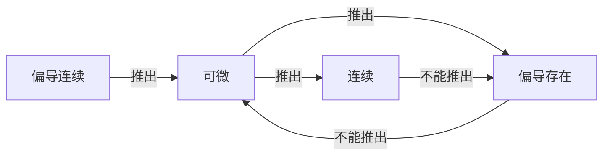
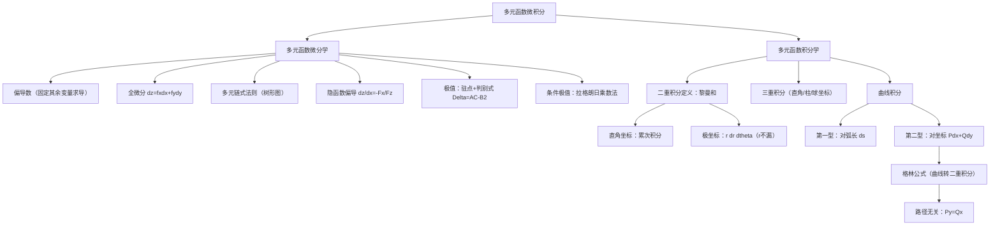

> 📌 从一元到多元，微积分的核心思想得到全面推广。偏导数描述多变量函数沿单一方向的变化率，二重积分将"切片求和"推广到平面区域。本章是数学一压轴题的核心战场。

---

## 📋 前置知识

- [[高等数学 第二章：导数与微分]] — 偏导数是对某个变量求导，本质与一元导数相同
- [[高等数学 第五章：定积分]] — 二重积分的计算化为两次定积分（累次积分）
- [[空间解析几何基础]] — 理解曲面方程、投影区域需要空间想象力
- [[极坐标系]] — 二重积分极坐标变换的基础

---

## 🤔 为什么需要多元函数微积分？

现实世界中几乎所有量都依赖多个变量：温度分布 $T(x, y, z)$ 依赖空间位置，利润 $P(p, q)$ 依赖两种产品的价格，物体受力 $F(x, y)$ 依赖平面坐标。

单变量微积分只能处理"沿一条路径"的变化，而多元微积分能处理"在整个区域上"的积累和"沿任意方向"的变化率——这是从一维世界升级到二维、三维世界的必经之路。

---

## 🧠 第一节：多元函数的基本概念

### 1.1 二元函数的定义

设 $D$ 是平面上的一个非空点集。若对每个点 $(x, y) \in D$，按照某一规则，都有唯一确定的实数 $z$ 与之对应，则称这个对应关系为**二元函数**，记作

$$z = f(x, y), \quad (x, y) \in D$$

$D$ 称为**定义域**，$z$ 称为**因变量**，$x, y$ 称为**自变量**。

> 🎯 **类比**：一元函数是数轴上的"自动售货机"；二元函数是平面上的"温度地图"——每个坐标点都对应一个温度值。

### 1.2 二元函数的极限与连续

**二重极限**：若对任意 $\varepsilon > 0$，存在 $\delta > 0$，当 $0 < \sqrt{(x-x_0)^2+(y-y_0)^2} < \delta$ 时，$|f(x,y) - A| < \varepsilon$，则

$$\lim_{(x,y)\to(x_0,y_0)} f(x,y) = A$$

> ⚠️ **关键区别**：二重极限要求点 $(x,y)$ 以**任意路径**趋向 $(x_0, y_0)$ 时结果都相同。若沿两条不同路径趋向同一点得到不同极限值，则二重极限**不存在**。

**连续**：若 $\lim_{(x,y)\to(x_0,y_0)} f(x,y) = f(x_0,y_0)$，则 $f$ 在 $(x_0,y_0)$ 处连续。

**结论**：多元初等函数在其定义域内处处连续（与一元类似），遇到定义域内的点可直接代入求极限。

---

## 🧠 第二节：偏导数

### 2.1 偏导数的定义

> 🎯 **类比**：你站在山坡上，向正东方走一步，脚下地面的坡度就是"对 $x$ 的偏导数"；向正北方走一步，地面坡度就是"对 $y$ 的偏导数"。偏导数就是"固定其他变量，只让一个变量变化时的变化率"。

$$f_x(x_0, y_0) = \lim_{\Delta x \to 0} \frac{f(x_0 + \Delta x, y_0) - f(x_0, y_0)}{\Delta x}$$

$$f_y(x_0, y_0) = \lim_{\Delta y \to 0} \frac{f(x_0, y_0 + \Delta y) - f(x_0, y_0)}{\Delta y}$$

**记号**：$f_x$，$\dfrac{\partial z}{\partial x}$，$\dfrac{\partial f}{\partial x}$（对 $x$ 的偏导数）

**计算方法**：对 $x$ 求偏导时，把 $y$ 看作常数，用一元求导规则对 $x$ 求导；对 $y$ 求偏导时，把 $x$ 看作常数。

### 2.2 高阶偏导数

二阶偏导数（共四个）：

$$f_{xx} = \frac{\partial^2 z}{\partial x^2}, \quad f_{xy} = \frac{\partial^2 z}{\partial x \partial y}, \quad f_{yx} = \frac{\partial^2 z}{\partial y \partial x}, \quad f_{yy} = \frac{\partial^2 z}{\partial y^2}$$

**混合偏导数相等定理**：若 $f_{xy}$ 与 $f_{yx}$ 在点 $(x_0, y_0)$ 处都连续，则

$$f_{xy}(x_0, y_0) = f_{yx}(x_0, y_0)$$

> ⚠️ **踩坑**：混合偏导数相等需要**连续性**条件。若题目明确给出二阶混合偏导数连续，则可自由交换求导顺序。

### 2.3 全微分

**定义**：若函数 $z = f(x, y)$ 的增量可以表示为

$$\Delta z = A\Delta x + B\Delta y + o(\rho), \quad \rho = \sqrt{(\Delta x)^2 + (\Delta y)^2}$$

则称 $f$ 在该点**可微**，$dz = A\,dx + B\,dy$ 称为**全微分**。

**可微的充分条件**：若 $f_x$、$f_y$ 在 $(x_0, y_0)$ 处连续，则 $f$ 在该点可微，且

$$dz = f_x(x_0,y_0)\,dx + f_y(x_0,y_0)\,dy = \frac{\partial z}{\partial x}\,dx + \frac{\partial z}{\partial y}\,dy$$

**可微、偏导存在、连续的关系**：



> ⚠️ **踩坑**：偏导存在**不能**推出可微，也不能推出连续！这与一元函数不同（一元可导必连续）。

### 2.4 多元复合函数的偏导数（链式法则）

设 $z = f(u, v)$，$u = u(x, y)$，$v = v(x, y)$，则

$$\frac{\partial z}{\partial x} = \frac{\partial z}{\partial u}\cdot\frac{\partial u}{\partial x} + \frac{\partial z}{\partial v}\cdot\frac{\partial v}{\partial x}$$

$$\frac{\partial z}{\partial y} = \frac{\partial z}{\partial u}\cdot\frac{\partial u}{\partial y} + \frac{\partial z}{\partial v}\cdot\frac{\partial v}{\partial y}$$

> 🎯 **记忆方式**：画"树形图"——从 $z$ 到每个中间变量，再到每个自变量，每条路径上的偏导数相乘，所有路径相加。

### 2.5 隐函数的偏导数

**由方程 $F(x, y, z) = 0$ 确定 $z = z(x, y)$**：

$$\frac{\partial z}{\partial x} = -\frac{F_x}{F_z}, \quad \frac{\partial z}{\partial y} = -\frac{F_y}{F_z} \quad (F_z \neq 0)$$

> 🎯 **记忆口诀**："分子是对应自变量的偏导，分母是对因变量的偏导，整体加负号。"

---

## 🧠 第三节：多元函数的极值

### 3.1 无条件极值

**必要条件**：若 $f(x, y)$ 在 $(x_0, y_0)$ 处取得极值，且偏导存在，则

$$f_x(x_0, y_0) = 0, \quad f_y(x_0, y_0) = 0$$

满足此条件的点称为**驻点**。

**充分条件（二阶判别法）**：设 $(x_0, y_0)$ 是驻点，令

$$A = f_{xx}(x_0,y_0), \quad B = f_{xy}(x_0,y_0), \quad C = f_{yy}(x_0,y_0)$$

$$\Delta = AC - B^2$$

| $\Delta$ | $A$ | 结论 |
|---------|-----|------|
| $\Delta > 0$ | $A < 0$ | 极大值 |
| $\Delta > 0$ | $A > 0$ | 极小值 |
| $\Delta < 0$ | — | 不是极值点（鞍点） |
| $\Delta = 0$ | — | 无法判断，需进一步分析 |

> 🎯 **类比**：$\Delta > 0$ 时，曲面在驻点附近像一个"碗"（极小）或"帽子"（极大）；$\Delta < 0$ 时，像一个"马鞍"——沿不同方向，函数一增一减。

### 3.2 条件极值与拉格朗日乘数法

**问题**：在约束条件 $\varphi(x, y) = 0$ 下，求 $f(x, y)$ 的极值。

**方法**：构造**拉格朗日函数**

$$L(x, y, \lambda) = f(x, y) + \lambda \varphi(x, y)$$

令

$$\begin{cases} L_x = f_x + \lambda \varphi_x = 0 \\ L_y = f_y + \lambda \varphi_y = 0 \\ L_\lambda = \varphi(x, y) = 0 \end{cases}$$

解此方程组，得到极值候选点，再判断极大还是极小（通常由实际问题背景判断）。

> 🎯 **几何意义**：极值点处，目标函数 $f$ 的梯度与约束曲线 $\varphi=0$ 的法向量**平行**（即 $\nabla f = -\lambda \nabla \varphi$）。

---

## 🧠 第四节：二重积分

### 4.1 二重积分的定义

> 🎯 **类比**：二重积分就是计算"弯曲地面上的体积"。把平面区域 $D$ 分成无数小格子，每格上竖一个小方柱，高度是 $f(x,y)$，把所有小方柱的体积加起来取极限，就是二重积分。

$$\iint_D f(x, y)\,d\sigma = \lim_{\lambda \to 0} \sum_{i=1}^n f(\xi_i, \eta_i)\Delta\sigma_i$$

其中 $d\sigma$ 是面积微元（直角坐标下 $d\sigma = dx\,dy$），$\lambda$ 是各小区域直径的最大值。

**几何意义**：当 $f(x,y) \geq 0$ 时，$\iint_D f(x,y)\,d\sigma$ 是曲面 $z=f(x,y)$ 与平面区域 $D$ 之间的体积。

### 4.2 二重积分的性质

$$\iint_D [\alpha f + \beta g]\,d\sigma = \alpha\iint_D f\,d\sigma + \beta\iint_D g\,d\sigma$$

$$\iint_{D_1 \cup D_2} f\,d\sigma = \iint_{D_1} f\,d\sigma + \iint_{D_2} f\,d\sigma \quad (D_1, D_2 \text{ 不重叠})$$

$$\iint_D 1\,d\sigma = S_D \quad (\text{区域 } D \text{ 的面积})$$

**估值**：若 $m \leq f(x,y) \leq M$，则 $m \cdot S_D \leq \iint_D f\,d\sigma \leq M \cdot S_D$。

**对称性（考研高频）**：

若积分区域 $D$ 关于 $y$ 轴对称（即关于 $x=0$ 对称）：

$$\iint_D f(x,y)\,d\sigma = \begin{cases} 0, & f(-x,y) = -f(x,y) \text{（关于 $x$ 为奇）} \\ 2\displaystyle\iint_{D_1} f(x,y)\,d\sigma, & f(-x,y) = f(x,y) \text{（关于 $x$ 为偶）} \end{cases}$$

其中 $D_1$ 是 $D$ 在 $x \geq 0$ 的部分。类似地，若 $D$ 关于 $x$ 轴对称，则对 $y$ 的奇偶性做对应处理。

> 💡 **轮换对称性**：若积分区域 $D$ 关于直线 $y=x$ 对称，则

$$\iint_D f(x,y)\,d\sigma = \iint_D f(y,x)\,d\sigma$$

这在化简积分时非常有用。

### 4.3 直角坐标下的累次积分

**X 型区域**（先 $y$ 后 $x$）：$D = \{(x,y) \mid a \leq x \leq b,\; \varphi_1(x) \leq y \leq \varphi_2(x)\}$

$$\iint_D f(x,y)\,d\sigma = \int_a^b\,dx\int_{\varphi_1(x)}^{\varphi_2(x)} f(x,y)\,dy$$

**Y 型区域**（先 $x$ 后 $y$）：$D = \{(x,y) \mid c \leq y \leq d,\; \psi_1(y) \leq x \leq \psi_2(y)\}$

$$\iint_D f(x,y)\,d\sigma = \int_c^d\,dy\int_{\psi_1(y)}^{\psi_2(y)} f(x,y)\,dx$$

> 💡 **选择积分顺序的原则**：选让内层积分**可以算出**的顺序。若先积 $y$ 遇到不可积函数（如 $e^{x^2}$），就换成先积 $x$。同时，选让积分区域边界**更简单**的顺序。

**交换积分顺序**（考研常考）：将 $\int_a^b\,dx\int_{\varphi_1(x)}^{\varphi_2(x)}$ 形式的累次积分，先画出积分区域 $D$，再以 Y 型重新描述，写出 $\int_c^d\,dy\int_{\psi_1(y)}^{\psi_2(y)}$ 的形式。

### 4.4 极坐标下的二重积分

**变换**：$x = r\cos\theta$，$y = r\sin\theta$，面积微元

$$d\sigma = r\,dr\,d\theta$$

$$\iint_D f(x,y)\,d\sigma = \iint_{D'} f(r\cos\theta, r\sin\theta)\,r\,dr\,d\theta$$

> ⚠️ **$r$ 不能漏！** 极坐标变换后，面积微元是 $r\,dr\,d\theta$ 而不是 $dr\,d\theta$。这个 $r$ 来自坐标变换的雅可比行列式，是最容易漏掉的地方。

**适用场景**：

- 积分区域是圆形、扇形、环形
- 被积函数含 $x^2 + y^2$（换成 $r^2$ 后大幅简化）

**常见区域的极坐标表示**：

| 区域形状 | 直角坐标 | 极坐标范围 |
|---------|---------|-----------|
| 整圆 $x^2+y^2 \leq R^2$ | — | $0 \leq r \leq R$，$0 \leq \theta \leq 2\pi$ |
| 上半圆 | $y \geq 0$ | $0 \leq r \leq R$，$0 \leq \theta \leq \pi$ |
| 第一象限圆 | $x,y \geq 0$ | $0 \leq r \leq R$，$0 \leq \theta \leq \frac{\pi}{2}$ |
| 圆环 $a^2 \leq x^2+y^2 \leq b^2$ | — | $a \leq r \leq b$，$0 \leq \theta \leq 2\pi$ |

---

## 🧠 第五节：三重积分（简述）

$$\iiint_\Omega f(x,y,z)\,dV$$

**直角坐标（先一后二法）**：投影到 $xOy$ 平面，得区域 $D_{xy}$，$z$ 从下曲面 $z_1(x,y)$ 到上曲面 $z_2(x,y)$：

$$\iiint_\Omega f\,dV = \iint_{D_{xy}}\,d\sigma\int_{z_1(x,y)}^{z_2(x,y)} f(x,y,z)\,dz$$

**柱坐标**：$x = r\cos\theta$，$y = r\sin\theta$，$z = z$，体积微元 $dV = r\,dr\,d\theta\,dz$

**球坐标**：$x = \rho\sin\varphi\cos\theta$，$y = \rho\sin\varphi\sin\theta$，$z = \rho\cos\varphi$，体积微元 $dV = \rho^2\sin\varphi\,d\rho\,d\varphi\,d\theta$

> 💡 **坐标选择原则**：积分区域是球或球的一部分 $\to$ 球坐标；含 $x^2+y^2$ 但 $z$ 独立 $\to$ 柱坐标；其他情形 $\to$ 直角坐标。

---

## 🧠 第六节：曲线积分与曲面积分（数学一范围）

### 6.1 第一型曲线积分（对弧长的曲线积分）

$$\int_L f(x,y)\,ds$$

**计算**：设曲线 $L$ 由参数方程 $x=\varphi(t)$，$y=\psi(t)$，$t\in[\alpha,\beta]$ 给出，则

$$\int_L f(x,y)\,ds = \int_\alpha^\beta f(\varphi(t),\psi(t))\sqrt{[\varphi'(t)]^2+[\psi'(t)]^2}\,dt$$

若 $L$：$y=y(x)$，$x\in[a,b]$，则 $ds = \sqrt{1+[y'(x)]^2}\,dx$。

### 6.2 第二型曲线积分（对坐标的曲线积分）

$$\int_L P\,dx + Q\,dy$$

**计算**：参数化后（注意积分上下限对应曲线方向）：

$$\int_L P\,dx + Q\,dy = \int_\alpha^\beta [P(\varphi(t),\psi(t))\varphi'(t) + Q(\varphi(t),\psi(t))\psi'(t)]\,dt$$

> ⚠️ **方向敏感**：第二型曲线积分与路径方向有关，方向反向则积分变号：$\displaystyle\int_{L^-} = -\int_L$。

### 6.3 格林公式

设 $D$ 是平面有界区域，边界 $L = \partial D$ 取**正向**（沿边界走时区域在左侧），$P$、$Q$ 在 $D$ 上有连续偏导数，则

$$\oint_L P\,dx + Q\,dy = \iint_D \left(\frac{\partial Q}{\partial x} - \frac{\partial P}{\partial y}\right)d\sigma$$

> 🎯 **应用**：将难以直接计算的曲线积分转化为二重积分（或反过来）。特别地，当 $\dfrac{\partial Q}{\partial x} = \dfrac{\partial P}{\partial y}$（即曲线积分与路径无关）时，$\oint_L P\,dx + Q\,dy = 0$。

**面积公式**（格林公式的特例）：

$$S_D = \frac{1}{2}\oint_L x\,dy - y\,dx$$

### 6.4 曲线积分与路径无关的条件

在单连通区域 $D$ 内，以下四个条件等价：

1. $\int_L P\,dx + Q\,dy$ 与路径无关（只与端点有关）
2. $\oint_L P\,dx + Q\,dy = 0$（沿任意闭曲线）
3. $\dfrac{\partial P}{\partial y} = \dfrac{\partial Q}{\partial x}$ 在 $D$ 内处处成立
4. $P\,dx + Q\,dy$ 是某函数 $u(x,y)$ 的全微分（$du = P\,dx + Q\,dy$）

---

## 💻 代码验证

```python
import sympy as sp

x, y, r, theta = sp.symbols('x y r theta', real=True)

# ---- 偏导数计算 ----
print("=== 偏导数验证 ===")
f = sp.sin(x**2 + y**2) + x*y
fx = sp.diff(f, x)
fy = sp.diff(f, y)
fxy = sp.diff(f, x, y)
fyx = sp.diff(f, y, x)
print(f"f = sin(x²+y²) + xy")
print(f"f_x = {fx}")
print(f"f_y = {fy}")
print(f"f_xy = {sp.simplify(fxy)}")
print(f"f_yx = {sp.simplify(fyx)}")
print(f"f_xy == f_yx: {sp.simplify(fxy - fyx) == 0}")

print()

# ---- 二重积分：直角坐标 ----
print("=== 二重积分（直角坐标）===")
# 计算 ∬_D (x+y) dσ，D: 0<=x<=1, 0<=y<=1
I1 = sp.integrate(sp.integrate(x + y, (y, 0, 1)), (x, 0, 1))
print(f"∬_D (x+y) dσ，D=[0,1]×[0,1] = {I1}")

# ∬_D x² dσ，D: 0<=x<=1, 0<=y<=x
I2 = sp.integrate(sp.integrate(x**2, (y, 0, x)), (x, 0, 1))
print(f"∬_D x² dσ，D: 0≤y≤x, 0≤x≤1 = {I2}")

print()

# ---- 二重积分：极坐标 ----
print("=== 二重积分（极坐标）===")
# ∬_{x²+y²≤1} sqrt(x²+y²) dσ = ∫₀^{2π}∫₀^1 r·r dr dθ
I3 = sp.integrate(sp.integrate(r**2, (r, 0, 1)), (theta, 0, 2*sp.pi))
print(f"∬_{{x²+y²≤1}} √(x²+y²) dσ = {I3}")

# 经典：∬_{x²+y²≤1} e^{-(x²+y²)} dσ
I4 = sp.integrate(sp.integrate(r*sp.exp(-r**2), (r, 0, 1)), (theta, 0, 2*sp.pi))
print(f"∬_{{x²+y²≤1}} e^(-x²-y²) dσ = {sp.simplify(I4)}")

print()

# ---- 极值判别 ----
print("=== 多元函数极值 ===")
f2 = x**3 + y**3 - 3*x*y
f2x = sp.diff(f2, x)
f2y = sp.diff(f2, y)
critical = sp.solve([f2x, f2y], [x, y])
print(f"f = x³+y³-3xy，驻点: {critical}")
for pt in critical:
    A = sp.diff(f2, x, 2).subs([(x, pt[0]), (y, pt[1])])
    B = sp.diff(f2, x, y).subs([(x, pt[0]), (y, pt[1])])
    C = sp.diff(f2, y, 2).subs([(x, pt[0]), (y, pt[1])])
    delta = A*C - B**2
    print(f"  ({pt[0]},{pt[1]}): A={A}, B={B}, C={C}, Δ={delta}", end="")
    if delta > 0:
        print(f" → {'极大值' if A < 0 else '极小值'} = {f2.subs([(x,pt[0]),(y,pt[1])])}")
    elif delta < 0:
        print(" → 鞍点")
    else:
        print(" → 无法判断")
```

```bash
python3 chapter6_multivariable.py
```

**预期输出**：

```text
=== 偏导数验证 ===
f = sin(x²+y²) + xy
f_x = 2*x*cos(x**2 + y**2) + y
f_y = 2*y*cos(x**2 + y**2) + x
f_xy = -4*x*y*sin(x**2 + y**2) + 1
f_yx = -4*x*y*sin(x**2 + y**2) + 1
f_xy == f_yx: True

=== 二重积分（直角坐标）===
∬_D (x+y) dσ，D=[0,1]×[0,1] = 1
∬_D x² dσ，D: 0≤y≤x, 0≤x≤1 = 1/4

=== 二重积分（极坐标）===
∬_{x²+y²≤1} √(x²+y²) dσ = 2*pi/3
∬_{x²+y²≤1} e^(-x²-y²) dσ = pi*(-1 + exp(1))/exp(1)

=== 多元函数极值 ===
f = x³+y³-3xy，驻点: [(0, 0), (1, 1)]
  (0,0): A=0, B=-3, C=0, Δ=-9 → 鞍点
  (1,1): A=6, B=-3, C=6, Δ=27 → 极小值 = -1
```

---

## ⚠️ 常见误区与踩坑点

> ❌ **误区 1：偏导存在就等于可微**
> 一元函数中可导等价于可微，但多元函数中偏导存在**不能**推出可微。反例：$f(x,y) = \dfrac{xy}{x^2+y^2}$（$(0,0)$ 处令其为 $0$），偏导存在但在原点不连续也不可微。

> ⚠️ **踩坑 2：极坐标积分漏写 $r$**
> $\iint_D f\,d\sigma$ 换极坐标后是 $\iint f(r\cos\theta, r\sin\theta) \cdot r \,dr\,d\theta$，$r$ 来自雅可比行列式，绝对不能漏。

> ⚠️ **踩坑 3：累次积分交换顺序时上下限搞错**
> 交换积分顺序前必须先**画出积分区域** $D$，再重新用另一种方式描述 $D$ 的边界，不能凭感觉直接交换上下限。

> ❌ **误区 4：格林公式忘记正方向**
> 格林公式中，边界曲线 $L$ 必须取**正向**（逆时针，区域在左）。若题目中路径是顺时针，必须加负号。

> ⚠️ **踩坑 4：驻点不一定是极值点**
> $\Delta = AC - B^2 > 0$ 时才能判断极值；$\Delta < 0$ 是鞍点；$\Delta = 0$ 时二阶判别法失效，需用定义或更高阶分析。

> ⚠️ **踩坑 5：二重极限与累次极限混淆**
> 二重极限 $\lim_{(x,y)\to(0,0)}$ 要求沿任意路径趋向；而先令 $x\to 0$ 再令 $y\to 0$ 是累次极限。二重极限存在能推出累次极限存在且相等，反之不然。

---

## 🔄 关键公式对比速查

| 类型 | 直角坐标 | 极坐标 | 柱/球坐标 |
|------|---------|--------|----------|
| 面积微元 | $dx\,dy$ | $r\,dr\,d\theta$ | — |
| 体积微元 | $dx\,dy\,dz$ | $r\,dr\,d\theta\,dz$（柱） | $\rho^2\sin\varphi\,d\rho\,d\varphi\,d\theta$（球） |
| 弧长微元 | $\sqrt{1+y'^2}\,dx$ | $\sqrt{r^2+r'^2}\,d\theta$ | — |
| 适用区域 | 矩形、三角形等 | 圆、扇形、环形 | 球体、锥体 |

> 💡 **选坐标系的口诀**：含 $x^2+y^2$ 用极坐标；含 $x^2+y^2+z^2$ 用球坐标；其余用直角坐标。

---

## 🏋️ 动手练习

### 练习 1：偏导数与全微分（⭐⭐ 中等）

**题目**：设 $z = e^{xy} \ln(x+y)$，求 $\dfrac{\partial z}{\partial x}$、$\dfrac{\partial z}{\partial y}$，并写出全微分 $dz$。

**参考答案**：

$$\frac{\partial z}{\partial x} = y e^{xy} \ln(x+y) + e^{xy} \cdot \frac{1}{x+y} = e^{xy}\!\left(y\ln(x+y) + \frac{1}{x+y}\right)$$

$$\frac{\partial z}{\partial y} = x e^{xy} \ln(x+y) + e^{xy} \cdot \frac{1}{x+y} = e^{xy}\!\left(x\ln(x+y) + \frac{1}{x+y}\right)$$

全微分：

$$dz = \frac{\partial z}{\partial x}\,dx + \frac{\partial z}{\partial y}\,dy = e^{xy}\!\left[\left(y\ln(x+y)+\frac{1}{x+y}\right)dx + \left(x\ln(x+y)+\frac{1}{x+y}\right)dy\right]$$

---

### 练习 2：隐函数偏导（⭐⭐ 中等）

**题目**：设 $z = z(x,y)$ 由方程 $x^2 + y^2 + z^2 = xyz + 6$ 确定，求 $\dfrac{\partial z}{\partial x}$ 和 $\dfrac{\partial z}{\partial y}$。

**参考答案**：

令 $F(x,y,z) = x^2 + y^2 + z^2 - xyz - 6$，则：

$$F_x = 2x - yz, \quad F_y = 2y - xz, \quad F_z = 2z - xy$$

$$\frac{\partial z}{\partial x} = -\frac{F_x}{F_z} = -\frac{2x - yz}{2z - xy} = \frac{yz - 2x}{2z - xy}$$

$$\frac{\partial z}{\partial y} = -\frac{F_y}{F_z} = -\frac{2y - xz}{2z - xy} = \frac{xz - 2y}{2z - xy}$$

---

### 练习 3：交换积分顺序（⭐⭐⭐ 较难）

**题目**：交换积分顺序：$\displaystyle\int_0^1 dx\int_{x^2}^x f(x,y)\,dy$

**参考答案**：

先确定积分区域 $D$：$0 \leq x \leq 1$，$x^2 \leq y \leq x$。

画图分析：$D$ 是由 $y = x$（上界）和 $y = x^2$（下界）在 $[0,1]$ 上围成的区域。

改用 Y 型描述：对固定的 $y \in [0,1]$，$x$ 的范围由 $x^2 \leq y \leq x$ 解出：

从 $y = x^2$ 得 $x \geq \sqrt{y}$；从 $y = x$ 得 $x \geq y$（且 $x \leq 1$）。

所以当 $y \in [0,1]$ 时，$x$ 从 $y$（由 $y=x$ 解出）到 $1$... 不对，需更仔细分析：

$D = \{(x,y) \mid 0 \leq y \leq 1,\; y \leq x \leq \sqrt{y}\}$（在 $[0,1]$ 内，$x$ 在 $y=x$ 右侧即 $x \geq y$，在 $y=x^2$ 左侧即 $x \leq \sqrt{y}$）。

故交换后：

$$\int_0^1 dy\int_y^{\sqrt{y}} f(x,y)\,dx$$

---

### 练习 4：极坐标二重积分（⭐⭐⭐ 较难）

**题目**：计算 $\displaystyle\iint_D e^{x^2+y^2}\,d\sigma$，其中 $D: x^2+y^2 \leq 4$。

**参考答案**：

$D$ 是半径为 $2$ 的圆盘，含 $x^2+y^2$，用极坐标：

$$\iint_D e^{x^2+y^2}\,d\sigma = \int_0^{2\pi}d\theta\int_0^2 e^{r^2} \cdot r\,dr$$

$$= 2\pi \int_0^2 r e^{r^2}\,dr = 2\pi \cdot \frac{1}{2}\left[e^{r^2}\right]_0^2 = \pi(e^4 - 1)$$

---

### 练习 5：多元函数极值（⭐⭐⭐ 较难）

**题目**：求 $f(x,y) = x^3 + y^3 - 3x - 3y$ 的极值。

**参考答案**：

联立偏导为零：

$$f_x = 3x^2 - 3 = 0 \implies x = \pm 1$$

$$f_y = 3y^2 - 3 = 0 \implies y = \pm 1$$

共四个驻点：$(1,1)$，$(1,-1)$，$(-1,1)$，$(-1,-1)$。

二阶偏导：$f_{xx} = 6x$，$f_{xy} = 0$，$f_{yy} = 6y$，$\Delta = 36xy$。

| 驻点 | $A = 6x$ | $B = 0$ | $C = 6y$ | $\Delta = 36xy$ | 结论 |
|-----|---------|---------|---------|----------------|------|
| $(1,1)$ | $6$ | $0$ | $6$ | $36 > 0$ | $A>0$，极小值 $f=-4$ |
| $(1,-1)$ | $6$ | $0$ | $-6$ | $-36 < 0$ | 鞍点 |
| $(-1,1)$ | $-6$ | $0$ | $6$ | $-36 < 0$ | 鞍点 |
| $(-1,-1)$ | $-6$ | $0$ | $-6$ | $36 > 0$ | $A<0$，极大值 $f=4$ |

极小值 $f(1,1) = -4$，极大值 $f(-1,-1) = 4$。

---

### 练习 6：格林公式（⭐⭐⭐⭐ 难）

**题目**：计算 $\displaystyle\oint_L (x^2 - y)\,dx + (x + \sin^2 y)\,dy$，其中 $L$ 是圆 $x^2+y^2=4$ 的正向（逆时针）。

**参考答案**：

令 $P = x^2 - y$，$Q = x + \sin^2 y$，则：

$$\frac{\partial Q}{\partial x} = 1, \quad \frac{\partial P}{\partial y} = -1$$

$$\frac{\partial Q}{\partial x} - \frac{\partial P}{\partial y} = 1 - (-1) = 2$$

由格林公式（$D$ 是圆盘 $x^2+y^2 \leq 4$，面积 $S = 4\pi$）：

$$\oint_L P\,dx + Q\,dy = \iint_D 2\,d\sigma = 2 \cdot 4\pi = 8\pi$$

---

### 练习 7：拉格朗日乘数法（⭐⭐⭐⭐ 难）

**题目**：在约束条件 $x + y + z = 1$ 下，求 $f(x,y,z) = x^2 + y^2 + z^2$ 的最小值。

**参考答案**：

构造拉格朗日函数：

$$L = x^2 + y^2 + z^2 + \lambda(x + y + z - 1)$$

令偏导为零：

$$L_x = 2x + \lambda = 0 \implies x = -\frac{\lambda}{2}$$

$$L_y = 2y + \lambda = 0 \implies y = -\frac{\lambda}{2}$$

$$L_z = 2z + \lambda = 0 \implies z = -\frac{\lambda}{2}$$

$$L_\lambda = x + y + z - 1 = 0$$

由前三式得 $x = y = z$，代入约束：$3x = 1$，$x = y = z = \dfrac{1}{3}$。

最小值 $f\!\left(\dfrac{1}{3},\dfrac{1}{3},\dfrac{1}{3}\right) = 3 \times \dfrac{1}{9} = \dfrac{1}{3}$。

（由几何意义，平面 $x+y+z=1$ 上到原点距离最近的点即最小值点，由对称性唯一，故此为全局最小值。）

---

## 📝 总结

### 本章要点回顾

1. **偏导数**：固定其他变量，对某一变量求导；可微 $\Rightarrow$ 偏导存在，但反之不成立（与一元不同）；混合偏导在连续条件下可交换顺序。

2. **全微分**：$dz = f_x\,dx + f_y\,dy$；可微的充分条件是偏导连续；可微的必要条件是偏导存在。

3. **多元极值**：驻点处 $f_x=f_y=0$；用 $\Delta = AC-B^2$ 判断（$\Delta>0$ 看 $A$ 的符号，$\Delta<0$ 是鞍点，$\Delta=0$ 失效）；有约束用拉格朗日乘数法。

4. **二重积分计算**：直角坐标化为累次积分（X 型或 Y 型），选顺序时先画区域；含 $x^2+y^2$ 或区域为圆形时换极坐标（别忘 $r$）；对称区域先判断奇偶性快速化简。

5. **格林公式**：$\oint_L P\,dx + Q\,dy = \iint_D \left(\frac{\partial Q}{\partial x} - \frac{\partial P}{\partial y}\right)d\sigma$；注意正方向；路径无关等价于 $\frac{\partial P}{\partial y} = \frac{\partial Q}{\partial x}$。

### 知识图谱



---

## 🔗 相关链接

- 前置章节：[[高等数学 第五章：定积分]]
- 关联概念：[[空间解析几何]]、[[极坐标系]]
- 下一模块：[[高等数学 第七章：微分方程]]
- 延伸内容：[[曲面积分与高斯公式]]、[[斯托克斯公式]]

## 📚 参考资料

- 同济大学数学系《高等数学》（第七版）下册第七~十章 —— 多元微积分标准教材
- 张宇《高等数学 18 讲》第 9~14 讲 —— 二重积分与格林公式专项讲解精炼
- 武忠祥《高等数学辅导讲义》—— 极坐标换元与积分顺序交换专题详尽
- 李永乐《数学复习全书》—— 拉格朗日乘数法与曲线积分历年真题汇总
