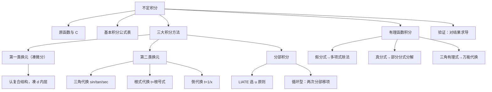

> 📌 不定积分是求导的"逆运算"——已知变化率 $f'(x)$，反求原函数 $f(x)$。掌握不定积分的三大方法（换元、分部、有理函数积分），是拿下定积分和微分方程的前提。

---

## 📋 前置知识

- [[高等数学 第二章：导数与微分]] — 不定积分每一步都要用导数验证；微分形式不变性是换元法的理论基础
- [[基本初等函数的导数公式]] — 基本积分表直接由导数公式"反过来"得到，必须背熟
- [[复合函数求导（链式法则）]] — 第一类换元法（凑微分）的逆过程

---

## 🤔 为什么需要不定积分？

你知道一辆车每时刻的速度 $v(t)$，想知道它走了多远——这就是从导数（速度）反推原函数（位移）的过程，也就是不定积分。

更一般地：任何"已知变化率，求原量"的问题都归结为不定积分。物理中的势能、电荷量，经济中的成本函数，工程中的信号处理——不定积分无处不在。

---

## 🧠 第一节：原函数与不定积分的定义

### 1.1 原函数

**定义**：若在区间 $I$ 上，$F'(x) = f(x)$，则称 $F(x)$ 是 $f(x)$ 在 $I$ 上的一个**原函数**。

> 🎯 **类比**：求导是"拆礼物"（已知包装好的 $F$，拆出里面的 $f$）；求原函数是"包礼物"（已知 $f$，包出 $F$）。

**原函数存在定理**：若 $f(x)$ 在区间 $I$ 上**连续**，则 $f(x)$ 在 $I$ 上一定存在原函数。

> ⚠️ **原函数不唯一**：若 $F(x)$ 是原函数，则 $F(x) + C$（$C$ 为任意常数）也是原函数，且 $f(x)$ 的所有原函数都是这种形式。

**证明唯一性**：若 $F'(x) = G'(x) = f(x)$，则 $[F(x)-G(x)]' = 0$，故 $F(x) - G(x) = C$（常数）。

### 1.2 不定积分的定义

$f(x)$ 的全体原函数称为 $f(x)$ 的**不定积分**，记作

$$\int f(x)\,dx = F(x) + C$$

其中 $\int$ 是积分号，$f(x)$ 是**被积函数**，$f(x)\,dx$ 是**被积表达式**，$x$ 是**积分变量**，$C$ 是**积分常数**。

**基本关系**（导数与积分互逆）：

$$\frac{d}{dx}\left[\int f(x)\,dx\right] = f(x)$$

$$\int F'(x)\,dx = F(x) + C$$

$$\int df(x) = f(x) + C, \quad d\left[\int f(x)\,dx\right] = f(x)\,dx$$

---

## 🧠 第二节：基本积分公式

由基本导数公式直接"反推"得到，必须**全部背熟**：

$$\int x^\alpha\,dx = \frac{x^{\alpha+1}}{\alpha+1} + C \quad (\alpha \neq -1)$$

$$\int \frac{1}{x}\,dx = \ln|x| + C$$

$$\int e^x\,dx = e^x + C, \quad \int a^x\,dx = \frac{a^x}{\ln a} + C$$

$$\int \sin x\,dx = -\cos x + C, \quad \int \cos x\,dx = \sin x + C$$

$$\int \sec^2 x\,dx = \tan x + C, \quad \int \csc^2 x\,dx = -\cot x + C$$

$$\int \sec x \tan x\,dx = \sec x + C, \quad \int \csc x \cot x\,dx = -\csc x + C$$

$$\int \frac{dx}{\sqrt{1-x^2}} = \arcsin x + C, \quad \int \frac{dx}{1+x^2} = \arctan x + C$$

$$\int \frac{dx}{\sqrt{x^2 \pm a^2}} = \ln\!\left|x + \sqrt{x^2 \pm a^2}\right| + C$$

$$\int \frac{dx}{x^2 - a^2} = \frac{1}{2a}\ln\left|\frac{x-a}{x+a}\right| + C$$

$$\int \frac{dx}{a^2 - x^2} = \frac{1}{2a}\ln\left|\frac{x+a}{x-a}\right| + C$$

$$\int \sqrt{a^2 - x^2}\,dx = \frac{x}{2}\sqrt{a^2-x^2} + \frac{a^2}{2}\arcsin\frac{x}{a} + C$$

> ⚠️ **$\int \frac{1}{x}dx = \ln|x| + C$，绝对值不能漏**！因为 $x$ 可以为负，$\ln(-x)$ 求导也得 $\dfrac{1}{x}$。

---

## 🧠 第三节：第一类换元法（凑微分法）

### 3.1 原理

> 🎯 **类比**：凑微分就像"把零钱凑成整钱"。积分式里有一个多余的因子，它恰好是某个函数的导数，于是把它"塞进" $d$ 里面，让整个式子变成标准形式。

**定理**：若 $\int f(u)\,du = F(u) + C$，且 $u = \varphi(x)$ 可导，则

$$\int f(\varphi(x))\,\varphi'(x)\,dx = \int f(\varphi(x))\,d\varphi(x) = F(\varphi(x)) + C$$

**本质**：把 $\varphi'(x)\,dx$ 凑成 $d[\varphi(x)]$，然后整体换元。

### 3.2 常用凑微分形式

| 原式 | 凑成 |
|------|------|
| $dx$ | $\dfrac{1}{a}d(ax+b)$ |
| $x\,dx$ | $\dfrac{1}{2}d(x^2)$ |
| $x^{n}\,dx$ | $\dfrac{1}{n+1}d(x^{n+1})$ |
| $\dfrac{dx}{x}$ | $d(\ln\|x\|)$ |
| $e^x\,dx$ | $d(e^x)$ |
| $\cos x\,dx$ | $d(\sin x)$ |
| $\sin x\,dx$ | $-d(\cos x)$ |
| $\sec^2 x\,dx$ | $d(\tan x)$ |
| $\dfrac{dx}{\sqrt{x}}$ | $2\,d(\sqrt{x})$ |
| $\dfrac{dx}{1+x^2}$ | $d(\arctan x)$ |

### 3.3 示例

**例 1**：$\displaystyle\int \frac{x}{\sqrt{1-x^2}}\,dx$

令 $u = 1 - x^2$，则 $du = -2x\,dx$，即 $x\,dx = -\dfrac{1}{2}du$：

$$\int \frac{x}{\sqrt{1-x^2}}\,dx = -\frac{1}{2}\int \frac{du}{\sqrt{u}} = -\frac{1}{2} \cdot 2\sqrt{u} + C = -\sqrt{1-x^2} + C$$

**例 2**：$\displaystyle\int \tan x\,dx$

$$\int \tan x\,dx = \int \frac{\sin x}{\cos x}\,dx = -\int \frac{d(\cos x)}{\cos x} = -\ln|\cos x| + C$$

**例 3**：$\displaystyle\int \sin^3 x\,dx$

$$\int \sin^3 x\,dx = \int \sin^2 x \cdot \sin x\,dx = \int (1-\cos^2 x)(-d\cos x)$$

令 $u = \cos x$：

$$= -\int (1-u^2)\,du = -u + \frac{u^3}{3} + C = -\cos x + \frac{\cos^3 x}{3} + C$$

---

## 🧠 第四节：第二类换元法

### 4.1 原理

当被积函数含有根号 $\sqrt{a^2 - x^2}$、$\sqrt{x^2 \pm a^2}$ 或其他难以直接处理的结构时，**主动令 $x = \varphi(t)$**（引入新变量），将积分化为关于 $t$ 的积分。

$$\int f(x)\,dx \xrightarrow{x = \varphi(t)} \int f(\varphi(t))\,\varphi'(t)\,dt$$

计算完后，必须**换回 $x$**。

### 4.2 三角代换（处理根式的标准手段）

| 被积函数含 | 令 $x =$ | 则根号化为 | 使用恒等式 |
|-----------|---------|-----------|-----------|
| $\sqrt{a^2 - x^2}$ | $a\sin t$，$t \in \left[-\dfrac{\pi}{2}, \dfrac{\pi}{2}\right]$ | $a\cos t$ | $1-\sin^2 t = \cos^2 t$ |
| $\sqrt{x^2 + a^2}$ | $a\tan t$，$t \in \left(-\dfrac{\pi}{2}, \dfrac{\pi}{2}\right)$ | $\dfrac{a}{\cos t}$ | $1+\tan^2 t = \sec^2 t$ |
| $\sqrt{x^2 - a^2}$ | $\dfrac{a}{\cos t}$，$t \in \left[0, \dfrac{\pi}{2}\right)$ | $a\tan t$ | $\sec^2 t - 1 = \tan^2 t$ |

> ⚠️ **换回 $x$ 时要画直角三角形辅助**：例如令 $x = a\sin t$，则 $\sin t = \dfrac{x}{a}$，用直角三角形得 $\cos t = \dfrac{\sqrt{a^2-x^2}}{a}$，$\tan t = \dfrac{x}{\sqrt{a^2-x^2}}$。

### 4.3 倒代换与根式代换

**倒代换**：被积函数分母次数远高于分子时，令 $x = \dfrac{1}{t}$，可降低分母次数。

**根式代换**：含 $\sqrt[n]{ax+b}$ 时，令 $t = \sqrt[n]{ax+b}$，直接去掉根号。

**示例**：$\displaystyle\int \frac{dx}{\sqrt{x}(1+\sqrt[3]{x})}$

令 $x = t^6$（取 2 和 3 的最小公倍数），则 $dx = 6t^5\,dt$，$\sqrt{x} = t^3$，$\sqrt[3]{x} = t^2$：

$$\int \frac{6t^5\,dt}{t^3(1+t^2)} = 6\int \frac{t^2}{1+t^2}\,dt = 6\int \left(1 - \frac{1}{1+t^2}\right)dt = 6(t - \arctan t) + C$$

换回 $x$（$t = x^{1/6}$）：

$$= 6\!\left(x^{1/6} - \arctan x^{1/6}\right) + C$$

---

## 🧠 第五节：分部积分法

### 5.1 公式

> 🎯 **来源**：对乘积求导公式 $(uv)' = u'v + uv'$ 两边积分，移项得：

$$\int u\,dv = uv - \int v\,du$$

这就是**分部积分公式**。

### 5.2 何时使用分部积分？

当被积函数是**两种不同类型函数的乘积**，且不能用换元法解决时，使用分部积分。

**LIATE 选 $u$ 原则**（$u$ 优先选排在前面的类型）：

$$\underbrace{L}_{\text{对数}} > \underbrace{I}_{\text{反三角}} > \underbrace{A}_{\text{代数（多项式）}} > \underbrace{T}_{\text{三角}} > \underbrace{E}_{\text{指数}}$$

> 💡 **口诀**："反对幂三指"——反三角、对数、幂函数、三角函数、指数函数，越靠前越优先选为 $u$，剩余部分凑进 $dv$。

### 5.3 典型组合与处理方式

| 被积函数类型 | 选 $u$ | 选 $dv$ | 备注 |
|------------|-------|--------|------|
| $P(x) e^x$ | $P(x)$（多项式） | $e^x\,dx$ | 分部后多项式降次 |
| $P(x) \sin x$ | $P(x)$ | $\sin x\,dx$ | 同上 |
| $P(x) \ln x$ | $\ln x$ | $P(x)\,dx$ | 对数优先 |
| $e^x \sin x$ | $e^x$ 或 $\sin x$ | 另一个 | 循环两次，移项求解 |
| $\arctan x$ | $\arctan x$ | $dx$ | 反三角优先 |

### 5.4 示例

**例 1**：$\displaystyle\int x e^x\,dx$

令 $u = x$，$dv = e^x\,dx$，则 $du = dx$，$v = e^x$：

$$\int x e^x\,dx = x e^x - \int e^x\,dx = x e^x - e^x + C = (x-1)e^x + C$$

**例 2**：$\displaystyle\int e^x \sin x\,dx$（循环型）

第一次分部（$u = \sin x$，$dv = e^x\,dx$）：

$$\int e^x \sin x\,dx = e^x \sin x - \int e^x \cos x\,dx$$

第二次分部（$u = \cos x$，$dv = e^x\,dx$）：

$$\int e^x \cos x\,dx = e^x \cos x + \int e^x \sin x\,dx$$

代回：

$$\int e^x \sin x\,dx = e^x \sin x - e^x \cos x - \int e^x \sin x\,dx$$

$$2\int e^x \sin x\,dx = e^x(\sin x - \cos x)$$

$$\int e^x \sin x\,dx = \frac{e^x(\sin x - \cos x)}{2} + C$$

**例 3**：$\displaystyle\int \ln x\,dx$

令 $u = \ln x$，$dv = dx$：

$$\int \ln x\,dx = x\ln x - \int x \cdot \frac{1}{x}\,dx = x\ln x - x + C$$

---

## 🧠 第六节：有理函数的积分

### 6.1 有理函数

形如 $R(x) = \dfrac{P(x)}{Q(x)}$（$P$、$Q$ 为多项式）的函数称为**有理函数**。

若 $\deg P < \deg Q$，称为**真分式**；否则先做多项式除法，化为**多项式 $+$ 真分式**。

### 6.2 部分分式分解

对真分式，将分母 $Q(x)$ 分解为不可约因子之积，然后分拆：

| 分母因子 | 对应部分分式 |
|---------|------------|
| $(x - a)$ | $\dfrac{A}{x-a}$ |
| $(x - a)^k$ | $\dfrac{A_1}{x-a} + \dfrac{A_2}{(x-a)^2} + \cdots + \dfrac{A_k}{(x-a)^k}$ |
| $(x^2 + px + q)$（不可约） | $\dfrac{Ax + B}{x^2+px+q}$ |
| $(x^2 + px + q)^k$ | $\dfrac{A_1 x+B_1}{x^2+px+q} + \cdots + \dfrac{A_k x+B_k}{(x^2+px+q)^k}$ |

**示例**：$\displaystyle\int \frac{x+2}{x^2-1}\,dx$

$$\frac{x+2}{x^2-1} = \frac{x+2}{(x-1)(x+1)} = \frac{A}{x-1} + \frac{B}{x+1}$$

待定系数法：$x+2 = A(x+1) + B(x-1)$

令 $x=1$：$3 = 2A$，$A = \dfrac{3}{2}$

令 $x=-1$：$1 = -2B$，$B = -\dfrac{1}{2}$

$$\int \frac{x+2}{x^2-1}\,dx = \frac{3}{2}\int \frac{dx}{x-1} - \frac{1}{2}\int \frac{dx}{x+1} = \frac{3}{2}\ln|x-1| - \frac{1}{2}\ln|x+1| + C$$

### 6.3 三角有理函数的积分

含 $\sin x$、$\cos x$ 的有理式，用**万能代换** $t = \tan\dfrac{x}{2}$：

$$\sin x = \frac{2t}{1+t^2}, \quad \cos x = \frac{1-t^2}{1+t^2}, \quad dx = \frac{2}{1+t^2}\,dt$$

> ⚠️ **万能代换计算量大**，优先考虑其他方法（如辅助角、积化和差）。若分母只含 $\sin^2 x$ 或 $\cos^2 x$，可用 $t = \tan x$ 更简便。

---

## 🧠 第七节：几类特殊积分技巧

### 7.1 配方法处理二次式

$$\int \frac{dx}{ax^2 + bx + c}$$

先对分母配方：$ax^2 + bx + c = a\!\left(x + \dfrac{b}{2a}\right)^2 + c - \dfrac{b^2}{4a}$，化为标准形式 $\int \dfrac{du}{u^2 \pm k^2}$。

### 7.2 利用奇偶性简化（为定积分预备）

若 $f(x)$ 是奇函数，其不定积分是偶函数（加 $C$ 后）；若 $f(x)$ 是偶函数，其不定积分是奇函数（加 $C$ 后）。

### 7.3 递推公式

**$I_n = \displaystyle\int \sin^n x\,dx$ 的递推**：

$$I_n = -\frac{\sin^{n-1}x \cos x}{n} + \frac{n-1}{n}I_{n-2}$$

类似地有 $\displaystyle\int \cos^n x\,dx$ 的递推，形式对称。

**$I_n = \displaystyle\int \sec^n x\,dx$ 的递推**：

$$I_n = \frac{\sec^{n-2}x \tan x}{n-1} + \frac{n-2}{n-1}I_{n-2}$$

---

## 💻 代码验证

```python
import sympy as sp

x = sp.Symbol('x')

# ---- 验证基本积分公式 ----
print("基本积分验证（对结果求导应还原被积函数）：")
checks = [
    (x**3, "x^3"),
    (1/x, "1/x"),
    (sp.exp(x), "e^x"),
    (sp.sin(x), "sin(x)"),
    (1/(1+x**2), "1/(1+x^2)"),
]
for f, name in checks:
    F = sp.integrate(f, x)
    verify = sp.simplify(sp.diff(F, x) - f)
    status = "✓" if verify == 0 else f"差值={verify}"
    print(f"  ∫{name}dx = {F}  {status}")

print()

# ---- 换元法示例 ----
f1 = x / sp.sqrt(1 - x**2)
F1 = sp.integrate(f1, x)
print(f"∫ x/√(1-x²) dx = {F1}")

# ---- 分部积分示例 ----
f2 = x * sp.exp(x)
F2 = sp.integrate(f2, x)
print(f"∫ x·e^x dx = {sp.simplify(F2)}")

f3 = sp.exp(x) * sp.sin(x)
F3 = sp.integrate(f3, x)
print(f"∫ e^x·sin(x) dx = {sp.simplify(F3)}")

f4 = sp.ln(x)
F4 = sp.integrate(f4, x)
print(f"∫ ln(x) dx = {F4}")

print()

# ---- 有理函数分解 ----
f5 = (x + 2) / (x**2 - 1)
F5 = sp.integrate(f5, x)
print(f"∫ (x+2)/(x²-1) dx = {F5}")

# ---- 三角代换 ----
f6 = 1 / sp.sqrt(1 - x**2)
F6 = sp.integrate(f6, x)
print(f"∫ 1/√(1-x²) dx = {F6}")
```

```bash
python3 chapter4_integral.py
```

**预期输出**：

```text
基本积分验证（对结果求导应还原被积函数）：
  ∫x^3dx = x**4/4  ✓
  ∫1/xdx = log(x)  ✓
  ∫e^xdx = exp(x)  ✓
  ∫sin(x)dx = -cos(x)  ✓
  ∫1/(1+x^2)dx = atan(x)  ✓

∫ x/√(1-x²) dx = -sqrt(1 - x**2)

∫ x·e^x dx = (x - 1)*exp(x)

∫ e^x·sin(x) dx = exp(x)*sin(x)/2 - exp(x)*cos(x)/2

∫ ln(x) dx = x*log(x) - x

∫ (x+2)/(x²-1) dx = 3*log(x - 1)/2 - log(x + 1)/2

∫ 1/√(1-x²) dx = asin(x)
```

---

## ⚠️ 常见误区与踩坑点

> ❌ **误区 1：忘记写积分常数 $C$**
> 不定积分结果必须加 $+ C$。在考研评分中漏写 $C$ 扣分。$C$ 代表的是"任意常数"，不能写成具体数字。

> ❌ **误区 2：$\int \frac{1}{x}\,dx = \ln x + C$**
> 正确写法是 $\ln|x| + C$。当 $x < 0$ 时，$(\ln(-x))' = \dfrac{1}{x}$，所以绝对值不能省略。

> ⚠️ **踩坑 3：换元后忘记换回原变量**
> 第二类换元法，令 $x = \varphi(t)$ 计算完后，必须将 $t$ 用 $x$ 表达替换回去，得到关于 $x$ 的表达式才是最终答案。

> ⚠️ **踩坑 4：分部积分选错 $u$ 和 $dv$**
> 选 $dv$ 时，$dv$ 必须是**容易积分**的部分。若 $dv$ 包含 $\ln x$ 或反三角函数，则 $v$ 不易求出，选择方向错误。牢记 LIATE 原则。

> ❌ **误区 5：循环分部积分中符号出错**
> $\int e^x \sin x\,dx$ 的循环型，第二次分部后得到 $-\int e^x\sin x\,dx$，移项时是"$+ \int$"，故两边系数为 $2$。符号搞错会导致 $0 = 0$ 的无效等式。

> ⚠️ **踩坑 6：有理函数分解时分母忘记完全因式分解**
> 必须将分母彻底分解为不可约因子。例如 $x^4 - 1 = (x^2+1)(x+1)(x-1)$，不能停在 $(x^2-1)(x^2+1)$ 就分解部分分式。

> ⚠️ **踩坑 7：三角代换后根号的化简**
> 令 $x = a\sin t$ 时，$\sqrt{a^2 - x^2} = \sqrt{a^2\cos^2 t} = |a\cos t|$。由于 $t \in \left[-\dfrac{\pi}{2}, \dfrac{\pi}{2}\right]$，$\cos t \geq 0$，所以 $= a\cos t$（去掉绝对值）。若忽略 $t$ 的范围限制，处理绝对值时会出错。

---

## 🔄 换元法 vs 分部积分对比

| 特征 | 第一类换元（凑微分） | 第二类换元 | 分部积分 |
|------|-----------------|-----------|---------|
| 被积函数特征 | 含复合函数，有"内层导数"出现 | 含根式或特殊结构 | 两类不同函数相乘 |
| 操作方向 | 主动凑 $d[\varphi(x)]$ | 主动令 $x = \varphi(t)$ | 拆成 $u\,dv$，递推降次 |
| 是否需要换回 | 否（变量未变） | **是**（必须换回 $x$） | 否 |
| 典型场景 | $\int f(\varphi(x))\varphi'(x)\,dx$ | $\int \sqrt{a^2-x^2}\,dx$ 等 | $\int x e^x\,dx$，$\int \ln x\,dx$ 等 |

> 💡 **实战选法**：先看被积函数是否能凑微分（最简单）；含根式考虑三角代换；两类函数相乘考虑分部积分；分母是多项式考虑部分分式。

---

## 🏋️ 动手练习

### 练习 1：凑微分（⭐⭐ 中等）

**题目**：求 $\displaystyle\int \frac{\arctan x}{1+x^2}\,dx$

**参考答案**：

注意 $\dfrac{1}{1+x^2} = (\arctan x)'$，故可凑微分：

$$\int \frac{\arctan x}{1+x^2}\,dx = \int \arctan x\,d(\arctan x)$$

令 $u = \arctan x$：

$$= \int u\,du = \frac{u^2}{2} + C = \frac{(\arctan x)^2}{2} + C$$

---

### 练习 2：三角换元（⭐⭐ 中等）

**题目**：求 $\displaystyle\int \frac{dx}{\sqrt{4-x^2}}$（用三角代换，展示完整过程）

**参考答案**：

令 $x = 2\sin t$，$t \in \left[-\dfrac{\pi}{2}, \dfrac{\pi}{2}\right]$，则 $dx = 2\cos t\,dt$，$\sqrt{4-x^2} = 2\cos t$：

$$\int \frac{2\cos t\,dt}{2\cos t} = \int dt = t + C$$

换回 $x$：由 $x = 2\sin t$，得 $\sin t = \dfrac{x}{2}$，故 $t = \arcsin\dfrac{x}{2}$：

$$= \arcsin\frac{x}{2} + C$$

---

### 练习 3：分部积分（⭐⭐ 中等）

**题目**：求 $\displaystyle\int x^2 \ln x\,dx$

**参考答案**：

LIATE 原则：$u = \ln x$（对数优先），$dv = x^2\,dx$，则 $du = \dfrac{1}{x}dx$，$v = \dfrac{x^3}{3}$：

$$\int x^2 \ln x\,dx = \frac{x^3}{3}\ln x - \int \frac{x^3}{3} \cdot \frac{1}{x}\,dx = \frac{x^3}{3}\ln x - \frac{1}{3}\int x^2\,dx$$

$$= \frac{x^3}{3}\ln x - \frac{x^3}{9} + C = \frac{x^3}{9}(3\ln x - 1) + C$$

---

### 练习 4：有理函数积分（⭐⭐⭐ 较难）

**题目**：求 $\displaystyle\int \frac{x^3 + 1}{x(x-1)^2}\,dx$

**参考答案**：

先检查次数：分子 $3$ 次，分母 $3$ 次，是假分式。做多项式除法：

$$\frac{x^3+1}{x(x-1)^2} = \frac{x^3+1}{x^3-2x^2+x}$$

多项式除法：$x^3+1 = 1 \cdot (x^3-2x^2+x) + (2x^2-x+1)$，故

$$\frac{x^3+1}{x(x-1)^2} = 1 + \frac{2x^2-x+1}{x(x-1)^2}$$

对真分式做部分分式分解：

$$\frac{2x^2-x+1}{x(x-1)^2} = \frac{A}{x} + \frac{B}{x-1} + \frac{C}{(x-1)^2}$$

$$2x^2-x+1 = A(x-1)^2 + Bx(x-1) + Cx$$

令 $x=0$：$1 = A$，故 $A = 1$

令 $x=1$：$2 = C$，故 $C = 2$

比较 $x^2$ 系数：$2 = A + B = 1 + B$，故 $B = 1$

$$\int \frac{x^3+1}{x(x-1)^2}\,dx = \int\!\left(1 + \frac{1}{x} + \frac{1}{x-1} + \frac{2}{(x-1)^2}\right)dx$$

$$= x + \ln|x| + \ln|x-1| - \frac{2}{x-1} + C$$

---

### 练习 5：分部积分——递推公式（⭐⭐⭐ 较难）

**题目**：利用递推公式，求 $I_3 = \displaystyle\int \sin^3 x\,dx$，并验证递推结果。

**参考答案**：

**方法一（直接计算）**：

$$I_3 = \int \sin^3 x\,dx = \int (1-\cos^2 x)\sin x\,dx = -\int(1-\cos^2 x)\,d(\cos x)$$

$$= -\cos x + \frac{\cos^3 x}{3} + C$$

**方法二（递推公式验证）**：

由递推公式 $I_n = -\dfrac{\sin^{n-1}x\cos x}{n} + \dfrac{n-1}{n}I_{n-2}$，令 $n=3$：

$$I_3 = -\frac{\sin^2 x \cos x}{3} + \frac{2}{3}I_1 = -\frac{\sin^2 x \cos x}{3} + \frac{2}{3}(-\cos x) + C$$

$$= -\frac{\sin^2 x \cos x}{3} - \frac{2\cos x}{3} + C = -\frac{\cos x(\sin^2 x + 2)}{3} + C$$

验证两种结果等价（利用 $\sin^2 x = 1 - \cos^2 x$）：

$$-\cos x + \frac{\cos^3 x}{3} = -\frac{3\cos x}{3} + \frac{\cos^3 x}{3} = -\frac{\cos x(3 - \cos^2 x)}{3}$$

$$= -\frac{\cos x(3-(1-\sin^2 x))}{3} = -\frac{\cos x(\sin^2 x + 2)}{3} \checkmark$$

---

### 练习 6：综合题——三角代换 + 分部（⭐⭐⭐⭐ 难）

**题目**：求 $\displaystyle\int \arcsin x\,dx$

**参考答案**：

令 $u = \arcsin x$，$dv = dx$，则 $du = \dfrac{dx}{\sqrt{1-x^2}}$，$v = x$：

$$\int \arcsin x\,dx = x\arcsin x - \int \frac{x}{\sqrt{1-x^2}}\,dx$$

对剩余积分凑微分（令 $w = 1-x^2$，$dw = -2x\,dx$）：

$$\int \frac{x}{\sqrt{1-x^2}}\,dx = -\frac{1}{2}\int \frac{dw}{\sqrt{w}} = -\sqrt{w} + C = -\sqrt{1-x^2} + C$$

故：

$$\int \arcsin x\,dx = x\arcsin x + \sqrt{1-x^2} + C$$

**验证**（对结果求导）：

$$\frac{d}{dx}\!\left(x\arcsin x + \sqrt{1-x^2}\right) = \arcsin x + \frac{x}{\sqrt{1-x^2}} + \frac{-2x}{2\sqrt{1-x^2}} = \arcsin x \checkmark$$

---

## 📝 总结

### 本章要点回顾

1. **不定积分 $=$ 原函数 $+\, C$**：原函数族相差任意常数；连续函数必有原函数；结果加 $C$ 不可少。

2. **基本积分表**必须背熟，尤其是 $\int\dfrac{1}{x}\,dx = \ln|x|+C$、$\int\dfrac{dx}{\sqrt{1-x^2}}$、$\int\dfrac{dx}{1+x^2}$、$\int\dfrac{dx}{\sqrt{x^2\pm a^2}}$ 这几个容易记错的。

3. **三大方法**：
   - **第一类换元（凑微分）**：认出复合结构，把内层导数凑进 $d[\cdot]$；
   - **第二类换元**：含根式时用三角代换去掉根号，计算完必须换回 $x$；
   - **分部积分**：两类函数相乘，LIATE 原则选 $u$，循环型两次分部后移项。

4. **有理函数积分**：假分式先除法，真分式做部分分式分解，用待定系数法确定系数。

5. **验证方法**：对结果求导，应还原被积函数。考场上怀疑结果时，对导数验证是最可靠的方法。

### 知识图谱



---

## 🔗 相关链接

- 前置章节：[[高等数学 第二章：导数与微分]]
- 下一章节：[[高等数学 第五章：定积分]]
- 关联概念：[[微分方程]]（不定积分是求解微分方程的核心工具）
- 关联技巧：[[换元积分法]]、[[分部积分法]]

## 📚 参考资料

- 同济大学数学系《高等数学》（第七版）第四章 —— 积分方法系统完整，例题经典
- 张宇《高等数学 18 讲》第 5 讲 —— 积分技巧总结，循环分部积分讲解清晰
- 武忠祥《高等数学辅导讲义》—— 有理函数积分与三角代换章节尤为详细
