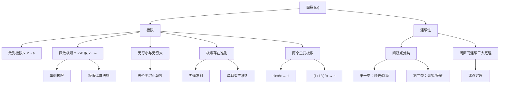

> 📌 本章是整个高等数学的基石。极限是微积分的语言——导数、积分、级数无一不建立在极限之上。掌握本章，等于拿到了整座高数大厦的钥匙。

---

## 📋 前置知识

- [[三角函数]] — 极限计算中大量出现 $\sin x$、$\cos x$、$\tan x$，及其倒数关系
- [[指数与对数函数]] — $e^x$、$\ln x$ 是最常见的极限对象
- [[不等式与绝对值]] — $\varepsilon$-$\delta$ 定义的核心工具
- [[集合与映射]] — 函数本质上是一种映射

---

## 🤔 为什么极限是核心？

想象你开车从北京到上海，你的平均速度是 $\frac{\Delta s}{\Delta t}$。但如果我问你"在某一瞬间，你的速度是多少"——这个"瞬间"的时间 $\Delta t \to 0$，此时 $\frac{\Delta s}{\Delta t}$ 变成了 $\frac{0}{0}$，直接计算没有意义。

极限正是为了解决这类问题而生：**当变量趋向某个值时，函数的趋势是什么？** 这个"趋势"就是极限。没有极限，导数无法定义，积分无法建立，整个微积分体系就会崩塌。

---

## 🧠 第一节：函数

### 1.1 函数的本质

> 🎯 **类比**：函数就像一台自动贩卖机。你投入一个硬币（输入 $x$），机器按照固定规则吐出一瓶饮料（输出 $y = f(x)$）。同样的硬币面值，永远出同一种饮料——这就是函数的"确定性"。

**正式定义**：设 $D$ 是一个非空实数集。若对于每一个 $x \in D$，按照某一对应法则 $f$，都有唯一确定的实数 $y$ 与之对应，则称 $f$ 为定义在 $D$ 上的**函数**，记作

$$y = f(x), \quad x \in D$$

其中 $D$ 称为**定义域**，$x$ 称为**自变量**，$y$ 称为**因变量**，$f(D) = \{f(x) \mid x \in D\}$ 称为**值域**。

> ⚠️ **踩坑**：两个函数相等，当且仅当**定义域相同**且**对应法则相同**。例如 $f(x) = x$ 与 $g(x) = \frac{x^2}{x}$ 看似一样，但 $g(x)$ 在 $x = 0$ 处无定义，二者**不是同一个函数**。

### 1.2 基本初等函数

考研中必须烂熟于心的六类基本初等函数：

| 类型 | 表达式 | 定义域 | 关键性质 |
|------|--------|--------|----------|
| 常数函数 | $y = C$ | $(-\infty, +\infty)$ | 图像为水平线 |
| 幂函数 | $y = x^\alpha$ | 依 $\alpha$ 而定 | $\alpha > 0$ 过原点 |
| 指数函数 | $y = a^x \ (a>0, a\neq 1)$ | $(-\infty, +\infty)$ | 值域 $(0,+\infty)$，过 $(0,1)$ |
| 对数函数 | $y = \log_a x$ | $(0, +\infty)$ | 指数函数的反函数 |
| 三角函数 | $\sin x, \cos x, \tan x$ 等 | 依具体函数定 | 周期性 |
| 反三角函数 | $\arcsin x, \arctan x$ 等 | 依具体函数定 | 有界性 |

> 💡 **特别重要**：$\arctan x$ 的值域是 $\left(-\dfrac{\pi}{2}, \dfrac{\pi}{2}\right)$；$\arcsin x$ 的值域是 $\left[-\dfrac{\pi}{2}, \dfrac{\pi}{2}\right]$，定义域是 $[-1, 1]$。这两个在极限、积分中频繁出现。

### 1.3 函数的四大特性

**① 有界性**

若存在正数 $M$，对一切 $x \in D$ 都有 $|f(x)| \leq M$，则称 $f(x)$ 在 $D$ 上**有界**。

> 🎯 **类比**：把函数的图像想象成一条在两条水平栏杆之间的曲线，永远不越界，就是有界。

常见有界函数：$\sin x$、$\cos x$、$\arctan x$、$\arcsin x$（在各自定义域上）。

**② 单调性**

若对任意 $x_1, x_2 \in I$，$x_1 < x_2$ 时都有 $f(x_1) < f(x_2)$，则 $f(x)$ 在 $I$ 上**单调递增**。

**③ 奇偶性**

定义域关于原点对称是**前提条件**！在此前提下：
- **偶函数**：$f(-x) = f(x)$，图像关于 $y$ 轴对称
- **奇函数**：$f(-x) = -f(x)$，图像关于原点对称

> ⚠️ **踩坑**：判断奇偶性，第一步一定先验证定义域是否关于原点对称，再代入 $-x$ 化简。若定义域不对称，则函数既非奇函数也非偶函数。

**④ 周期性**

若存在正数 $T$，对一切 $x$ 都有 $f(x+T) = f(x)$，则 $T$ 为函数的**周期**。最小正周期简称"周期"。

常见周期：$\sin x$、$\cos x$ 周期为 $2\pi$；$\tan x$ 周期为 $\pi$。

---

## 🧠 第二节：数列的极限

### 2.1 什么是数列极限

> 🎯 **类比**：数列极限就像射箭。你一次次调整角度射箭，每次都比上次更接近靶心。当你射了"无限多次"后，箭落的位置就"趋向"靶心——那个靶心就是极限值 $a$。

**正式定义（$\varepsilon$-$N$ 定义）**：

设 $\{x_n\}$ 为数列，$a$ 为常数。若对任意 $\varepsilon > 0$，存在正整数 $N$，使得当 $n > N$ 时，都有

$$|x_n - a| < \varepsilon$$

则称数列 $\{x_n\}$ 以 $a$ 为极限，记作

$$\lim_{n \to \infty} x_n = a \quad \text{或} \quad x_n \to a \ (n \to \infty)$$

**如何理解这个定义？**

- $\varepsilon$ 是你任意指定的误差范围，可以无限小
- $N$ 是一个"分界点"，过了第 $N$ 项以后，所有项都落在 $(a-\varepsilon, a+\varepsilon)$ 内
- 极限描述的是**趋势**，不是"达到"：$x_n$ 不需要等于 $a$，只需无限接近

### 2.2 数列极限的重要性质

| 性质 | 内容 |
|------|------|
| 唯一性 | 若极限存在，则唯一 |
| 有界性 | 收敛数列必有界（反之不成立） |
| 保号性 | 若 $\lim x_n = a > 0$，则存在 $N$，当 $n > N$ 时 $x_n > 0$ |
| 夹逼准则 | 若 $y_n \leq x_n \leq z_n$ 且 $\lim y_n = \lim z_n = a$，则 $\lim x_n = a$ |

> ⚠️ **踩坑**：有界数列不一定收敛！例如 $x_n = (-1)^n$ 有界（$|x_n| \leq 1$），但极限不存在。

---

## 🧠 第三节：函数的极限

### 3.1 函数极限的两种情形

**情形一：$x \to \infty$（$x$ 趋向无穷大）**

$$\lim_{x \to \infty} f(x) = A$$

含义：当 $|x|$ 充分大时，$f(x)$ 无限接近 $A$。

注意 $x \to \infty$ 包含三种子情形：$x \to +\infty$，$x \to -\infty$，以及两者同时（$x \to \infty$）。

$$\lim_{x \to \infty} f(x) = A \iff \lim_{x \to +\infty} f(x) = \lim_{x \to -\infty} f(x) = A$$

**情形二：$x \to x_0$（$x$ 趋向有限值）**

**$\varepsilon$-$\delta$ 定义**：对任意 $\varepsilon > 0$，存在 $\delta > 0$，当 $0 < |x - x_0| < \delta$ 时，有

$$|f(x) - A| < \varepsilon$$

则称 $f(x)$ 在 $x \to x_0$ 时的极限为 $A$。

> ⚠️ **关键细节**：定义中 $0 < |x - x_0|$，这个"$0 <$"至关重要——极限描述 $x$ **趋向** $x_0$ 时的行为，与 $f(x_0)$ 的值**无关**，$f(x_0)$ 甚至可以不存在！

### 3.2 单侧极限

**左极限**：$\lim_{x \to x_0^-} f(x)$，$x$ 从左侧趋近 $x_0$

**右极限**：$\lim_{x \to x_0^+} f(x)$，$x$ 从右侧趋近 $x_0$

$$\lim_{x \to x_0} f(x) = A \iff \lim_{x \to x_0^-} f(x) = \lim_{x \to x_0^+} f(x) = A$$

> 🎯 **应用场景**：分段函数在分界点处的极限，必须用单侧极限来判断！

### 3.3 极限的四则运算法则

若 $\lim f(x) = A$，$\lim g(x) = B$，则：

$$\lim [f(x) \pm g(x)] = A \pm B$$

$$\lim [f(x) \cdot g(x)] = A \cdot B$$

$$\lim \frac{f(x)}{g(x)} = \frac{A}{B} \quad (B \neq 0)$$

> ⚠️ **前提**：每个极限必须**单独存在**，才能拆分运算。若出现 $\frac{0}{0}$、$\frac{\infty}{\infty}$、$0 \cdot \infty$ 等不定式，不能直接用四则运算。

---

## 🧠 第四节：无穷小与无穷大

### 4.1 无穷小

**定义**：若 $\lim f(x) = 0$，则称 $f(x)$ 为该极限过程下的**无穷小量**。

> ⚠️ **无穷小不是一个很小的数，而是极限为零的变量！** $0.000001$ 是一个很小的常数，不是无穷小；而 $x \to 0$ 时的 $x$ 才是无穷小。

**无穷小的比较**（设 $\alpha, \beta$ 都是无穷小）：

| 关系 | 条件 | 记号/名称 |
|------|------|-----------|
| $\beta$ 是比 $\alpha$ 高阶的无穷小 | $\lim \dfrac{\beta}{\alpha} = 0$ | $\beta = o(\alpha)$ |
| $\beta$ 与 $\alpha$ 同阶 | $\lim \dfrac{\beta}{\alpha} = C \neq 0$ | — |
| $\beta$ 与 $\alpha$ 等价 | $\lim \dfrac{\beta}{\alpha} = 1$ | $\beta \sim \alpha$ |
| $\beta$ 是 $\alpha$ 的 $k$ 阶无穷小 | $\lim \dfrac{\beta}{\alpha^k} = C \neq 0$ | — |

### 4.2 常用等价无穷小（$x \to 0$ 时）

这是计算极限最常用的工具，**必须背熟**：

$$\sin x \sim x, \quad \tan x \sim x, \quad \arcsin x \sim x, \quad \arctan x \sim x$$

$$1 - \cos x \sim \frac{x^2}{2}, \quad \ln(1+x) \sim x, \quad e^x - 1 \sim x$$

$$(1+x)^\alpha - 1 \sim \alpha x, \quad a^x - 1 \sim x \ln a$$

> ⚠️ **等价替换的限制**：等价无穷小只能对**乘除因子**整体替换，不能对**加减的项**单独替换！

**错误示范**：

$$\lim_{x \to 0} \frac{\tan x - \sin x}{x^3}$$

若错误地对分子做 $\tan x \sim x$，$\sin x \sim x$，得到分子 $\sim x - x = 0$，这是**错误的**！

**正确做法**：

$$\lim_{x \to 0} \frac{\tan x - \sin x}{x^3} = \lim_{x \to 0} \frac{\sin x(1 - \cos x)}{x^3 \cos x} \sim \lim_{x \to 0} \frac{x \cdot \dfrac{x^2}{2}}{x^3 \cdot 1} = \frac{1}{2}$$

### 4.3 无穷大

**定义**：若对任意 $M > 0$，当 $x$ 充分接近某过程时，都有 $|f(x)| > M$，则称 $f(x)$ 为该过程的**无穷大量**。

$$\lim f(x) = \infty$$

**无穷大与无穷小的关系**：若 $f(x)$ 为无穷大，则 $\dfrac{1}{f(x)}$ 为无穷小（反之亦然）。

---

## 🧠 第五节：极限的存在准则与两个重要极限

### 5.1 夹逼准则

若在 $x \to x_0$（或 $x \to \infty$）的某过程中：

$$g(x) \leq f(x) \leq h(x)$$

且 $\lim g(x) = \lim h(x) = A$，则 $\lim f(x) = A$。

> 🎯 **类比**：$f(x)$ 像被两个"护卫"$g(x)$ 和 $h(x)$ 夹住。两个护卫都走向同一个目的地 $A$，被夹在中间的 $f(x)$ 必然也只能去往 $A$。

### 5.2 单调有界准则

单调递增（递减）且有上界（下界）的数列必有极限。

### 5.3 两个重要极限

**第一重要极限**：

$$\lim_{x \to 0} \frac{\sin x}{x} = 1$$

推广形式：若 $u(x) \to 0$，则

$$\lim \frac{\sin u(x)}{u(x)} = 1, \quad \lim \frac{\tan u(x)}{u(x)} = 1$$

**第二重要极限**：

$$\lim_{x \to \infty} \left(1 + \frac{1}{x}\right)^x = e$$

等价形式：当 $u(x) \to 0$ 时，

$$\lim (1 + u(x))^{\frac{1}{u(x)}} = e$$

> ⚠️ **第二重要极限使用条件**：底数必须是"$1 +$ 无穷小"的形式，指数必须是对应的"无穷大"。遇到 $1^\infty$ 型不定式，优先考虑凑第二重要极限或取对数。

---

## 🧠 第六节：函数的连续性

### 6.1 连续的定义

> 🎯 **类比**：连续函数就像用一支笔画出的曲线——笔不离纸，没有"跳跃"。如果画到某处必须抬笔再落笔，那个"抬笔点"就是间断点。

**定义**：若 $\lim_{x \to x_0} f(x) = f(x_0)$，则称 $f(x)$ 在 $x_0$ 处**连续**。

这个条件等价于同时满足：
1. $f(x)$ 在 $x_0$ 处有定义（$f(x_0)$ 存在）
2. $\lim_{x \to x_0} f(x)$ 存在（左右极限相等）
3. 极限值等于函数值

### 6.2 间断点的分类

若 $f(x)$ 在 $x_0$ 处不连续，$x_0$ 为**间断点**。

**第一类间断点**（左右极限都存在）：

- **可去间断点**：左右极限存在且相等，但不等于 $f(x_0)$（或 $f(x_0)$ 无定义）
  - 例：$f(x) = \dfrac{\sin x}{x}$ 在 $x = 0$ 处，$\lim_{x \to 0} f(x) = 1$ 但 $f(0)$ 无定义
- **跳跃间断点**：左右极限存在但不相等
  - 例：$f(x) = \text{sgn}(x)$ 在 $x = 0$ 处

**第二类间断点**（至少一侧极限不存在）：

- **无穷间断点**：极限为 $\infty$，如 $f(x) = \dfrac{1}{x}$ 在 $x = 0$ 处
- **振荡间断点**：极限不存在（振荡），如 $f(x) = \sin\dfrac{1}{x}$ 在 $x = 0$ 处

### 6.3 连续函数的运算与性质

- 连续函数的四则运算仍连续（分母不为零处）
- 连续函数的复合仍连续
- **初等函数在其定义域内处处连续**（这是计算极限最常用的结论）

> 💡 **极限计算捷径**：若 $f(x)$ 是初等函数，且 $x_0$ 在其定义域内，则 $\lim_{x \to x_0} f(x) = f(x_0)$，**直接代入**即可！

### 6.4 闭区间上连续函数的三大定理

设 $f(x)$ 在 $[a, b]$ 上连续：

**① 最值定理**：$f(x)$ 在 $[a,b]$ 上必能取到最大值 $M$ 和最小值 $m$。

**② 有界定理**：$f(x)$ 在 $[a,b]$ 上有界，即存在 $K > 0$ 使 $|f(x)| \leq K$。

**③ 介值定理**：对任意 $c$ 满足 $m \leq c \leq M$，存在 $\xi \in [a,b]$ 使 $f(\xi) = c$。

**零点定理（介值定理的特例）**：若 $f(a) \cdot f(b) < 0$（即两端异号），则存在 $\xi \in (a,b)$ 使 $f(\xi) = 0$。

> 🎯 **零点定理的应用**：考研常考"证明方程在某区间内有根"——构造辅助函数，验证两端异号，直接引用零点定理。

---

## 💻 代码验证（Python 辅助理解）

虽然考研不考编程，但用代码直观验证极限有助于建立直觉。

```python
import numpy as np
import matplotlib.pyplot as plt

# 验证 lim_{x->0} sin(x)/x = 1
x_vals = np.array([0.1, 0.01, 0.001, 0.0001, 0.00001])
y_vals = np.sin(x_vals) / x_vals

print("验证第一重要极限 sin(x)/x → 1:")
for x, y in zip(x_vals, y_vals):
    print(f"  x = {x:.5f}, sin(x)/x = {y:.10f}")

# 验证 lim_{x->∞} (1 + 1/x)^x = e
x_large = np.array([10, 100, 1000, 10000, 100000])
e_approx = (1 + 1/x_large) ** x_large

print("\n验证第二重要极限 (1+1/x)^x → e:")
print(f"e 的真实值 = {np.e:.10f}")
for x, val in zip(x_large, e_approx):
    print(f"  x = {x:6d}, (1+1/x)^x = {val:.10f}")
```

```bash
python3 verify_limits.py
```

**预期输出**：

```text
验证第一重要极限 sin(x)/x → 1:
  x = 0.10000, sin(x)/x = 0.9983341665
  x = 0.01000, sin(x)/x = 0.9999833334
  x = 0.00100, sin(x)/x = 0.9999998333
  x = 0.00010, sin(x)/x = 0.9999999983
  x = 0.00001, sin(x)/x = 1.0000000000

验证第二重要极限 (1+1/x)^x → e:
e 的真实值 = 2.7182818285
  x =     10, (1+1/x)^x = 2.5937424601
  x =    100, (1+1/x)^x = 2.7048138294
  x =   1000, (1+1/x)^x = 2.7169239322
  x =  10000, (1+1/x)^x = 2.7181459268
  x = 100000, (1+1/x)^x = 2.7182682372
```

---

## ⚠️ 常见误区与踩坑点

> ❌ **误区 1：极限存在就等于函数在该点有定义**
> $\lim_{x \to 0} \dfrac{\sin x}{x} = 1$，但 $\dfrac{\sin x}{x}$ 在 $x = 0$ 处根本没有定义。极限描述"趋近"，与函数值无关。

> ❌ **误区 2：无穷小可以当成零处理**
> $\lim_{x \to 0} x = 0$，但在极限过程中 $x \neq 0$。如果直接令 $x = 0$ 带入 $\dfrac{\sin x}{x}$，得到 $\dfrac{0}{0}$ 没有意义。

> ⚠️ **踩坑 3：等价替换用在加减法上**
> 分子（分母）是若干项的**和差**时，不能对每项单独做等价替换。必须先提取公因式或用其他方法，把和差化成乘积，再替换。

> ⚠️ **踩坑 4：$1^\infty$ 型不判断底数**
> 遇到 $1^\infty$ 型极限，必须检验底数是否**严格等于 1** 还是"趋向 1 的量"。若底数真的恒等于 1，极限就是 1；若底数是趋向 1 的变量，才使用第二重要极限。

> ⚠️ **踩坑 5：分段函数在分界点的极限忘记验证单侧**
> 对分段函数，在分界点处必须分别算左极限和右极限，二者都存在且相等，极限才存在。只算其中一侧是不够的。

> ❌ **误区 6：连续一定可导**
> 连续是可导的必要条件，但不是充分条件。$f(x) = |x|$ 在 $x = 0$ 处连续，但不可导（左右导数不等）。

---

## 🔄 概念对比

| 特性 | 可去间断点 | 跳跃间断点 | 无穷间断点 |
|------|-----------|-----------|-----------|
| 左极限 | 存在 | 存在 | 不存在（为 $\infty$） |
| 右极限 | 存在 | 存在 | 不存在（为 $\infty$） |
| 左 $=$ 右？ | 是 | 否 | — |
| 能否"补救"为连续 | 能（重新定义 $f(x_0)$）| 不能 | 不能 |
| 所属类别 | 第一类 | 第一类 | 第二类 |

> 💡 **一句话总结**：第一类间断点左右极限都存在（不一定相等），第二类至少一侧极限不存在（或为无穷大）。

---

## 🏋️ 动手练习

### 练习 1：求极限（⭐ 基础型）

**题目**：求 $\displaystyle\lim_{x \to 0} \frac{1 - \cos 2x}{x \sin x}$

**参考答案**：

利用等价无穷小 $1 - \cos 2x \sim \dfrac{(2x)^2}{2} = 2x^2$，$\sin x \sim x$（$x \to 0$），分子分母都是乘积形式，可以整体替换：

$$\lim_{x \to 0} \frac{1 - \cos 2x}{x \sin x} = \lim_{x \to 0} \frac{2x^2}{x \cdot x} = \lim_{x \to 0} \frac{2x^2}{x^2} = 2$$

---

### 练习 2：分段函数的连续性（⭐⭐ 中等）

**题目**：设 $f(x) = \begin{cases} \dfrac{\ln(1+x)}{x}, & x \neq 0 \\ a, & x = 0 \end{cases}$，问 $a$ 为何值时 $f(x)$ 在 $x = 0$ 处连续？

**参考答案**：

要使 $f(x)$ 在 $x = 0$ 连续，需 $\lim_{x \to 0} f(x) = f(0) = a$。

计算极限：当 $x \to 0$ 时，$\ln(1+x) \sim x$，故

$$\lim_{x \to 0} \frac{\ln(1+x)}{x} = \lim_{x \to 0} \frac{x}{x} = 1$$

因此 $a = 1$ 时 $f(x)$ 在 $x = 0$ 处连续。

---

### 练习 3：$1^\infty$ 型极限（⭐⭐ 中等）

**题目**：求 $\displaystyle\lim_{x \to \infty} \left(\frac{x+1}{x-1}\right)^x$

**参考答案**：

将底数改写：

$$\frac{x+1}{x-1} = 1 + \frac{2}{x-1}$$

令 $u = \dfrac{2}{x-1}$，当 $x \to \infty$ 时 $u \to 0$，且指数 $x = \dfrac{2}{u} + 1$，故

$$\left(1 + u\right)^{\frac{2}{u} + 1} = \left(1+u\right)^{\frac{2}{u}} \cdot (1+u)^1 \to e^2 \cdot 1 = e^2$$

因此 $\displaystyle\lim_{x \to \infty} \left(\frac{x+1}{x-1}\right)^x = e^2$

---

### 练习 4：夹逼准则（⭐⭐ 中等）

**题目**：求 $\displaystyle\lim_{n \to \infty} \sqrt[n]{1^n + 2^n + 3^n}$

**参考答案**：

注意到对任意正整数 $n$：

$$3 = \sqrt[n]{3^n} \leq \sqrt[n]{1^n + 2^n + 3^n} \leq \sqrt[n]{3 \cdot 3^n} = 3 \cdot \sqrt[n]{3} = 3^{1+\frac{1}{n}}$$

当 $n \to \infty$ 时：左侧 $\to 3$，右侧 $3^{1+\frac{1}{n}} \to 3^1 = 3$。

由夹逼准则，$\displaystyle\lim_{n \to \infty} \sqrt[n]{1^n + 2^n + 3^n} = 3$

---

### 练习 5：间断点判断与分类（⭐⭐⭐ 综合）

**题目**：求函数 $f(x) = \dfrac{x^2 - 1}{x^2 - 3x + 2}$ 的间断点，并判断类型。

**参考答案**：

分母 $x^2 - 3x + 2 = (x-1)(x-2) = 0$，故 $x = 1$ 和 $x = 2$ 是间断点。

**在 $x = 1$ 处**：

$$\lim_{x \to 1} \frac{x^2 - 1}{x^2 - 3x + 2} = \lim_{x \to 1} \frac{(x-1)(x+1)}{(x-1)(x-2)} = \lim_{x \to 1} \frac{x+1}{x-2} = \frac{2}{-1} = -2$$

极限存在（为 $-2$），但 $f(1)$ 无定义，所以 $x = 1$ 是**可去间断点**（第一类）。

**在 $x = 2$ 处**：

$$\lim_{x \to 2^-} \frac{x+1}{x-2} = \frac{3}{0^-} = -\infty, \quad \lim_{x \to 2^+} \frac{x+1}{x-2} = \frac{3}{0^+} = +\infty$$

极限为无穷大，所以 $x = 2$ 是**无穷间断点**（第二类）。

---

### 练习 6：用零点定理证明根的存在性（⭐⭐⭐ 综合）

**题目**：证明方程 $x^3 + x - 1 = 0$ 在区间 $(0, 1)$ 内至少有一个实根。

**参考答案**：

设 $f(x) = x^3 + x - 1$。

$f(x)$ 是多项式，在 $[0,1]$ 上连续。

计算端点值：

$$f(0) = 0 + 0 - 1 = -1 < 0$$

$$f(1) = 1 + 1 - 1 = 1 > 0$$

由于 $f(0) \cdot f(1) = -1 \times 1 < 0$（两端异号），

由**零点定理**，存在 $\xi \in (0, 1)$ 使得 $f(\xi) = 0$，即 $\xi^3 + \xi - 1 = 0$。

故方程在 $(0, 1)$ 内至少有一个实根。$\blacksquare$

---

## 📝 总结

### 本章要点回顾

1. **极限的本质**是描述变量趋向某过程时的行为趋势，与该点的函数值无关；$\varepsilon$-$\delta$（或 $\varepsilon$-$N$）定义是极限的精确语言。

2. **两个重要极限**必须熟记：$\displaystyle\lim_{x \to 0} \dfrac{\sin x}{x} = 1$ 和 $\displaystyle\lim_{x \to \infty}\left(1+\dfrac{1}{x}\right)^x = e$；等价无穷小表（$x \to 0$ 时的那一套）要能脱口而出。

3. **极限不定式类型**：$\dfrac{0}{0}$、$\dfrac{\infty}{\infty}$、$0 \cdot \infty$、$1^\infty$、$\infty^0$、$0^0$、$\infty - \infty$，每种都有对应的处理策略（等价替换、因式分解、有理化、取对数……）。

4. **连续的判断**：三步走——有定义 → 极限存在 → 极限值等于函数值；初等函数在定义域内直接代入。

5. **闭区间连续函数**享有最值定理、有界定理、介值定理（含零点定理）——这三个定理是证明题的核心工具。

### 知识图谱



---

## 🔗 相关链接

- 上级概念：[[高等数学总览]]
- 下级概念：[[导数与微分]]、[[不定积分]]、[[定积分]]
- 同级概念：[[数学一 线性代数]]、[[数学一 概率论]]
- 关联工具：[[洛必达法则]]（求不定式极限的重要工具，第二章介绍）

## 📚 参考资料

- 同济大学数学系《高等数学》（第七版），第一章 —— 标准教材，例题经典
- 张宇《高等数学 18 讲》—— 考研专项，极限部分讲解透彻
- 武忠祥《高等数学辅导讲义》—— 分类细致，适合查漏补缺
