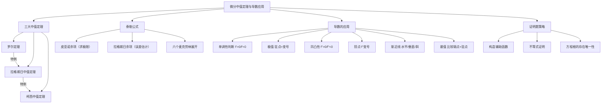

> 📌 本章是"导数能做什么"的集中展示。中值定理是理论骨架，极值判断、单调性、凹凸性、泰勒展开是实战工具。考研证明题的核心阵地就在这里。

---

## 📋 前置知识

- [[高等数学 第二章：导数与微分]] — 本章所有结论都基于导数；链式法则、洛必达法则在这里继续使用
- [[高等数学 第一章：函数、极限与连续]] — 闭区间连续函数的性质（最值定理、零点定理）是中值定理的前提
- [[导数的几何意义]] — 理解"切线斜率"有助于直觉理解各中值定理

---

## 🤔 为什么需要中值定理？

你开车从北京到上海，全程 1200 km，耗时 10 小时，平均速度 120 km/h。但交警说："你在某个瞬间一定超速了！"——他怎么知道的？

因为如果你**每时每刻**都不超过 120 km/h，那 10 小时最多走 1200 km，刚好够，但只要有任何一段更快，就意味着某瞬间速度超过平均值。这个逻辑的精确数学表述，就是**中值定理**。

中值定理的核心思想：**整体行为**（平均变化率、端点差值）可以推断**某个局部瞬间**的性质（某点导数值）。这是从"整体"到"局部"的桥梁，是考研证明题最常用的理论武器。

---

## 🧠 第一节：三大中值定理

### 1.1 罗尔定理（Rolle's Theorem）

**定理内容**：设 $f(x)$ 满足：
1. 在闭区间 $[a, b]$ 上**连续**
2. 在开区间 $(a, b)$ 内**可导**
3. **端点值相等**：$f(a) = f(b)$

则在 $(a, b)$ 内至少存在一点 $\xi$，使得 $f'(\xi) = 0$。

> 🎯 **几何直觉**：连续曲线的起点和终点等高，中间一定有一处"水平切线"（山顶或山谷）。

> ⚠️ **三个条件缺一不可！**
> - 若 $[a,b]$ 上不连续：$f(x) = \begin{cases}1, & x \in (0,1) \\ 0, & x=0 \text{ 或 } x=1\end{cases}$，结论不成立
> - 若 $(a,b)$ 上不可导：$f(x) = |x|$ 在 $[-1,1]$ 上，$f(-1)=f(1)=1$，但 $f'(0)$ 不存在，$(a,b)$ 内无处 $f'=0$
> - 若端点值不等：显然不能保证存在水平切线

**罗尔定理的常用变形**：若 $f(x)$ 在 $[a,b]$ 上连续，在 $(a,b)$ 内可导，则"证明 $f'(\xi) = 0$ 存在"等价于"找到两点使 $f$ 值相等，再用罗尔定理"。

**构造辅助函数的技巧**：很多中值定理的证明题需要你"构造"一个辅助函数 $F(x)$，使 $F(a) = F(b)$，然后对 $F$ 应用罗尔定理。

---

### 1.2 拉格朗日中值定理（Lagrange's Mean Value Theorem）

**定理内容**：设 $f(x)$ 满足：
1. 在 $[a, b]$ 上**连续**
2. 在 $(a, b)$ 内**可导**

则在 $(a, b)$ 内至少存在一点 $\xi$，使得

$$f'(\xi) = \frac{f(b) - f(a)}{b - a}$$

等价写法（**拉格朗日公式**）：

$$f(b) - f(a) = f'(\xi)(b - a), \quad \xi \in (a, b)$$

> 🎯 **几何直觉**：连接曲线两端点的割线斜率 $\dfrac{f(b)-f(a)}{b-a}$，在曲线中间某处的切线斜率与之相等。

> 💡 **罗尔定理是拉格朗日定理的特例**：当 $f(a) = f(b)$ 时，$\dfrac{f(b)-f(a)}{b-a} = 0$，即 $f'(\xi) = 0$，退化为罗尔定理。

**拉格朗日定理的三大应用**：

**① 证明不等式**：利用 $f(b) - f(a) = f'(\xi)(b-a)$，对 $f'(\xi)$ 的范围加以估计。

**② 证明恒等式**：若 $f'(x) = 0$ 对所有 $x$ 成立，则 $f(x) = C$（常数）。

**③ 有限增量公式**：$\Delta y = f'(\xi)\Delta x$，是微分 $dy = f'(x_0)\Delta x$ 的"精确版"（$\xi$ 在 $x_0$ 与 $x_0 + \Delta x$ 之间）。

---

### 1.3 柯西中值定理（Cauchy's Mean Value Theorem）

**定理内容**：设 $f(x)$，$g(x)$ 均满足：
1. 在 $[a, b]$ 上**连续**
2. 在 $(a, b)$ 内**可导**
3. $g'(x) \neq 0$，$x \in (a, b)$

则在 $(a, b)$ 内至少存在一点 $\xi$，使得

$$\frac{f(b) - f(a)}{g(b) - g(a)} = \frac{f'(\xi)}{g'(\xi)}$$

> 💡 **拉格朗日是柯西的特例**：取 $g(x) = x$，则 $g'(x) = 1$，柯西定理退化为拉格朗日定理。

> 🎯 **柯西定理的主要用途**：证明洛必达法则的理论依据，以及部分涉及两个函数之比的证明题。

---

### 1.4 三大定理的逻辑关系


---

## 🧠 第二节：泰勒公式

### 2.1 为什么需要泰勒公式？

导数告诉我们函数在某点的瞬时变化率，但它只是"线性近似"（切线近似）。如果我们想用**多项式**来更精确地逼近函数，就需要泰勒公式。

> 🎯 **类比**：一阶泰勒近似（线性）就像用直尺量曲线，二阶（抛物线）就像用弯尺，阶次越高，拟合越精确。

### 2.2 泰勒公式（带皮亚诺余项）

若 $f(x)$ 在 $x_0$ 处有 $n$ 阶导数，则

$$f(x) = f(x_0) + f'(x_0)(x-x_0) + \frac{f''(x_0)}{2!}(x-x_0)^2 + \cdots + \frac{f^{(n)}(x_0)}{n!}(x-x_0)^n + o\!\left((x-x_0)^n\right)$$

其中 $o\!\left((x-x_0)^n\right)$ 是比 $(x-x_0)^n$ 高阶的无穷小（皮亚诺余项）。

**$x_0 = 0$ 时称为麦克劳林公式**：

$$f(x) = f(0) + f'(0)x + \frac{f''(0)}{2!}x^2 + \cdots + \frac{f^{(n)}(0)}{n!}x^n + o(x^n)$$

### 2.3 泰勒公式（带拉格朗日余项）

若 $f(x)$ 在 $[a, b]$ 上有 $n+1$ 阶导数，$x_0 \in [a,b]$，则

$$f(x) = \sum_{k=0}^{n} \frac{f^{(k)}(x_0)}{k!}(x-x_0)^k + \frac{f^{(n+1)}(\xi)}{(n+1)!}(x-x_0)^{n+1}$$

其中 $\xi$ 在 $x_0$ 与 $x$ 之间。拉格朗日余项 $R_n(x) = \dfrac{f^{(n+1)}(\xi)}{(n+1)!}(x-x_0)^{n+1}$ 可用于**误差估计**。

### 2.4 六个必背麦克劳林展开式

以下六个是考研中出现频率极高的展开式，必须**一字不差地背熟**：

$$e^x = 1 + x + \frac{x^2}{2!} + \frac{x^3}{3!} + \cdots + \frac{x^n}{n!} + o(x^n)$$

$$\sin x = x - \frac{x^3}{3!} + \frac{x^5}{5!} - \cdots + \frac{(-1)^n x^{2n+1}}{(2n+1)!} + o(x^{2n+1})$$

$$\cos x = 1 - \frac{x^2}{2!} + \frac{x^4}{4!} - \cdots + \frac{(-1)^n x^{2n}}{(2n)!} + o(x^{2n})$$

$$\ln(1+x) = x - \frac{x^2}{2} + \frac{x^3}{3} - \cdots + \frac{(-1)^{n-1} x^n}{n} + o(x^n), \quad x \in (-1, 1]$$

$$\frac{1}{1-x} = 1 + x + x^2 + \cdots + x^n + o(x^n), \quad |x| < 1$$

$$(1+x)^\alpha = 1 + \alpha x + \frac{\alpha(\alpha-1)}{2!}x^2 + \cdots + \frac{\alpha(\alpha-1)\cdots(\alpha-n+1)}{n!}x^n + o(x^n)$$

> 💡 **泰勒展开用于极限**：当 $x \to 0$ 时，把函数展开到适当阶次，分子分母约去最低次项，是求极限（尤其是 $\frac{0}{0}$ 型）的强力工具，有时比洛必达更快。

---

## 🧠 第三节：函数的单调性与极值

### 3.1 单调性的判断

**定理**：设 $f(x)$ 在 $[a,b]$ 上连续，在 $(a,b)$ 内可导：
- 若 $f'(x) > 0$，$x \in (a,b)$，则 $f$ 在 $[a,b]$ 上**单调递增**
- 若 $f'(x) < 0$，$x \in (a,b)$，则 $f$ 在 $[a,b]$ 上**单调递减**

> ⚠️ **注意**：$f'(x_0) = 0$ 的点（驻点）不一定是极值点，也不破坏单调性（例如 $f(x) = x^3$ 在 $x=0$ 处 $f'=0$，但函数仍单调递增）。

### 3.2 极值的定义与判别

**极大值**：若在 $x_0$ 某邻域内（$x_0$ 处除外），$f(x) < f(x_0)$，则 $f(x_0)$ 是极大值。

**极小值**：若在 $x_0$ 某邻域内（$x_0$ 处除外），$f(x) > f(x_0)$，则 $f(x_0)$ 是极小值。

极大值和极小值统称**极值**，$x_0$ 称为**极值点**。

> ⚠️ **极值是局部概念**，不是整体最大最小值。极大值可能小于极小值！

**极值存在的必要条件**：若 $f'(x_0)$ 存在且 $x_0$ 是极值点，则 $f'(x_0) = 0$（驻点）。

**极值存在的充分条件**有两种：

**第一充分条件（一阶导数判别）**：

设 $f'(x_0) = 0$（或 $f'(x_0)$ 不存在），在 $x_0$ 两侧：

| $x < x_0$ 时 $f'$ | $x > x_0$ 时 $f'$ | 结论 |
|-----------------|-----------------|------|
| $+$ | $-$ | $x_0$ 是极大值点 |
| $-$ | $+$ | $x_0$ 是极小值点 |
| 同号 | 同号 | $x_0$ 不是极值点 |

**第二充分条件（二阶导数判别）**：

设 $f'(x_0) = 0$，$f''(x_0)$ 存在：

- 若 $f''(x_0) < 0$，则 $x_0$ 是**极大值点**
- 若 $f''(x_0) > 0$，则 $x_0$ 是**极小值点**
- 若 $f''(x_0) = 0$，**无法判断**，需用第一充分条件

> 🎯 **直觉**：$f''(x_0) < 0$ 意味着函数在 $x_0$ 处"开口向下"（凹陷），自然是极大值；$f''(x_0) > 0$ 意味着"开口向上"（鼓起），是极小值。

### 3.3 最值

**闭区间上连续函数的最值**求法：
1. 求 $f'(x) = 0$ 的所有驻点
2. 找出 $f'(x)$ 不存在的点
3. 计算所有这些点及端点 $a$、$b$ 的函数值
4. 比较大小，最大的是最大值，最小的是最小值

---

## 🧠 第四节：函数的凹凸性与拐点

### 4.1 凹凸性的定义

> 🎯 **类比**：把函数曲线想象成山坡。"凸"（上凸）就像山顶——曲线在切线**下方**；"凹"（下凸）就像山谷——曲线在切线**上方**。

**严格定义**（注意：国内教材定义与部分国外教材相反）：

- **凹弧（下凸）**：若弦上任意一点在曲线上方，即 $f\!\left(\dfrac{x_1+x_2}{2}\right) \leq \dfrac{f(x_1)+f(x_2)}{2}$，称为凸函数（国内有时也叫"下凸"）。
- **凸弧（上凸）**：弦在曲线下方，即 $f\!\left(\dfrac{x_1+x_2}{2}\right) \geq \dfrac{f(x_1)+f(x_2)}{2}$。

> ⚠️ **术语说明**：考研试卷中常用"曲线是凹的"表示 $f'' > 0$（开口向上，即国内的"下凸/凹弧"），"曲线是凸的"表示 $f'' < 0$（开口向下）。以 $f''$ 的符号为准最安全。

**判别定理**：设 $f(x)$ 在 $I$ 上二阶可导：
- $f''(x) > 0$，$x \in I$ $\Rightarrow$ 曲线在 $I$ 上是**凹弧**（开口向上）
- $f''(x) < 0$，$x \in I$ $\Rightarrow$ 曲线在 $I$ 上是**凸弧**（开口向下）

### 4.2 拐点

**定义**：若曲线在点 $(x_0, f(x_0))$ 两侧的凹凸性发生改变，则该点称为曲线的**拐点**。

**求拐点步骤**：
1. 求 $f''(x) = 0$ 的点及 $f''(x)$ 不存在的点
2. 验证这些点两侧 $f''(x)$ 的符号是否改变
3. 符号改变的点才是拐点（同号则不是拐点）

> ⚠️ **踩坑**：$f''(x_0) = 0$ 不一定是拐点！例如 $f(x) = x^4$，$f''(0) = 0$，但 $x = 0$ 两侧 $f'' > 0$，不改变凹凸性，不是拐点。

---

## 🧠 第五节：函数图形的描绘

### 5.1 渐近线

**水平渐近线**：若 $\lim_{x \to +\infty} f(x) = b$ 或 $\lim_{x \to -\infty} f(x) = b$，则 $y = b$ 是水平渐近线。

**垂直渐近线**：若 $\lim_{x \to x_0} f(x) = \infty$，则 $x = x_0$ 是垂直渐近线。

**斜渐近线**：若 $\lim_{x \to \infty} \dfrac{f(x)}{x} = k \neq 0$ 且 $\lim_{x \to \infty} [f(x) - kx] = b$，则 $y = kx + b$ 是斜渐近线。

> 💡 **判断顺序**：先查定义域找垂直渐近线候选点，再查 $x \to \pm\infty$ 的极限判断水平或斜渐近线。水平渐近线和斜渐近线不能同时存在（在同一侧）。

### 5.2 函数图形描绘步骤

完整的函数分析步骤（考研大题常考）：

1. **定义域**：找出所有无意义的点
2. **奇偶性、周期性**：简化分析
3. **一阶导数**：求驻点，判断单调区间和极值
4. **二阶导数**：判断凹凸区间和拐点
5. **渐近线**：水平、垂直、斜渐近线
6. **特殊点**：与坐标轴的交点
7. **描图**：综合以上信息

---

## 🧠 第六节：中值定理的证明题策略

中值定理的证明题是考研数学一的高频题型，有固定的解题套路。

### 6.1 证明"存在 $\xi$ 使 $f'(\xi) = \text{某表达式}$"

**策略**：将目标等式改写，找到一个辅助函数 $F(x)$，使 $F'(x) = 0$ 等价于目标等式，然后验证 $F$ 满足罗尔定理条件。

**常用辅助函数构造技巧**：

| 目标结论形式 | 辅助函数 $F(x)$ |
|------------|----------------|
| $f'(\xi) + g(\xi)f(\xi) = 0$ | $F(x) = f(x) \cdot e^{G(x)}$，其中 $G' = g$ |
| $f'(\xi) \cdot g(\xi) = f(\xi) \cdot g'(\xi)$ | $F(x) = \dfrac{f(x)}{g(x)}$（或 $f(x)g(x)$） |
| $nf(\xi) + \xi f'(\xi) = 0$ | $F(x) = x^n f(x)$ |
| $f'(\xi)(b-\xi) = f(b) - f(\xi)$ | 联系拉格朗日，取 $F(x) = f(b) - f(x)$ |

### 6.2 证明不等式

**策略**：构造 $F(x) = \text{不等式左边} - \text{右边}$，利用单调性或中值定理证明 $F(x) \geq 0$（或 $\leq 0$）。

### 6.3 证明方程有根

已在第一章零点定理中介绍，这里补充：若证明根的**唯一性**，可在存在性之外再证 $f'(x)$ 在区间上严格单调（无第二个零点）。

---

## 💻 代码验证

```python
import numpy as np
import sympy as sp
import matplotlib.pyplot as plt

x = sp.Symbol('x')

# ---- 验证泰勒展开 ----
f = sp.exp(x)
taylor_5 = sp.series(f, x, 0, 6)  # 展开到 x^5
print("e^x 的麦克劳林展开（到 x^5）：")
print(taylor_5)

f2 = sp.sin(x)
taylor_sin = sp.series(f2, x, 0, 8)
print("\nsin(x) 的麦克劳林展开（到 x^7）：")
print(taylor_sin)

# ---- 利用泰勒展开求极限 ----
# lim_{x->0} (e^x - 1 - x) / x^2
expr = (sp.exp(x) - 1 - x) / x**2
print("\nlim_(x->0) (e^x - 1 - x)/x² =", sp.limit(expr, x, 0))

# ---- 求函数的极值与单调区间 ----
g = x**3 - 3*x**2 + 1
g_prime = sp.diff(g, x)
g_double_prime = sp.diff(g, x, 2)

critical = sp.solve(g_prime, x)
print(f"\ng(x) = x³ - 3x² + 1")
print(f"g'(x) = {g_prime}")
print(f"驻点: x = {critical}")
for cp in critical:
    val = g_double_prime.subs(x, cp)
    nature = "极大值" if val < 0 else "极小值" if val > 0 else "无法判断"
    print(f"  x={cp}: g''={val}，为{nature}，g({cp})={g.subs(x,cp)}")

# ---- 求凹凸区间与拐点 ----
inflection_candidates = sp.solve(g_double_prime, x)
print(f"\n拐点候选: x = {inflection_candidates}")
```

```bash
python3 chapter3_verify.py
```

**预期输出**：

```text
e^x 的麦克劳林展开（到 x^5）：
1 + x + x**2/2 + x**3/6 + x**4/24 + x**5/120 + O(x**6)

sin(x) 的麦克劳林展开（到 x^7）：
x - x**3/6 + x**5/120 - x**7/5040 + O(x**8)

lim_(x->0) (e^x - 1 - x)/x² = 1/2

g(x) = x³ - 3x² + 1
g'(x) = 3*x**2 - 6*x
驻点: x = [0, 2]
  x=0: g''=-6，为极大值，g(0)=1
  x=2: g''=6，为极小值，g(2)=-3

拐点候选: x = [1]
```

---

## ⚠️ 常见误区与踩坑点

> ❌ **误区 1：驻点就是极值点**
> $f'(x_0) = 0$ 只是极值的**必要条件**，不是充分条件。$f(x) = x^3$ 在 $x=0$ 处 $f'=0$，但 $f'$ 不变号，不是极值点。

> ❌ **误区 2：$f''(x_0) = 0$ 的点就是拐点**
> $f''(x_0) = 0$ 只是拐点的必要条件。还需验证 $f''$ 在 $x_0$ 两侧**符号改变**。$f(x) = x^4$ 在 $x=0$ 处 $f''=0$，但不是拐点。

> ⚠️ **踩坑 3：凹凸性术语混淆**
> 考研中"凹"对应 $f''>0$（开口向上），"凸"对应 $f''<0$（开口向下）。部分资料定义相反，以 $f''$ 符号为准。

> ⚠️ **踩坑 4：忘记检验端点和不可导点**
> 求闭区间上的最大最小值，不能只看驻点，还要比较**端点值**和**导数不存在点的函数值**。

> ❌ **误区 5：中值定理中 $\xi$ 的值是唯一的**
> 中值定理只保证 $\xi$ 的"存在性"，$\xi$ 可能有多个，通常只需证明"至少存在一个"。

> ⚠️ **踩坑 5：斜渐近线漏掉 $x \to -\infty$ 的情况**
> 斜渐近线要分别对 $x \to +\infty$ 和 $x \to -\infty$ 检验，两侧的斜渐近线可以不同。

---

## 🔄 概念对比

| 概念 | 条件 | 结论 | 用途 |
|------|------|------|------|
| 罗尔定理 | 连续、可导、$f(a)=f(b)$ | $\exists\,\xi$：$f'(\xi)=0$ | 证明导数零点存在 |
| 拉格朗日定理 | 连续、可导 | $f(b)-f(a)=f'(\xi)(b-a)$ | 不等式证明、增量估计 |
| 柯西定理 | 两函数连续、可导 | $\dfrac{f(b)-f(a)}{g(b)-g(a)}=\dfrac{f'(\xi)}{g'(\xi)}$ | 洛必达法则的理论基础 |
| 泰勒公式 | $n$ 阶可导 | 多项式逼近 + 余项 | 近似计算、极限求解 |

> 💡 **一句话总结**：罗尔 $\subset$ 拉格朗日 $\subset$ 柯西，三者均在证明"存在某个点满足某性质"；泰勒公式是拉格朗日公式的推广（一阶泰勒余项即拉格朗日公式）。

---

## 🏋️ 动手练习

### 练习 1：拉格朗日定理证明不等式（⭐⭐ 中等）

**题目**：证明：当 $x > 0$ 时，$\dfrac{x}{1+x} < \ln(1+x) < x$。

**参考答案**：

设 $f(t) = \ln(1+t)$，在 $[0, x]$（$x > 0$）上应用拉格朗日定理：

$$\ln(1+x) - \ln 1 = f'(\xi) \cdot x = \frac{x}{1+\xi}, \quad \xi \in (0, x)$$

由于 $0 < \xi < x$，有：

$$\frac{1}{1+x} < \frac{1}{1+\xi} < \frac{1}{1+0} = 1$$

因此：

$$\frac{x}{1+x} < \frac{x}{1+\xi} = \ln(1+x) < x$$

即 $\dfrac{x}{1+x} < \ln(1+x) < x$。$\blacksquare$

---

### 练习 2：极值与最值（⭐⭐ 中等）

**题目**：求函数 $f(x) = x^3 - 3x^2 - 9x + 5$ 在 $[-2, 6]$ 上的极值和最值。

**参考答案**：

$f'(x) = 3x^2 - 6x - 9 = 3(x^2 - 2x - 3) = 3(x-3)(x+1)$

驻点：$x = -1$ 和 $x = 3$（均在 $[-2, 6]$ 内）。

用第一充分条件：

| 区间 | $(-2,-1)$ | $x=-1$ | $(-1,3)$ | $x=3$ | $(3,6)$ |
|------|-----------|--------|----------|-------|---------|
| $f'$ 符号 | $+$ | $0$ | $-$ | $0$ | $+$ |
| 单调性 | 递增 | — | 递减 | — | 递增 |

- $x = -1$：$f'$ 由正变负，**极大值** $f(-1) = -1 - 3 + 9 + 5 = 10$
- $x = 3$：$f'$ 由负变正，**极小值** $f(3) = 27 - 27 - 27 + 5 = -22$

比较所有候选点函数值：

$$f(-2) = -8 - 12 + 18 + 5 = 3$$
$$f(-1) = 10, \quad f(3) = -22, \quad f(6) = 216 - 108 - 54 + 5 = 59$$

- **最大值**：$f(6) = 59$
- **最小值**：$f(3) = -22$

---

### 练习 3：泰勒展开求极限（⭐⭐⭐ 较难）

**题目**：求 $\displaystyle\lim_{x \to 0} \frac{e^x \sin x - x(1+x)}{x^3}$

**参考答案**：

将 $e^x$ 和 $\sin x$ 各展开到 $x^3$ 阶（因分母是 $x^3$）：

$$e^x = 1 + x + \frac{x^2}{2} + \frac{x^3}{6} + o(x^3)$$

$$\sin x = x - \frac{x^3}{6} + o(x^3)$$

相乘（只保留到 $x^3$ 项）：

$$e^x \sin x = \left(1 + x + \frac{x^2}{2} + \frac{x^3}{6}\right)\left(x - \frac{x^3}{6}\right) + o(x^3)$$

展开取到 $x^3$：

$$= x + x^2 + \frac{x^3}{2} + \frac{x^3}{6} - \frac{x^3}{6} + o(x^3) = x + x^2 + \frac{x^3}{2} + o(x^3)$$

分子：

$$e^x \sin x - x(1+x) = \left(x + x^2 + \frac{x^3}{2} + o(x^3)\right) - (x + x^2) = \frac{x^3}{2} + o(x^3)$$

$$\lim_{x \to 0} \frac{e^x \sin x - x(1+x)}{x^3} = \lim_{x \to 0} \frac{\dfrac{x^3}{2} + o(x^3)}{x^3} = \frac{1}{2}$$

---

### 练习 4：中值定理证明题（⭐⭐⭐ 较难）

**题目**：设 $f(x)$ 在 $[0,1]$ 上连续，在 $(0,1)$ 内可导，且 $f(0) = 0$，$f(1) = 1$。证明：存在 $\xi \in (0,1)$，使得 $f'(\xi) = 2\xi$。

**参考答案**：

目标：$f'(\xi) = 2\xi$，即 $f'(\xi) - 2\xi = 0$。

构造辅助函数 $F(x) = f(x) - x^2$。

验证条件：
- $F(x)$ 在 $[0,1]$ 上连续，在 $(0,1)$ 内可导 ✓
- $F(0) = f(0) - 0 = 0$
- $F(1) = f(1) - 1 = 1 - 1 = 0$
- 所以 $F(0) = F(1) = 0$ ✓

由**罗尔定理**，存在 $\xi \in (0,1)$，使 $F'(\xi) = 0$。

$$F'(x) = f'(x) - 2x \implies F'(\xi) = f'(\xi) - 2\xi = 0 \implies f'(\xi) = 2\xi$$

$\blacksquare$

---

### 练习 5：凹凸性与拐点（⭐⭐⭐ 较难）

**题目**：求曲线 $y = x^4 - 2x^3$ 的凹凸区间与拐点。

**参考答案**：

$y' = 4x^3 - 6x^2$

$y'' = 12x^2 - 12x = 12x(x-1)$

令 $y'' = 0$，得 $x = 0$ 或 $x = 1$。

分析 $y''$ 的符号：

| 区间 | $(-\infty, 0)$ | $x=0$ | $(0, 1)$ | $x=1$ | $(1, +\infty)$ |
|------|--------------|-------|---------|-------|--------------|
| $y''$ 符号 | $+$ | $0$ | $-$ | $0$ | $+$ |
| 凹凸 | 凹弧 | — | 凸弧 | — | 凹弧 |

- $x = 0$ 两侧 $y''$ 变号（$+ \to -$）：拐点 $(0, 0)$
- $x = 1$ 两侧 $y''$ 变号（$- \to +$）：拐点 $(1, -1)$

**凹区间**（$y''>0$）：$(-\infty, 0)$ 和 $(1, +\infty)$

**凸区间**（$y''<0$）：$(0, 1)$

**拐点**：$(0, 0)$ 和 $(1, -1)$

---

### 练习 6：综合大题——中值定理嵌套（⭐⭐⭐⭐ 难）

**题目**：设 $f(x)$ 在 $[a,b]$ 上连续，在 $(a,b)$ 内二阶可导，且 $f(a) = f(b) = 0$。证明：对任意 $x \in (a,b)$，存在 $\eta \in (a,b)$，使得

$$f(x) = \frac{f''(\eta)}{2}(x-a)(x-b)$$

**参考答案**：

固定 $x \in (a,b)$，设 $x$ 固定，构造辅助函数：

$$F(t) = f(t) - f(x) \cdot \frac{(t-a)(t-b)}{(x-a)(x-b)}$$

注意 $F$ 中第二项是关于 $t$ 的函数（$x$ 视为参数）。

验证：
- $F(a) = f(a) - f(x) \cdot \dfrac{0}{(x-a)(x-b)} = 0$
- $F(b) = f(b) - f(x) \cdot \dfrac{0}{(x-a)(x-b)} = 0$
- $F(x) = f(x) - f(x) \cdot \dfrac{(x-a)(x-b)}{(x-a)(x-b)} = 0$

所以 $F$ 在 $[a,b]$ 上连续，在 $(a,b)$ 内可导，且在 $a$、$x$、$b$ 三点处为零。

对区间 $[a, x]$ 用**罗尔定理**（$F(a)=F(x)=0$）：$\exists\, \xi_1 \in (a,x)$ 使 $F'(\xi_1) = 0$。

对区间 $[x, b]$ 用**罗尔定理**（$F(x)=F(b)=0$）：$\exists\, \xi_2 \in (x,b)$ 使 $F'(\xi_2) = 0$。

对区间 $[\xi_1, \xi_2]$ 再次用**罗尔定理**（$F'(\xi_1)=F'(\xi_2)=0$）：$\exists\, \eta \in (\xi_1, \xi_2) \subset (a,b)$ 使 $F''(\eta) = 0$。

计算 $F''(t)$：

$$F(t) = f(t) - \frac{f(x)}{(x-a)(x-b)}(t-a)(t-b)$$

$$F''(t) = f''(t) - \frac{f(x)}{(x-a)(x-b)} \cdot 2$$

由 $F''(\eta) = 0$：

$$f''(\eta) - \frac{2f(x)}{(x-a)(x-b)} = 0$$

$$f(x) = \frac{f''(\eta)}{2}(x-a)(x-b)$$

$\blacksquare$

---

## 📝 总结

### 本章要点回顾

1. **三大中值定理**：罗尔 $\subset$ 拉格朗日 $\subset$ 柯西。考研中最常用拉格朗日（证不等式）和罗尔（构造辅助函数证 $f'(\xi)=0$ 型结论）。

2. **泰勒公式六式必背**：$e^x$、$\sin x$、$\cos x$、$\ln(1+x)$、$\dfrac{1}{1-x}$、$(1+x)^\alpha$ 的麦克劳林展开；求极限时用泰勒展开有时比洛必达更快。

3. **极值判别**：一阶充分条件（看 $f'$ 变号方向），二阶充分条件（看 $f''$ 符号）；$f''(x_0)=0$ 时必须退回一阶。

4. **凹凸与拐点**：$f''>0$ 凹，$f''<0$ 凸；拐点要验证两侧 $f''$ 变号，不变号就不是拐点。

5. **证明题套路**：构造辅助函数 $F(x)$，使 $F$ 满足罗尔/拉格朗日条件，再对 $F'$ 或 $F''$ 得到结论；遇到嵌套结论（如本章练习 6），可以连续两次用罗尔定理。

### 知识图谱



---

## 🔗 相关链接

- 前置章节：[[高等数学 第二章：导数与微分]]
- 下一章节：[[高等数学 第四章：不定积分]]
- 关联概念：[[洛必达法则]]（柯西中值定理的应用）、[[多元函数极值]]（本章极值判别的推广）
- 关联定理：[[零点定理]]（第一章，与罗尔定理配合使用）

## 📚 参考资料

- 同济大学数学系《高等数学》（第七版）第三章 —— 中值定理与泰勒定理的完整证明
- 张宇《高等数学 18 讲》第 3 讲 —— 中值定理证明题技巧归纳极为实用
- 武忠祥《高等数学辅导讲义》—— 辅助函数构造有专题总结
- 李永乐《数学复习全书》—— 历年中值定理真题汇总
