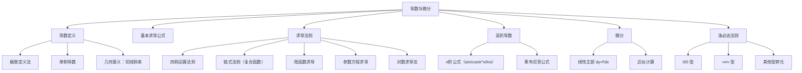

> 📌 导数刻画函数的"瞬时变化率"，微分是导数的几何近似工具。掌握求导，是计算极值、积分、级数的核心前置技能。

---

## 📋 前置知识

- [[高等数学 第一章：函数、极限与连续]] — 导数本质上是一种特殊极限，必须先理解极限
- [[基本初等函数]] — 六类基本初等函数的公式要烂熟于心
- [[等价无穷小替换]] — 洛必达法则和导数定义中会用到

---

## 🤔 为什么需要导数？

你开车，仪表盘显示的速度是"此时此刻"的速度，不是"过去一段时间"的平均速度。这个瞬时速度，在数学上就是路程函数 $s(t)$ 对时间的**导数** $s'(t)$。

更一般地：任何"变化快慢"的问题——电流强度、温度变化、利润增速、图像斜率——本质上都是导数问题。导数是微积分的"引擎"，没有导数就没有极值、没有泰勒展开、没有微分方程。

---

## 🧠 第一节：导数的定义

### 1.1 从平均变化率到瞬时变化率

设函数 $y = f(x)$ 在 $x_0$ 附近有定义。给 $x_0$ 一个增量 $\Delta x$（可正可负），函数值的增量为

$$\Delta y = f(x_0 + \Delta x) - f(x_0)$$

**平均变化率**：$\dfrac{\Delta y}{\Delta x} = \dfrac{f(x_0 + \Delta x) - f(x_0)}{\Delta x}$

> 🎯 **类比**：平均变化率是"这段路程的平均速度"，而瞬时变化率是"某一瞬间的速度"。让时间段 $\Delta x \to 0$，平均速度就变成了瞬时速度。

当 $\Delta x \to 0$ 时，若该比值的极限存在，就定义为 $f(x)$ 在 $x_0$ 处的**导数**：

$$f'(x_0) = \lim_{\Delta x \to 0} \frac{f(x_0 + \Delta x) - f(x_0)}{\Delta x}$$

等价写法（令 $x = x_0 + \Delta x$，即 $\Delta x = x - x_0$，$\Delta x \to 0$ 等价于 $x \to x_0$）：

$$f'(x_0) = \lim_{x \to x_0} \frac{f(x) - f(x_0)}{x - x_0}$$

导数的其他记号：$y'\big|_{x=x_0}$，$\dfrac{dy}{dx}\bigg|_{x=x_0}$，$\dfrac{df}{dx}\bigg|_{x=x_0}$

### 1.2 导函数

若 $f(x)$ 在区间 $I$ 上每一点都可导，则得到一个新函数，称为 $f(x)$ 的**导函数**，记作

$$f'(x), \quad y', \quad \frac{dy}{dx}, \quad \frac{d}{dx}f(x)$$

### 1.3 单侧导数

**左导数**：$f'_-(x_0) = \lim_{\Delta x \to 0^-} \dfrac{f(x_0 + \Delta x) - f(x_0)}{\Delta x}$

**右导数**：$f'_+(x_0) = \lim_{\Delta x \to 0^+} \dfrac{f(x_0 + \Delta x) - f(x_0)}{\Delta x}$

$$f'(x_0) \text{ 存在} \iff f'_-(x_0) = f'_+(x_0)$$

> ⚠️ **踩坑**：分段函数在分界点处的导数，必须分别求左右导数，再验证是否相等。只求一侧是错的。

### 1.4 可导与连续的关系

**可导 $\Rightarrow$ 连续**（可导必连续）

**连续 $\not\Rightarrow$ 可导**（连续不一定可导）

> 📌 **经典反例**：$f(x) = |x|$ 在 $x = 0$ 处连续，但

$$f'_-(0) = \lim_{x \to 0^-} \frac{|x| - 0}{x - 0} = \lim_{x \to 0^-} \frac{-x}{x} = -1$$

$$f'_+(0) = \lim_{x \to 0^+} \frac{|x| - 0}{x - 0} = \lim_{x \to 0^+} \frac{x}{x} = 1$$

左右导数不等，故 $f(x) = |x|$ 在 $x = 0$ 处**不可导**。

### 1.5 导数的几何意义

$f'(x_0)$ 是曲线 $y = f(x)$ 在点 $(x_0, f(x_0))$ 处**切线的斜率**。

切线方程：$y - f(x_0) = f'(x_0)(x - x_0)$

法线方程（与切线垂直）：$y - f(x_0) = -\dfrac{1}{f'(x_0)}(x - x_0)$（$f'(x_0) \neq 0$）

---

## 🧠 第二节：基本求导公式

这是整章的基础，必须**一字不差地背熟**。

### 2.1 基本初等函数的导数

$$( C )' = 0 \quad (C \text{ 为常数})$$

$$( x^\alpha )' = \alpha x^{\alpha - 1}$$

$$( a^x )' = a^x \ln a, \quad (e^x)' = e^x$$

$$( \log_a x )' = \frac{1}{x \ln a}, \quad (\ln x)' = \frac{1}{x}$$

$$( \sin x )' = \cos x, \quad (\cos x)' = -\sin x$$

$$( \tan x )' = \sec^2 x, \quad (\cot x)' = -\csc^2 x$$

$$( \sec x )' = \sec x \tan x, \quad (\csc x)' = -\csc x \cot x$$

$$( \arcsin x )' = \frac{1}{\sqrt{1-x^2}}, \quad (\arccos x)' = -\frac{1}{\sqrt{1-x^2}}$$

$$(\arctan x)' = \frac{1}{1+x^2}, \quad (\text{arccot}\, x)' = -\frac{1}{1+x^2}$$

> ⚠️ **踩坑**：$(\cos x)' = -\sin x$，负号不能忘；$(\arccos x)'$ 和 $(\text{arccot}\, x)'$ 都有负号，与正弦、正切的反函数导数差一个负号。

### 2.2 四则运算求导法则

设 $u = u(x)$，$v = v(x)$ 均可导，则：

$$(u \pm v)' = u' \pm v'$$

$$(uv)' = u'v + uv'$$

$$\left(\frac{u}{v}\right)' = \frac{u'v - uv'}{v^2} \quad (v \neq 0)$$

> 🎯 **记忆口诀（积的求导）**："前导后不导，加上前不导后导"

---

## 🧠 第三节：复合函数求导（链式法则）

### 3.1 链式法则

> 🎯 **类比**：复合函数就像流水线。原料 $x$ 先经过第一道工序变成半成品 $u = g(x)$，再经过第二道工序变成成品 $y = f(u)$。整条流水线的效率（变化率）= 第一道效率 $\times$ 第二道效率。

设 $y = f(u)$，$u = g(x)$，且 $g$ 在 $x$ 处可导，$f$ 在 $u = g(x)$ 处可导，则复合函数 $y = f(g(x))$ 在 $x$ 处可导，且

$$\frac{dy}{dx} = \frac{dy}{du} \cdot \frac{du}{dx} = f'(u) \cdot g'(x) = f'(g(x)) \cdot g'(x)$$

**多层复合**：$y = f(g(h(x)))$

$$\frac{dy}{dx} = f'(g(h(x))) \cdot g'(h(x)) \cdot h'(x)$$

> ⚠️ **踩坑**：复合求导时，"外层对中间变量求导"乘以"中间变量对 $x$ 求导"，层层剥洋葱，不要漏掉任何一层的导数。

**示例**：求 $y = \sin(x^2 + 1)$ 的导数

令 $u = x^2 + 1$，则 $y = \sin u$：

$$y' = (\sin u)' \cdot (x^2 + 1)' = \cos u \cdot 2x = 2x\cos(x^2 + 1)$$

---

## 🧠 第四节：隐函数与参数方程求导

### 4.1 隐函数求导

由方程 $F(x, y) = 0$ 确定的函数 $y = y(x)$ 称为**隐函数**。求 $\dfrac{dy}{dx}$ 的方法：

> 🎯 **类比**：把 $y$ 始终看作 $x$ 的函数，对方程两边同时关于 $x$ 求导，遇到 $y$ 的函数就用链式法则，然后解出 $y'$。

**方法**：方程两边对 $x$ 求导，注意 $y$ 是 $x$ 的函数，$\dfrac{d}{dx}[f(y)] = f'(y) \cdot y'$。

**示例**：设 $e^y + xy = e$，求 $y'$

两边对 $x$ 求导：

$$e^y \cdot y' + y + x \cdot y' = 0$$

整理：$y'(e^y + x) = -y$

$$y' = \frac{-y}{e^y + x}$$

### 4.2 参数方程求导

设 $\begin{cases} x = \varphi(t) \\ y = \psi(t) \end{cases}$，则

$$\frac{dy}{dx} = \frac{\psi'(t)}{\varphi'(t)} \quad (\varphi'(t) \neq 0)$$

**二阶导数**：

$$\frac{d^2y}{dx^2} = \frac{d}{dx}\left(\frac{dy}{dx}\right) = \frac{\left(\dfrac{dy}{dx}\right)'_t}{\varphi'(t)} = \frac{\psi''(t)\varphi'(t) - \psi'(t)\varphi''(t)}{[\varphi'(t)]^3}$$

> ⚠️ **踩坑**：参数方程求二阶导时，是对 $t$ 求导再除以 $\varphi'(t)$，而**不是** $\dfrac{\psi''(t)}{\varphi''(t)}$！这是考研中非常高频的错误。

### 4.3 对数求导法

当函数形如**幂指函数** $y = u(x)^{v(x)}$，或多个函数连乘连除时，先两边取对数再求导，往往大幅简化计算。

**示例**：求 $y = x^{\sin x}$ 的导数（$x > 0$）

两边取对数：$\ln y = \sin x \cdot \ln x$

两边对 $x$ 求导：

$$\frac{y'}{y} = \cos x \cdot \ln x + \sin x \cdot \frac{1}{x}$$

$$y' = y\left(\cos x \ln x + \frac{\sin x}{x}\right) = x^{\sin x}\left(\cos x \ln x + \frac{\sin x}{x}\right)$$

---

## 🧠 第五节：高阶导数

### 5.1 定义

$f'(x)$ 的导数称为 $f(x)$ 的**二阶导数**，记作 $f''(x)$ 或 $\dfrac{d^2y}{dx^2}$。

$n$ 阶导数：$f^{(n)}(x) = \left[f^{(n-1)}(x)\right]'$，记作 $y^{(n)}$ 或 $\dfrac{d^ny}{dx^n}$。

### 5.2 常用高阶导数公式

$$(\sin x)^{(n)} = \sin\!\left(x + n\cdot\frac{\pi}{2}\right)$$

$$(\cos x)^{(n)} = \cos\!\left(x + n\cdot\frac{\pi}{2}\right)$$

$$(e^x)^{(n)} = e^x, \quad (a^x)^{(n)} = a^x (\ln a)^n$$

$$(\ln x)^{(n)} = \frac{(-1)^{n-1}(n-1)!}{x^n}$$

$$(x^m)^{(n)} = m(m-1)\cdots(m-n+1)x^{m-n} \quad (m \geq n \text{ 时})$$

### 5.3 莱布尼茨公式

$(uv)$ 的 $n$ 阶导数：

$$(uv)^{(n)} = \sum_{k=0}^{n} \binom{n}{k} u^{(k)} v^{(n-k)}$$

其中 $\binom{n}{k} = \dfrac{n!}{k!(n-k)!}$，$u^{(0)} = u$，$v^{(0)} = v$。

> 🎯 **类比**：莱布尼茨公式与二项式定理 $(a+b)^n$ 的展开形式完全类似，只是把"幂次"换成了"导数阶次"。

---

## 🧠 第六节：微分

### 6.1 微分的定义

> 🎯 **类比**：你要计算一个球面积的变化量。球的半径从 $r$ 增加 $\Delta r$ 时，面积精确变化量 $\Delta S = 4\pi(r+\Delta r)^2 - 4\pi r^2 = 8\pi r \Delta r + 4\pi(\Delta r)^2$。当 $\Delta r$ 很小时，$4\pi(\Delta r)^2$ 极其微小，**主要变化量**是 $8\pi r \Delta r$，这个线性主部就是微分 $dS$。

若 $f'(x_0)$ 存在，则函数的增量可以写成：

$$\Delta y = f'(x_0) \Delta x + o(\Delta x)$$

其中 $f'(x_0)\Delta x$ 是 $\Delta y$ 关于 $\Delta x$ 的**线性主部**，称为 $f(x)$ 在 $x_0$ 处的**微分**，记作

$$dy = f'(x_0)\,dx$$

其中 $dx = \Delta x$ 是自变量的微分。

### 6.2 微分的几何意义

在点 $(x_0, f(x_0))$ 处，$dy$ 是切线上纵坐标的增量；$\Delta y$ 是曲线上纵坐标的真实增量。当 $\Delta x$ 很小时，$dy \approx \Delta y$。

### 6.3 微分公式与运算法则

微分公式与导数公式一一对应：$dy = f'(x)\,dx$

$$d(uv) = v\,du + u\,dv$$

$$d\!\left(\frac{u}{v}\right) = \frac{v\,du - u\,dv}{v^2}$$

**微分形式不变性**：无论 $x$ 是自变量还是中间变量，$dy = f'(u)\,du$ 的形式都成立。这使得微分在换元积分中极为方便。

### 6.4 近似计算

当 $|\Delta x|$ 很小时：$f(x_0 + \Delta x) \approx f(x_0) + f'(x_0)\Delta x$

常用近似公式（$x \to 0$ 时）：

$$\sqrt{1+x} \approx 1 + \frac{x}{2}, \quad \sin x \approx x, \quad e^x \approx 1 + x, \quad \ln(1+x) \approx x$$

$$(1+x)^\alpha \approx 1 + \alpha x$$

---

## 🧠 第七节：洛必达法则

洛必达法则是处理**不定式极限**最系统的工具，也是考研中出现频率极高的方法。

### 7.1 法则内容

**$\dfrac{0}{0}$ 型**：若 $\lim_{x \to a} f(x) = 0$，$\lim_{x \to a} g(x) = 0$，且 $f$、$g$ 在 $a$ 附近可导，$g'(x) \neq 0$，则

$$\lim_{x \to a} \frac{f(x)}{g(x)} = \lim_{x \to a} \frac{f'(x)}{g'(x)}$$

（右边极限存在或为 $\infty$ 时成立）

**$\dfrac{\infty}{\infty}$ 型**：类似地，对 $f(x) \to \infty$，$g(x) \to \infty$ 的情形同样成立。

### 7.2 其他不定式的转化

| 不定式类型 | 转化方法 |
|-----------|---------|
| $0 \cdot \infty$ | 改写为 $\dfrac{0}{1/\infty}$ 或 $\dfrac{\infty}{1/0}$，化为 $\dfrac{0}{0}$ 或 $\dfrac{\infty}{\infty}$ |
| $\infty - \infty$ | 通分或有理化，化为 $\dfrac{0}{0}$ |
| $1^\infty$、$0^0$、$\infty^0$ | 取对数：$\ln y = v \ln u$，化为 $0 \cdot \infty$ |

### 7.3 使用洛必达的注意事项

> ⚠️ **洛必达不是万能的！** 使用前必须确认：
> 1. 极限确实是不定式（$\frac{0}{0}$ 或 $\frac{\infty}{\infty}$）
> 2. 导数之比的极限**存在**（若不存在也不能说原极限不存在，可能需要换方法）
> 3. 优先考虑等价替换化简，再用洛必达，减少计算量

**示例**：$\displaystyle\lim_{x \to 0} \frac{e^x - 1 - x}{x^2}$（$\frac{0}{0}$ 型）

$$\lim_{x \to 0} \frac{e^x - 1 - x}{x^2} \xlongequal{\text{洛}} \lim_{x \to 0} \frac{e^x - 1}{2x} \xlongequal{\text{洛}} \lim_{x \to 0} \frac{e^x}{2} = \frac{1}{2}$$

---

## 💻 代码验证

```python
import sympy as sp

x = sp.Symbol('x')

# 验证基本导数公式
funcs = {
    'sin(x)': sp.sin(x),
    'cos(x)': sp.cos(x),
    'e^x':    sp.exp(x),
    'ln(x)':  sp.ln(x),
    'arctan(x)': sp.atan(x),
    'x^3':    x**3,
}

print("基本导数验证：")
for name, f in funcs.items():
    df = sp.diff(f, x)
    print(f"  d/dx [{name}] = {df}")

print()

# 链式法则示例：sin(x^2 + 1)
f = sp.sin(x**2 + 1)
print(f"d/dx [sin(x²+1)] = {sp.diff(f, x)}")

print()

# 洛必达验证
expr = (sp.exp(x) - 1 - x) / x**2
limit_val = sp.limit(expr, x, 0)
print(f"lim_(x→0) (e^x - 1 - x)/x² = {limit_val}")

# 参数方程示例：x=t², y=t³
t = sp.Symbol('t')
phi = t**2
psi = t**3
dy_dx = sp.diff(psi, t) / sp.diff(phi, t)
print(f"\n参数方程 x=t², y=t³：")
print(f"  dy/dx = {sp.simplify(dy_dx)}")

d2y_dx2_num = sp.diff(dy_dx, t)
d2y_dx2 = d2y_dx2_num / sp.diff(phi, t)
print(f"  d²y/dx² = {sp.simplify(d2y_dx2)}")
```

```bash
python3 derivative_verify.py
```

**预期输出**：

```text
基本导数验证：
  d/dx [sin(x)] = cos(x)
  d/dx [cos(x)] = -sin(x)
  d/dx [e^x] = exp(x)
  d/dx [ln(x)] = 1/x
  d/dx [arctan(x)] = 1/(x**2 + 1)
  d/dx [x^3] = 3*x**2

d/dx [sin(x²+1)] = 2*x*cos(x**2 + 1)

lim_(x→0) (e^x - 1 - x)/x² = 1/2

参数方程 x=t², y=t³：
  dy/dx = 3*t/2
  d²y/dx² = 3/(4*t)
```

---

## ⚠️ 常见误区与踩坑点

> ❌ **误区 1：$[f(x)^n]' = n \cdot f(x)^{n-1}$，忘记乘以 $f'(x)$**
> 链式法则要求乘以内层函数的导数。正确：$[f(x)^n]' = n \cdot f(x)^{n-1} \cdot f'(x)$

> ❌ **误区 2：$\left(\dfrac{u}{v}\right)' = \dfrac{u'}{v'}$**
> 这是错误的！商的导数是 $\dfrac{u'v - uv'}{v^2}$，分子是交叉相减，不是直接上下分别求导。

> ⚠️ **踩坑 3：参数方程二阶导数的求法**
> 二阶导数 $\dfrac{d^2y}{dx^2} \neq \dfrac{\psi''(t)}{\varphi''(t)}$。正确做法是将 $\dfrac{dy}{dx}$ 看作关于 $t$ 的新函数，再对 $t$ 求导，然后除以 $\varphi'(t)$。

> ⚠️ **踩坑 4：隐函数求导时对含 $y$ 的项漏掉链式法则**
> 对 $y^2$ 关于 $x$ 求导，结果是 $2y \cdot y'$，不是 $2y$。凡是含 $y$ 的表达式对 $x$ 求导，都要乘以 $y'$。

> ❌ **误区 5：洛必达法则用于非不定式**
> 若 $\lim_{x \to a} g(x) \neq 0$，则 $\lim \dfrac{f(x)}{g(x)} = \dfrac{\lim f(x)}{\lim g(x)}$ 直接计算即可，**不能使用洛必达**。强行使用会得到错误结果。

> ⚠️ **踩坑 6：绝对值函数的导数**
> $|f(x)|$ 在 $f(x) = 0$ 的点处可能不可导，必须用定义分左右导数检验。在 $f(x) \neq 0$ 处，$|f(x)|' = \dfrac{f(x)}{|f(x)|} \cdot f'(x) = \text{sgn}(f(x)) \cdot f'(x)$。

---

## 🔄 概念对比

| 特性 | 导数 $f'(x_0)$ | 微分 $dy$ |
|------|--------------|----------|
| 本质 | 极限值（一个数） | 线性主部（一个表达式） |
| 表达式 | $\lim_{\Delta x \to 0} \dfrac{\Delta y}{\Delta x}$ | $f'(x_0)\,dx$ |
| 几何意义 | 切线斜率 | 切线上纵坐标的增量 |
| 应用 | 变化率、极值判断 | 近似计算、换元积分 |
| 关系 | $dy = f'(x)\,dx$，互相决定 | — |

> 💡 **一句话总结**：导数是微分的系数，微分是导数乘以自变量增量的乘积；有导数必有微分，有微分必有导数，二者等价。

---

## 🏋️ 动手练习

### 练习 1：用定义求导（⭐⭐ 中等）

**题目**：用导数定义求 $f(x) = \sqrt{x}$ 在 $x = 4$ 处的导数。

**参考答案**：

$$f'(4) = \lim_{\Delta x \to 0} \frac{\sqrt{4 + \Delta x} - \sqrt{4}}{\Delta x} = \lim_{\Delta x \to 0} \frac{\sqrt{4+\Delta x} - 2}{\Delta x}$$

分子有理化，乘以 $\dfrac{\sqrt{4+\Delta x} + 2}{\sqrt{4+\Delta x} + 2}$：

$$= \lim_{\Delta x \to 0} \frac{(4 + \Delta x) - 4}{\Delta x(\sqrt{4+\Delta x} + 2)} = \lim_{\Delta x \to 0} \frac{\Delta x}{\Delta x(\sqrt{4+\Delta x} + 2)} = \lim_{\Delta x \to 0} \frac{1}{\sqrt{4+\Delta x} + 2} = \frac{1}{4}$$

验证：由公式 $(x^{1/2})' = \dfrac{1}{2\sqrt{x}}$，在 $x = 4$ 处为 $\dfrac{1}{2\sqrt{4}} = \dfrac{1}{4}$。✓

---

### 练习 2：复合函数与积商法则综合（⭐⭐ 中等）

**题目**：求 $y = \dfrac{\ln(1+x^2)}{\arctan x}$ 的导数。

**参考答案**：

令 $u = \ln(1+x^2)$，$v = \arctan x$，用商的求导法则：

$$u' = \frac{2x}{1+x^2}, \quad v' = \frac{1}{1+x^2}$$

$$y' = \frac{u'v - uv'}{v^2} = \frac{\dfrac{2x}{1+x^2} \cdot \arctan x - \ln(1+x^2) \cdot \dfrac{1}{1+x^2}}{(\arctan x)^2}$$

$$= \frac{2x\arctan x - \ln(1+x^2)}{(1+x^2)(\arctan x)^2}$$

---

### 练习 3：隐函数求导（⭐⭐ 中等）

**题目**：设曲线由方程 $x^3 + y^3 = 3axy$（$a \neq 0$，笛卡尔叶形线）确定，求 $y'$，并求曲线在点 $\left(\dfrac{3a}{2}, \dfrac{3a}{2}\right)$ 处的切线方程。

**参考答案**：

两边对 $x$ 求导：

$$3x^2 + 3y^2 y' = 3a(y + xy')$$

$$3x^2 + 3y^2 y' = 3ay + 3axy'$$

整理：$y'(3y^2 - 3ax) = 3ay - 3x^2$

$$y' = \frac{ay - x^2}{y^2 - ax}$$

在点 $\left(\dfrac{3a}{2}, \dfrac{3a}{2}\right)$ 处：

$$y'\bigg|_{x=y=\frac{3a}{2}} = \frac{a \cdot \dfrac{3a}{2} - \left(\dfrac{3a}{2}\right)^2}{\left(\dfrac{3a}{2}\right)^2 - a \cdot \dfrac{3a}{2}} = \frac{\dfrac{3a^2}{2} - \dfrac{9a^2}{4}}{\dfrac{9a^2}{4} - \dfrac{3a^2}{2}} = \frac{-\dfrac{3a^2}{4}}{\dfrac{3a^2}{4}} = -1$$

切线斜率为 $-1$，切线方程：

$$y - \frac{3a}{2} = -1 \cdot \left(x - \frac{3a}{2}\right) \implies x + y = 3a$$

---

### 练习 4：高阶导数与莱布尼茨公式（⭐⭐⭐ 较难）

**题目**：设 $y = x^2 \sin x$，求 $y^{(10)}$。

**参考答案**：

令 $u = x^2$，$v = \sin x$，用莱布尼茨公式：

$$y^{(n)} = \sum_{k=0}^{n} \binom{n}{k} u^{(k)} v^{(n-k)}$$

注意 $u = x^2$ 最多求到二阶导后变为常数，三阶及以上均为零：

$$u^{(0)} = x^2, \quad u^{(1)} = 2x, \quad u^{(2)} = 2, \quad u^{(k)} = 0 \quad (k \geq 3)$$

故莱布尼茨展开只有 $k = 0, 1, 2$ 三项有效，$n = 10$：

$$y^{(10)} = \binom{10}{0} x^2 \cdot (\sin x)^{(10)} + \binom{10}{1} \cdot 2x \cdot (\sin x)^{(9)} + \binom{10}{2} \cdot 2 \cdot (\sin x)^{(8)}$$

利用 $(\sin x)^{(n)} = \sin\!\left(x + \dfrac{n\pi}{2}\right)$：

$$(\sin x)^{(10)} = \sin\!\left(x + 5\pi\right) = -\sin x$$

$$(\sin x)^{(9)} = \sin\!\left(x + \frac{9\pi}{2}\right) = \sin\!\left(x + \frac{\pi}{2}\right) = \cos x$$

$$(\sin x)^{(8)} = \sin\!\left(x + 4\pi\right) = \sin x$$

代入：

$$y^{(10)} = 1 \cdot x^2(-\sin x) + 10 \cdot 2x \cos x + 45 \cdot 2 \sin x$$

$$= -x^2 \sin x + 20x\cos x + 90\sin x$$

---

### 练习 5：不定式极限综合（⭐⭐⭐ 较难）

**题目**：求 $\displaystyle\lim_{x \to 0^+} x^x$（$0^0$ 型）

**参考答案**：

令 $y = x^x$，两边取对数：$\ln y = x \ln x$

这是 $0 \cdot \infty$ 型，改写为 $\dfrac{\infty}{\infty}$ 型：

$$\ln y = \frac{\ln x}{1/x}$$

用洛必达法则（分子 $(\ln x)' = \dfrac{1}{x}$，分母 $(x^{-1})' = -x^{-2}$）：

$$\lim_{x \to 0^+} \frac{\ln x}{1/x} = \lim_{x \to 0^+} \frac{1/x}{-1/x^2} = \lim_{x \to 0^+} (-x) = 0$$

故 $\ln y \to 0$，即 $y \to e^0 = 1$。

$$\lim_{x \to 0^+} x^x = 1$$

---

### 练习 6：综合应用——切线与法线（⭐⭐⭐ 综合）

**题目**：曲线 $C$ 由参数方程 $\begin{cases} x = t - \sin t \\ y = 1 - \cos t \end{cases}$ 确定（摆线）。求 $t = \dfrac{\pi}{2}$ 时曲线上对应点处的切线方程与法线方程。

**参考答案**：

当 $t = \dfrac{\pi}{2}$ 时，切点坐标：

$$x_0 = \frac{\pi}{2} - \sin\frac{\pi}{2} = \frac{\pi}{2} - 1, \quad y_0 = 1 - \cos\frac{\pi}{2} = 1$$

求斜率：

$$\frac{dy}{dx} = \frac{(1-\cos t)'}{(t - \sin t)'} = \frac{\sin t}{1 - \cos t}$$

在 $t = \dfrac{\pi}{2}$ 处：

$$k = \frac{\sin\dfrac{\pi}{2}}{1 - \cos\dfrac{\pi}{2}} = \frac{1}{1 - 0} = 1$$

切线方程：

$$y - 1 = 1 \cdot \left(x - \left(\frac{\pi}{2} - 1\right)\right) \implies y = x - \frac{\pi}{2} + 2$$

法线斜率为 $-1$，法线方程：

$$y - 1 = -1 \cdot \left(x - \left(\frac{\pi}{2} - 1\right)\right) \implies y = -x + \frac{\pi}{2}$$

---

## 📝 总结

### 本章要点回顾

1. **导数本质**是极限：$f'(x_0) = \lim_{\Delta x \to 0} \dfrac{f(x_0 + \Delta x) - f(x_0)}{\Delta x}$；几何上是切线斜率；可导必连续，连续不必可导。

2. **求导三大法则**：四则运算（和差积商）、链式法则（复合函数）、对数求导法（幂指函数及连乘连除）——这三种覆盖了考研 95% 的求导场景。

3. **特殊求导**：隐函数（两边对 $x$ 求导，注意链式法则）；参数方程（一阶 $\dfrac{\psi'}{\varphi'}$，二阶再对 $t$ 求导再除以 $\varphi'$）。

4. **高阶导数**：熟记 $\sin$、$\cos$、$e^x$、$\ln x$ 的 $n$ 阶公式；遇到乘积形式用莱布尼茨公式。

5. **洛必达法则**：处理 $\dfrac{0}{0}$、$\dfrac{\infty}{\infty}$ 型；其他类型先变形，再套用；等价替换优先，洛必达兜底。

### 知识图谱



---

## 🔗 相关链接

- 上级概念：[[高等数学总览]]
- 前置章节：[[高等数学 第一章：函数、极限与连续]]
- 下一章节：[[高等数学 第三章：微分中值定理与导数的应用]]
- 关联概念：[[不定积分]]（导数的逆运算）、[[泰勒展开]]（高阶导数的应用）

## 📚 参考资料

- 同济大学数学系《高等数学》（第七版）第二、三章 —— 例题系统，定理证明严谨
- 张宇《高等数学 18 讲》第 2 讲 —— 导数计算技巧总结精炼
- 武忠祥《高等数学辅导讲义》—— 隐函数与参数方程部分尤其详细
