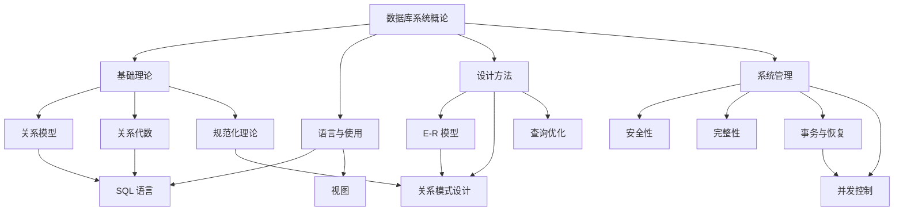

# 数据库系统概论（第6版）· 全书总纲概览

> 📌 这篇笔记是王珊《数据库系统概论》（第6版）全书的"导航地图"，用最少的篇幅帮你建立完整的知识框架，搞清楚每章在讲什么、各章之间的逻辑关系、以及复试最可能考到的核心概念。后续每个章节都会有独立的详细笔记展开。


## 📋 前置知识

本篇是总纲概览，从零开始讲起，无硬性前置要求。

如果你对以下概念有基本了解会更顺畅，但不了解也完全没关系，我们会在正文中解释：

- [[集合论基础]] — 关系模型的数学基础
- [[离散数学]] — 关系代数需要的逻辑思维
- [[操作系统基础]] — 理解数据库的存储和并发管理


## 🤔 为什么要学这个？

想象一下你开了一家连锁奶茶店。你有几千种原料、几百个配方、上万条订单记录、几十个门店的员工信息。一开始你用 Excel 表格管理这些数据，但很快你会发现：

- 同一个员工的手机号在 $3$ 张表里重复出现，改了一处忘了另一处（**数据冗余和不一致**）
- 两个店长同时修改库存表，一个人的修改把另一个人的覆盖了（**并发控制问题**）
- 某天电脑突然断电，你发现昨天录入的 $200$ 条订单全没了（**数据恢复问题**）
- 实习生不小心删了整张客户表（**安全性问题**）
- 你想查"上个月哪个门店的珍珠奶茶卖得最好"，但数据散落在 $5$ 个不同的文件里（**数据查询困难**）

**数据库系统**就是为了系统性地解决上述所有问题而诞生的。它不只是"存数据的地方"，而是一整套**管理数据的理论体系和软件系统**，包括怎么组织数据（数据模型）、怎么查数据（查询语言）、怎么保证数据不出错（完整性）、怎么防止数据被偷看（安全性）、怎么让多人同时用而不打架（并发控制）、怎么在出事后恢复数据（恢复技术）等等。

对于考研复试来说，数据库是计算机专业的核心基础课，几乎必考。掌握这本书的核心理论，是你复试通过的关键。


## 🧠 全书知识框架

> 🎯 **类比**：把整本书想象成一栋大楼的建造过程。第 $1$ 章是"为什么要盖楼"（概述），第 $2$-$4$ 章是"设计图纸"（数据模型和 SQL 语言），第 $5$ 章是"安全门禁"（安全性），第 $6$ 章是"质量检验"（完整性），第 $7$ 章是"建筑规范"（规范化理论），第 $8$ 章是"建筑方案"（数据库设计），第 $9$-$10$ 章是"施工现场管理"（查询优化和存储），第 $11$-$12$ 章是"多人施工的协调和事故应急"（事务、并发、恢复）。

下面我们逐章梳理核心知识点。每章的详细展开请看对应的 [[独立章节笔记]]，这里只勾勒骨架。


### 第 $1$ 章：绪论 — 数据库系统是什么？

这一章回答的核心问题是：**数据库从哪来？它解决了什么问题？它由哪些部分组成？**

#### 1.1 四个基本概念

你需要牢牢记住这四个概念的区别，考试经常考辨析题：

- **数据（Data）**：描述事物的符号记录。比如 `("张三", 男, 20, 计算机系)` 就是一条数据。数据有"型"（Data Type，数据的结构和格式）和"值"（Data Value，具体的内容）之分
- **数据库（Database, DB）**：长期存储在计算机内、有组织的、可共享的大量数据的集合。注意三个关键词——"长期存储"（不是临时的）、"有组织"（不是乱堆的）、"可共享"（多个用户和应用可以同时使用）
- **数据库管理系统（DBMS）**：位于用户与操作系统之间的一层数据管理软件。它是数据库系统的核心。MySQL、PostgreSQL、Oracle 都是 DBMS 的具体产品
- **数据库系统（DBS）**：由数据库 + DBMS + 应用程序 + 数据库管理员（DBA）组成的完整系统

> 🎯 **类比**：数据就像图书馆里的一本本书（信息载体），数据库就像整个图书馆（有组织的书籍集合），DBMS 就像图书管理系统软件（帮你检索、借还、管理书籍），数据库系统就像"图书馆 + 管理系统 + 图书管理员 + 借阅规则"这一整套体系。

#### 1.2 数据管理技术的发展

数据管理经历了三个阶段，这是常考的简答题：

| 阶段 | 人工管理阶段 | 文件系统阶段 | 数据库系统阶段 |
|------|------------|------------|--------------|
| 时间 | 20世纪50年代中期以前 | 50年代末-60年代中 | 60年代末至今 |
| 数据独立性 | 无 | 独立性差 | 高度独立 |
| 数据共享 | 无共享 | 共享性差，冗余大 | 共享性高，冗余小 |
| 数据由谁管理 | 用户/程序员 | 文件系统 | DBMS |

#### 1.3 数据模型

数据模型是数据库系统的核心和基础。它分为两大类：

- **概念模型**（也叫信息模型）：面向用户的，用来描述现实世界的。最典型的就是 **E-R 模型**（Entity-Relationship Model，实体-联系模型）
- **逻辑模型**：面向计算机的，包括层次模型、网状模型、**关系模型**（最重要！）、面向对象模型等

关系模型是本书的绝对重点。它用**二维表**（关系）来表示数据和数据之间的联系，简单直观，有严格的数学基础。

#### 1.4 数据库系统的三级模式结构

这个知识点几乎是必考的：

- **外模式（External Schema）**：也叫用户模式或子模式，是用户能看到的局部数据的逻辑结构。不同用户可以有不同的外模式
- **模式（Schema）**：也叫逻辑模式，是数据库中全体数据的逻辑结构和特征的描述。一个数据库只有一个模式
- **内模式（Internal Schema）**：也叫存储模式，描述数据的物理存储结构。一个数据库只有一个内模式

三级模式之间有两层映像：

- **外模式/模式映像**：保证了数据的**逻辑独立性**（模式改了，只要调整映像，外模式不用变，应用程序也不用改）
- **模式/内模式映像**：保证了数据的**物理独立性**（存储结构改了，只要调整映像，模式不用变）

> 🎯 **类比**：把数据库想象成一家大酒店。**内模式**是酒店的地基和管道布局（物理层面怎么建的），**模式**是酒店的完整建筑图纸（所有房间的逻辑布局），**外模式**是不同住客看到的不同景象——商务客人只关心会议室在哪，游客只关心泳池和餐厅在哪。酒店内部重新铺管道（内模式变了），住客感受不到（逻辑独立性）；酒店加盖了新楼层（模式变了），只要你常去的餐厅没变，你也感受不到（物理独立性）。

📖 详细笔记：[[第1章-绪论]]


### 第 $2$ 章：关系数据库 — 数据库的数学根基

这一章是理论重镇，给关系数据库建立严格的数学定义。

#### 2.1 关系模型的基本概念

- **关系（Relation）**：一个关系就是一张二维表。比如"学生"表就是一个关系
- **元组（Tuple）**：表中的一行就是一个元组，代表一条记录
- **属性（Attribute）**：表中的一列就是一个属性，有属性名和值域
- **域（Domain）**：属性的取值范围。比如"性别"这个属性的域是 $\{男, 女\}$
- **分量（Component）**：元组中的一个属性值
- **候选码（Candidate Key）**：能唯一标识一个元组的最小属性组。比如学号能唯一确定一个学生，学号就是候选码
- **主码（Primary Key）**：从候选码中选定的一个作为主码。一个关系只能有一个主码
- **外码（Foreign Key）**：关系 $R$ 中的一个属性组，它不是 $R$ 的主码，但它对应另一个关系 $S$ 的主码。外码用来表示关系之间的联系

> ❌ **误区：候选码一定只有一个属性**
> 很多初学者以为主码/候选码只能是一个字段（比如"学号"），但实际上候选码可以是多个属性的组合。例如"选课"关系中，单独的"学号"不能唯一确定一条记录（一个学生可以选多门课），单独的"课程号"也不行，必须用 $(\text{学号}, \text{课程号})$ 这个属性组合才能唯一标识一条选课记录。

#### 2.2 关系的完整性

三类完整性约束是高频考点：

- **实体完整性（Entity Integrity）**：主码的属性值不能为空（NULL）。道理很简单——主码是用来唯一标识元组的，如果它是空的，你怎么区分不同的记录？
- **参照完整性（Referential Integrity）**：外码的值要么为空，要么必须是被参照关系中某个元组的主码值。比如选课表中的"学号"（外码）填的值，必须在学生表的"学号"（主码）中存在
- **用户定义的完整性（User-Defined Integrity）**：根据具体应用的语义约束，比如"年龄必须在 $0$ 到 $150$ 之间"、"成绩必须在 $0$ 到 $100$ 之间"

#### 2.3 关系代数

关系代数（Relational Algebra）是一种抽象的查询语言，用**集合运算**来表达对关系的操作。它是理解 SQL 的数学基础，也是考试中计算题/推导题的重灾区。

**传统集合运算**（要求两个关系有相同的属性个数和对应的域）：

- **并（Union）$R \cup S$**：把 $R$ 和 $S$ 的所有元组合在一起，去掉重复
- **差（Difference）$R - S$**：在 $R$ 中但不在 $S$ 中的元组
- **交（Intersection）$R \cap S$**：同时在 $R$ 和 $S$ 中的元组
- **笛卡尔积（Cartesian Product）$R \times S$**：$R$ 的每一行和 $S$ 的每一行拼接，如果 $R$ 有 $m$ 行、$S$ 有 $n$ 行，结果有 $m \times n$ 行

**专门的关系运算**（重点中的重点）：

- **选择（Selection）$\sigma$**：从关系中选出满足条件的**行**（元组）。例如 $\sigma_{\text{年龄} > 20}(\text{学生})$ 选出所有年龄大于 $20$ 的学生
- **投影（Projection）$\pi$**：从关系中选出指定的**列**（属性）。例如 $\pi_{\text{姓名, 年龄}}(\text{学生})$ 只保留姓名和年龄两列
- **连接（Join）$\bowtie$**：把两个关系按某个条件拼接起来。最常用的是**自然连接**（Natural Join），它自动按同名属性进行等值连接并去掉重复列
- **除（Division）$\div$**：这是最难理解的运算，通俗来说就是"找出在 $R$ 中与 $S$ 的所有元组都有关系的那些元组"。典型例题："找出选修了全部课程的学生"

> 🎯 **类比**：选择 $\sigma$ 就像从一叠简历中挑出符合条件的人（横向筛选行），投影 $\pi$ 就像只看简历的某几项信息、忽略其他（纵向筛选列），连接 $\bowtie$ 就像把两份不同的名单按"姓名"对齐合并成一份完整档案。

📖 详细笔记：[[第2章-关系数据库]]


### 第 $3$-$4$ 章：SQL 语言 — 与数据库对话的标准语言

SQL（Structured Query Language，结构化查询语言）是关系数据库的标准语言。第 $3$ 章讲基础，第 $4$ 章讲高级特性。这两章是**实操和笔试都必考**的。

#### 3.1 SQL 的核心功能分类

| 功能类别 | 关键字 | 说明 |
|---------|--------|------|
| 数据定义（DDL） | CREATE, ALTER, DROP | 创建/修改/删除 表、视图、索引 |
| 数据查询（DQL） | SELECT | 查询数据，SQL 的灵魂 |
| 数据操纵（DML） | INSERT, UPDATE, DELETE | 增/改/删数据 |
| 数据控制（DCL） | GRANT, REVOKE | 授权和收回权限 |

#### 3.2 SELECT 查询的核心结构

```sql
SELECT [ALL | DISTINCT] <目标列表达式>
FROM <表名或视图名>
[WHERE <条件表达式>]
[GROUP BY <列名> [HAVING <条件>]]
[ORDER BY <列名> [ASC | DESC]];
```

这个结构的**执行顺序**（非常容易考）是：**FROM → WHERE → GROUP BY → HAVING → SELECT → ORDER BY**。注意执行顺序和书写顺序不一样！

#### 3.3 高频考点速查

- **多表连接查询**：等值连接、自然连接、外连接（LEFT JOIN / RIGHT JOIN / FULL JOIN）、自身连接
- **嵌套查询**：带 IN / NOT IN / EXISTS / NOT EXISTS 的子查询。尤其是 **相关子查询**（子查询依赖外层查询的值）和 **EXISTS 的用法**
- **集合操作**：UNION（并）、INTERSECT（交）、EXCEPT（差）
- **聚集函数**：COUNT、SUM、AVG、MAX、MIN，配合 GROUP BY 使用
- **视图（View）**：虚表，不存储数据，只存储定义。用 `CREATE VIEW` 创建。视图的作用：简化查询、提供数据独立性、提供安全保护

> ⚠️ **踩坑提醒：WHERE 和 HAVING 的区别**
> WHERE 是对**原始行**进行过滤，在分组之前执行，不能用聚集函数。HAVING 是对**分组后的组**进行过滤，在 GROUP BY 之后执行，可以用聚集函数。比如"找出平均成绩大于 $90$ 的课程"，必须用 HAVING，不能用 WHERE。

📖 详细笔记：[[第3章-SQL基础]]、[[第4章-SQL高级]]


### 第 $5$ 章：数据库安全性 — 谁能看什么数据？

安全性要解决的问题是：**防止非法用户访问数据库中的数据**。

#### 5.1 安全性控制的层次

从外到内共有四道防线：

1. **用户身份鉴别**：你是谁？（口令、数字证书、生物识别等）
2. **存取控制（Access Control）**：你能做什么？这是核心。分为两种策略：
   - **自主存取控制（DAC, Discretionary Access Control）**：通过 GRANT/REVOKE 授权和收回权限。灵活但安全性相对低，因为权限可以传递
   - **强制存取控制（MAC, Mandatory Access Control）**：给数据和用户都分等级。规则是"高读低、低写高"的反向——即用户只能读**不高于**自己级别的数据，只能写**不低于**自己级别的数据
3. **视图机制**：通过视图限制用户只能看到部分数据
4. **审计（Audit）**：事后追查，记录谁在什么时候做了什么操作

#### 5.2 GRANT 和 REVOKE

```sql
-- 授权：把对 Student 表的查询权限授给用户 U1，并允许 U1 继续授权给别人
GRANT SELECT ON TABLE Student TO U1 WITH GRANT OPTION;

-- 收回权限：收回 U1 对 Student 表的查询权限（CASCADE 级联收回 U1 传递出去的权限）
REVOKE SELECT ON TABLE Student FROM U1 CASCADE;
```

📖 详细笔记：[[第5章-数据库安全性]]


### 第 $6$ 章：数据库完整性 — 数据本身的正确性

完整性和安全性容易混淆。**安全性是防止非法访问（防外人），完整性是防止不合法的数据进入数据库（防自己人犯错）**。

#### 6.1 三类完整性约束（与第 $2$ 章呼应）

- **实体完整性**：主码不能为 NULL → 对应 `PRIMARY KEY` 约束
- **参照完整性**：外码必须合法 → 对应 `FOREIGN KEY ... REFERENCES ...` 约束，违约时可选 CASCADE（级联）、SET NULL、NO ACTION 等策略
- **用户定义完整性**：业务规则 → 对应 `NOT NULL`、`UNIQUE`、`CHECK` 约束

#### 6.2 触发器（Trigger）

触发器是一种特殊的存储过程，当满足特定条件时自动执行。它是主动完整性检查的手段。

```sql
CREATE TRIGGER 触发器名
{BEFORE | AFTER} {INSERT | UPDATE | DELETE}
ON 表名
FOR EACH ROW | FOR EACH STATEMENT
WHEN (条件)
BEGIN
    -- 触发动作
END;
```

📖 详细笔记：[[第6章-数据库完整性]]


### 第 $7$ 章：关系数据库规范化理论 — 怎样设计"好"的表？

这是整本书理论难度最高的一章，也是考试中推导题/计算题的重灾区。

#### 7.1 为什么需要规范化？

一张"设计不好"的表会导致四种异常：

- **数据冗余**：同一信息重复存储多次
- **更新异常**：修改一处数据却忘了修改其他地方的副本
- **插入异常**：想插入一些数据却因为主码不完整而无法插入
- **删除异常**：删除某些数据时顺带把其他有用数据也丢了

> 🎯 **类比**：假设你把学生信息和课程信息全塞进一张大表 `(学号, 姓名, 系名, 系主任, 课程号, 成绩)`。这就像把厨房、卧室、浴室全放在一个房间里——看起来省事，但做饭的油烟会弄脏床铺（数据冗余），修马桶的时候不得不把床搬走（更新异常），你想新建一个系但这个系还没有学生就没法录入（插入异常），最后一个学生退学就把系的信息也删没了（删除异常）。**规范化就是"合理隔断"，把一个大房间分成功能清晰的独立房间。**

#### 7.2 函数依赖（Functional Dependency, FD）

函数依赖是规范化理论的基石。设 $X$ 和 $Y$ 是关系 $R$ 的属性子集，如果 $X$ 的值能唯一确定 $Y$ 的值，就说 $Y$ **函数依赖于** $X$，记作 $X \rightarrow Y$。

例如在学生表中，$\text{学号} \rightarrow \text{姓名}$（知道学号就能确定姓名），但 $\text{姓名} \nrightarrow \text{学号}$（可能有同名学生）。

关键类型：

- **完全函数依赖**：$X \rightarrow Y$，且 $X$ 的任何真子集都不能决定 $Y$。记作 $X \xrightarrow{F} Y$
- **部分函数依赖**：$X \rightarrow Y$，但 $X$ 的某个真子集也能决定 $Y$。记作 $X \xrightarrow{P} Y$
- **传递函数依赖**：$X \rightarrow Y$，$Y \rightarrow Z$，且 $Y \nrightarrow X$，则 $Z$ 传递依赖于 $X$

#### 7.3 范式（Normal Form）的层次

范式是衡量关系模式规范化程度的"等级"：

$$
1NF \subset 2NF \subset 3NF \subset BCNF \subset 4NF
$$

- **$1NF$（第一范式）**：每个属性都是不可再分的原子值。这是关系模型的最低要求
- **$2NF$（第二范式）**：在 $1NF$ 的基础上，消除**非主属性对码的部分函数依赖**。通俗说：每个非主属性必须**完全依赖于整个主码**，而不是只依赖主码的一部分
- **$3NF$（第三范式）**：在 $2NF$ 的基础上，消除**非主属性对码的传递函数依赖**。通俗说：非主属性之间不能有"A 决定 B，B 决定 C"的链条
- **$BCNF$（Boyce-Codd 范式）**：在 $3NF$ 的基础上，要求**每个函数依赖的左边都必须包含候选码**。这是对 $3NF$ 的增强，把主属性的问题也解决了

#### 7.4 Armstrong 公理

Armstrong 公理是求解属性闭包和候选码的工具，考试中经常出计算题：

- **自反律**：若 $Y \subseteq X$，则 $X \rightarrow Y$
- **增广律**：若 $X \rightarrow Y$，则 $XZ \rightarrow YZ$
- **传递律**：若 $X \rightarrow Y$ 且 $Y \rightarrow Z$，则 $X \rightarrow Z$

由此可推出：合并规则、分解规则、伪传递规则。

#### 7.5 模式分解

将一个不满足高级范式的关系模式分解成多个满足要求的子模式。分解时必须满足：

- **无损连接性**：分解后的关系自然连接回来能得到原来的关系（不丢数据也不多数据）
- **保持函数依赖**：原来的所有函数依赖在分解后的子关系中仍然成立

> ⚠️ **踩坑提醒**：分解到 $BCNF$ 时不一定能同时保持函数依赖；分解到 $3NF$ 可以做到既无损连接又保持函数依赖。这是常考的判断题。

📖 详细笔记：[[第7章-规范化理论]]


### 第 $8$ 章：数据库设计 — 从需求到数据库的完整流程

这一章是把前面的理论落地到实际的设计过程。

#### 8.1 数据库设计的六个阶段

| 阶段 | 核心任务 | 产出物 |
|------|---------|--------|
| 需求分析 | 弄清楚用户到底需要什么数据 | 数据字典、数据流图 |
| 概念结构设计 | 把需求抽象成概念模型 | **E-R 图** |
| 逻辑结构设计 | 把 E-R 图转换成关系模式 | 关系模式 |
| 物理结构设计 | 确定存储结构和存取方法 | 物理设计方案 |
| 数据库实施 | 建表、装数据、编程序 | 可运行的数据库 |
| 运行和维护 | 持续优化和调整 | 维护文档 |

#### 8.2 E-R 模型（重点！）

E-R 模型用图形化方式描述现实世界，是概念设计的核心工具：

- **实体（Entity）**：用矩形表示，代表一个客观存在的"东西"，如"学生"、"课程"
- **属性（Attribute）**：用椭圆表示，描述实体的特征，如学生的"姓名"、"年龄"
- **联系（Relationship）**：用菱形表示，描述实体之间的关系

联系的类型（根据参与实体的数量比）：

- **$1:1$（一对一）**：一个班只有一个班长，一个班长只管一个班
- **$1:n$（一对多）**：一个系有多个学生，一个学生只属于一个系
- **$m:n$（多对多）**：一个学生可以选多门课，一门课可以被多个学生选

#### 8.3 E-R 图向关系模式的转换规则

- $1:1$ 联系：可以合并到任一端的关系模式中
- $1:n$ 联系：将联系合并到 $n$ 端的关系模式中
- $m:n$ 联系：**必须**单独转换成一个新的关系模式，其主码是两端实体主码的组合

📖 详细笔记：[[第8章-数据库设计]]


### 第 $9$ 章：关系查询处理和查询优化

这一章讲 DBMS 内部是如何执行你写的 SQL 的，以及如何让查询跑得更快。

#### 9.1 查询处理的四个阶段

1. **查询分析**：语法检查，解析 SQL 语句
2. **查询检查**：语义检查，验证表名、列名是否存在，权限是否足够
3. **查询优化**：生成最优的执行计划。分为**代数优化**（基于关系代数等价变换规则）和**物理优化**（选择最优的存取路径和连接算法）
4. **查询执行**：按照执行计划执行

#### 9.2 代数优化的核心策略

最重要的原则：**尽早做选择和投影**。因为选择和投影会减少中间结果的大小，后续运算的代价就小了。

具体的等价变换规则包括：选择串接律、选择和投影的交换律、选择和笛卡尔积/连接的交换律等。

📖 详细笔记：[[第9章-查询优化]]


### 第 $10$ 章：数据库存储（部分版本归入其他章节）

这一章讲数据在磁盘上是怎么组织的，索引（Index）是怎么工作的。

#### 10.1 索引的类型

- **B+ 树索引**：最常用的索引结构，适合范围查询和等值查询。B+ 树的所有数据都在叶子节点，叶子节点之间用指针串联
- **Hash 索引**：只适合等值查询，不支持范围查询

> 🎯 **类比**：B+ 树索引就像字典的目录——你可以按首字母快速翻到大致位置，然后在小范围内精确找到你要的词。Hash 索引就像直接告诉你"这个词在第 $237$ 页"——特别快，但如果你想找"所有 A 开头的词"就没用了。

📖 详细笔记：[[第10章-数据库存储与索引]]


### 第 $11$ 章：数据库恢复技术 — 出了事怎么办？

恢复技术解决的问题是：**当系统故障、硬件损坏或人为错误导致数据损坏时，如何把数据库恢复到正确状态。**

#### 11.1 事务（Transaction）

事务是恢复和并发控制的基本单位。事务的四个特性（**ACID**）是必背考点：

- **原子性（Atomicity）**：事务中的操作要么全做、要么全不做。不存在"做了一半"的中间状态
- **一致性（Consistency）**：事务执行前后，数据库从一个一致状态变到另一个一致状态。比如转账前后总金额不变
- **隔离性（Isolation）**：多个事务并发执行时，彼此互不干扰，一个事务的执行不能被其他事务看到中间结果
- **持久性（Durability）**：事务一旦提交，它对数据库的修改就是永久性的，即使之后系统崩溃也不会丢失

#### 11.2 故障的类型

| 故障类型 | 原因 | 影响范围 |
|---------|------|---------|
| 事务内部故障 | 程序逻辑错误、违反完整性约束 | 单个事务 |
| 系统故障（软故障） | 操作系统崩溃、停电 | 内存中所有事务 |
| 介质故障（硬故障） | 磁盘损坏 | 整个数据库 |

#### 11.3 恢复的核心技术

- **数据转储（Dump）**：定期把数据库复制一份作为备份。分为静态转储/动态转储、海量转储/增量转储
- **日志文件（Log）**：记录事务对数据库的所有更新操作。每条日志记录包含：事务标识、操作类型、操作对象、旧值（Before Image）、新值（After Image）

恢复策略：

- 事务故障：利用日志的旧值进行 **UNDO**（撤销）
- 系统故障：对已提交但未写入磁盘的事务进行 **REDO**（重做），对未提交的事务进行 **UNDO**
- 介质故障：用备份恢复数据库，再用日志 REDO 已提交事务

#### 11.4 检查点（Checkpoint）

检查点技术用来减少恢复时需要处理的日志量。检查点之前已提交的事务不需要再 REDO。

📖 详细笔记：[[第11章-数据库恢复技术]]


### 第 $12$ 章：并发控制 — 多人同时用怎么协调？

并发控制解决的问题是：**多个事务同时执行时，如何保证数据的一致性。**

#### 12.1 并发操作带来的问题

如果不加控制，并发操作会产生三种数据不一致性：

- **丢失修改（Lost Update）**：两个事务同时读取同一数据并修改，一个事务的修改覆盖了另一个的
- **不可重复读（Non-repeatable Read）**：一个事务两次读同一数据，中间被另一个事务修改了，两次读到的值不一样
- **读"脏"数据（Dirty Read）**：一个事务读到了另一个事务尚未提交的修改，但那个事务后来回滚了

#### 12.2 封锁（Locking）

封锁是并发控制的主要手段：

- **排他锁（X 锁 / 写锁）**：事务 $T$ 对数据对象 $A$ 加了 X 锁后，只有 $T$ 能读和写 $A$，其他任何事务都不能再加任何锁
- **共享锁（S 锁 / 读锁）**：事务 $T$ 对数据对象 $A$ 加了 S 锁后，$T$ 能读 $A$ 但不能写，其他事务也能再加 S 锁（一起读），但不能加 X 锁（不能写）

封锁协议（重要考点）：

| 封锁协议 | 规则 | 能解决的问题 |
|---------|------|------------|
| 一级封锁协议 | 修改数据前加 X 锁，事务结束释放 | 防止丢失修改 |
| 二级封锁协议 | 一级 + 读数据前加 S 锁，读完释放 | 还能防止读脏数据 |
| 三级封锁协议 | 一级 + 读数据前加 S 锁，事务结束释放 | 还能防止不可重复读 |

#### 12.3 可串行化调度

并发控制的正确性标准：一个并发调度是正确的，当且仅当它的结果等价于某个**串行调度**的结果。这叫做**可串行化（Serializable）**。

判断方法：**冲突可串行化** — 构造前驱图（优先图），如果图中无环，则调度是冲突可串行化的。

#### 12.4 两段锁协议（2PL）

两段锁协议是保证可串行化的充分条件：

- **扩展阶段（Growing Phase）**：事务只能加锁，不能释放锁
- **收缩阶段（Shrinking Phase）**：事务只能释放锁，不能加新锁

> ❌ **误区：两段锁协议能防止死锁**
> 很多人以为遵守两段锁协议就不会死锁，但实际上 $2PL$ 只保证可串行化，**不能防止死锁**。死锁需要通过超时法或等待图法来检测和解除。

#### 12.5 死锁

- **死锁的预防**：一次封锁法（一次性申请所有需要的锁）、顺序封锁法（按固定顺序加锁）
- **死锁的检测**：等待图法——如果事务等待图中存在环路，则发生了死锁
- **死锁的解除**：选择一个代价最小的事务进行回滚

📖 详细笔记：[[第12章-并发控制]]


## ⚠️ 常见误区与踩坑点

> ❌ **误区 1：数据库 = 表**
> 很多初学者以为数据库就是"建几张表存数据"。实际上表（关系）只是数据库的一种数据模型的具体形式，数据库还包含视图、索引、约束、触发器、存储过程等一系列对象，以及安全、恢复、并发控制等一整套管理机制。

> ❌ **误区 2：安全性 = 完整性**
> 安全性是防止**非法用户**对数据库的非法操作（防外部威胁），完整性是防止**合法用户**输入不符合语义的数据（防内部错误）。方向完全不同。

> ❌ **误区 3：$3NF$ 和 $BCNF$ 差不多**
> $3NF$ 只消除了非主属性对码的传递依赖，**主属性可能仍然存在问题**。$BCNF$ 要求更严格——每个函数依赖的决定因素都必须包含候选码。但代价是分解到 $BCNF$ 不一定能保持函数依赖。

> ⚠️ **踩坑 4：两段锁和一次封锁容易混淆**
> 一次封锁法是事务开始时一次性锁住所有需要的数据，可以防止死锁但降低并发度。两段锁协议只要求锁的获取和释放分两个阶段，不要求一次全锁住，能保证可串行化但不能防止死锁。


## 🔄 全书核心概念对比

| 维度 | 安全性 | 完整性 | 并发控制 | 恢复 |
|------|-------|--------|---------|------|
| 防什么 | 防非法用户 | 防不合法数据 | 防并发冲突 | 防数据丢失 |
| 核心手段 | GRANT/REVOKE, MAC | PRIMARY KEY, FOREIGN KEY, CHECK, TRIGGER | 封锁(X锁/S锁) | 日志 + 备份 |
| ACID对应 | — | 一致性 C | 隔离性 I | 原子性 A, 持久性 D |
| 属于哪章 | 第5章 | 第6章 | 第12章 | 第11章 |

> 💡 **一句话总结**：安全性管"谁能碰"，完整性管"数据对不对"，并发控制管"多人同时用"，恢复管"出事了怎么回来"。


## 🏋️ 复试模拟练习

### 练习 1：概念辨析（⭐ 难度）

**题目**：简述数据库系统的三级模式结构以及两层映像，并说明它们如何实现数据独立性。

**参考答案**：

数据库系统采用三级模式结构：外模式（用户视图，可以有多个）、模式（全局逻辑结构，只有一个）、内模式（物理存储结构，只有一个）。

两层映像是：外模式/模式映像和模式/内模式映像。

外模式/模式映像保证了**逻辑独立性**：当模式改变时（如增加新的表或字段），只要相应地修改外模式/模式映像，应用程序不需要改变。

模式/内模式映像保证了**物理独立性**：当内模式改变时（如更换存储结构或增加索引），只要相应地修改模式/内模式映像，模式和应用程序都不需要改变。

### 练习 2：范式判断（⭐⭐ 难度）

**题目**：设关系模式 $R(A, B, C, D)$，函数依赖集 $F = \{AB \rightarrow C, C \rightarrow D, D \rightarrow B\}$。求 $R$ 的候选码，并判断 $R$ 属于第几范式。

**参考答案**：

第一步，求候选码。观察 $F$ 中所有函数依赖的右边，$A$ 从未出现在右边，所以 $A$ 必须包含在任何候选码中。计算 $A$ 的闭包：$A^+ = \{A\}$，不能推出全部属性，所以 $A$ 不是候选码。

尝试 $AB$：$(AB)^+ = \{A, B\} \xrightarrow{AB \rightarrow C} \{A, B, C\} \xrightarrow{C \rightarrow D} \{A, B, C, D\} = R$，所以 $AB$ 是候选码。

尝试 $AC$：$(AC)^+ = \{A, C\} \xrightarrow{C \rightarrow D} \{A, C, D\} \xrightarrow{D \rightarrow B} \{A, B, C, D\} = R$，所以 $AC$ 也是候选码。

尝试 $AD$：$(AD)^+ = \{A, D\} \xrightarrow{D \rightarrow B} \{A, B, D\} \xrightarrow{AB \rightarrow C} \{A, B, C, D\} = R$，所以 $AD$ 也是候选码。

候选码为 $AB$、$AC$、$AD$。主属性为 $\{A, B, C, D\}$，即所有属性都是主属性。

由于所有属性都是主属性（没有非主属性），不存在非主属性对码的部分依赖或传递依赖，所以 $R$ 满足 $3NF$。

检查 $BCNF$：$C \rightarrow D$，$C$ 不包含任何候选码；$D \rightarrow B$，$D$ 也不包含任何候选码。因此 $R$ 不满足 $BCNF$。

结论：$R \in 3NF$，$R \notin BCNF$。

### 练习 3：并发控制分析（⭐⭐⭐ 难度）

**题目**：什么是两段锁协议？它能保证什么？不能保证什么？请举例说明遵守两段锁协议仍可能发生死锁的情况。

**参考答案**：

两段锁协议（Two-Phase Locking, 2PL）要求每个事务分为两个阶段：扩展阶段（只能加锁不能解锁）和收缩阶段（只能解锁不能加锁）。

它**能保证**并发调度的可串行化（即结果等价于某个串行调度）。

它**不能保证**不发生死锁。

死锁示例：事务 $T_1$ 先锁住数据 $A$，事务 $T_2$ 先锁住数据 $B$。然后 $T_1$ 请求锁住 $B$（被 $T_2$ 占着，等待），$T_2$ 请求锁住 $A$（被 $T_1$ 占着，等待）。两个事务互相等待，形成死锁。虽然两个事务都遵守了两段锁协议（都还在扩展阶段），但仍然死锁了。


## 📝 总结

### 本篇要点回顾

1. **数据库系统由 DB + DBMS + 应用程序 + DBA 组成**，三级模式（外模式/模式/内模式）和两层映像保证了数据的逻辑独立性和物理独立性
2. **关系模型是核心**，用二维表表示数据，关系代数（选择 $\sigma$、投影 $\pi$、连接 $\bowtie$、除 $\div$）是查询的数学基础，SQL 是其标准实现
3. **安全性防外人（GRANT/REVOKE, DAC/MAC），完整性防错误数据（三类完整性约束）**，两者方向不同但都保护数据库
4. **规范化理论是设计好表结构的理论依据**，核心是函数依赖和范式（$1NF \rightarrow 2NF \rightarrow 3NF \rightarrow BCNF$），目标是消除冗余和异常
5. **事务的 ACID 特性是恢复和并发控制的理论基础**——恢复技术用日志和备份保证原子性和持久性，并发控制用封锁协议保证隔离性

### 知识图谱




## 🔗 相关链接

- 下级概念（各章详细笔记）：
  - [[第1章-绪论]]
  - [[第2章-关系数据库]]
  - [[第3章-SQL基础]]
  - [[第4章-SQL高级]]
  - [[第5章-数据库安全性]]
  - [[第6章-数据库完整性]]
  - [[第7章-规范化理论]]
  - [[第8章-数据库设计]]
  - [[第9章-查询优化]]
  - [[第10章-数据库存储与索引]]
  - [[第11章-数据库恢复技术]]
  - [[第12章-并发控制]]
- 相关领域：[[操作系统]]、[[数据结构]]、[[离散数学]]


## 📚 参考资料

- 王珊, 杜小勇, 陈红.《数据库系统概论》（第6版）. 高等教育出版社, 2023 — 本笔记的主教材
- [数据库系统概念（Database System Concepts）](https://www.db-book.com/) — Silberschatz 的经典英文教材，适合对照学习
- [MySQL 官方文档](https://dev.mysql.com/doc/) — 实践时查阅具体 SQL 语法
