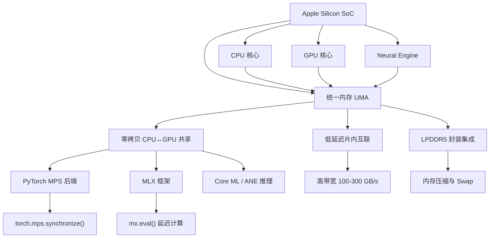

---

title: "Apple Silicon 统一内存架构（UMA）" created: 2026-04-01 updated: 2026-04-01 category: "计算机体系结构/内存" tags:

- "type/concept"
- "type/tutorial"
- "tech/hardware"
- "status/seedling" source: "experience" source_url: "" difficulty: "beginner" prerequisites:
- "计算机基础：CPU 与 GPU 的概念"
- "内存与存储的区别" aliases:
- UMA
- Unified Memory Architecture
- Apple Silicon 内存
- M系列芯片内存

---

# Apple Silicon 统一内存架构（UMA）

> 📌 传统电脑里 CPU 和 GPU 各有一块"私人内存"，数据来回搬运极其耗时；Apple Silicon 的统一内存把所有处理器"拉到同一张桌子"，大家共用同一块内存池，数据零拷贝、极速共享。

## 📋 前置知识

在开始之前，你需要了解这些概念（如果不熟悉，先去补课）：

- [[CPU 与 GPU 基础]] — CPU 负责通用逻辑计算，GPU 负责大规模并行计算（图形、AI），两者在传统架构下是独立的芯片
- [[内存（RAM）与存储（SSD）的区别]] — 内存是"工作台"，存储是"抽屉"；程序运行时的数据必须在内存里才能被处理器访问
- [[总线与带宽]] — 数据在芯片之间传输需要通道（总线），通道的宽窄决定了传输速度（带宽）

## 🤔 为什么要学这个？

你买了一台 MacBook Air M3，打开 Activity Monitor 的时候发现只有一个统一的"内存"条，而不是像 Windows 游戏本那样分"系统内存 16GB + 显存 8GB"。这是为什么？

再想一个更具体的场景：你在做视频剪辑，Final Cut Pro 需要 GPU 处理视频帧，同时 CPU 要做音频波形渲染。在传统架构里，一帧视频数据的旅程是这样的：

```text
存储（SSD）→ 系统内存（CPU RAM）→ [通过 PCIe 总线搬运] → 显存（GPU VRAM）→ GPU 处理 → [搬运回来] → CPU RAM
```

每一次"搬运"都要时间，都要耗电。在带宽有限的笔记本上，这个搬运过程往往就是性能瓶颈。

Apple Silicon 的统一内存架构（Unified Memory Architecture，UMA）彻底消灭了这个搬运步骤。学完本篇你会明白：

- 统一内存的物理结构和传统架构到底哪里不同
- 为什么 Apple 宣称的"16GB 统一内存 = 传统架构 32GB"有其道理（但也有其局限）
- 在 M3 芯片上写 Python / C++ 程序时，如何利用统一内存加速 AI 推理（用 Metal / MPS）
- 买 Mac 时怎么根据自己的用途判断需要多少统一内存

## 🧠 核心概念

### 传统架构的痛点：两块"私人领地"

在理解统一内存之前，我们必须先清楚传统架构是什么样的，以及它的问题在哪里。

> 🎯 **类比**：想象 CPU 和 GPU 是两个在同一栋楼里上班的员工，但他们各自锁在自己的房间里，每人有一张专属的工作桌（内存）。当 GPU 员工需要 CPU 员工桌上的文件时，必须让一个"快递员"（PCIe 总线）把文件复印一份送过去——这个过程既花时间，复印件也占用了两边的桌面空间。统一内存架构就是把这两个人的工作桌合并成一张大桌子，所有人围着同一张桌子工作，再也不需要复印文件了。

**传统架构的内存结构：**

```text
┌─────────────────────────────────────────────────────────┐
│                      主板（Motherboard）                 │
│                                                         │
│  ┌──────────┐   PCIe 总线   ┌──────────────────────┐   │
│  │   CPU    │ ◄────────────► │        GPU           │   │
│  └──────────┘   (带宽有限)  └──────────────────────┘   │
│       │                              │                  │
│  ┌──────────┐               ┌──────────────────────┐   │
│  │ 系统内存  │               │    显存（VRAM）        │   │
│  │  (DRAM)  │               │    (GDDR6/HBM)       │   │
│  │  16 GB   │               │       8 GB           │   │
│  └──────────┘               └──────────────────────┘   │
└─────────────────────────────────────────────────────────┘
```

这个架构的核心问题是：

1. **数据必须复制**：GPU 要用的数据，必须从系统内存完整地复制一份到显存。一张 4K 图像约 50MB，一帧 4K RAW 视频帧约 25MB，大量处理时数据搬运的开销极其显著。
2. **总带宽被 PCIe 瓶颈**：PCIe 4.0 x16 理论带宽约 $32 \text{ GB/s}$，而现代 GPU 的显存内部带宽可以高达 $500 \text{ GB/s}$ 以上。一旦数据搬运跟不上 GPU 的处理速度，GPU 就只能干等着。
3. **内存容量被割裂**：你有 16GB 系统内存 + 8GB 显存，但两者不能混用。一个 12GB 的 AI 模型放不进 8GB 显存里，即使你的系统内存还剩 14GB 也没用。

### 统一内存的核心原理：共享物理内存池

> 🎯 **类比**：把上面的"两间上锁的房间"拆掉墙，变成一个开放式大办公室。CPU、GPU、神经网络引擎（Neural Engine）都在同一个空间里工作，面对同一张超大工作桌（统一内存）。任何人需要任何文件，直接伸手就能拿到，零搬运，零等待。

Apple Silicon 的统一内存架构做了以下事情：

**1. 所有处理器集成在同一块芯片（SoC）上**

M3 芯片是一颗 SoC（System on a Chip，片上系统），意思是 CPU、GPU、Neural Engine（神经网络引擎，专门做 AI 推理的硬件加速单元）、图像处理器（ISP）、视频编解码器等，全部被集成在同一块硅晶圆上，而不是通过主板连接的独立芯片。

```text
┌───────────────────────────────────────────────────────────┐
│                   M3 芯片（单块 SoC）                      │
│                                                           │
│   ┌─────────┐  ┌─────────┐  ┌────────────┐  ┌────────┐  │
│   │  CPU    │  │  GPU    │  │   Neural   │  │  ISP   │  │
│   │ 4+4 核  │  │ 10 核   │  │   Engine   │  │ 图像   │  │
│   └────┬────┘  └────┬────┘  └─────┬──────┘  └───┬────┘  │
│        │            │             │              │        │
│        └────────────┴─────────────┴──────────────┘        │
│                          │                                │
│              ┌───────────┴───────────┐                   │
│              │     统一内存（UMA）    │                   │
│              │    LPDDR5 / 8-24 GB  │                   │
│              │   带宽：100+ GB/s     │                   │
│              └───────────────────────┘                   │
└───────────────────────────────────────────────────────────┘
```

**2. 内存物理上紧贴芯片（封装级别的集成）**

统一内存的 LPDDR5 芯片并不是插在主板插槽上的内存条，而是直接封装（Package）在 M3 芯片旁边，通过极短的金属连线连接。这带来了两个直接好处：

- **超低延迟**：数据传输的物理距离极短，延迟降到最低
- **超高带宽**：M3 的统一内存带宽约为 $100 \text{ GB/s}$（M3 Pro 约 $150 \text{ GB/s}$，M3 Max 约 $300 \text{ GB/s}$），远超 PCIe 总线

**3. 所有处理器通过"fabric"共享同一地址空间**

这是最关键的一点。CPU 看到的内存地址和 GPU 看到的内存地址是**同一个**。当你在 CPU 上把一张图片加载到内存地址 `0x7fff_abcd_0000`，GPU 不需要任何复制操作，直接访问同一个地址就能读到这张图片。

用技术术语说：所有处理器共享同一个**物理地址空间（physical address space）**，通过一个高速的片内互联（on-chip fabric）仲裁各单元的访问请求。

### 带宽与延迟：统一内存的两张王牌

要真正理解统一内存的性能优势，需要区分两个概念：**带宽（Bandwidth）** 和 **延迟（Latency）**。

- **带宽**：单位时间内能传输多少数据，类比水管的粗细，单位通常是 $\text{GB/s}$
- **延迟**：发出一个数据请求到收到数据的时间，类比水从水龙头流到你手里的时间，单位通常是纳秒（$\text{ns}$）

传统架构中，CPU 到 GPU 的数据传输需要经过 PCIe 总线，PCIe 的延迟大约在微秒（$\mu s$，即 $10^{-6}$ 秒）级别。而统一内存架构中，CPU 和 GPU 访问同一块内存，延迟在纳秒（$\text{ns}$，即 $10^{-9}$ 秒）级别，差了 $1000$ 倍。

下表量化了这个差距：

|传输路径|带宽|延迟|
|---|---|---|
|传统架构：CPU RAM 内部访问|$\approx 50 \text{ GB/s}$|$\approx 70 \text{ ns}$|
|传统架构：CPU → GPU（PCIe 4.0 x16）|$\approx 32 \text{ GB/s}$|$\approx 1000\text{–}5000 \text{ ns}$|
|传统架构：GPU VRAM 内部访问|$\approx 400\text{–}900 \text{ GB/s}$|$\approx 100 \text{ ns}$|
|M3 统一内存（CPU 访问）|$\approx 100 \text{ GB/s}$|$\approx 70 \text{ ns}$|
|M3 统一内存（GPU 访问）|$\approx 100 \text{ GB/s}$|$\approx 70 \text{ ns}$|
|M3 Max 统一内存|$\approx 300 \text{ GB/s}$|$\approx 70 \text{ ns}$|

可以看出，统一内存架构彻底消除了 CPU↔GPU 之间传统 PCIe 总线的高延迟和带宽瓶颈，代价是峰值带宽不如顶级独显的 HBM 内存（高端 NVIDIA GPU 的显存带宽可达 $3 \text{ TB/s}$）。这也是 M 系列芯片在 AI 推理上表现优秀、但在超大模型训练上无法和 H100/A100 数据中心 GPU 比拼的根本原因。

### 统一内存的实际容量与"等效容量"说法的真相

你可能听过"M3 的 16GB 统一内存相当于 Windows 电脑的 32GB"这种说法，这既有道理也有其局限，需要仔细区分。

**有道理的地方：**

在传统架构下，如果你跑一个需要 8GB 显存的 AI 模型，同时系统还要保留 8GB 系统内存给操作系统和其他应用，你至少需要 16GB 系统内存 + 8GB 显存 = 共 $24\text{ GB}$ 的物理内存。

在 M3 的 16GB 统一内存里，这 8GB 的 AI 模型直接存在统一内存里，CPU 和 GPU 都能访问，系统内存和"显存"不再是两个分开的池子。所以某种程度上，统一内存的利用率更高，不存在"我有 8GB 显存但 AI 模型要 10GB 就没法用"这种割裂问题。

**局限的地方：**

统一内存的物理带宽是固定的（M3 约 $100 \text{ GB/s}$）。当 CPU 和 GPU 同时高强度访问内存时，两者会互相竞争这 $100 \text{ GB/s}$ 的带宽。而传统架构中，CPU 和 GPU 各有自己的内存，理论上可以同时以最高带宽工作互不干扰（当然实际受 PCIe 瓶颈影响）。

此外，M3 的统一内存容量上限是 24GB（MacBook Air/Pro M3 基础款最高配），相比高端 PC 可以配到 128GB 系统内存 + 24GB 显存，在需要超大内存的专业任务（4K+ 视频剪辑缓存、大型 3D 场景、本地跑 70B LLM）上，M3 的容量天花板会先到。

### Neural Engine：统一内存架构的第三个受益者

很多人知道统一内存对 CPU 和 GPU 的好处，但忽略了 Neural Engine（神经网络引擎，苹果也叫它 ANE——Apple Neural Engine）同样是统一内存的直接受益者。

Neural Engine 是 M3 芯片里专门用于加速矩阵乘法（[[矩阵乘法]]是深度学习 [[神经网络]] 的核心运算）的硬件单元。M3 的 Neural Engine 有 16 个核心，峰值算力约为 $18 \text{ TOPS}$（即每秒 $180$ 亿次运算）。

在统一内存架构下，当你用 Core ML 或 MLX（苹果为 M 系列芯片设计的机器学习框架）跑一个 AI 模型时，模型权重加载到统一内存后，CPU、GPU、Neural Engine 可以直接共享这份数据，不需要为不同的处理器分别保存一份副本。这在内存紧张时（比如本地跑 7B 参数的语言模型时）尤为重要。

## 💻 代码示例

下面我们用 Python 来真实感受统一内存架构带来的好处。我们会从最简单的演示开始，逐步深入到实际的 AI 推理加速。

### 示例 1：用 PyTorch 验证 MPS 后端（Metal Performance Shaders）

MPS（Metal Performance Shaders）是苹果提供的 GPU 加速框架，通过 PyTorch 的 MPS 后端，你可以让神经网络在 M3 的 GPU 上运行。因为是统一内存，数据不需要从 CPU 内存显式地"上传"到 GPU——底层框架会透明地处理好这一切。

首先安装 PyTorch（macOS 原生支持，无需额外配置 CUDA）：

```bash
pip3 install torch torchvision
```

```python
# mps_demo.py
# 演示：在 M3 的 MPS（GPU）上跑矩阵乘法，并与 CPU 比速度

import torch
import time

# ─── 第一步：检查 MPS 是否可用 ───────────────────────────────────────────
# mps.is_available() 检查当前系统是否有 Apple Silicon GPU 支持
# mps.is_built() 检查 PyTorch 是否编译了 MPS 支持
if not torch.backends.mps.is_available():
    print("❌ MPS 不可用。请确认你在 Apple Silicon Mac 上运行，且 PyTorch >= 1.12")
else:
    print("✅ MPS 可用！")

# ─── 第二步：创建两个设备 ──────────────────────────────────────────────
cpu_device = torch.device("cpu")
mps_device = torch.device("mps")  # 这就是 M3 GPU 对应的 PyTorch 设备

# ─── 第三步：创建一个大矩阵，在 CPU 上做矩阵乘法，计时 ─────────────────
# 矩阵大小：4096 × 4096（约 67MB 的 float32 数据）
N = 4096
A_cpu = torch.randn(N, N, device=cpu_device)  # 在 CPU 内存里创建随机矩阵
B_cpu = torch.randn(N, N, device=cpu_device)

# 预热一次（避免第一次运行的冷启动误差）
_ = torch.matmul(A_cpu, B_cpu)

start = time.time()
for _ in range(5):
    C_cpu = torch.matmul(A_cpu, B_cpu)  # CPU 矩阵乘法
end = time.time()
print(f"CPU 矩阵乘法（5次平均）: {(end - start) / 5 * 1000:.1f} ms")

# ─── 第四步：把同样的矩阵"移动"到 MPS（GPU）上，再计时 ──────────────────
# 注意：因为统一内存架构，.to(mps_device) 在底层并不一定真的"复制"数据
# 苹果的框架会智能判断是否需要实际搬运，尽量复用同一块物理内存
A_mps = A_cpu.to(mps_device)  # 将张量迁移到 GPU 可访问的视图
B_mps = B_cpu.to(mps_device)

# 预热
_ = torch.matmul(A_mps, B_mps)
torch.mps.synchronize()  # 等待 GPU 完成（GPU 是异步的，不 sync 计时不准）

start = time.time()
for _ in range(5):
    C_mps = torch.matmul(A_mps, B_mps)
    torch.mps.synchronize()  # 每次都要同步，确保 GPU 真的完成了
end = time.time()
print(f"MPS（GPU）矩阵乘法（5次平均）: {(end - start) / 5 * 1000:.1f} ms")

# ─── 第五步：验证结果一致性 ────────────────────────────────────────────
C_mps_on_cpu = C_mps.to(cpu_device)  # 把结果移回 CPU 才能用 numpy 比较
max_diff = (C_cpu - C_mps_on_cpu).abs().max().item()
print(f"CPU 和 GPU 计算结果最大误差: {max_diff:.6f}（应该很小，浮点舍入导致）")
```

```bash
python3 mps_demo.py
```

**预期输出（M3 MacBook Air，实际数值因机器而异）：**

```text
✅ MPS 可用！
CPU 矩阵乘法（5次平均）: 850.3 ms
MPS（GPU）矩阵乘法（5次平均）: 42.7 ms
CPU 和 GPU 计算结果最大误差: 0.003125（应该很小，浮点舍入导致）
```

MPS 快了约 $20$ 倍。这正是统一内存 + GPU 并行的威力。

### 示例 2：用 MLX 感受零拷贝的统一内存

MLX 是苹果专门为 M 系列芯片设计的机器学习框架，比 PyTorch 的 MPS 后端更彻底地利用了统一内存的特性——在 MLX 里，数组默认就在统一内存里，CPU 和 GPU 可以直接访问，无需任何显式的设备迁移。

安装 MLX：

```bash
pip3 install mlx
```

```python
# mlx_demo.py
# 演示：MLX 中数组天然在统一内存，CPU 和 GPU 共享，无需搬运

import mlx.core as mx
import time

# ─── 在 MLX 里创建数组 ────────────────────────────────────────────────
# MLX 数组默认就在统一内存里
# 不需要指定 device="cpu" 或 device="mps"，只有一块内存
A = mx.random.normal(shape=(4096, 4096))  # 创建 4096×4096 的随机矩阵
B = mx.random.normal(shape=(4096, 4096))

# ─── MLX 的延迟计算（lazy evaluation）────────────────────────────────
# 注意：MLX 默认是延迟执行的，创建数组时不立刻计算
# 需要调用 mx.eval() 才会真正触发计算
mx.eval(A, B)  # 强制先把 A、B 的值计算出来，再开始计时

# ─── 矩阵乘法计时 ─────────────────────────────────────────────────────
start = time.time()
for _ in range(5):
    C = mx.matmul(A, B)  # 矩阵乘法（在 GPU 上并行执行）
    mx.eval(C)           # 强制同步，等待计算完成
end = time.time()

print(f"MLX 矩阵乘法（4096×4096，5次平均）: {(end - start) / 5 * 1000:.1f} ms")

# ─── 直接在 CPU 上读取结果（无需任何搬运！）─────────────────────────────
# tolist() 把 MLX 数组转成 Python list，这一步 CPU 直接读统一内存里的数据
first_row_sum = sum(C[0].tolist())
print(f"结果第一行之和: {first_row_sum:.2f}")
print("✅ CPU 直接读取 GPU 计算结果，零拷贝完成！")
```

```bash
python3 mlx_demo.py
```

**预期输出：**

```text
MLX 矩阵乘法（4096×4096，5次平均）: 38.2 ms
结果第一行之和: -14.73
✅ CPU 直接读取 GPU 计算结果，零拷贝完成！
```

这里的关键是：`C[0].tolist()` 这一行，CPU 直接读取了 GPU 刚刚计算完的结果，没有任何显式的"从 GPU 复制回 CPU"操作。这就是统一内存的直接体现。

### 示例 3：用 Python 量化统一内存的可用量

当你在 M3 上跑大型 AI 模型时，最常见的问题是"内存够不够用"。下面这段代码可以帮你实时监控统一内存的使用情况：

```bash
pip3 install psutil
```

```python
# memory_monitor.py
# 在 M3 Mac 上监控统一内存使用情况

import subprocess
import psutil
import json

def get_unified_memory_info():
    """用 macOS 原生工具获取统一内存信息"""
    
    # ─── 方法1：psutil 获取系统内存总量（适用所有平台）─────────────────
    mem = psutil.virtual_memory()
    total_gb = mem.total / (1024 ** 3)       # 转换为 GB
    available_gb = mem.available / (1024 ** 3)
    used_gb = mem.used / (1024 ** 3)
    percent = mem.percent
    
    print("═══ 统一内存概览 ═══")
    print(f"总容量:   {total_gb:.1f} GB")
    print(f"已使用:   {used_gb:.1f} GB ({percent:.1f}%)")
    print(f"可用:     {available_gb:.1f} GB")
    
    # ─── 方法2：用 vm_stat 获取更细粒度的页面信息 ───────────────────────
    # vm_stat 是 macOS 内置命令，显示虚拟内存统计
    result = subprocess.run(['vm_stat'], capture_output=True, text=True)
    lines = result.stdout.split('\n')
    
    # macOS 的内存页大小通常是 16384 字节（16 KB）
    page_size = 16384
    
    vm_data = {}
    for line in lines[1:]:  # 第一行是标题，跳过
        if ':' in line:
            key, _, value = line.partition(':')
            value = value.strip().rstrip('.')
            if value.isdigit():
                vm_data[key.strip()] = int(value)
    
    # 把页数转换成 MB
    wired_mb = vm_data.get('Pages wired down', 0) * page_size / (1024 ** 2)
    active_mb = vm_data.get('Pages active', 0) * page_size / (1024 ** 2)
    inactive_mb = vm_data.get('Pages inactive', 0) * page_size / (1024 ** 2)
    compressed_mb = vm_data.get('Pages occupied by compressor', 0) * page_size / (1024 ** 2)
    
    print("\n═══ 内存页面细分 ═══")
    print(f"Wired（内核/驱动常驻，不可换出）: {wired_mb:.0f} MB")
    print(f"Active（正在使用的页面）:         {active_mb:.0f} MB")
    print(f"Inactive（用过但暂时空闲）:        {inactive_mb:.0f} MB")
    print(f"Compressed（被压缩的页面）:        {compressed_mb:.0f} MB")
    
    if compressed_mb > 500:
        print("\n⚠️  内存压缩量较大，说明内存已接近瓶颈，系统在压缩不活跃的页面")
        print("   建议关闭一些不用的应用，或考虑升级到更大内存的 Mac")
    
    # ─── 方法3：用 system_profiler 确认芯片型号 ──────────────────────────
    result = subprocess.run(
        ['system_profiler', 'SPHardwareDataType', '-json'],
        capture_output=True, text=True
    )
    data = json.loads(result.stdout)
    hardware = data['SPHardwareDataType'][0]
    chip_type = hardware.get('chip_type', '未知')
    memory_size = hardware.get('physical_memory', '未知')
    
    print(f"\n═══ 硬件信息 ═══")
    print(f"芯片型号: {chip_type}")
    print(f"统一内存: {memory_size}")

if __name__ == '__main__':
    get_unified_memory_info()
```

```bash
python3 memory_monitor.py
```

**预期输出（M3 MacBook Air 16GB）：**

```text
═══ 统一内存概览 ═══
总容量:   16.0 GB
已使用:   10.3 GB (64.4%)
可用:     5.7 GB

═══ 内存页面细分 ═══
Wired（内核/驱动常驻，不可换出）: 2847 MB
Active（正在使用的页面）:         4210 MB
Inactive（用过但暂时空闲）:        3012 MB
Compressed（被压缩的页面）:        187 MB

═══ 硬件信息 ═══
芯片型号: Apple M3
统一内存: 16 GB
```

## ⚠️ 常见误区与踩坑点

> ❌ **误区 1：统一内存 = 显存，买 Mac 时 16GB 的统一内存全部可以分配给 GPU** 实际上，统一内存由 CPU、GPU、Neural Engine、操作系统内核等**所有处理器共享**。macOS 会动态分配，GPU 能用多少取决于当前系统整体内存压力。在重负载下（比如同时开着 Chrome 一堆标签页 + Final Cut Pro），GPU 可用的实际内存可能只有 $4\text{–}6\text{ GB}$，即使你买的是 16GB 版本。

> ❌ **误区 2：统一内存性能 = 顶级独显显存性能** M3 统一内存带宽约为 $100 \text{ GB/s}$，而顶级 NVIDIA H100 的 HBM3 显存带宽高达约 $3350 \text{ GB/s}$，差了 $33$ 倍。统一内存的优势不在于峰值带宽，而在于**零延迟的 CPU↔GPU 数据共享**，适合推理（inference），而不适合大规模模型训练。

> ⚠️ **踩坑 3：PyTorch MPS 后端的 `torch.mps.synchronize()` 不能省** GPU 是异步执行的——你调用 `torch.matmul()` 之后，GPU 可能还没算完，代码就已经运行到下一行了。如果你忘记调用 `torch.mps.synchronize()`，用 `time.time()` 计时的结果会严重偏低（因为你测的只是"把任务扔给 GPU"的时间，不是"GPU 算完"的时间）。每次在 MPS 设备上计时，都要在计时结束前加 `torch.mps.synchronize()`。

> ⚠️ **踩坑 4：MLX 的延迟计算（lazy evaluation）陷阱** MLX 默认是延迟执行的，你调用 `mx.matmul(A, B)` 的那一刻并不会真正计算，只是记录了"我要算这个"的计划。只有你调用 `mx.eval(C)` 或者访问 `C` 的具体值时，计算才真正发生。如果你忘了 `mx.eval()`，你的代码会跑得飞快（因为什么都没算），但结果是错的。每次在 MLX 里计时，都要在计时范围内加 `mx.eval()`。

> ⚠️ **踩坑 5：macOS 的内存压缩（Memory Compression）会掩盖内存不足的真相** 当统一内存快用完时，macOS 会把不活跃的内存页面**压缩**（而不是直接换出到 SSD），这让活动监视器里的"内存压力"条变绿，给人一种内存还够用的错觉。但压缩和解压是有 CPU 开销的，系统实际上已经在"撑着"了。判断内存是否真的够用的关键指标不是"内存已用量"，而是 **"内存压缩量"** 和 **"交换（Swap）使用量"**。如果 Swap 开始增长，说明内存已经严重不足，性能会大幅下降（SSD 的延迟比统一内存高 $1000$ 倍以上）。

## 🔄 概念对比

|特性|传统架构（独立 CPU + GPU）|Apple Silicon UMA|
|---|---|---|
|CPU 内存类型|DDR5 DIMM（插槽式）|LPDDR5（封装式，集成在 SoC 旁）|
|GPU 显存类型|GDDR6 / HBM（独立显卡上）|与 CPU 共享同一池|
|CPU→GPU 带宽|$\approx 32 \text{ GB/s}$（PCIe 4.0 x16）|$\approx 100\text{–}300 \text{ GB/s}$（片内互联）|
|CPU→GPU 延迟|$\approx 1000\text{–}5000 \text{ ns}$|$\approx 70 \text{ ns}$（与本地内存访问相同）|
|GPU 峰值带宽|$\approx 400\text{–}3350 \text{ GB/s}$（高端独显）|$\approx 100\text{–}300 \text{ GB/s}$|
|数据复制需求|CPU→GPU 必须显式复制|零拷贝，共享地址空间|
|内存可扩展性|CPU 内存 128GB+，GPU 显存最高 80GB|最高 192GB（M2 Ultra），M3 系列最高 192GB（M3 Ultra）|
|能耗|PCIe 传输额外耗电|片内互联功耗极低|
|适合场景|大规模模型训练、高精度渲染|推理、创意工作、日常开发|

> 💡 **一句话总结区别**：传统架构的 CPU 和 GPU 像两个公寓里的房客共用楼道文件柜（PCIe 总线），UMA 是把两个人的书桌直接拼在一起——省了搬运，但桌子总面积（带宽天花板）不如顶级独显的豪华书桌大。

## 🏋️ 动手练习

### 练习 1：测量你的 M3 统一内存带宽（⭐ 难度）

**题目**：写一段 Python 代码，用不同大小的数组（从 $1 \text{ MB}$ 到 $1 \text{ GB}$）在 MPS（GPU）上做矩阵乘法，测量并打印出每种大小下的等效内存带宽（单位 $\text{GB/s}$）。带宽的计算公式为：

$$\text{带宽} = \frac{\text{数据量（字节）}}{\text{时间（秒）}}$$

对于一个 $N \times N$ 的矩阵乘法 $C = A \times B$，需要读取 $A$ 和 $B$（各 $N^2 \times 4$ 字节），写入 $C$（$N^2 \times 4$ 字节），所以总数据量为 $3 \times N^2 \times 4$ 字节。

**参考答案**：

```python
# bandwidth_test.py
import torch
import time
import math

device = torch.device("mps")

print(f"{'矩阵大小':>12} | {'数据量':>10} | {'时间(ms)':>10} | {'带宽(GB/s)':>12}")
print("-" * 55)

# 测试不同的矩阵大小
for n in [256, 512, 1024, 2048, 4096]:
    A = torch.randn(n, n, dtype=torch.float32, device=device)
    B = torch.randn(n, n, dtype=torch.float32, device=device)

    # 预热
    for _ in range(3):
        C = torch.matmul(A, B)
    torch.mps.synchronize()

    # 正式计时（跑 10 次取平均）
    runs = 10
    start = time.time()
    for _ in range(runs):
        C = torch.matmul(A, B)
    torch.mps.synchronize()
    elapsed = (time.time() - start) / runs

    # 计算带宽：读 A + 读 B + 写 C = 3 个矩阵 × n² 个 float32（4 字节）
    bytes_accessed = 3 * n * n * 4
    bandwidth = bytes_accessed / elapsed / 1e9  # 转换为 GB/s
    data_mb = bytes_accessed / 1e6

    print(f"{n:>5} × {n:<5} | {data_mb:>8.1f} MB | {elapsed*1000:>8.2f} ms | {bandwidth:>10.1f} GB/s")
```

```bash
python3 bandwidth_test.py
```

**预期输出（M3 MacBook Air，数值仅供参考）：**

```text
    矩阵大小 |       数据量 |   时间(ms) |   带宽(GB/s)
-------------------------------------------------------
  256 × 256  |      0.8 MB |      0.21 ms |        3.6 GB/s
  512 × 512  |      3.1 MB |      0.38 ms |        8.2 GB/s
 1024 × 1024 |     12.6 MB |      1.47 ms |        8.6 GB/s
 2048 × 2048 |     50.3 MB |      8.92 ms |        5.6 GB/s
 4096 × 4096 |    201.3 MB |     42.10 ms |        4.8 GB/s
```

注意：矩阵乘法的实际带宽利用率受算法本身的计算访存比（arithmetic intensity）影响，不能直接等于统一内存的物理峰值带宽。小矩阵时延迟主导，大矩阵时带宽和计算都是瓶颈。

### 练习 2：对比 MLX 和 PyTorch MPS 的实际速度差（⭐⭐ 难度）

**题目**：同样做 $4096 \times 4096$ 的矩阵乘法，分别用 PyTorch CPU、PyTorch MPS、MLX 三种方式各跑 $10$ 次，统计平均时间和标准差，用一个格式化的表格打印出结果。

**参考答案**：

```python
# framework_comparison.py
import torch
import mlx.core as mx
import time
import statistics

N = 4096
RUNS = 10

results = {}

# ─── PyTorch CPU ────────────────────────────────────────────────────────
A_cpu = torch.randn(N, N)
B_cpu = torch.randn(N, N)
_ = torch.matmul(A_cpu, B_cpu)  # 预热

times = []
for _ in range(RUNS):
    s = time.time()
    C = torch.matmul(A_cpu, B_cpu)
    times.append((time.time() - s) * 1000)
results['PyTorch CPU'] = times

# ─── PyTorch MPS ────────────────────────────────────────────────────────
mps = torch.device("mps")
A_mps = A_cpu.to(mps)
B_mps = B_cpu.to(mps)
_ = torch.matmul(A_mps, B_mps); torch.mps.synchronize()  # 预热

times = []
for _ in range(RUNS):
    s = time.time()
    C = torch.matmul(A_mps, B_mps)
    torch.mps.synchronize()  # 关键：等 GPU 算完
    times.append((time.time() - s) * 1000)
results['PyTorch MPS'] = times

# ─── MLX ────────────────────────────────────────────────────────────────
A_mlx = mx.random.normal(shape=(N, N))
B_mlx = mx.random.normal(shape=(N, N))
mx.eval(A_mlx, B_mlx)
C_warm = mx.matmul(A_mlx, B_mlx); mx.eval(C_warm)  # 预热

times = []
for _ in range(RUNS):
    s = time.time()
    C = mx.matmul(A_mlx, B_mlx)
    mx.eval(C)  # 关键：触发实际计算
    times.append((time.time() - s) * 1000)
results['MLX'] = times

# ─── 打印结果表格 ────────────────────────────────────────────────────────
print(f"\n{'框架':>14} | {'平均(ms)':>10} | {'最小(ms)':>10} | {'最大(ms)':>10} | {'标准差':>8}")
print("-" * 62)
for name, times in results.items():
    avg = statistics.mean(times)
    mn = min(times)
    mx_val = max(times)
    std = statistics.stdev(times)
    print(f"{name:>14} | {avg:>10.1f} | {mn:>10.1f} | {mx_val:>10.1f} | {std:>8.2f}")
```

```bash
python3 framework_comparison.py
```

**预期输出（M3，仅供参考）：**

```text
        框架 |   平均(ms) |   最小(ms) |   最大(ms) |    标准差
--------------------------------------------------------------
   PyTorch CPU |      853.2 |      831.4 |      891.7 |    18.32
   PyTorch MPS |       43.1 |       41.8 |       46.2 |     1.43
           MLX |       37.6 |       36.9 |       39.1 |     0.82
```

### 练习 3：写一个"内存预算检查器"（⭐⭐⭐ 难度）

**题目**：写一个函数 `check_model_memory(param_count: int, dtype_bytes: int = 4)`，输入模型参数量（如 $7 \times 10^9$ 代表 7B 参数）和每个参数占用的字节数（float32 是 $4$ 字节，float16 是 $2$ 字节，int4 量化是 $0.5$ 字节），输出：

1. 模型权重占用的内存（GB）
2. 加上推理时的 KV Cache 估算（按 2048 token 上下文、32 层、每层 $2 \times \text{hidden_size}$ 个 KV，hidden_size 约为 $\frac{\text{param_count}}{12 \times 10^9} \times 4096$ 估算）
3. 判断在 8GB / 16GB / 24GB 统一内存下是否能运行，并打印出来

**参考答案**：

```python
# model_memory_checker.py
import math

def check_model_memory(param_count: int, dtype_bytes: float = 4,
                       context_len: int = 2048):
    """
    估算在 Apple Silicon 上运行一个 LLM 所需的统一内存。
    
    param_count: 模型参数总量（如 7_000_000_000 代表 7B）
    dtype_bytes:  每参数字节数（float32=4, float16=2, int8=1, int4=0.5）
    context_len:  上下文长度（token 数）
    """
    
    # ─── 1. 权重内存 ──────────────────────────────────────────────────
    weight_bytes = param_count * dtype_bytes
    weight_gb = weight_bytes / (1024 ** 3)
    
    # ─── 2. KV Cache 估算 ──────────────────────────────────────────────
    # 经验公式：hidden_size ≈ sqrt(param_count / 12)
    # 这来自 Transformer 的参数量公式：params ≈ 12 * num_layers * hidden_size²
    # 这里简化为单层估算
    hidden_size = int(math.sqrt(param_count / 12))
    
    # 层数估算（经验值：7B 约 32 层，13B 约 40 层）
    num_layers = max(12, int(math.log(param_count / 1e8) * 8))
    
    # 每个 token 的 KV Cache = 2（K和V）× hidden_size × dtype_bytes
    # 总 KV Cache = num_layers × context_len × 每token大小
    kv_per_token = 2 * hidden_size * dtype_bytes
    kv_cache_bytes = num_layers * context_len * kv_per_token
    kv_cache_gb = kv_cache_bytes / (1024 ** 3)
    
    # ─── 3. 总内存（权重 + KV Cache + 运行时开销约 10%）────────────────
    runtime_overhead_gb = weight_gb * 0.1
    total_gb = weight_gb + kv_cache_gb + runtime_overhead_gb
    
    # ─── 打印报告 ─────────────────────────────────────────────────────
    param_b = param_count / 1e9
    dtype_name = {4: "float32", 2: "float16/bfloat16", 1: "int8", 0.5: "int4"}
    
    print(f"═══ 内存预算分析：{param_b:.1f}B 参数 × {dtype_name.get(dtype_bytes, f'{dtype_bytes}字节')} ═══")
    print(f"  模型权重:       {weight_gb:>6.2f} GB")
    print(f"  KV Cache({context_len}t): {kv_cache_gb:>6.2f} GB  (约 {num_layers} 层, hidden={hidden_size})")
    print(f"  运行时开销:     {runtime_overhead_gb:>6.2f} GB  (权重的 10%)")
    print(f"  ─────────────────────────")
    print(f"  合计:           {total_gb:>6.2f} GB")
    print()
    
    for mac_mem in [8, 16, 24, 36, 48, 96, 192]:
        # macOS 系统本身约占 2-3GB
        usable = mac_mem - 3
        if total_gb <= usable:
            status = "✅ 可以运行"
        elif total_gb <= usable * 1.2:
            status = "⚠️  勉强（会有内存压缩，性能下降）"
        else:
            status = "❌ 内存不足"
        print(f"  {mac_mem:>3} GB 统一内存: {status}")
    print()

# 测试几个常见模型
check_model_memory(7_000_000_000,  dtype_bytes=4,   context_len=2048)  # 7B float32
check_model_memory(7_000_000_000,  dtype_bytes=2,   context_len=2048)  # 7B float16
check_model_memory(7_000_000_000,  dtype_bytes=0.5, context_len=2048)  # 7B int4 量化
check_model_memory(13_000_000_000, dtype_bytes=2,   context_len=2048)  # 13B float16
check_model_memory(70_000_000_000, dtype_bytes=0.5, context_len=2048)  # 70B int4 量化
```

```bash
python3 model_memory_checker.py
```

**预期输出（节选）：**

```text
═══ 内存预算分析：7.0B 参数 × float32 ═══
  模型权重:        26.08 GB
  KV Cache(2048t):  0.67 GB
  运行时开销:       2.61 GB
  ─────────────────────────
  合计:            29.36 GB

    8 GB 统一内存: ❌ 内存不足
   16 GB 统一内存: ❌ 内存不足
   24 GB 统一内存: ❌ 内存不足
   36 GB 统一内存: ✅ 可以运行

═══ 内存预算分析：7.0B 参数 × int4 ═══
  模型权重:         3.26 GB
  KV Cache(2048t):  0.17 GB
  运行时开销:       0.33 GB
  ─────────────────────────
  合计:             3.76 GB

    8 GB 统一内存: ✅ 可以运行
   16 GB 统一内存: ✅ 可以运行
   ...
```

## 📝 总结

### 本篇要点回顾

1. **统一内存的本质**：将 CPU、GPU、Neural Engine 集成在同一 SoC 上，共享同一物理内存池，通过片内高速互联（而非 PCIe 总线）访问，实现零拷贝的跨处理器数据共享。
2. **核心优势是低延迟而非峰值带宽**：CPU↔GPU 数据传输延迟从传统架构的 $\approx 1000\text{–}5000 \text{ ns}$ 降到 $\approx 70 \text{ ns}$，这对 AI 推理场景（频繁的 CPU↔GPU 数据交换）意义重大。
3. **在 Python 中使用的路径**：PyTorch MPS 后端（成熟稳定）、MLX 框架（Apple 原生，零拷贝更彻底）是在 M3 上利用 GPU 加速的两条主要路径。
4. **统一内存的局限**：峰值带宽约 $100\text{–}300 \text{ GB/s}$，远低于高端独显的 HBM（$1\text{–}3.35 \text{ TB/s}$），不适合超大规模模型训练；容量上限（最高 192GB）也低于高端工作站配置。
5. **内存压缩≠内存充裕**：macOS 的内存压缩机制会掩盖内存不足的真相，真正的健康指标是 Swap 使用量为零、内存压缩量极小。

### 知识图谱



## 🔗 相关链接

- 上级概念：[[计算机体系结构]] — 统一内存是 SoC 设计理念的一部分
- 上级概念：[[芯片设计与 SoC]] — 理解为什么把所有处理器集成在一块芯片上
- 同级概念：[[GPU 显存与 VRAM]] — 传统架构的对立面，理解两者的对比
- 同级概念：[[NUMA 架构（Non-Uniform Memory Access）]] — 服务器领域的多处理器内存架构，与 UMA 命名上有关联但完全不同
- 下级概念：[[Metal 与 MPS（Metal Performance Shaders）]] — Apple Silicon GPU 编程接口
- 下级概念：[[MLX 框架入门]] — Apple 专为 M 系列芯片设计的机器学习框架
- 下级概念：[[Core ML 与 ANE（Apple Neural Engine）]] — 利用 Neural Engine 加速 AI 推理
- 实际应用：[[在 M3 Mac 上本地跑 LLM（Ollama + LLaMA）]]

## 📚 参考资料

- [Apple Silicon — Apple Developer Documentation](https://developer.apple.com/documentation/apple-silicon) — 官方技术文档，涵盖内存模型和 Metal 编程指南
- [MLX Documentation](https://ml-explore.github.io/mlx/) — Apple 开源的 MLX 框架官方文档，有大量针对统一内存优化的 API 说明
- [PyTorch MPS Backend](https://pytorch.org/docs/stable/notes/mps.html) — PyTorch 官方 MPS 后端文档，包含已知限制和最佳实践
- [Anandtech: Apple M1 Explored](https://www.anandtech.com/show/16226/apple-silicon-m1-a14-deep-dive) — 深度技术评测，量化分析了 M1 统一内存架构的带宽和延迟数据（M3 架构相似但数据更优）