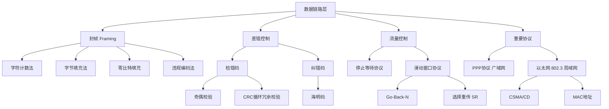

# 数据链路层详解（计算机网络·408考研）

> 📌 数据链路层是计算机网络分层模型的第二层，负责把物理层传来的"杂乱比特流"打包成有意义的**帧（Frame）**，并保证在**相邻两台设备之间**可靠、有序地传递数据。

## 📋 前置知识

在开始之前，你需要了解这些概念：

- [[物理层与信号传输]] — 数据链路层的数据来自物理层，需要知道比特流是什么
- [[计算机网络分层模型（OSI与TCP/IP）]] — 数据链路层是第二层，上面是网络层，下面是物理层
- [[二进制与校验基础]] — CRC校验涉及二进制除法，需要掌握基本运算

## 🤔 为什么要学这个？

假设你要给远在北京的朋友快递一个易碎的花瓶：

- 物理层只管"把东西扔进快递箱"——它只传输比特，不关心对不对、丢没丢
- 但你需要有人**把花瓶装进泡沫盒（封帧）**、在外面写上**地址（寻址）**、检查**有没有在路上摔碎（差错控制）**、以及控制**发货速度别把对方仓库压垮（流量控制）**

数据链路层干的就是这些事。

408考试中，数据链路层占分集中在：**帧结构、滑动窗口协议、CRC校验、以太网、PPP协议**，每年必考，是得分的重要来源。

## 🧠 核心概念

### 一、帧（Frame）：数据链路层的基本单位

> 🎯 **类比**：把帧想象成一个**快递包裹**。物理层只传输散装零件（比特），数据链路层负责把零件装进盒子、贴上标签、打上胶带——这个"盒子"就是帧。

**正式定义**：帧是数据链路层的协议数据单元（PDU），由首部、数据部分（来自上层的IP数据报）和尾部三段组成。

典型的帧结构：

```
| 帧首部（Header） | 数据部分（Data） | 帧尾部（Trailer） |
```

首部包含：目的地址、源地址、类型/长度字段等  
尾部包含：帧校验序列（FCS，通常是CRC的结果）

---

### 二、封帧（Framing）：如何在比特流中找到帧的边界

物理层传来的是连续的比特流，接收方怎么知道"从哪里到哪里是一个完整的帧"？这就是**封帧**要解决的问题。

408考试关注以下四种方法：

#### 方法1：字符计数法

在帧首部用一个字段标明帧的长度（含多少字节）。接收方读到长度字段就知道这一帧到哪里结束。

> ⚠️ **缺点**：如果长度字段本身出错，接收方就会完全失去同步，后续所有帧都会对齐错误，几乎不单独使用。

#### 方法2：字符填充（字节填充）

选定一个特殊字符作为帧的**开始标志（SOH）和  结束标志（EOT）**。  
如果数据内部也出现了这个特殊字符怎么办？——在它前面插入一个**转义字符（ESC）**。

```
原始数据中含 EOT：  ... A  EOT  B ...
发送后变成：        ... A  ESC  EOT  B ...
接收方看到 ESC+EOT，就知道这个 EOT 是数据，不是帧结束符
```

#### 方法3：比特填充（零比特插入）

这是 **HDLC 协议**使用的方法，408中频繁出现。

帧的开始和结束都用标志序列 `01111110`（6个连续的1）来标记。  
**问题**：数据中如果也出现了6个连续的1怎么办？  
**解决**：发送方每遇到连续5个1，就**强制插入一个0**；接收方每遇到连续5个1后的0，就**自动删除这个0**。

```
发送方规则：遇到 11111 就变成 111110
接收方规则：遇到 111110 就删掉末尾的 0 → 还原为 11111
```

#### 方法4：违规编码法

利用物理层编码中"正常数据不会出现的编码组合"来标记帧边界。例如曼彻斯特编码中，高-高或低-低跳变在正常数据中不会出现，可以用它们标记帧首尾。

---

### 三、差错控制：数据传错了怎么办？

> 🎯 **类比**：想象你在嘈杂的操场上跟同学说话，对方可能没听清楚。差错控制就是解决"听错了怎么知道"（检错）和"听错了怎么纠正"（纠错）的问题。

数据链路层使用两种手段：

#### 手段1：检错码（能发现错误，但不能纠正）

**奇偶校验码**是最简单的检错码。在数据末尾加1位，使整个码字中1的个数为奇数（奇校验）或偶数（偶校验）。只能检测**奇数个**比特错误，2个比特同时出错则检测不出。

**CRC（循环冗余校验）** 是408的重点，几乎每年必考计算题。

> 🎯 **类比**：CRC 就像用一把特定的"尺子"去量数据，把余数记下来一起发送。收到数据后，对方用同一把尺子再量一遍，余数为0则没出错。

CRC 计算步骤：

1. 确定**生成多项式 $G(x)$**（出题会给你），假设它有 $r+1$ 位，则余数（FCS）有 $r$ 位
2. 在原始数据后面补 $r$ 个0
3. 用补0后的数据对生成多项式做**模2除法**（异或除法，不借位）
4. 得到的余数就是 FCS，**替换**原来补的那 $r$ 个0，拼在数据后面发送
5. 接收方用收到的整个帧对 $G(x)$ 再做模2除法，若余数为0则无误

**模2除法示例**：

原始数据：`1101`，生成多项式 $G(x) = x^3+1$，即 `1001`（共4位，$r=3$）

```
数据补3个0：1101 000

模2除法过程（每步用异或）：

1101000 ÷ 1001
  1001
  ────
  1000
  1001
  ────
  0010   ← 商的最后，余数为 001（不足3位补0得 001）
```

发送的帧 = `1101` + `001` = `1101001`

> ⚠️ **踩坑**：模2除法每一步都是**异或（XOR）**，不是普通的减法，绝对不能借位！1 XOR 1 = 0，0 XOR 0 = 0，1 XOR 0 = 1。

#### 手段2：纠错码（能直接纠正错误）

**海明码（Hamming Code）** 是408要求掌握的纠错码。

海明码的核心思想：在数据位中**插入若干校验位**，每个校验位负责"监管"一部分数据位，通过多个校验位的组合结果定位出错的具体位置。

海明码的校验位数量 $r$ 必须满足：

$$2^r \geq m + r + 1$$

其中 $m$ 是数据位数，$r$ 是校验位数。

校验位位置在第 $2^0, 2^1, 2^2, \ldots$ 位（即第1、2、4、8……位），其余位置放数据位。

---

### 四、流量控制：发太快怎么办？

> 🎯 **类比**：老师讲课太快，学生来不及记笔记——流量控制就是让学生可以喊"慢点！"的机制。

数据链路层的流量控制通过**滑动窗口协议**实现，这是408数据链路层中**分值最高、最容易出计算题**的考点。

#### 停止等待协议（Stop-and-Wait）

发送方每次只发一帧，等收到接收方的**确认（ACK）**之后才发下一帧。

```
发送方：[帧0] ————————→
                         接收方：收到 → 发 ACK0
发送方：收到ACK0 → [帧1] ————→
```

效率极低，信道利用率：

$$U = \frac{T_f}{T_f + RTT + T_a}$$

其中 $T_f$ 是帧的发送时间，$RTT$ 是往返传播时延，$T_a$ 是确认帧发送时间（通常忽略不计）。

#### 滑动窗口协议

允许发送方在收到确认之前，连续发送**多个帧**，窗口大小决定"最多允许几个帧在路上飞"。

**发送窗口（$W_T$）**：发送方可以连续发出的最大帧数  
**接收窗口（$W_R$）**：接收方能缓存的最大帧数

信道利用率（发送窗口足够大时）：

$$U = \frac{W_T \times T_f}{T_f + RTT + T_a} \approx \frac{W_T \times T_f}{T_f + 2T_p}$$

其中 $T_p$ 是单向传播时延，$RTT \approx 2T_p$。

当 $W_T \times T_f \geq T_f + 2T_p$ 时（即窗口够大），信道利用率可达 100%。

---

### 五、滑动窗口的两种出错处理协议

#### 协议1：Go-Back-N（GBN，退回N帧）

出错时，发送方**退回到出错帧，重传从出错帧开始的所有后续帧**。

- 接收窗口大小：$W_R = 1$（接收方只接受按序到达的帧）
- 发送窗口大小：$W_T \leq 2^n - 1$（$n$ 是帧序号的比特数）

> 🎯 **类比**：老师出题，你做错了第3题，老师说："从第3题开始全部重做！"——哪怕你后面几题做对了，也必须重做。

#### 协议2：选择重传（SR，Selective Repeat）

出错时，只重传**出错的那一帧**，其他帧不受影响。

- 接收窗口大小：$W_R = 2^{n-1}$
- 发送窗口大小：$W_T \leq 2^{n-1}$（$n$ 是帧序号的比特数）

> 🎯 **类比**：老师说："你只有第3题错了，只重做第3题就好。"

> ⚠️ **踩坑：窗口大小上限是高频考点！**  
> GBN 发送窗口最大为 $2^n - 1$，SR 发送/接收窗口最大均为 $2^{n-1}$。  
> 如果 SR 的窗口超过 $2^{n-1}$，接收方无法区分"新帧"和"重传的旧帧"，会产生混乱。

三种协议对比：

|特性|停止等待|Go-Back-N|选择重传|
|---|---|---|---|
|发送窗口 $W_T$|1|$\leq 2^n-1$|$\leq 2^{n-1}$|
|接收窗口 $W_R$|1|1|$\leq 2^{n-1}$|
|出错重传范围|当前帧|出错帧及其后所有帧|仅出错帧|
|接收方缓存要求|低|低|高|
|信道利用率|最低|中等|最高|
|实现复杂度|最低|中等|最高|

> 💡 **一句话总结区别**：停止等待最慢但最简单；GBN 效率高但出错代价大；SR 效率最高但接收方需要更多缓存，实现最复杂。

---

### 六、重要协议：PPP 与以太网

#### PPP 协议（点对点协议）

PPP 是**广域网**中使用最广泛的数据链路层协议，用于两个节点之间的点对点链路（如家庭拨号上网）。

PPP 帧结构：

```
| 标志 F | 地址 A | 控制 C | 协议 | 数据 | FCS | 标志 F |
| 7E    | FF    | 03    | 2字节| 可变 | 2/4字节| 7E |
```

- 标志字段 `7E`（即 `01111110`）标识帧的开始和结束
- PPP **不提供可靠传输**（无编号、无确认），差错检测靠 FCS
- PPP **不支持多点链路**，只支持点对点

PPP 使用**字节填充**来防止数据中的 `7E` 被误认为帧标志：遇到 `7E` 就用 `7D 5E` 替换，遇到 `7D` 就用 `7D 5D` 替换。

#### 以太网（Ethernet）

以太网是**局域网（LAN）**中最主流的数据链路层协议，对应 IEEE 802.3 标准。

以太网 MAC 帧结构：

```
| 前导码 | 目的地址 | 源地址 | 类型/长度 | 数据 | FCS |
| 8字节  | 6字节   | 6字节  | 2字节    | 46~1500字节 | 4字节 |
```

- **MAC 地址**：6字节（48位）物理地址，全球唯一，写作十六进制如 `AA:BB:CC:DD:EE:FF`
- **最小帧长 64 字节**（不含前导码）：目的地址+源地址+类型+数据+FCS = 6+6+2+46+4 = 64 字节。数据部分不足46字节时必须**填充（Padding）**到46字节。
- **最大帧长 1518 字节**（不含前导码）：数据最大 1500 字节，即 MTU = 1500 字节

> ⚠️ **踩坑：最小帧长 64 字节是 CSMA/CD 的要求！**  
> 以太网使用 CSMA/CD（载波监听多路访问/碰撞检测）机制。最小帧长保证发送方在帧发送完毕之前能检测到碰撞，从而正确处理冲突。如果帧太短，碰撞可能在发送完后才被检测到，已经来不及处理。

#### CSMA/CD 工作原理

> 🎯 **类比**：多人共用一个对讲机频道——先听（CS），没人说话再说（MA），说话时继续监听（CD），如果和别人撞上了就停下来等随机时间再说。

1. **先听后发（CS）**：发送前监听信道，若信道空闲才发送
2. **边发边听（CD）**：发送过程中同时检测信道，检测到碰撞立即停止
3. **发送阻塞信号（Jamming）**：停止发送后发一段32位的阻塞信号，让所有站点都知道发生了碰撞
4. **随机退避（Binary Exponential Backoff）**：等待随机时间后重试，重试次数越多，等待范围越大，最多重试16次，超过则丢弃帧并报错

> ⚠️ **注意**：**CSMA/CD 只用于有线以太网**，无线局域网（WiFi）用的是 CSMA/CA（碰撞避免），因为无线环境中无法边发边听。

## 💻 代码示例

下面用 Python 模拟 CRC 校验的计算过程，帮你理解模2除法的每一步：

```python
# crc_demo.py
# 模拟 CRC（循环冗余校验）的计算与验证过程

def xor(a, b):
    """对两个等长的二进制字符串做异或（模2运算，不借位）"""
    result = []
    for i in range(len(b)):
        # 相同为0，不同为1
        result.append('0' if a[i] == b[i] else '1')
    return ''.join(result)


def mod2div(dividend, divisor):
    """
    模2除法（二进制除法，每步用异或替代减法）
    参数:
        dividend: 被除数（已补0的数据）
        divisor:  除数（生成多项式）
    返回:
        余数（即 FCS 校验码）
    """
    pick = len(divisor)         # 每次取与除数等长的被除数片段
    tmp = dividend[:pick]       # 取出第一个片段

    while pick < len(dividend):
        if tmp[0] == '1':
            # 首位为1才做异或（等效于"能整除一次"）
            tmp = xor(divisor, tmp) + dividend[pick]
        else:
            # 首位为0，相当于商0，用全0做异或等于不变
            tmp = xor('0' * pick, tmp) + dividend[pick]
        pick += 1

    # 最后一步
    if tmp[0] == '1':
        tmp = xor(divisor, tmp)
    else:
        tmp = xor('0' * pick, tmp)

    return tmp  # 余数就是 FCS


def encode_crc(data, generator):
    """
    CRC 编码：在原始数据后附上 FCS
    参数:
        data:      原始二进制数据字符串，如 '1101'
        generator: 生成多项式二进制字符串，如 '1001'
    """
    r = len(generator) - 1          # FCS 的位数 = 生成多项式位数 - 1
    data_padded = data + '0' * r    # 在数据后补 r 个 0

    remainder = mod2div(data_padded, generator)  # 做模2除法，得余数

    # 用余数替换原来补的 r 个 0，得到最终发送的帧
    codeword = data + remainder
    print(f"原始数据:   {data}")
    print(f"生成多项式: {generator}（共{len(generator)}位，r={r}）")
    print(f"补0后数据:  {data_padded}")
    print(f"FCS余数:    {remainder}")
    print(f"发送的帧:   {codeword}")
    return codeword


def verify_crc(received, generator):
    """
    CRC 验证：接收方用收到的帧除以生成多项式，检查余数是否为0
    """
    remainder = mod2div(received, generator)
    if all(c == '0' for c in remainder):
        print(f"\n验证结果: ✅ 余数为 {remainder}，无差错")
    else:
        print(f"\n验证结果: ❌ 余数为 {remainder}，帧有差错！")


if __name__ == "__main__":
    data      = "1101"   # 原始数据
    generator = "1001"   # 生成多项式 G(x) = x^3 + 1

    print("=" * 40)
    print("【发送方：CRC 编码】")
    print("=" * 40)
    codeword = encode_crc(data, generator)

    print("\n" + "=" * 40)
    print("【接收方：CRC 验证（无差错情况）】")
    print("=" * 40)
    verify_crc(codeword, generator)

    print("\n" + "=" * 40)
    print("【接收方：CRC 验证（引入1位差错）】")
    print("=" * 40)
    # 模拟第2位出错（0变1）
    corrupted = list(codeword)
    corrupted[1] = '1' if corrupted[1] == '0' else '0'
    corrupted = ''.join(corrupted)
    print(f"引入差错后的帧: {corrupted}")
    verify_crc(corrupted, generator)
```

运行命令：

```bash
python3 crc_demo.py
```

预期输出：

```
========================================
【发送方：CRC 编码】
========================================
原始数据:   1101
生成多项式: 1001（共4位，r=3）
补0后数据:  1101000
FCS余数:    001
发送的帧:   1101001

========================================
【接收方：CRC 验证（无差错情况）】
========================================

验证结果: ✅ 余数为 000，无差错

========================================
【接收方：CRC 验证（引入1位差错）】
========================================
引入差错后的帧: 1001001

验证结果: ❌ 余数为 101，帧有差错！
```

下面再用 Python 模拟滑动窗口的发送/确认逻辑，理解 GBN 与 SR 的区别：

```python
# sliding_window_demo.py
# 演示 Go-Back-N 和 选择重传 的核心逻辑差异

def go_back_n(total_frames, window_size, error_frame):
    """
    模拟 Go-Back-N 协议
    参数:
        total_frames: 总帧数
        window_size:  发送窗口大小
        error_frame:  第几帧发生错误（从0开始）
    """
    print(f"\n=== Go-Back-N | 窗口={window_size} | 第{error_frame}帧出错 ===")
    sent = 0           # 已发送到哪一帧
    acked = 0          # 已确认到哪一帧
    transmit_count = 0 # 总发送次数

    while acked < total_frames:
        # 发送窗口内的帧
        window_end = min(acked + window_size, total_frames)
        for i in range(sent, window_end):
            print(f"  发送帧 {i}")
            transmit_count += 1
            sent += 1

        # 接收方处理（简化：遇到出错帧则不确认后续）
        if error_frame is not None and acked <= error_frame < sent:
            print(f"  ❌ 帧 {error_frame} 出错，GBN 退回重传从帧 {error_frame} 开始")
            sent = error_frame  # 退回到出错帧重传
            error_frame = None  # 只出错一次
        else:
            acked = sent  # 全部确认

    print(f"  总发送次数: {transmit_count}（效率因重传下降）")


def selective_repeat(total_frames, window_size, error_frame):
    """
    模拟 选择重传（SR）协议
    参数同上
    """
    print(f"\n=== 选择重传 | 窗口={window_size} | 第{error_frame}帧出错 ===")
    received = [False] * total_frames  # 记录每一帧是否被正确接收
    transmit_count = 0

    # 第一轮发送
    for i in range(total_frames):
        print(f"  发送帧 {i}")
        transmit_count += 1
        if i != error_frame:
            received[i] = True  # 正确接收
        else:
            print(f"  ❌ 帧 {i} 出错，SR 只重传这一帧")

    # 只重传出错的帧
    if error_frame is not None:
        print(f"  重传帧 {error_frame}")
        transmit_count += 1
        received[error_frame] = True

    print(f"  总发送次数: {transmit_count}（只重传出错帧，更高效）")


# 示例：共发送6帧，窗口大小4，第2帧出错
go_back_n(6, 4, 2)
selective_repeat(6, 4, 2)
```

运行命令：

```bash
python3 sliding_window_demo.py
```

预期输出（简化演示）：

```
=== Go-Back-N | 窗口=4 | 第2帧出错 ===
  发送帧 0
  发送帧 1
  发送帧 2
  发送帧 3
  ❌ 帧 2 出错，GBN 退回重传从帧 2 开始
  发送帧 2
  发送帧 3
  发送帧 4
  发送帧 5
  总发送次数: 8（效率因重传下降）

=== 选择重传 | 窗口=4 | 第2帧出错 ===
  发送帧 0
  发送帧 1
  发送帧 2
  发送帧 3
  发送帧 4
  发送帧 5
  ❌ 帧 2 出错，SR 只重传这一帧
  重传帧 2
  总发送次数: 7（只重传出错帧，更高效）
```

## ⚠️ 常见误区与踩坑点

> ❌ **误区1：认为数据链路层提供可靠传输**  
> 很多初学者以为数据链路层的"差错控制"就等于"可靠传输"，但实际上像以太网、PPP 这类协议只做**检错**，发现错误后**直接丢弃帧**，并不重传。真正的可靠传输是 TCP（传输层）的职责。**数据链路层的可靠传输（如 HDLC 的滑动窗口）主要用于早期误码率高的有线链路，现代以太网误码率极低，通常不在此层保证可靠性。**

> ❌ **误区2：GBN 和 SR 的窗口大小搞反**  
> GBN 发送窗口最大为 $2^n - 1$，SR 发送窗口最大为 $2^{n-1}$。两者不能记混。记忆技巧：SR 因为接收方要缓存乱序帧，接收窗口占了一半序号空间，发送窗口只能用另一半，所以是 $2^{n-1}$。

> ⚠️ **踩坑3：CRC 模2除法步骤出错**  
> 最常见的错误是用普通减法代替异或，或者在"首位为0时"忘记用全0串去异或（导致位移错误）。建议做题时一步步对齐写，不要跳步骤。

> ⚠️ **踩坑4：以太网最小帧长的计算**  
> 64字节是**从目的地址字段开始到FCS字段结束**的总长度，**不包含前导码（8字节）**。考试题目如果问"以太网帧最小多少字节"，答 64 字节；如果问"加上前导码共多少字节"，答 72 字节。

> ❌ **误区5：把 CSMA/CD 和 CSMA/CA 混用**  
> CSMA/CD（碰撞检测）用于**有线以太网**，边发边听检测碰撞；CSMA/CA（碰撞避免）用于**无线局域网（802.11/WiFi）**，因为无线无法做到边发边听（自干扰）。二者不能互换。

## 🏋️ 动手练习

### 练习1：CRC 校验计算（⭐ 难度）

**题目**：原始数据为 `110101`，生成多项式 $G(x) = x^4 + x + 1$（即 `10011`）。  
求 FCS，并写出最终发送的帧。

**提示**：$G(x)$ 有5位，所以 $r=4$，在原始数据后补4个0，然后做模2除法。

<details> <summary>💡 点击查看参考答案</summary>

原始数据：`110101`  
补4个0：`1101010000`  
生成多项式：`10011`

模2除法过程：

```
1101010000 ÷ 10011
10011
─────
 110010000
 10011
 ──────
  1001000
  10011
  ──────
   00010
```

余数（FCS）= `0010`（补全4位）

最终发送帧 = `110101` + `0010` = `1101010010`

验证：用 `1101010010` ÷ `10011`，余数应为 `0000`。

</details>

### 练习2：滑动窗口效率计算（⭐⭐ 难度）

**题目**：卫星信道，数据率为 $1\text{ Mbps}$，卫星与地面站单向传播时延为 $270\text{ ms}$，使用 GBN 协议，帧长为 $1000\text{ bit}$，序号用 3 位二进制表示。  
求：① GBN 发送窗口最大值；② 信道利用率。

**提示**：  
先算 $T_f$（帧发送时间），再算 $2T_p$（往返传播时延），然后判断窗口是否足够大。

<details> <summary>💡 点击查看参考答案</summary>

① GBN 发送窗口最大值：

序号位数 $n = 3$，发送窗口最大 $= 2^3 - 1 = 7$

② 信道利用率：

$$T_f = \frac{1000 \text{ bit}}{1 \times 10^6 \text{ bps}} = 1 \text{ ms}$$

$$2T_p = 2 \times 270 \text{ ms} = 540 \text{ ms}$$

判断窗口是否足够覆盖往返时延：

$$W_T \times T_f = 7 \times 1 \text{ ms} = 7 \text{ ms} < T_f + 2T_p = 1 + 540 = 541 \text{ ms}$$

窗口不够大，信道利用率：

$$U = \frac{W_T \times T_f}{T_f + 2T_p} = \frac{7 \times 1}{1 + 540} = \frac{7}{541} \approx 1.29%$$

结论：卫星链路传播时延极大，3位序号的 GBN 效率极低，实际应用中需要更大的序号空间（如 TCP 的32位序号）。

</details>

### 练习3：帧结构综合分析（⭐⭐⭐ 难度）

**题目**：以太网使用3位序号的 SR 协议（假设），发送窗口和接收窗口最大各为多少？若数据率为 $100\text{ Mbps}$，帧长 $1250\text{ byte}$，单向传播时延 $1\text{ μs}$，SR 协议的最大信道利用率是多少？

**提示**：SR 发送窗口最大为 $2^{n-1}$，先检查窗口是否足够大，再计算利用率。

<details> <summary>💡 点击查看参考答案</summary>

序号位数 $n = 3$：

$$W_T^{max} = W_R^{max} = 2^{3-1} = 4$$

$$T_f = \frac{1250 \times 8 \text{ bit}}{100 \times 10^6 \text{ bps}} = \frac{10000}{10^8} = 0.1 \text{ ms} = 100 \text{ μs}$$

$$2T_p = 2 \times 1 \text{ μs} = 2 \text{ μs}$$

$$T_f + 2T_p = 100 + 2 = 102 \text{ μs}$$

$$W_T \times T_f = 4 \times 100 = 400 \text{ μs} > 102 \text{ μs}$$

窗口足够大，信道利用率可达：

$$U = \frac{W_T \times T_f}{T_f + 2T_p} = \frac{400}{102} > 100%$$

此时取 $U = 100%$（信道利用率不能超过100%，说明4帧的窗口对这条链路完全够用）。

</details>

## 📝 总结

### 本篇要点回顾

1. **封帧**解决"如何在比特流中识别帧边界"，常见方法：字节填充（PPP用）、零比特填充（HDLC用）
2. **CRC** 是数据链路层最重要的检错机制，核心是模2除法；**海明码**是纠错机制，靠多个校验位定位出错位置
3. **滑动窗口协议**通过允许多帧"在路上飞"提升信道利用率；GBN 出错退回重传 $N$ 帧，SR 只重传出错帧
4. **窗口大小上限**：GBN 为 $2^n-1$，SR 为 $2^{n-1}$，这是高频考点，必须牢记
5. **以太网**最小帧64字节（CSMA/CD 要求），MAC 地址6字节，MTU=1500字节；**PPP** 用于点对点广域网，无可靠传输

### 知识图谱



## 🔗 相关链接

- 上级概念：[[计算机网络分层模型（OSI与TCP/IP）]]
- 同级概念：[[物理层]]、[[网络层与IP协议]]
- 下级概念：[[CRC校验详解]]、[[海明码详解]]、[[以太网帧格式详解]]、[[PPP协议详解]]
- 实际应用：[[TCP可靠传输机制]]（传输层的可靠性对比）、[[408真题·数据链路层专项]]

## 📚 参考资料

- [谢希仁《计算机网络》第8版](https://book.douban.com/subject/35498740/) — 408指定参考书，数据链路层在第三章，例题丰富
- [王道计算机网络考研复习指导](https://book.douban.com/subject/35298735/) — 考研必备，习题覆盖全面，含历年真题解析
- [RFC 1661 - The Point-to-Point Protocol](https://www.rfc-editor.org/rfc/rfc1661) — PPP 协议官方标准文档