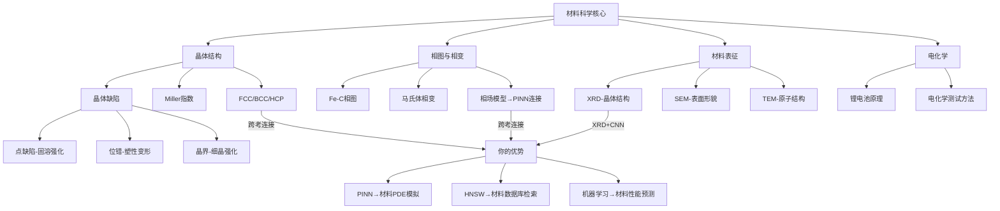

---

title: "材料科学速通——跨考生面试核心考点" date: 2026-03-30 tags:

- 考研复试
- 材料科学
- 上科大
- 跨考 category: "考研备战"

---

# 材料科学速通——跨考生面试核心考点

> 📌 这不是一篇完整的材料科学教材，而是一份专门为**计算机背景跨考生**设计的面试急救包。目标是：用你已经懂的编程/数学概念来类比材料概念，让你在 2 周内能和面试老师正常对话。

## 📋 前置知识

你已经有的知识可以直接帮你理解材料：

- [[偏微分方程数值求解（PINN）]] — 材料中的扩散、相变本质上都是 PDE 问题
- [[机器学习基础]] — 材料基因组学、性能预测直接用得上
- [[线性代数基础]] — 晶体结构、张量力学的数学底座
- [[C++ 内存模型]] — 类比理解晶体中的"缺陷"和"位错"

## 🗺️ 全局导航：材料科学的四大模块

面试考察的材料知识可以归纳为四大模块，优先级从高到低：

|模块|面试被问概率|你需要达到的深度|
|---|---|---|
|模块一：晶体结构|⭐⭐⭐⭐⭐|能解释概念 + 举例|
|模块二：相图与相变|⭐⭐⭐⭐|能读图 + 说出意义|
|模块三：材料表征|⭐⭐⭐⭐⭐|知道每种方法干什么|
|模块四：电化学基础|⭐⭐⭐|能解释锂电池原理|

## 🧱 模块一：晶体结构基础

### 什么是晶体？

> 🎯 **类比**：把晶体想象成一个**完美排列的三维数组**（`int arr[N][N][N]`）。每个格点存放一个原子，整个结构严格周期性重复。非晶体（如玻璃）则像一个乱序的哈希表——元素都在，但没有规律。

**准确定义**：晶体是原子（或离子、分子）在三维空间中**周期性有序排列**的固体。这种排列的最小重复单元叫做**晶胞（Unit Cell）**。

**为什么重要**：材料的几乎所有宏观性质（导电、强度、磁性）都源于微观的晶体结构。

### 三种最重要的晶体结构

面试最高频，必须能脱口而出：

|结构名称|英文缩写|代表金属|配位数|致密度|
|---|---|---|---|---|
|面心立方|FCC|Al、Cu、Au、Ni|12|74%|
|体心立方|BCC|Fe（室温）、W、Cr|8|68%|
|密排六方|HCP|Ti、Mg、Zn|12|74%|

**配位数（Coordination Number）**：一个原子周围紧邻原子的数量。配位数越高，原子堆积越紧密，材料通常越致密、延展性越好。

**致密度（Packing Factor）**：原子体积占晶胞总体积的比例。

> 💡 **面试回答技巧**：被问到"铁是什么结构"时，记住铁有**同素异形体**：室温是 BCC（$\alpha$-Fe），912°C 以上变成 FCC（$\gamma$-Fe，即奥氏体），继续加热到 1394°C 又变回 BCC（$\delta$-Fe）。这个转变是钢铁热处理的基础。

### 晶向与晶面（Miller 指数）

> 🎯 **类比**：Miller 指数就像三维坐标系里的**方向向量**，用来描述晶体中的特定方向和平面，写法是 $[hkl]$（晶向）和 $(hkl)$（晶面）。

**记法规则**：

- 晶向 $[hkl]$：方括号，表示一个方向
- 晶面 $(hkl)$：圆括号，表示一族平行晶面
- 负数写在数字上方加横线，口头读作"负 h"

**面试必知**：FCC 金属的**滑移系**（位错运动的通道）是 ${111}\langle110\rangle$，共 12 个。滑移系越多，金属延展性越好，这就是为什么 FCC 金属（铜、铝）比 BCC 金属更容易加工。

### 晶体缺陷——材料性能调控的关键

> 🎯 **类比**：晶体缺陷就像代码里的 Bug。完美晶体反而没用——正是这些"Bug"赋予了材料各种实用性能。钢比纯铁强，就是因为碳原子作为"间隙缺陷"卡住了位错运动。

缺陷分三类：

**零维缺陷（点缺陷）**：单个原子层面的不完整性

- **空位（Vacancy）**：某个格点上原子"消失了"
- **间隙原子（Interstitial）**：原子"挤"进了格点之间的空隙（碳溶入铁中就是这样）
- **置换原子（Substitutional）**：一个外来原子"替换"了原来的原子

**一维缺陷（线缺陷）**：也叫**位错（Dislocation）**，是材料力学性能的核心概念

> 🎯 **类比**：位错就像地毯上的皱褶。你要挪动整张地毯，直接推很费力；但如果地毯有个皱褶，你只需要推动皱褶逐步移动，最终地毯被挪动了，但每一步都很省力。晶体的塑性变形就是位错在移动。

位错分两种：

- **刃型位错（Edge Dislocation）**：多了半个原子面，像一把刀插进晶体
- **螺型位错（Screw Dislocation）**：原子面扭转错位，像螺旋楼梯

**强化机制**：阻碍位错运动 = 提高材料强度。常见方法：

- **固溶强化**：加入溶质原子（钢中加碳）
- **加工硬化**：冷变形产生大量位错，位错互相缠绕难以运动
- **晶界强化（细晶强化）**：晶粒越细，晶界越多，位错穿越晶界越难

**二维缺陷（面缺陷）**：晶界（Grain Boundary）、相界、堆垛层错等

## 🌡️ 模块二：相图与相变

### 什么是"相"？

**相（Phase）**：材料中**结构均匀、成分均匀**的区域。冰水混合物里有两个相（固相的冰 + 液相的水）；钢里可以有铁素体相和渗碳体相共存。

> 🎯 **类比**：相就像程序里的不同**数据结构**。同样是铁原子，BCC 排列时叫铁素体，FCC 排列时叫奥氏体——"数据"一样，"结构"不同，性能完全不同。

### 二元相图怎么读

以最重要的**Fe-C（铁碳）相图**为例，这是钢铁材料的"说明书"：

**横轴**：碳的质量分数（0% 到 6.69%） **纵轴**：温度（°C）

**三条必记的关键线**：

- **液相线**：线以上全是液态
- **固相线**：线以下全是固态
- **共析线（727°C）**：含碳 0.77% 的奥氏体在此温度发生共析转变

**必记的关键点**：

|点/线|温度|含碳量|意义|
|---|---|---|---|
|共析点 A|727°C|0.77%|奥氏体 → 铁素体 + 渗碳体（珠光体）|
|共晶点 C|1148°C|4.3%|液态 → 奥氏体 + 渗碳体（莱氏体）|

**钢 vs 铸铁**：含碳量 < 2.11% 叫**钢**，> 2.11% 叫**铸铁**。这不是随意划分的，2.11% 是碳在 FCC 铁中的最大固溶度。

### 马氏体相变——钢铁热处理的核心

**工艺**：把钢加热到奥氏体区（FCC）→ 快速淬火（急速冷却）

**结果**：碳原子来不及扩散析出，被"困"在了 BCC 铁的间隙里，形成**马氏体（Martensite）**——一种体正方结构，极硬但极脆。

**为什么硬**：大量碳原子造成的晶格畸变严重阻碍位错运动。

**实际应用**：淬火后必须**回火**（低温加热），让部分碳析出，在保持较高强度的同时恢复一定韧性——这就是工具钢、弹簧钢等的制造原理。

> 💡 **跨考生加分连接**：马氏体相变是一个**非扩散型相变**，转变速度极快（接近声速）。从计算模拟角度，这类相变难以用传统分子动力学模拟，需要相场模型（Phase Field Model）或机器学习势函数（ML potential）。**这就是你能切入的研究角度。**

## 🔬 模块三：材料表征方法

这一模块面试出现频率极高，必须知道每种方法"干什么用、原理是什么"。

### XRD——X 射线衍射（最重要）

**用途**：测定材料的**晶体结构**（什么相、晶格参数是多少）

**原理**：X 射线打到晶体上，被不同晶面反射，当满足**布拉格方程**时发生衍射增强：

$$2d\sin\theta = n\lambda$$

其中 $d$ 是晶面间距，$\theta$ 是衍射角，$\lambda$ 是 X 射线波长，$n$ 是整数。

**读图要点**：

- 每个衍射峰对应一组晶面 $(hkl)$
- 峰的位置（$2\theta$ 角）→ 确定是什么相（与数据库比对）
- 峰的宽度 → 晶粒尺寸（谢乐公式：晶粒越小，峰越宽）
- 峰的强度 → 各相的相对含量

> 💡 **跨考生加分连接**：XRD 图谱的相鉴定本质上是**模式匹配**问题，已有研究用卷积神经网络（CNN）自动识别 XRD 图谱。你可以提到这个方向。

### SEM——扫描电子显微镜

**用途**：观察材料的**表面形貌**（微米到纳米尺度）

**原理**：用聚焦电子束扫描样品表面，收集二次电子或背散射电子成像。

**能告诉你什么**：

- 表面形貌、断口形貌（脆性断裂 vs 韧性断裂）
- 配合 **EDS（能谱分析）**：知道各个位置的元素组成

**SEM vs TEM 的区别**：

|特性|SEM|TEM|
|---|---|---|
|分辨率|纳米级（~1 nm）|原子级（< 0.1 nm）|
|成像区域|表面|内部（需制备薄样品）|
|样品制备|简单|复杂（需减薄到 100 nm 以下）|
|主要用途|形貌、成分分布|晶体结构、位错观察|

> 💡 **一句话总结区别**：SEM 看"长什么样"，TEM 看"怎么排列的"。

### 其他常见表征方法速查

|方法|全称|用途|
|---|---|---|
|TEM|透射电子显微镜|原子级结构、位错、界面|
|AFM|原子力显微镜|表面形貌（导体/非导体均可）|
|XPS|X 射线光电子能谱|表面元素组成和**化学价态**|
|Raman|拉曼光谱|分子键合状态、碳材料鉴定|
|TGA|热重分析|热稳定性、成分分解温度|
|DSC|差示扫描量热仪|相变温度、热焓变化|

## ⚡ 模块四：电化学基础（能源材料方向必备）

### 锂电池基本原理

> 🎯 **类比**：锂电池就像一个反复搬运工人（锂离子）在两栋楼（正极和负极）之间来回搬货的系统。充电时，工人从正极楼搬到负极楼；放电时，工人自发地搬回去，同时驱动外部电路做功。

**结构**：正极 | 电解质 | 负极

**充放电过程**（以 LiCoO₂/石墨电池为例）：

放电时：

- 负极（石墨）：$\text{Li}_x\text{C}_6 \rightarrow x\text{Li}^+ + xe^- + \text{C}_6$（锂离子脱出）
- 正极（LiCoO₂）：$\text{Li}_{1-x}\text{CoO}_2 + x\text{Li}^+ + xe^- \rightarrow \text{LiCoO}_2$（锂离子嵌入）

**关键性能指标**：

- **能量密度（Wh/kg）**：单位质量能存多少能量
- **功率密度（W/kg）**：单位质量能输出多大功率
- **循环寿命（cycles）**：充放电多少次后容量降到 80%
- **倍率性能（C-rate）**：大电流充放电时的性能保持率

### 电化学测试方法

|方法|英文|能告诉你什么|
|---|---|---|
|循环伏安法|CV|氧化还原反应的电位、可逆性|
|电化学阻抗谱|EIS|界面电阻、扩散系数|
|恒流充放电|GCD|实际容量、库仑效率|

## 🎤 如何在面试中用你的背景连接材料知识

这是最关键的部分。你不是纯材料生，你是有**差异化竞争力**的跨考生。下面是你的科研经历和材料方向的具体连接点：

### 连接点 1：PINN → 材料模拟

你做过的事：用 PINN 求解 Burgers 方程（一维双曲守恒律）

**材料中的平行问题**：

- Fick 扩散方程（描述原子在材料中扩散的 PDE） 
- 相场方程（描述相变界面演化的 PDE）
- 导热方程（热处理过程中的温度场）

**面试话术**：

> "我在研究中用物理信息神经网络求解了具有间断解的双曲守恒律方程，这类方程在材料领域有直接对应——比如描述溶质扩散的 Fick 第二定律、相场模型中的 Cahn-Hilliard 方程，本质上都是偏微分方程。我认为 PINN 这套框架可以迁移到这些材料模拟问题上，尤其是在有实验数据作为约束的情况下。"

### 连接点 2：HNSW 毕设 → 材料数据库检索

你做过的事：实现了高效向量检索引擎

**材料中的平行问题**：

- 材料基因组计划（Materials Project）包含数十万种材料的计算数据
- 材料性能预测：给定成分和结构，预测力学/电学/热学性质
- 相似材料搜索：给定目标性能，在数据库中找最接近的候选材料

**面试话术**：

> "我的毕设实现了一个向量检索引擎。在材料领域，材料性能可以被编码为高维特征向量，这套检索技术可以用于在大型材料数据库中快速找到相似性能的候选材料，加速新材料的发现流程。"

## 📝 总结

### 面试前必须能回答的 10 个问题

1. FCC、BCC、HCP 各有什么代表金属？配位数是多少？
2. 什么是位错？为什么位错运动会导致塑性变形？
3. 固溶强化、加工硬化、细晶强化的原理各是什么？
4. Fe-C 相图中，钢和铸铁怎么区分？共析点在哪里？
5. 马氏体是什么？为什么淬火后要回火？
6. XRD 能测什么？布拉格方程是什么？
7. SEM 和 TEM 的主要区别是什么？
8. 锂电池充放电时，锂离子如何运动？
9. 什么是相？相变的驱动力是什么（吉布斯自由能降低）？
10. 你的计算机背景如何与材料研究结合？（用上面的话术）

### 知识图谱

## 🔗 相关链接

- 上级概念：[[计算材料学]]
- 同级概念：[[化工原理基础]]、[[物理化学核心概念]]
- 下级概念：[[相场模型与Cahn-Hilliard方程]]、[[材料基因组计划]]

## 📚 参考资料

- [Materials Project](https://materialsproject.org/) — 全球最大材料计算数据库，可查任意材料的晶体结构和性质
- [Callister《材料科学与工程导论》](https://www.wiley.com/) — 英文经典教材，第 8-10 章是面试重点
- [MIT OCW 3.091 Introduction to Solid-State Chemistry](https://ocw.mit.edu/) — 免费公开课，讲解晶体结构极其清晰
