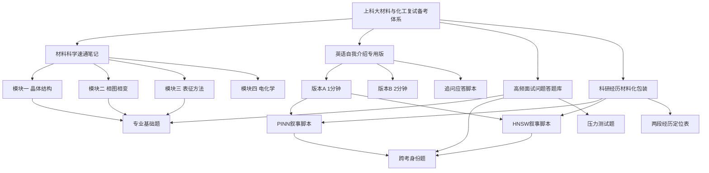

---

title: "科研经历材料化包装——面试叙事脚本" date: 2026-03-30 tags:

- 考研复试
- 科研经历
- 上科大
- 跨考
- 面试叙事 category: "考研备战"

---

# 科研经历材料化包装——面试叙事脚本

> 📌 这份笔记的核心任务只有一个：把你已经做过的两段经历，用材料与化工研究者听得懂、觉得有价值的语言重新讲一遍。不是造假，不是夸大，是**换一个坐标系来描述同一件真实的事**。

## 🧭 总体策略：你的叙事主线

在开始具体脚本之前，先建立一条贯穿始终的主线。面试官听你讲经历，脑子里其实只有一个问题：

**"这个人来我实验室，能给我做什么？"**

你的主线答案是：

> 我有能力把物理问题转化成计算问题，再把计算结果转化回物理意义。这是计算材料学研究最核心的能力之一，而我在两段经历里分别练习了这两个方向。

PINN 经历证明的是：**我能理解物理方程，把它变成可以训练的神经网络，再把结果和理论对比**。

HNSW 经历证明的是：**我能把一个算法问题做到极致，有工程执行力，不只是纸上谈兵**。

两段经历加在一起，传递的信号是：**我既有科学思维，也有工程能力，两者都不只停留在表面**。

记住这条主线，下面所有的叙事都围绕它展开。

## 🔬 经历一：PINN 研究的完整面试叙事

### 第一层：30 秒电梯版（老师没有特别追问时用）

> 我大三时在林志阳老师指导下做了一个关于偏微分方程数值求解的研究项目。我们对比了物理信息神经网络（PINN）和隐函数神经网络（IFNN）在求解具有激波解的方程上的表现。这类方程在材料领域有直接对应——扩散方程、相场方程的数学结构和我们研究的方程是同源的。这段经历让我意识到，数值方法和材料模拟之间的距离比我想象的近得多，也是我走向计算材料学方向的直接契机。

**时长**：约 25–30 秒。用于自我介绍后的自然过渡，或者老师说"说说你的科研经历"但语气比较随意的时候。

### 第二层：2 分钟完整版（老师说"详细说说"时用）

分四段讲，每段之间有明确的逻辑过渡：

**第一段：背景和问题（约 20 秒）**

> 这个项目的出发点是一类在工程和物理中很重要的方程——双曲守恒律方程。最典型的例子是 Burgers 方程，它描述了流体中的非线性对流现象。这类方程的难点在于它会产生激波——解在某个位置会出现不连续的跳跃，这对数值方法来说是一个经典的挑战。我们的研究问题是：神经网络能不能比传统有限差分方法更好地处理这类问题？

**第二段：我做了什么（约 40 秒）**

> 我用 PyTorch 从头复现了两种方法。第一种是 PINN，思路是把方程的残差作为损失函数，让神经网络在满足边界条件的同时最小化方程残差。训练策略是 Adam 加 L-BFGS 两阶段优化——Adam 先做粗略收敛，L-BFGS 再做精细调整。参考解用 Godunov 有限体积法生成，这是处理守恒律方程的经典高精度方法。第二种是 IFNN，它不直接输出解的数值，而是学习一个隐函数，解对应这个函数的零水平集。我针对光滑初始条件和间断初始条件分别设计了数值实验。

**第三段：发现了什么（约 30 秒）**

> 核心发现是：对光滑解，PINN 表现很好；但一旦出现激波，PINN 的损失函数景观变得非常病态，网络倾向于把激波"抹平"，而不是精确捕捉它。IFNN 通过隐函数表示，天然地回避了直接逼近不连续函数的困难，对激波的捕捉明显更准确。这个差异背后的机制，是 IFNN 的输出是连续的隐函数值，不连续性藏在它的零水平集里，避开了神经网络在逼近间断函数时的本质困难。

**第四段：和材料的连接（约 25 秒）**

> 这段经历让我想到了材料里的相界面问题。固液界面、相变前沿，本质上就是移动的不连续面，和激波在数学上是同构的。相场模型用一个连续的序参量来描述这类界面，某种程度上和 IFNN 的隐函数思路有相似之处。我认为 IFNN 类的方法在材料模拟场景里——特别是描述相变界面演化——有很好的应用潜力，这也是我很想继续深入的方向。

**时长**：约 115 秒。

### 第三层：追问应对脚本

老师听完你的介绍，最可能追问以下几个方向：

**追问 A：Godunov 方法是什么？**

> Godunov 方法是处理双曲守恒律方程的一类有限体积格式。它的核心思想是把计算域分成一个个小格子，在每个格子交界处求解一个局部的黎曼问题——也就是两侧初值不同的激波管问题——然后用精确或近似的黎曼解来更新格子里的平均值。它天然地满足守恒律，对激波有良好的捕捉能力，是计算流体力学和材料模拟里的经典工具。

**追问 B：L-BFGS 是什么，为什么要两阶段优化？**

> L-BFGS 是一种拟牛顿优化方法，它通过近似海森矩阵的逆来确定搜索方向，收敛速度比 Adam 这类一阶方法快很多，但计算代价也更高。两阶段的原因是：Adam 对初始点不敏感，能快速把参数带到损失函数的大致低谷区域；L-BFGS 在平坦区域的精细调整能力强，在 Adam 收敛之后接手可以更高效地找到精确极小值。直接用 L-BFGS 从头训练，容易卡在早期的鞍点上。

**追问 C：你说 IFNN 和相场模型有相似之处，能具体说说吗？**

> 相场模型用一个连续的序参量 $\phi$ 来表示材料的相态，$\phi=1$ 代表一相，$\phi=0$ 代表另一相，界面区域是 $\phi$ 从 0 连续变化到 1 的过渡带。这个序参量的演化由 Cahn-Hilliard 方程或 Allen-Cahn 方程控制。IFNN 的思路是类似的：它学习一个函数 $F(x,t)$，界面对应 $F=0$ 的水平集。两者都把不连续的界面转化为连续函数的特定等值面来处理，避开了直接计算不连续量的困难。当然，相场模型有完整的热力学推导基础，而 IFNN 是数据驱动的，这是两者的根本区别。

**追问 D：这个研究最终发表了吗？有什么局限性？**

> 这是一个本科阶段的研究项目，规模和深度还不足以发表，主要目的是训练我对这套方法体系的理解。局限性有几个：我们只研究了一维方程，高维情况下 PINN 和 IFNN 的对比还没有做；我们的测试方程相对简单，和真实材料里的耦合 PDE 还有距离；另外，IFNN 的训练稳定性也有问题，在某些初始条件下零水平集的提取会失败。这些都是如果继续深入需要解决的问题。

## ⚙️ 经历二：HNSW 毕设的完整面试叙事

### 第一层：30 秒电梯版

> 我的毕业设计是用 C++17 实现一个面向 Apple M3 芯片的高性能向量检索引擎，基于 HNSW 算法。通过利用 ARM 架构的 SIMD 指令集、分层预取策略和无锁并发设计，最终在百万级数据集上实现了单次查询 0.14 毫秒的延迟和超过 7000 的查询吞吐量。这个项目训练了我把算法和硬件特性结合起来做系统优化的能力，这种能力在高通量材料模拟中同样是需要的。

**时长**：约 30 秒。

### 第二层：2 分钟完整版

**第一段：问题背景（约 20 秒）**

> HNSW 是 Hierarchical Navigable Small World 的缩写，是目前工业界最主流的近似最近邻搜索算法之一。它的核心思想是构建一个多层的图结构，高层是稀疏的"高速公路"，底层是密集的"本地街道"，查询时先在高层快速定位大致区域，再在底层精细搜索。我的任务是从头实现这个算法，并且专门针对苹果 M3 芯片的 ARM 架构进行深度优化。

**第二段：我做了什么（约 50 秒）**

> 优化分三个层次。第一层是计算层：向量距离计算是最热的内循环，我用了两个技术——一是把 float32 的向量量化成 float16，维度减半，内存带宽压力减半；二是用 ARM NEON SIMD 指令集，一条指令同时处理四个浮点运算，配合四路累加器和循环展开消除流水线的数据依赖，单核构建吞吐量提升了 3.2 倍。第二层是访存层：内存访问延迟往往是瓶颈，不是算力。我设计了一个分层预取策略，在处理当前节点的同时，提前把下一批候选节点的数据加载到缓存，让 CPU 的硬件预取器和软件预取指令协同工作，查询 QPS 提升约 18%。第三层是并发层：多线程构建索引时锁竞争是大问题，我完全剥离了系统锁，用基于 CAS 原子操作的无锁设计和 thread_local 快照来消除内核态开销，8 线程下构建加速比达到 3.31。

**第三段：结果（约 20 秒）**

> 最终在 SIFT1M 百万级标准测试集上，系统实现了 7104 查询每秒的吞吐量，单次查询延迟 0.14 毫秒，Recall@10 达到 92.4%。这个性能指标在轻量级实现里是比较有竞争力的。

**第四段：和材料的连接（约 25 秒）**

> 我后来想到，这套系统放到材料信息学里有直接的应用场景。Materials Project 这类数据库里有十几万种材料的计算性质，可以编码成高维特征向量。给定一个目标性质组合，快速找到数据库里最相似的候选材料，就是一个近似最近邻问题。现在很多材料逆设计的工作还在用暴力搜索或者简单的随机采样，用 HNSW 这类结构可以让搜索效率提高几个数量级，在高通量筛选场景里意义很大。

**时长**：约 115 秒。

### 第三层：追问应对脚本

**追问 A：SIMD 是什么？**

> SIMD 是 Single Instruction Multiple Data 的缩写，单指令多数据。普通 CPU 指令一次处理一个数，SIMD 指令一次可以处理多个数。ARM NEON 是 ARM 架构上的 SIMD 扩展，寄存器宽度 128 位，可以同时处理 4 个 32 位浮点数或者 8 个 16 位浮点数。在向量距离计算这种高度规则的密集运算里，用 SIMD 可以把计算吞吐量提升到接近理论峰值，是高性能计算的基础工具。

**追问 B：CAS 是什么，为什么能替代锁？**

> CAS 是 Compare-And-Swap，比较并交换，是 CPU 提供的一条原子指令。它的语义是：如果内存里的值等于预期值，就把它换成新值，这个操作是原子的，不可打断。传统锁的代价是线程在等待锁的时候会切换到内核态，这个上下文切换非常贵。用 CAS 可以在用户态实现无锁数据结构，线程不需要睡眠，只是不断重试，避免了内核态开销。在锁竞争不激烈的时候，无锁 CAS 的性能比互斥锁快很多。

**追问 C：Recall@10 是什么意思，92.4% 算好吗？**

> Recall@10 是指：对于每一个查询，精确最近邻前 10 个结果里，有多少个出现在我的近似搜索结果里。92.4% 意味着平均每次查询，10 个真正最近邻里有 9.24 个被找到了。在近似最近邻领域，Recall@10 达到 90% 以上同时保持高 QPS，一般认为是工程上可用的水平。如果要进一步提高召回率，可以增大搜索时的候选集大小，但代价是延迟上升，这是一个可以调节的 tradeoff。

**追问 D：这个系统和 FAISS 比怎么样？**

> FAISS 是 Meta 开发的工业级向量检索库，工程完整度、跨平台支持、功能丰富程度都远超我的实现。我的系统定位是轻量级、零依赖、专门针对 Apple M3 的原生优化，相当于 FAISS 的一个特定场景下的专用版本。在 M3 芯片上，针对 NEON 指令集的深度优化，我的实现在延迟上有一定优势，但这是以牺牲通用性为代价的。这个项目对我来说更重要的价值是，我完整理解了从算法到硬件的每一层优化逻辑，而不是调用一个黑盒库。

## 🗂️ 两段经历的定位总结

在面试里，这两段经历应该各司其职：

|场景|用哪段经历|强调什么|
|---|---|---|
|老师问"为什么跨考"|PINN 为主|数学连接，发现材料 PDE 同源|
|老师问"你能给实验室带来什么"|HNSW 为主|工程执行力，高性能计算能力|
|老师问"你有什么科研经历"|两段都讲，PINN 先|先建立科研背景，再展示工程能力|
|老师问"你对计算材料学了解多少"|PINN 为主 + 材料连接|主动建立 PDE → 材料模拟的桥梁|
|老师问"你的编程能力怎么样"|HNSW 为主|给出具体的性能数字，不说空话|

## ⚠️ 叙事中的常见失误

> ❌ **失误一：把所有技术细节全部倒出来** 老师不是来听技术汇报的，细节是用来回答追问的弹药，不是开场就倒的。先说清楚"做了什么、发现了什么、和材料有什么关系"，再等老师追问。

> ❌ **失误二：说完经历就停，不建立连接** 每段经历讲完，都要有一句"这和材料研究的连接是……"，主动帮老师完成"这个人能干什么"的判断，不要让老师自己去想。

> ❌ **失误三：数字说不清楚** 你的 HNSW 项目有大量具体数字（3.2 倍、18%、7104 QPS、0.14 ms、92.4%），这些是你经历里最有说服力的部分，一定要背到脱口而出，不要含糊说"提升了很多"。

> ❌ **失误四：被追问到不会的地方就慌** 老师追问到你答不上来的时候，标准应对是："这个问题我目前理解得还不够深入，我的初步判断是……，我回去之后会认真研究这个方向。"这个回答既诚实，又展示了学习意愿，比硬撑一个错答案好得多。

## 📝 总结

### 面试前最后的准备清单

- 版本A自我介绍：背到不需要想，像说自己名字一样自然
- PINN 两分钟版：练到不超时，结尾连接材料那句一定要有
- HNSW 两分钟版：所有性能数字背熟，3.2 倍、18%、3.31 倍、7104、0.14 ms、92.4%
- 查上科大导师页面，填实 Q11 的答案
- 把材料速通笔记里的 10 个必答问题再过一遍

### 四份笔记的整体关系

## 🔗 相关链接

- 上级概念：[[上科大材料与化工复试全攻略]]
- 同级概念：[[英语自我介绍——上科大材料与化工专硕复试专用]]、[[高频专业面试问题答题库]]
- 下级概念：[[PINN原理与材料PDE连接]]、[[机器学习势函数入门]]

## 📚 参考资料

- [DeePMD-kit 文档](https://docs.deepmd.org/) — 机器学习势函数的主流框架，面试提到立刻加分
- [HNSW 原文 Malkov & Yashunin 2018](https://arxiv.org/abs/1603.09320) — 你毕设的算法来源，如果老师追问算法细节可以引用
- [Cahn-Hilliard 方程维基](https://en.wikipedia.org/wiki/Cahn%E2%80%93Hilliard_equation) — 理解相场模型和 IFNN 连接的入口

---

四份笔记全部完成。给你一个整体回顾：

**第一份**：材料科学速通——建立地基，让你能和老师正常对话

**第二份**：英语自我介绍——三个版本 + 所有追问的应答脚本

**第三份**：高频面试问题答题库——18 道题，按模块分类，跨考专项单独列出

**第四份**：科研经历材料化包装——两段经历的三层叙事结构，含所有可能的追问应对

现在最重要的一件事：**去上科大物质科学与技术学院的官网，找 2–3 个做计算材料或机器学习辅助材料研究的导师，读他们最近的论文，把第三份里 Q11 的括号填实**。这一步做了，你的准备就完整了。

加油，你的背景真的比你想的更有竞争力。