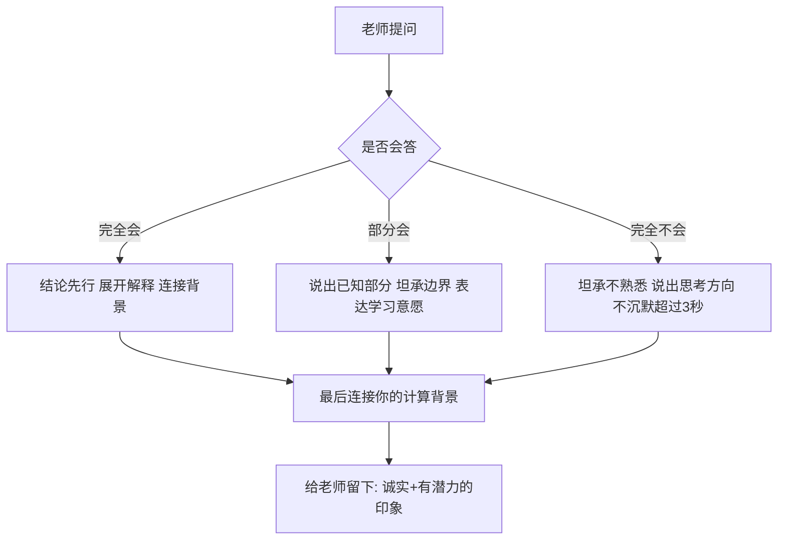

---

title: "高频专业面试问题——上科大材料与化工跨考专用答题库" date: 2026-03-30 tags:

- 考研复试
- 专业面试
- 上科大
- 跨考
- 材料科学 category: "考研备战"

---

# 高频专业面试问题——上科大材料与化工跨考专用答题库

> 📌 这份答题库分四个模块：材料专业基础题、跨考身份专项题、压力测试题、综合开放题。每道题都给出了**针对你的背景**的参考答案框架，不是通用模板，而是专门为位凯瑞定制的逻辑和素材。

## 📋 使用方法

- **标注⭐的题**：必考或极高概率出现，必须准备到能流利作答
- **标注☆的题**：中等概率，理解框架即可，不需要逐字背
- **答题原则**：先给结论，再展开解释，最后如果可以，连接到你的背景
- **时长控制**：每道题的中文回答控制在 60–90 秒，英文题 45–60 秒

## 🧱 模块一：材料专业基础题

这是面试老师考察你"有没有补过课"的部分。答对不加分，答不出来才扣分。目标是：每道题都能说出核心概念，不要卡壳超过 3 秒。

### ⭐ Q1：请介绍一下金属的三种典型晶体结构

**答题框架：**

金属最常见的三种晶体结构是面心立方（FCC）、体心立方（BCC）和密排六方（HCP）。

FCC 的代表金属是铝、铜、金、镍，每个原子有 12 个紧邻原子，原子堆积效率约 74%，延展性好，因为它有 12 个滑移系，位错容易运动。

BCC 的代表是室温下的铁、钨、铬，配位数是 8，堆积效率 68%，强度相对较高但延展性不如 FCC。

HCP 的代表是钛、镁、锌，配位数也是 12，但滑移系只有 3 个，所以 HCP 金属通常比较脆，加工性差。

**连接你的背景（如果老师追问"为什么关注这个"）：**

> 从计算的角度，这三种结构对应不同的对称群，在构建机器学习势函数时，如何让模型对这些旋转和平移对称性保持不变，是一个核心设计问题。

### ⭐ Q2：什么是位错？它和材料强度有什么关系？

**答题框架：**

位错是晶体中一种线缺陷，本质上是原子排列的局部错误——可以想象成晶体里多了半个原子面，像一把刀插进去的感觉。

位错的重要性在于它解释了一个长期困惑材料学家的问题：理论计算的金属强度比实际高出 1000 倍以上，原因就是实际金属的变形不是整个晶面一起滑动，而是位错在逐步移动，这就像推动地毯上的皱褶比推整张地毯省力得多。

位错和强度的关系是：**阻碍位错运动 = 提高强度**。具体机制有三种：一是固溶强化，加入溶质原子造成晶格畸变，给位错运动设置障碍；二是加工硬化，冷变形产生大量位错互相缠绕；三是细晶强化，晶粒越细晶界越多，位错穿越晶界越难。

钢里加碳就是典型的固溶强化，碳原子卡在铁的间隙里，同时还能参与形成渗碳体第二相，进一步强化。

### ⭐ Q3：请解释 Fe-C 相图，钢和铸铁怎么区分？

**答题框架：**

Fe-C 相图是铁和碳的平衡状态图，横轴是碳的质量分数，纵轴是温度。

最关键的分界线是碳含量 2.11%：低于这个值叫钢，高于这个值叫铸铁。这个数字不是随意划定的，它是碳在 FCC 铁（奥氏体）中的最大固溶度，超过这个量碳就必须以渗碳体的形式析出。

相图里有两个特别重要的点：一是 727°C、含碳 0.77% 的共析点，奥氏体在此温度缓慢冷却会分解成铁素体加渗碳体的层片状混合物，叫珠光体；二是 1148°C、含碳 4.3% 的共晶点，这是铸铁体系的关键温度。

对钢铁热处理来说，最重要的操作是淬火：把钢加热到奥氏体区，然后快速冷却，碳原子来不及扩散，被强制留在 BCC 铁的格子里，形成马氏体，极硬但脆。淬火后再低温回火，适当释放内应力，就能得到高强度又有一定韧性的钢。

### ⭐ Q4：XRD 的原理是什么？能测什么信息？

**答题框架：**

XRD 的原理基于布拉格方程：

$$2d\sin\theta = n\lambda$$

X 射线打到晶体上，被不同晶面反射，当光程差恰好等于波长整数倍时，反射光相互加强，形成衍射峰。

从 XRD 图谱可以读出三类信息：第一，峰的位置（$2\theta$ 角）告诉你晶面间距 $d$，通过与数据库比对可以鉴定是什么相；第二，峰的宽度反映晶粒尺寸，晶粒越小峰越宽，这是谢乐公式的核心；第三，峰的强度比例可以估算多相材料中各相的相对含量。

**连接你的背景：**

> XRD 图谱的相鉴定本质上是模式匹配问题，已经有研究用卷积神经网络来自动识别图谱，准确率已经接近人工标注。如果有机会，这是我很想尝试的一个应用方向。

### ☆ Q5：SEM 和 TEM 的区别是什么？各自适合什么场景？

**答题框架：**

SEM 是扫描电子显微镜，用聚焦电子束扫描样品**表面**，通过收集二次电子成像，分辨率在纳米量级，样品制备简单，主要用来看形貌和表面特征。配合 EDS 能谱还可以做元素分布分析。

TEM 是透射电子显微镜，电子束**穿透**样品，分辨率可以达到原子级别，能直接看到晶体的原子排列、位错结构、界面特征。但代价是样品必须减薄到 100 纳米以下，制备非常耗时。

一句话总结：SEM 看"表面长什么样"，TEM 看"内部怎么排列的"。高分辨 TEM（HRTEM）是目前表征材料微观结构最直接的手段之一。

### ☆ Q6：什么是马氏体？为什么淬火后要回火？

**答题框架：**

马氏体是钢铁淬火时形成的一种亚稳相。奥氏体（FCC 铁）快速冷却时，碳原子来不及扩散析出，被强制"冻"在 BCC 铁的间隙里，使晶格发生畸变，形成体心正方结构，这就是马氏体。

马氏体极硬，原因是大量碳原子造成的晶格畸变严重阻碍位错运动。但同时也极脆，因为内应力很大，一碰就裂。

回火是在淬火之后进行低温加热（通常 150–600°C），目的是：让部分过饱和碳以细小碳化物的形式析出，释放内应力，在保持较高硬度的同时恢复一定韧性。不同回火温度对应不同的强韧性平衡，这就是工具钢、弹簧钢、结构钢制造工艺的核心。

### ☆ Q7：锂离子电池的工作原理是什么？影响能量密度的因素有哪些？

**答题框架：**

锂离子电池的核心机制是锂离子在正负极之间的嵌入和脱出。放电时，负极（石墨）中的锂离子脱出，经电解质迁移到正极（如 LiCoO₂）嵌入，同时电子通过外电路做功；充电时方向相反。

影响能量密度的因素主要有三个：一是正极材料的理论容量和工作电压，电压越高、容量越大，能量密度越高，这是为什么磷酸铁锂安全但能量密度偏低，而三元材料（NCM）能量密度高但热稳定性稍差；二是负极材料，硅负极理论容量是石墨的十倍，但膨胀问题严重；三是电解质，固态电解质既可以提高安全性，也有望支持更高电压窗口。

**连接你的背景（加分项）：**

> 从数据角度来看，锂电池的性能衰减机制非常复杂，涉及固体电解质界面（SEI）的生长、活性材料的结构演变等多个耦合过程。这类问题非常适合用机器学习方法从大量循环数据中提取规律，做寿命预测模型。

## 🎯 模块二：跨考身份专项题

这是最重要的模块。老师问这类问题，不是要为难你，而是在评估你是不是真的想清楚了，以及你能不能把自己的背景变成优势。

### ⭐ Q8：你是计算机背景，为什么要跨考材料与化工？

**参考答案（完整版，约 90 秒）：**

这个问题我想清楚了很久，让我说两个层面的原因。

第一个是学科的层面。我在做 PINN 研究的时候，一直在用神经网络求解偏微分方程。做到后来我发现，这些方程——Burgers 方程、对流扩散方程——和材料科学里的扩散方程、相场方程在数学上是完全同源的。我当时意识到，我不只是在解一个数学题，我在解的其实是材料里真实发生的物理过程。这让我开始认真研究计算材料学，越看越觉得这是一个我真正想深入的方向。

第二个是现实的层面。现在材料研究面临的瓶颈不是缺乏想法，而是缺乏能把想法快速实现和验证的人。大多数材料实验室里，写代码的能力是稀缺的。我的 C++ 系统编程能力、机器学习基础、数值方法背景，放到材料研究里是直接可以用的工具，不是要从头学的东西。

所以我的逻辑是：不是我要放弃计算机，而是我要把计算机的能力带到材料里去，做两个领域都需要但都没有足够多人在做的事。

### ⭐ Q9：你没有学过材料力学、物理化学这些课，能跟上研究生的课程吗？

**参考答案：**

这是一个合理的担忧，我也认真想过这个问题。

坦白说，在核心材料课程的系统学习上，我确实有缺口。但我想说两点。

第一，这些缺口是可以填补的，而且我已经开始填了。我在复试准备期间系统学习了晶体结构、相图、材料表征等基础内容，发现用我的数学背景理解这些内容其实并不困难——材料热力学本质上就是多元函数的极值问题，扩散本质上就是梯度流。

第二，研究能力不等于课程知识的总量。我在本科阶段证明了自己能从零快速掌握一个新方向——我的毕设涉及 ARM 微架构、SIMD 指令集，这些都是我入门前完全不懂的东西，最终做到了具有实际性能指标的成果。我相信我有能力用同样的方式建立材料知识体系。

我的计划是：研一上学期，在正常选课之外，每周额外投入时间系统学习材料科学导论和物理化学，争取在半年内建立起扎实的基础。

### ⭐ Q10：你的初试总分 295，数学和专业课还可以，但英语和政治偏低，怎么看？

**参考答案（压力题，要冷静）：**

确实，我的英语初试成绩 63 分不算突出，政治 60 分也只是过线水平。

英语方面，我的 CET-6 已经通过，我认为初试英语成绩偏低主要反映的是应试技巧和时间分配的问题，而不是英语能力本身。我能独立阅读英文文献，这在研究生阶段更为关键。我也会继续提高，包括口语表达。

政治分数偏低，我没有太多辩解，就是备考投入不足。

总分 295 刚好达到上科大的调剂线，我承认这说明我的初试发挥有遗憾。但我想说的是，如果你们愿意给我机会，我会用研究生期间的成果来证明这不是能力问题，而是备考策略的问题。

### ☆ Q11：如果录取了，你打算跟哪个导师，做什么方向？

**参考答案框架（必须填入真实导师信息）：**

我在准备复试期间仔细研究了学院的导师介绍和近期发表的论文。

我对 [导师姓名] 老师的研究方向最感兴趣，特别是他/她在 [具体方向，如机器学习势函数/计算相变/材料基因组] 方面的工作。我读了他/她发表在 [期刊名] 的一篇关于 [大概内容] 的论文，印象最深的是 [具体的一个点]。

我认为我的 [PINN 数值方法背景 / C++ 高性能计算能力] 可以直接用在这个方向上，具体来说是 [一句话说明怎么用]。

当然，最终方向还是要根据老师的需求和项目情况来定，我的态度是愿意配合，愿意学习。

> ⚠️ **行动项**：复试前去 https://spst.shanghaitech.edu.cn 把每个老师的研究方向过一遍，找到和计算材料/机器学习交叉的老师，读他最近 1–2 篇论文，把上面的括号填实。

## 💣 模块三：压力测试题

这类题的目的不是考知识，是看你在压力下的心态和应变。关键是：**不慌，不卑不亢，有态度但不强硬**。

### ⭐ Q12：你觉得自己跟材料本科生相比，差在哪里？

**参考答案：**

差距是真实存在的，我不打算回避。

专业知识的系统性是最大的差距。材料本科生学了四年的材料力学、物理化学、腐蚀与防护、材料加工等课程，形成了完整的知识体系。我目前对这些的掌握是碎片化的、自学的，有明显的盲区。

实验操作是第二个差距。我没有摸过 SEM，没有做过 XRD 样品制备，这些实验直觉是需要时间积累的。

但我想补充一点：差距不等于弱势，只是不同。材料本科生有我没有的东西，我也有他们没有的东西——高性能 C++ 开发能力、机器学习的系统性训练、数值方法的实践经验。研究生阶段，这两种背景的组合往往比单一背景更有价值，前提是我能在入学后快速补齐基础短板。

### ⭐ Q13：如果我们不录取你，你怎么办？

**参考答案：**

如果这次复试没能通过，我会认真反思原因。

如果是专业基础不够扎实，我会用这段时间系统学习材料科学的核心课程，明年再考或者申请其他方向。如果是综合表现问题，我会找机会请教，看清楚自己的不足在哪里。

但坦白说，我现在的状态是专注在这里，把这次机会争取到最好。关于"万一落选"，我当然有预案，但现在不是想这个的时候。

### ☆ Q14：你觉得你做的 HNSW 项目有什么不足？

**参考答案（展示自我批判能力）：**

不足是有的，而且我自己很清楚。

第一，我的系统只针对 Apple M3 的 ARM 架构做了优化，迁移到 x86 服务器或者其他平台上需要重新做向量化，可移植性差。

第二，我的索引构建是离线批量构建的，不支持动态增删节点。真实的材料数据库是不断更新的，需要在线增量更新能力，这是我当时为了简化实现而砍掉的功能。

第三，我对理论分析做得不够充分。HNSW 的搜索复杂度分析涉及随机图的渗流理论，我能调用结论但推导过程理解得不深，这是我自己不满意的地方。

承认不足是正常的——任何工程都有取舍，重要的是我知道取舍在哪里，以及如果给我更多时间我会怎么改进。

### ☆ Q15：你本科 GPA 3.62，不算很高，说明了什么？

**参考答案：**

3.62 的 GPA 确实不算优秀，这我承认。

回头看，大一大二我在课程学习上的投入是不均衡的——对自己感兴趣的方向（算法、系统）投入多，对一些基础公共课投入少，这直接反映在了成绩上。

但我想说两件事：第一，我的核心专业课成绩是好的，弱的是一些非核心课程；第二，我认为 GPA 反映的是课程考试能力，而我在科研和工程项目上的实际投入和产出，比 GPA 更能代表我的研究潜力——四次校奖学金、两个有实际成果的项目、一个软件著作权，是我认为更能说明问题的证明。

我不是在为低 GPA 辩解，只是想给老师完整的信息来判断。

## 🌐 模块四：综合开放题

### ⭐ Q16：你怎么理解"计算材料学"这个方向？

**参考答案：**

计算材料学，我理解是用计算方法来研究材料的结构、性质和过程，它是连接理论和实验的桥梁。

从尺度上来分，有三个层次：第一层是量子力学层次，主要是密度泛函理论（DFT），能精确计算电子结构和能量，但只能处理几百个原子；第二层是原子模拟层次，分子动力学和蒙特卡洛方法，能处理更大的体系，但需要势函数描述原子间相互作用；第三层是连续介质层次，有限元、相场模型等，能模拟微米到毫米尺度的现象，比如裂纹扩展、相变界面演化。

现在最令人兴奋的进展，是机器学习势函数打通了第一层和第二层之间的鸿沟——用 DFT 数据训练神经网络，得到一个既有 DFT 精度又有经典势函数速度的模型，让模拟大体系成为可能。

**这正是我最想深入的方向。**

### ☆ Q17：你最近看过什么和材料相关的论文或新闻？

**备用素材（选 1–2 个准备）：**

**选项 A（ML势函数方向）：**

> 我最近关注了 DeePMD（Deep Potential Molecular Dynamics）这个方向，这是张林峰团队开发的机器学习势函数框架，已经用于模拟水、合金、锂电池电解质等系统。让我印象深刻的是他们在 2023 年发表的工作，用机器学习势实现了亿原子规模的分子动力学，在超算上达到了里程碑式的规模。

**选项 B（材料基因组方向）：**

> 我了解到 Materials Project 数据库现在已经收录了超过 15 万种无机材料的计算性质，包括能带结构、弹性模量、磁性等。有团队用图神经网络在这个数据库上训练属性预测模型，准确率已经接近 DFT 计算，但速度快了六个数量级，这对高通量材料筛选很有意义。

**选项 C（电池材料方向）：**

> 固态电池最近进展比较快，宁德时代和丰田都在推进全固态锂电池的量产进程。从材料角度，固态电解质面临的核心挑战是界面阻抗——固固界面的接触比液态电解质差很多，怎么用界面工程和材料设计来降低阻抗，是目前研究的热点。

### ☆ Q18：如果导师让你做一个你完全不熟悉的实验，你会怎么办？

**参考答案：**

我的第一反应不是拒绝，也不是假装会，而是搞清楚我需要学什么。

具体来说，我会做三件事：第一，找相关的实验教程和文献，理解这个实验的原理和标准操作流程；第二，向实验室里有经验的师兄师姐请教，让他们带我操作一次；第三，第一次独立操作之前，把关键步骤、可能出错的地方列成清单，确认每一步后再进行下一步。

我在毕设里就遇到过类似情况——ARM NEON SIMD 指令集我入门前完全没碰过，但我用了大概两周通过文档和实验摸清楚了基本用法。我相信这个学习方式可以迁移到实验技能的培养上。

## 📝 总结

### 高概率题目清单（复试前必须准备到流利作答）

按照出现概率排序：

1. Q8：为什么跨考材料与化工
2. Q1：三种晶体结构
3. Q4：XRD 原理
4. Q9：能否跟上课程
5. Q3：Fe-C 相图
6. Q11：打算跟哪个导师
7. Q2：位错与强度
8. Q12：和材料本科生比差在哪
9. Q16：怎么理解计算材料学
10. Q7：锂电池原理

### 答题心态总结

## 🔗 相关链接

- 上级概念：[[上科大材料与化工复试全攻略]]
- 同级概念：[[英语自我介绍——上科大材料与化工专硕复试专用]]
- 下级概念：[[科研经历材料化包装]]、[[材料科学速通核心考点]]

## 📚 参考资料

- [DeePMD-kit 官网](https://www.deepmd.org/) — 机器学习势函数主流框架，面试提到有加分
- [Materials Project](https://materialsproject.org/) — 材料数据库，了解高通量计算材料学的入口
- Callister《材料科学与工程导论》第 4–7 章 — 覆盖晶体结构、缺陷、相图的标准教材

---

第三份完成。最后一份是**科研经历的材料化包装**——我会把你的 PINN 研究和 HNSW 毕设重新用材料人的语言叙述一遍，给你一份中文面试叙事脚本，让你知道每一段经历该怎么讲、讲到什么深度、在哪里停下来让老师追问。

继续吗？